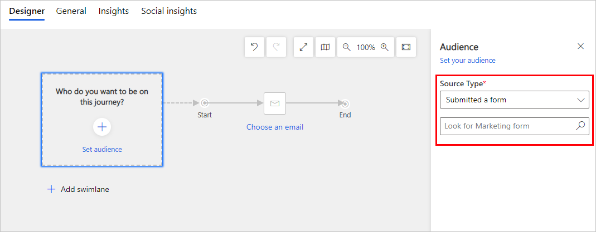

# Create an inbound customer journey

*Inbound customer journeys* seek to attract new, unknown contacts, so they typically target new contacts who submit a form on a landing page to register for a newsletter, download a whitepaper, or receive some other perk. You'd typically promote your inbound campaign by running ads and posting links on social media. (In comparison, an *outbound* customer journey is one that starts with a segment made up of contacts that are already included in your Dynamics 365 Marketing database. An outbound journey usually starts by sending out marketing emails to the members of a segment.)

Though messaging and promotion strategies are typically different for inbound versus outbound campaigns, you design inbound customer journeys in Dynamics 365 Marketing using the same tools as with an outbound customer journey. The most important difference is that you typically start an inbound customer journey with an audience consisting of contacts who submitted a specific form instead of a segment, though you could also set up a segment that finds contacts who submitted a specific form. In this configuration, all contacts (both new and existing) who submit the form immediately start down that journey.

## Use a form to launch an inbound campaign

You can create an inbound campaign by setting up the contacts who **Submitted a form** as the source of your **Audience** tile at the start of a journey. You can then configure the tile to reference the marketing form record that created the embedded or captured form you are using on your external site. This will cause each contact that submits the form to be added to the journey, as though they had joined a segment targeted by the journey.

## Use a behavioral segment to find contacts who submitted a form

Another way to create an inbound journey is to start with an [behavioral segment](segments-interaction.md) that is based on form-submit or event-registration interactions, and filtered for a specific form or event ID. This technique will work with both native and externally hosted forms, and with event registrations.

### See also

[Create a simple customer journey](create-simple-customer-journey.md)  
[Generate activities from a customer journey](generate-activities-from-customer-journey.md)  
[Create an interactive customer journey](create-interactive-customer-journey.md)  
[Use customer journeys to create automated campaigns](customer-journeys-create-automated-campaigns.md)  
[Customer journey tiles reference](customer-journey-tiles-reference.md)  

[!INCLUDE[footer-include](../includes/footer-banner.md)]