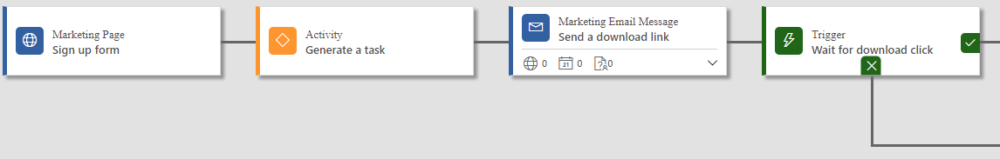

# Create an inbound customer journey

[!INCLUDE[cc_applies_to_update_9_0_0](../includes/cc_applies_to_update_9_0_0.md)]

<iframe src="https://www.microsoft.com/en-us/videoplayer/embed/d73cc179-5984-4a32-ad84-0755f56b0399" frameborder="0" allowfullscreen=""></iframe>

An outbound customer journey is one that starts with a segment made up of contacts that are already included in your [!INCLUDE[pn-crm-2016-shortest](../includes/pn-crm-2016-shortest.md)] database, so an outbound journey usually starts by sending out marketing emails to the members of a segment. An inbound journey seeks to attract new, unknown contacts, so an inbound journey typically starts with a landing page that new contacts use to register for a newsletter, download, or some other perk. You'd typically promote your inbound campaign by running ads and posting links on social media.

Though messaging and promotion strategies are typically quite different for an inbound campaign compared to an outbound one, you design inbound customer journeys in [!INCLUDE[pn-crm-2016-shortest](../includes/pn-crm-2016-shortest.md)] by using the same basic tools as you would to create an outbound customer journey (as we've seen in several previous exercises). The most important difference is that you typically start an inbound customer journey with a landing page or event instead of a segment. In this configuration, all contacts (both new and existing) who submit the form from the landing page or register for the event immediately start down that journey.

### See also

[Create a simple customer journey](create-simple-customer-journey.md)  
[Generate activities from a customer journey](generate-activities-from-customer-journey.md)  
[Create an interactive customer journey](create-interactive-customer-journey.md)  
[Use customer journeys to create automated campaigns](customer-journeys-create-automated-campaigns.md)  
[Customer journey tiles reference](customer-journey-tiles-reference.md)  
