# Create an interactive customer journey with triggers and signup

<iframe src="https://www.microsoft.com/videoplayer/embed/d73cc179-5984-4a32-ad84-0755f56b0399" frameborder="0" allowfullscreen=""></iframe>

In [Create a simple customer journey with email messaging](create-simple-customer-journey.md), you created the simplest possible customer journey, which simply sends an email message to all contacts in a segment. Now we'll go a bit deeper into customer journeys to see how to add interactive features and decision points by including landing pages and triggers in the design.

1. Go to **Marketing** > **Marketing Execution** > **Marketing Emails** and create a new email message like the one you made in [Create a marketing email and go live](create-marketing-email.md). Be sure to include all the minimum requirements&mdash;name, subject, from-contact, subscription center link, and sender physical address—but don't go live yet.

    > [!TIP]
    > Consider choosing a non-blank email template this time. These templates not only have sample content, graphics, and column layouts, but also include all mandatory elements such as the subscription center link and physical address.

2. This message will invite recipients to pick up a free download from your website. To get the free download, they'll need to visit the landing page, submit a form, and then wait for a follow-up email that contains the download link. (The message content would normally explain all of this, but for this exercise it's not necessary.) With your new email message still open, drag a **Marketing Page** design element from the **Toolbox** onto the design canvas.  
    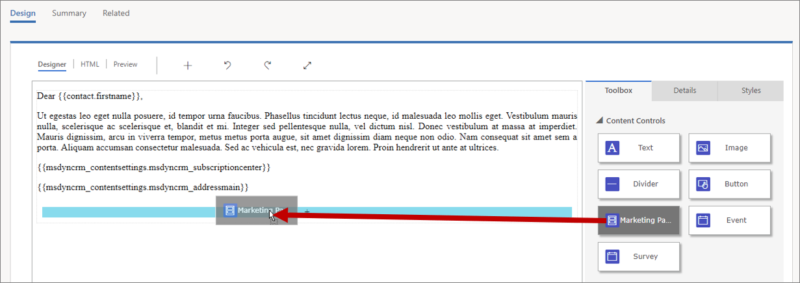

3. When you drop the **Marketing Page** element in place, it's automatically selected and the **Properties** tab opens to show its settings.  
    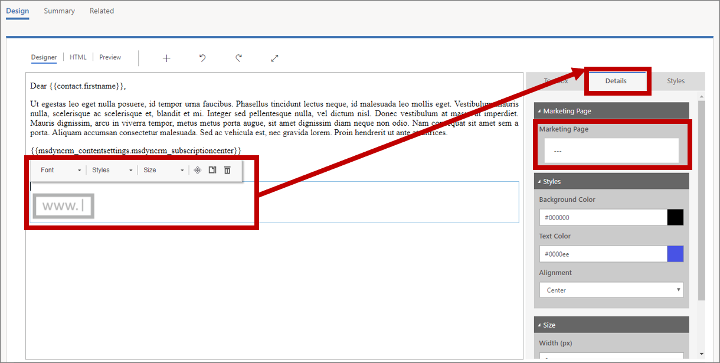

    Set the **Marketing Page** field to the name of the landing page you made in [Create a landing page with a form](create-landing-page.md) (or any valid landing page).  

4. Continue to style and format your button as follows:
   - Edit and style the button text by working directly on the canvas and using the floating toolbar, just as you would with a **Text** element. You might enter text such as **Click here to register for your download**.
   - Working on the **Properties** tab, choose a background color, text color, height, and width for the button.

     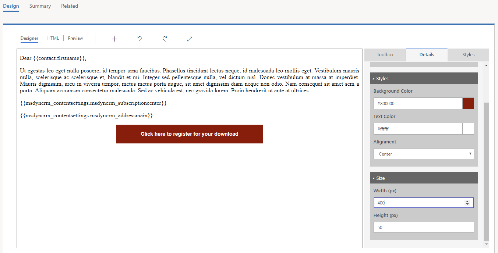

5. As before, **Save** your message, choose **Check for Errors**, fix any issues, and then **Go Live**.

6. Create two more marketing emails:
   - *A download link message*: This message will be sent after a contact submits the form on the landing page. Let the subject be **Thank you for signing up, here's your download link!** but don't worry too much about the content for now. (In a real project, you would include a link to the promised download here.)
   - *A follow-up message*: This message will be sent if a contact does not submit the form after a few days. Let the subject be **Don't miss out!**, but don't worry too much about the content for now. (In a real project, you would repeat most of the original offer here.)

     Remember to include all required elements and to go live with each of them.

7. Go to **Marketing** > **Marketing Execution** > **Customer Journeys** and create a new customer journey like the one you made in [Create a simple customer journey with email messaging](create-simple-customer-journey.md). As before, add the following:
   - Place a **Segment Group** tile in the first position, and configure its nested **Segment** tile to reference the segment of test contacts you made in [Create a dynamic segment](create-segment.md).
   - Add an **Email** tile right after the **Segment Group**, and configure it to reference the first email message you made for this exercise (with the landing page button).

     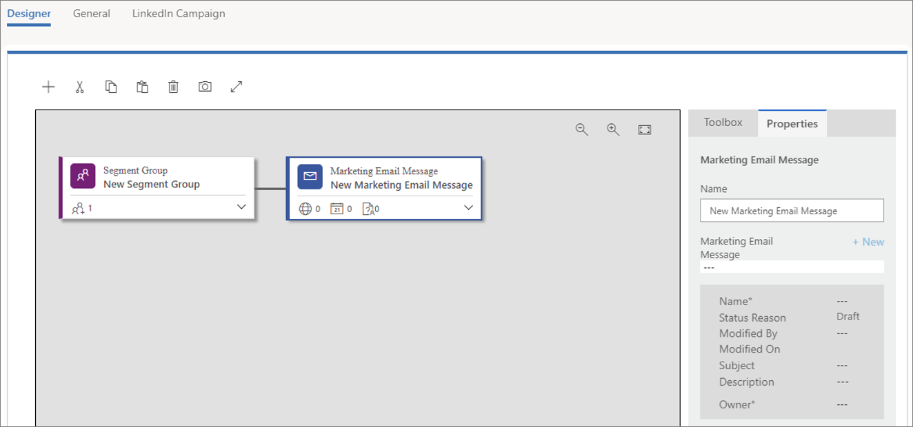  

8. Although your email message includes a link to a landing page, the journey is not aware of that link, nor even of the landing page itself. This journey should react to landing page submissions, so you need to reference the page and link it to the message by nesting a marketing-page tile under the email tile. Drag a **Marketing Page** tile from the **Toolbox**, and drop it directly onto the **Marketing Email Message** tile.  
    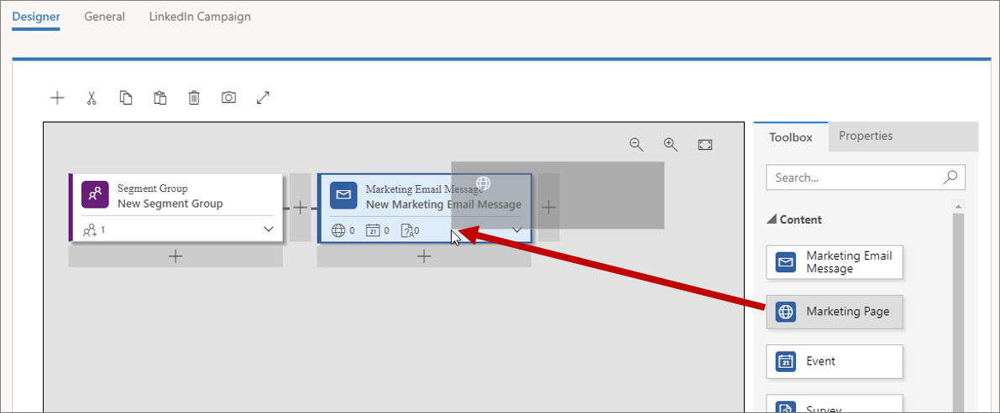

9. Expand the **Marketing Email Message** tile by choosing the expansion button in its lower-right corner. Now you can see the **Marketing Page** tile that you just added.  
    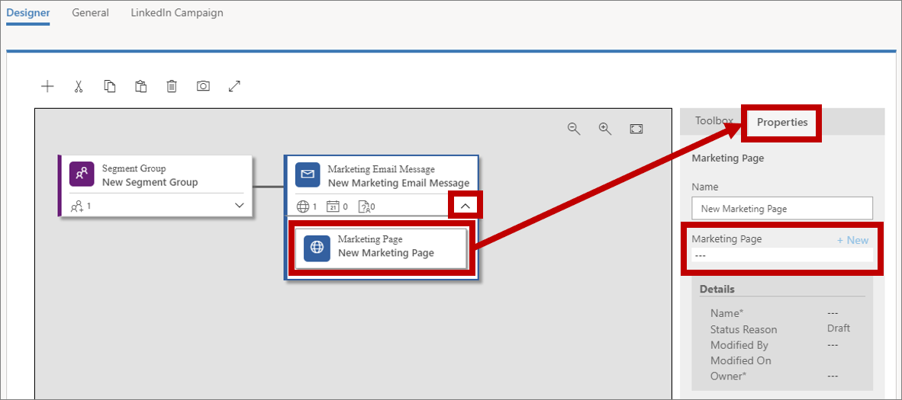

    Select the **Marketing Page** tile, open the **Properties** tab, and make the following settings:
    - **Marketing Page**: Set to the name of the landing page you made in [Create a landing page with a form](create-landing-page.md).  
    - **Name**: Set to a value that you will recognize later (such as **Free download registration page**).

10. Now add a trigger tile. *Trigger tiles* add interactivity to the journey by splitting the pipeline and establishing logical criteria for deciding which path each contact will take. Drag a **Trigger** tile from the **Toolbox** to the space immediately to the right of the **Marketing Email Message** tile.  
     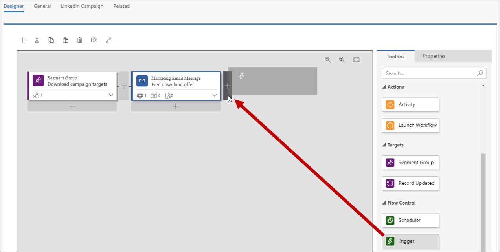

11. Select the new **Trigger** tile on the canvas, and then open the **Properties** tab.  
     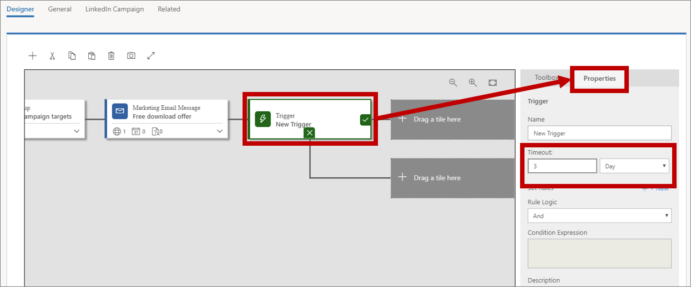

     Set the **Timeout** to establish how long contacts will wait on this tile before being sent down the false (bottom) path if they don't submit the registration form. Three days is a typical timeout value, but the best choice depends on your actual circumstances.

12. With the **Trigger** tile still selected and the **Properties** tab still open, select **+New** next to the **Set Rules** heading.  
     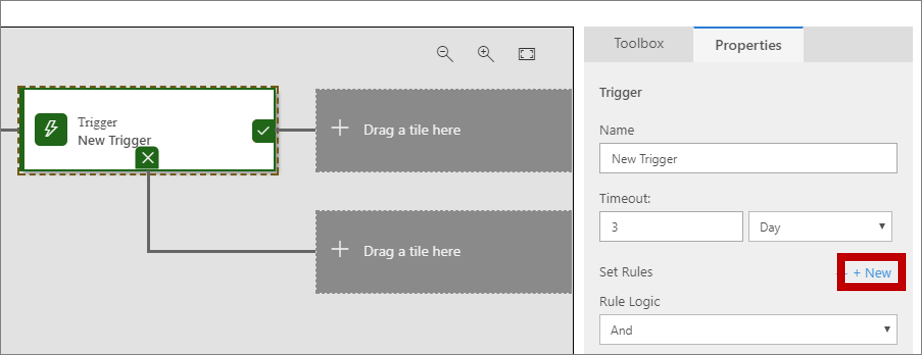  

13. A new rule, called **Rule 1**, is added for the trigger.  
     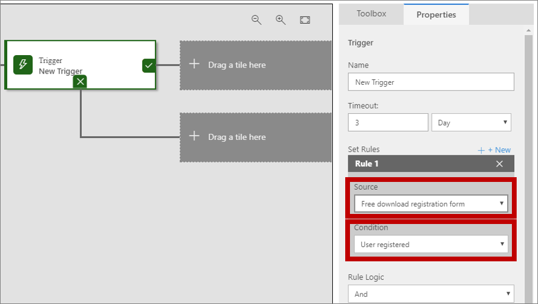

     Make the following settings for **Rule 1**:
    - **Source**: Choose the name of the **Marketing Page** tile you added to the **Marketing Email Message** tile (we suggested **Free download registration page**). Note that this references the name of the *tile*, not the name of the marketing page itself.
    - **Condition**: Set to **User registered**.

      This expression evaluates to true as soon as a contact submits valid information by using the referenced landing page. Each contact will wait at this trigger tile either until its logic evaluates to true or until the timeout period has elapsed, whichever comes first. As soon as a contact fulfills the requirements, it's sent down the true (top) path; if the timeout expires first, the contact is sent down the false (bottom) path instead.

      > [!TIP]
      > Many types of trigger rules are possible, depending on which types of tiles are available along the pipeline leading to the trigger. For example, you might define a trigger when a contact just opens the landing page, or define a trigger on the email message itself when a contact selects a link or opens the message. You can also establish complex logic by adding several rules and combining them using AND or OR operators.

14. Add two more **Marketing Email Message** tiles after the trigger, one on the top path and one on the bottom path.  
     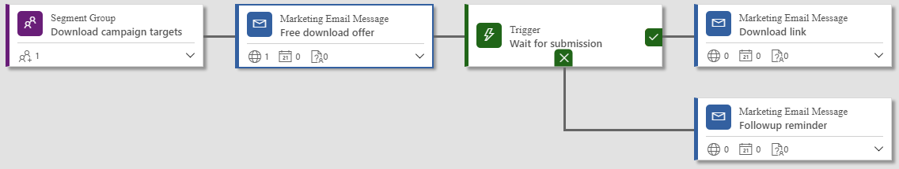  

     Configure them as follows:
    - **Top tile**: This message is sent to contacts who submit the form (when the trigger evaluates to true). Configure it to send the download link message that you created earlier in this procedure.
    - **Bottom tile**: This message is sent to contacts who haven't submitted the form within three days of receiving the initial offer. Configure it to send the follow-up reminder message that you created earlier in this procedure.

      > [!TIP]
      > For the purposes of this exercise, you can stop here. But in a real campaign, you would probably repeat most of this pipeline along the bottom path, so that you have a follow-up reminder and then a trigger that waits for page submissions. You can reuse the same landing page and download-link message.
      > 
      > 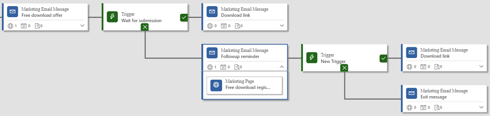

15. Save your customer journey. Then, as you've done before, go to the **General** tab to give the journey a name and schedule. Finally, **Check for Errors** and **Go Live**. More information: [Create a simple customer journey with email messaging](create-simple-customer-journey.md)

### See also

[Create a simple customer journey](create-simple-customer-journey.md)  
[Generate activities from a customer journey](generate-activities-from-customer-journey.md)  
[Create an inbound customer journey](create-inbound-customer-journey.md)  
[Use customer journeys to create automated campaigns](customer-journeys-create-automated-campaigns.md)  
[Customer journey tiles reference](customer-journey-tiles-reference.md)  
[Working with segments](segmentation-lists-subscriptions.md)
