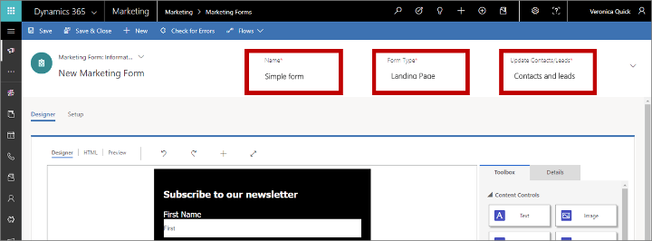
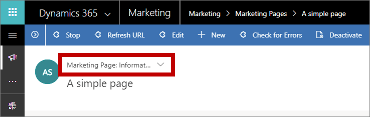

# Create a landing page with a form

[!INCLUDE[cc_applies_to_update_9_0_0](../includes/cc_applies_to_update_9_0_0.md)]

[!INCLUDE[cc-beta-prerelease-disclaimer](../includes/cc-beta-prerelease-disclaimer.md)]

A *landing page* is a webpage that functions as a customer touchpoint for one of your marketing initiatives. For example, you might send out an email message that invites recipients to sign up for a free white paper download. To get the download, message recipients must select a link that opens a webpage with a form where they enter information (which is saved directly in your [!INCLUDE[pn-crm-2016-shortest](../includes/pn-crm-2016-shortest.md)] database), and then they receive an email with the download link. The same landing page can also be made available to unknown visitors of your website, who will add themselves as new contacts in your database when they request the download.

In [!INCLUDE[pn-crm-2016-shortest](../includes/pn-crm-2016-shortest.md)], a landing page is a type of *marketing page*. Other types of marketing pages include *subscription centers* and *forward-to-a-friend forms*, both of which support email marketing and are more specialized in purpose. All marketing pages run on your [!INCLUDE[pn-crm-2016-shortest](../includes/pn-crm-2016-shortest.md)] server and are based on the portal capabilities for [!INCLUDE[pn-crm-2016-shortest](../includes/pn-crm-2016-shortest.md)] feature.

To create a landing page and go live:

1. Most landing pages include an input form that people can use to submit information, so you'll start by creating the form itself. Go to **Marketing** &gt; **Internet Marketing** &gt; **Marketing Forms**.  
    

    On the command bar, select **New**.

    > [!TIP]
    > Forms are standalone records, and each of them can be used on any number of marketing pages. In day-to-day work, you'll often reuse existing forms rather than create a new one for each landing page. But for this exercise, you'll create a new one.

1. The **New Marketing Form** page opens with the **Select a Form Template** dialog box shown. This is similar to the template dialog box presented for marketing emails (as you saw in [Create a marketing email and go live](create-marketing-email.md)).  
    

    Choose a template, and then choose **Select**. The template dialog box closes, and your selected template is copied to your new form.

1. Now you are looking at the form designer, which works like the email designer but provides different tools in the **Toolbox**. As with the email designer, there are required fields at the top of the page.  
    

    Enter the following:
    - **Name**: This is an internal name for your form.
    - **Form Type**: Different types of marketing pages require different types of forms. You're making a landing page, so set this to **Landing Page**.
    - **Update Contacts/Leads**: Set this to **Contacts and Leads**. This means that [!INCLUDE[pn-crm-2016-shortest](../includes/pn-crm-2016-shortest.md)] looks for existing contacts and leads that match submissions from this form and will update any existing contacts and leads, or create new ones.

1. We want the form to include four fields (first name, last name, email, and country), and we want the first name, last name, and email to be required (which means that contacts must supply values for these fields to submit the form). Thanks to the template, we're almost there.  
    

    Each required field shows a red asterisk on the form. Select the **First Name** field on the canvas to open the **Properties** tab for it. Make sure the **Required** check box is selected. Note that the red asterisk appears when the box is selected and goes away when it's cleared. Make sure that the first name, last name, and email fields are all marked as required.

1. Go back to the **Toolbox** tab and find the **Country** block under the **Fields** heading. Drag the **Country** block to your form, but don't make it required.  
    

1. On the command bar, select **Check for Errors**, and then fix any problems that are reported just as you did with the email message and customer journey.

1. On the command bar, select **Save** to save your form. Forms are always live, so you don't need to select **Go Live**.

1. Now you're ready to use your new form on a landing page. Go to **Marketing** &gt; **Lead Management** &gt; **Marketing Pages**, and then select **New** on the command bar. The **New Marketing Page** page opens with the **Select a Template** dialog box shown.  
    

    It's important to choose a template of the right type (landing page), so do the following here:
    1. Go to the **Type** tab.
    1. Choose **Landing Page** from the drop-down list.
    1. Browse the available templates and select one that appeals to you.
    1. Choose **Select**.

1. The **Select a Template** dialog box closes, and the content from your selected template is copied to your design. As with the form designer, there are required fields at the top of the page.  
    

    Enter the following:
    - **Name**: Enter a name for the page that you can easily recognize later. This name is internal-only..
    - **Type**: Make sure this is set to **Landing page**.
    - **Partial URL**: When you publish the page, this value becomes part of its URL. The page will be published on your [!INCLUDE[pn-crm-2016-shortest](../includes/pn-crm-2016-shortest.md)] portal server, so the final URL for the page will have the form: **https://*&lt;YourOrg&gt;*.microsoftcrmportals.com/*&lt;PartialURL&gt;***. Enter a suitable partial URL (note that contacts might notice this text when they load your page).

    You are now in the page designer, which resembles the form and email designers. Your page already includes lots of content that came from the template you chose, including placeholder images, sample text, and more. Most of these are placed by using standard **Toolbox** items like **Text** blocks and **Image** blocks, though some layout features are hard-coded in HTML as part of the template. As with email messages, you can add new blocks, edit text directly on the canvas, and configure blocks by selecting them and using the **Properties** tab. You can also set global page styles by using the **Styles** tab. In a real project, you would spend time now working with all these settings to create and style your content.

1. Most landing page templates already include an unconfigured **Form** block that shows a placeholder with the text **Select a form**. Find and select it on the page (or add a new **Form** block from the **Toolbox** tab if needed).  
      

    The **Properties** tab opens when you select the **Form** block. Set the **Marketing Form** field to the name of the form that you created earlier in this procedure. Your form design is loaded onto the page.

    > [!TIP]
    > Forms are imported by reference—they are not copied to your page. That means that if you go back and edit the form, any changes you make there will be seen on all existing pages that use that form, so be careful when editing forms!

1. As you did with the other items you created, select **Save** on the command bar. Then select **Check for Errors** and read the results in the notification area. Address any issues, and recheck until your design passes. Finally, choose **Go Live**. If the command is successful, your page will be published and available on the internet.

1. Go to the **Summary** tab.  
    

    Here you'll find information about your page, a **Timeline** where you can add notes and track its development, and links to various related records. You'll also find the **Full Page URL** in the **Content** section. Select the preview button  at the right side of the **Full Page URL** field to open the page. Then enter and submit some information through the page.

    > [!TIP]
    > Many entities in [!INCLUDE[pn-marketing-business-app-module-name](../includes/pn-marketing-business-app-module-name.md)] have a **Summary** tab like this one, where you can see general settings, a timeline, and related records.

1. Switch to the **[!INCLUDE[pn-insights](../includes/pn-insights.md)]** view by using the drop-down list above the page name headline.  
    

    As people interact with your page, information will become available in the **[!INCLUDE[pn-insights](../includes/pn-insights.md)]** view, including lists of contacts who visited and submitted the form on the page and analytics about its performance. You should be able to see your test submission on the **Submissions** tab here.

[!INCLUDE[cc-marketing-cookies](../includes/cc-marketing-cookies.md)]

### See also

[Design your digital content](design-digital-content.md)  
[Keyboard shortcuts and accessibility features for content designers](design-digital-content.md)  
[Content blocks reference](content-blocks-reference.md)  
[Create and deploy marketing pages](create-deploy-marketing-pages.md)  
[How Dynamics 365 for Marketing uses cookies](cookies.md)

