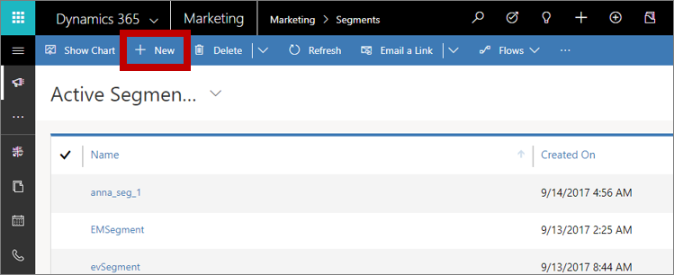
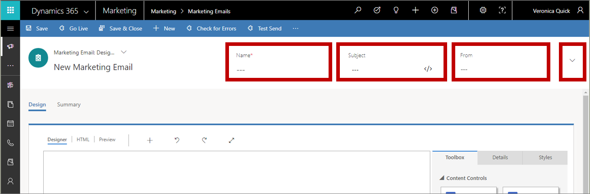
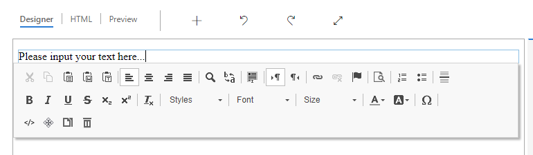
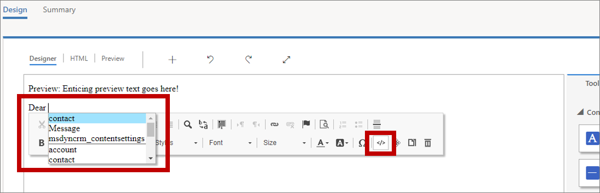
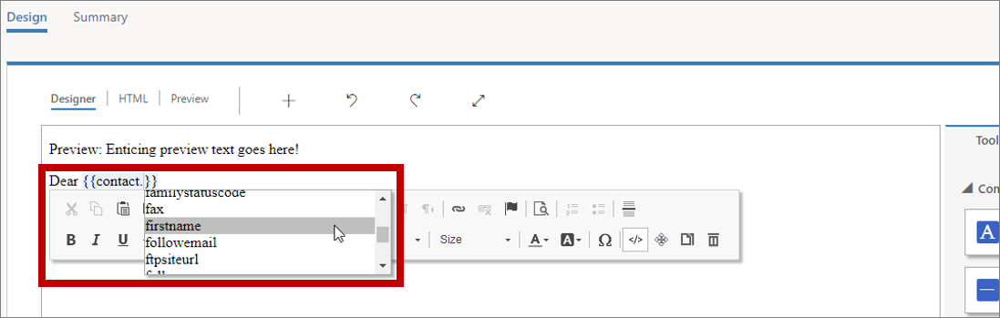
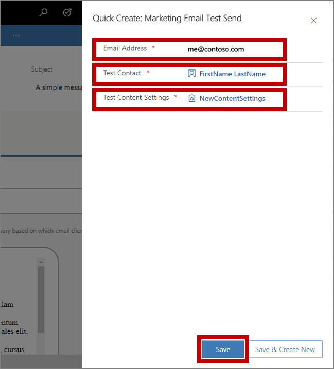

# Create a marketing email and go live

[!INCLUDE[cc_applies_to_update_9_0_0](../includes/cc_applies_to_update_9_0_0.md)]

<iframe src="https://go.microsoft.com/fwlink/p/?linkid=863168" frameborder="0" allowfullscreen></iframe>

Email is a vital marketing channel for most modern organizations. It's also a core feature of [!INCLUDE[pn-marketing-business-app-module-name](../includes/pn-marketing-business-app-module-name.md)], which provides tools for creating graphically rich marketing emails with dynamic, personalized content. [!INCLUDE[pn-crm-2016-shortest](../includes/pn-crm-2016-shortest.md)] can send large volumes of personalized marketing emails, monitor how each recipient interacts with them, drive customer-journey automation based on these interactions, and present results both for individual contacts and with aggregate statistical analytics.

> [!TIP]
> **Process overview**&mdash;to set up and execute a simple email campaign, you must do the following:
> 1. Create an email design that delivers your message and includes required elements such as a subscription-center link, your physical address, email subject, and email From address.
> 1. Publish the design by selecting **Go live**. This copies the design to the [!INCLUDE[pn-crm-2016-shortest](../includes/pn-crm-2016-shortest.md)] email marketing service, which makes the message available for use by a customer journey (but doesn't deliver any messages yet). The go-live process also activates any dynamic code and replaces links with trackable versions that are redirected through [!INCLUDE[pn-crm-2016-shortest](../includes/pn-crm-2016-shortest.md)].
> 1. Set up a customer journey that, at a minimum, identifies a published target segment and a published email message to deliver to that segment.
> 1. Activate the customer journey by choosing **Go Live**. The journey then drives the email-delivery process and other automation features. It personalizes and sends each individual message, collects interaction data, and can follow up with additional processes based on those interactions.
> 
> This exercise describes how to do the first two of these steps. You'll set up the last two steps in the [next exercise](create-simple-customer-journey.md).

To create a marketing email and go live:

1. Go to **Marketing** &gt; **Marketing Execution** &gt; **Marketing Emails**. This takes you to a list of existing marketing emails.  
    

    On the command bar, select **New**.

1. The **New Marketing Email** page opens with the **Select an Email Template** dialog box shown. Each template provides a starting point for designing a particular type of message. The template dialog box provides tools for searching, browsing, and previewing your template collection.  
    

    For this exercise, select the **blank** template so that you can step through all the required content. Then choose **Select** to apply the template to your new message.

    > [!TIP]
    > Several standard templates are provided out of the box, and you can also create your own templates that feature your organization's graphical identity, required elements, and messaging standards. [!INCLUDE[proc-more-information](../includes/proc-more-information.md)] [Create templates for emails, pages, forms, and journeys](create-templates.md)

1. The **Select an Email Template** dialog box closes and the content (if any) from your selected template is copied to your design. At the top of the email designer page are three required fields: **Name**, **Subject**, and **From**. If your browser window is too narrow to show all the fields, you'll also see a down arrow that opens a menu where you can see the fields that didn't fit.  
    

    Enter the following:
    - **Name**: This is an internal name for your message. Enter any name that you will easily recognize later.
    - **Subject**: This is the subject that email recipients will see when they receive the message.
    - **From**: Select here to choose the [!INCLUDE[pn-crm-2016-shortest](../includes/pn-crm-2016-shortest.md)] user who email recipients will see as the sender of the message.

1. In the main part of the page, you now see the design canvas (on the left side), where you can drag, arrange, and enter content. A **Toolbox** on the right side of the page provides content blocks that you'll use to construct your message.  
    

    Drag a **Text** block from the **Toolbox** tab over to the top of the canvas. When you have dragged the block to a suitable location, a blue shaded region appears. Release the mouse button to drop the block at that location.

1. When you drop the text block, you'll see some placeholder text within the block and a floating toolbar just below or above it.  
   

   Select and remove the placeholder text, and then add your own. Use the toolbar buttons to style your text as you would in a text editor like [!INCLUDE[cc-microsoft](../includes/cc-microsoft.md)] [!INCLUDE[pn-ms-word-short](../includes/pn-ms-word-short.md)] (point to any toolbar button to see what it does). Most of the buttons are for styling text and paragraphs, but there are also buttons for creating links; entering dynamic text (more on this later); and moving, copying, or deleting the entire text block.

    > [!TIP]
    > The very first text that you enter on the page is especially important because most email clients show this as preview text for the messages in their inbox list. Here is how it looks in [!INCLUDE[cc-microsoft](../includes/cc-microsoft.md)] [!INCLUDE[pn-ms-outlook-short](../includes/pn-ms-outlook-short.md)]:
    >
    >
    >
    >Messages that come from a familiar sender that have an enticing subject and relevant preview text are much more likely to get opened than messages that have just some, or none, of those things.

1. An easy way to personalize the message is to include the name of the recipient in the greeting. Add the recipient's name as dynamic text by using the assist-edit feature as follows:

    1. Working in the text block you just added, enter a suitable opening such as **Dear**.
    1. On the pop-up toolbar, select the assist-edit button **&lt;/&gt;**. This opens a drop-down list at your insertion point in the text block.
      
    1. In the assist-edit drop-down list, select **Contact**. The assist-edit tool enters code that references the contact entity, advances the insertion point to the next position in the code, and opens a new drop-down list that shows each field from the contact entity.
    
    1. In the assist-edit drop-down list, select **firstname**. The assist-edit tool finishes the code so that it references the first-name field from the contact entity. The full salutation now looks like this: **Dear {{contact.firstname}},**. (If you prefer, you can enter that code directly without using assist-edit.)

   > [!TIP]
   > You might have noticed that the **Subject** field also has an assist-edit button. This means that you can put dynamic text (including the recipient's name) in the subject too.

1. The body of all email messages must include both a subscription-center link and your organization's physical address. These are required by law in many jurisdictions, and [!INCLUDE[pn-crm-2016-shortest](../includes/pn-crm-2016-shortest.md)] won't let you publish any marketing email that doesn't have them. Most templates include them already, but when you're working with a blank template you must add them yourself. Like you did with the recipient's name, you'll place them by using assist-edit as follows:
    1. Choose a suitable location for your physical address, and then use assist-edit to place it. Select **msdyncrm\_contentsettings** in the first drop-down list, and then select **msdyncrm\_addressmain** in the second drop-down list to build the expression: **{{msdyncrm\_contentsettings.msdyncrm\_addressmain}}**.
    1. Choose a suitable location for the subscription-center link, and then enter some anchor text there (such as **manage your subscriptions**). Select the anchor text, and then select the **Link** button  from the floating toolbar, which opens the **Link** dialog box. Select the assist-edit button for the **Link** field, and then select **msdyncrm\_contentsettings** in the first drop-down list and **msdyncrm\_subscriptioncenter** from the second list to build the expression: **{{msdyncrm\_contentsettings.msdyncrm\_subscriptioncenter}}**. Select **OK** to create the link.  
      

    > [!TIP]
    > Values that you use often, including required content like the subscription-center link and physical address, are stored in [!INCLUDE[pn-crm-2016-shortest](../includes/pn-crm-2016-shortest.md)] as *content settings*. That's why you chose the content settings entity when placing these values by using assist-edit. Content settings provide a central location where you can store and update information that you use in most or all of your messages.
    > 
    > You can have as many Content Settings records as you like, but many organizations use just one. When you set up a customer journey, you'll also pick the Content Settings record used by all messages sent by that journey. This means that you can reuse the same marketing email in different customer journeys, but dynamic values taken from the Content Settings record can vary based on which customer journey sends the message.  

1. You should usually include at least one visible image in your design because this will invite recipients to load images, which is required for [!INCLUDE[pn-crm-2016-shortest](../includes/pn-crm-2016-shortest.md)] to log the message-open event. Drag an **Image** block from the **Toolbox** onto the canvas. This time, when you drop the block, you'll see an image placeholder and the **Details** tab, which shows configuration settings for the selected block.  
    

1. On the **Details** tab, select the **Image Gallery** button  at the right side of the **Source** field . The **Select an Image** dialog box opens.  
      
Here you can see all the images that have already been uploaded to your [!INCLUDE[pn-crm-2016-shortest](../includes/pn-crm-2016-shortest.md)] server. Select an image, and then choose **Select** to place it in your message design. (If you don't see any images, choose **Upload a Picture** to add a new one.)

    > [!TIP]
    > When a message goes live, [!INCLUDE[pn-crm-2016-shortest](../includes/pn-crm-2016-shortest.md)] uploads all relevant images from your library to its content-delivery network, where they become available as a single source to all recipients. The images aren't attached to each message, but instead are included as links that are redirected through [!INCLUDE[pn-crm-2016-shortest](../includes/pn-crm-2016-shortest.md)] for tracking purposes. Recipients won't download any images until they open the message, which saves bandwidth both for you and them. When a recipient's email client requests the images, [!INCLUDE[pn-crm-2016-shortest](../includes/pn-crm-2016-shortest.md)] knows that the message has been opened, and by whom.

1. Your message now includes all the minimal required and recommended content, so go to the **Preview** tab to see an approximation of how it will be rendered on various screen sizes and how its dynamic content will get resolved.  
      

    Use the buttons in the leftmost column to choose a screen size and orientation to preview. Use the **Contact** and **Content Settings** fields in the **Properties** column to see how your dynamic content will resolve for various recipients and settings.

1. To make sure your message includes all required content and is ready to send, select **Check for Errors** in the command bar. [!INCLUDE[pn-crm-2016-shortest](../includes/pn-crm-2016-shortest.md)] checks your message, and then displays results in the notification bar. Expand the notification bar to read the results.  
    

    If you followed this procedure, your message should pass the error check. If it doesn't, read the error message, fix the reported issue, and try again until it passes.

1. Until now, your previews and error checks have been simulated. The final test is to deliver the message to yourself, open it in your email program, and inspect the results. On the command bar, select **Test Send**. A **Quick Create** form slides in from the side.  
    

    Enter your own **Email Address** in the field provided, and select the **Test Contact** and **Test Content Settings** records to use when resolving dynamic content (these work the same as for the simulated preview). Select **Save** to send yourself the message. You should receive it in a few minutes.

1. If your message still looks good after you receive it in your inbox and open it, you're ready to publish it by selecting **Go Live** on the command bar.  
    

    [!INCLUDE[pn-crm-2016-shortest](../includes/pn-crm-2016-shortest.md)] copies your design to the email marketing service, which makes the message available for use by a customer journey (but doesn't deliver any messages yet). The go-live process also activates any dynamic code and replaces links with trackable versions that are redirected through [!INCLUDE[pn-crm-2016-shortest](../includes/pn-crm-2016-shortest.md)] (which identifies the recipient and logs the click). Finally, your message **Status Reason** is updated to **Live**.

   > [!TIP]
   > While the message is live, it's locked for editing in [!INCLUDE[pn-crm-2016-shortest](../includes/pn-crm-2016-shortest.md)]. If you need to edit a live message, you must first open it in [!INCLUDE[pn-crm-2016-shortest](../includes/pn-crm-2016-shortest.md)], and then select **Deactivate** on the command bar.

### See also

[Best practices for email marketing](get-ready-email-marketing.md)  
[Design your digital content](design-digital-content.md)  
[Keyboard shortcuts and accessibility features for content designers](design-digital-content.md)  
[Prepare marketing email messages](prepare-marketing-emails.md)  
[Work with email templates](email-templates.md)  
[Content blocks reference](content-blocks-reference.md)