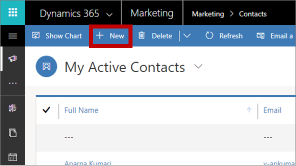
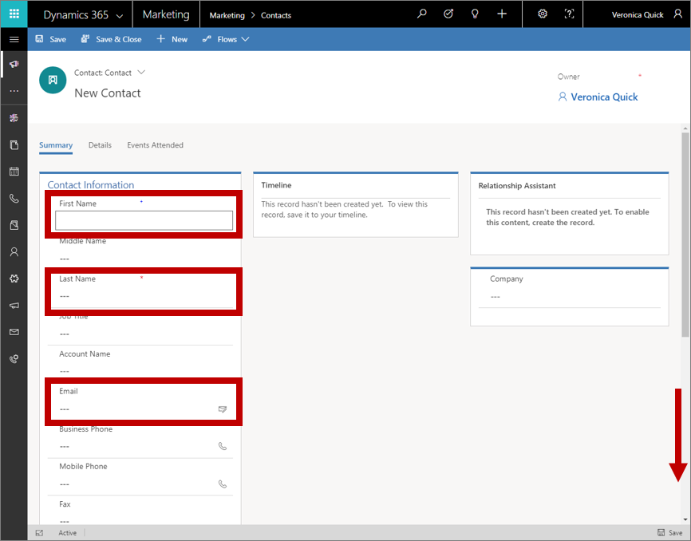
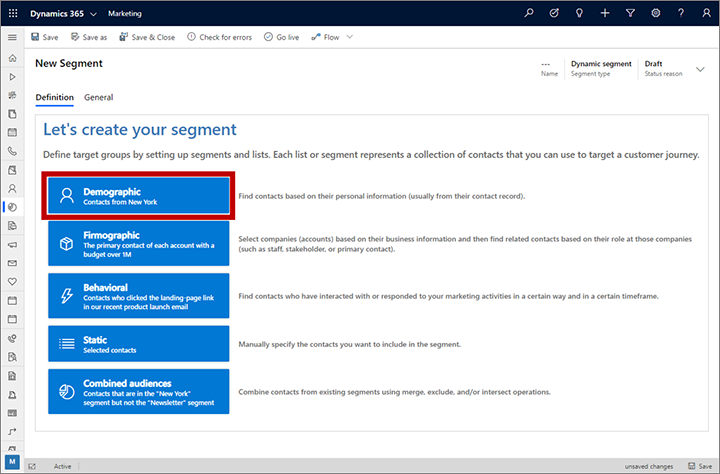
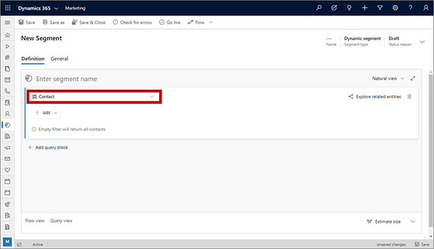
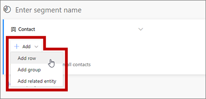
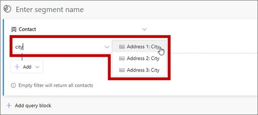
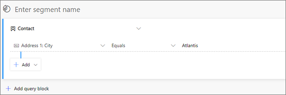
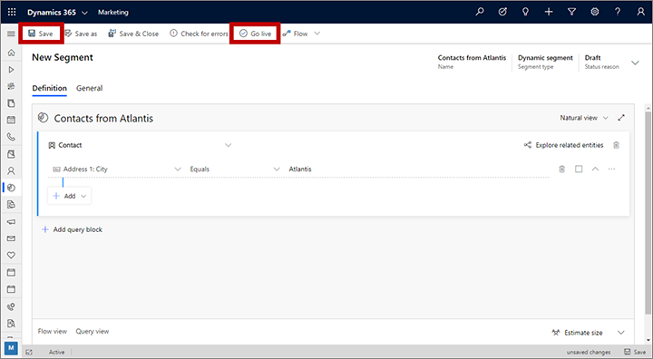
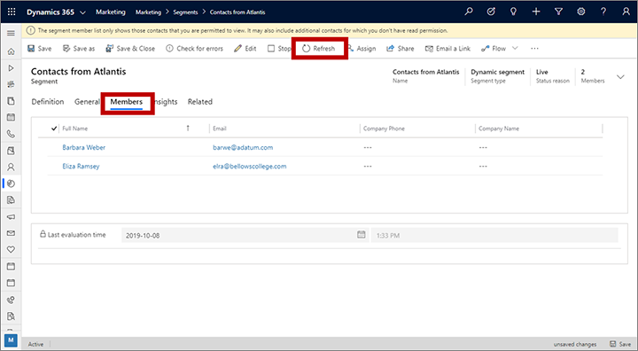

# Create a dynamic segment

One of the first and most important decisions you'll make when you design any marketing piece is to choose the right audience. Only after you know this will you be able to tailor your message to best appeal to that group of people.

In Dynamics 365 Marketing, you'll set up a collection of segments, which you'll define by using terms that resemble those you already use to describe groups of customers, such as "female wine enthusiasts over 40 living in San Francisco" or "craft beer fans from North Carolina who visited our booth at the festival." Then you'll use these segments to target marketing initiatives like email-marketing campaigns and customer journeys. Segments like these, which you define by using a set of rules and conditions, are called *dynamic segments* because membership in these segments changes constantly and automatically based on information in your database. (Static segments are populated by adding contacts explicitly, one at a time.)

In this exercise, you'll create a couple of fictional contacts with email addresses that you can read, and then set up a test segment that includes those contacts. This test segment will be useful later when you begin to experiment with customer journeys.

1. Go to **Marketing** > **Customers** > **Contacts**. This takes you to a list of existing contacts. On the command bar, select **New**.

    

1. The **New Contact** page opens.

      
    Fill out the following fields:
      - **First Name**: Enter a fictional first name.
      - **Last Name**: Enter a fictional last name.
      - **Email**: Enter your own email address (or one that you can receive mail from).
      - **Address 1: City**: Enter a fictional city (for this example, we use **Atlantis**). This will make it easy to create a segment that only includes fictional contacts.

1. On the command bar, select **Save & Close**.

1. Create a second contact similar to the one you just made. Use the same email address and fictional city, but use a different first and last name.

1. Go to **Marketing** > **Customers** > **Segments**. This takes you to a list of existing segments. On the command bar, select **New**.  

1. The **Segment templates** dialog box opens; select **Cancel** to close it and continue to the **Let's create your segment** screen. We're going to base this segment on properties of contact records alone, so select **Demographic** to create a demographic segment.

    

1. Dynamics 365 Marketing creates a demographic segment, which already includes a query against the contact entity. You can see the entity being queried by checking the value shown on the drop-down list at the top of the query block.

    

1. Your segment currently includes no filters (clause rows), which means it will find all the contacts in your database. But we only want to find the new test contacts that we just created, so let's add a filter. Open the **Add** drop-down list and select **Add row**.

    

1. A new row is added to your query on the contact entity. The row starts with a field containing the ghost test **Select attribute**. Select this field to open a drop-down list that shows all attributes available on the contact entity. Then type "city" to filter the list and choose **Address 1: City** from the list.

    

1. Two new drop-down lists are now added to the row. Leave the next drop-down list set to **Equals**. This is the *operator*, which defines the way we are going test values in the **Address 1: City** field of the **Contact** entity. Other operators include **Contains**, **Begins with**, **Contains data**, and more, depending on which type of value (string, number, date, and so on) you are working with.

1. Select the third drop-down list, which contains the ghost text **Enter text** and type the fictional city name that you chose for your test contacts (such as "Atlantis" if that's what you chose).

    

1. Select the field at the top of the query, which contains the ghost test **Enter segment name** and enter a name for your segment (such as "Contacts from Atlantis").

1. Select **Save** on the command bar to save your segment and then select **Go Live** to publish the segment (you won't be able to use it in a customer journey until it goes live, even though you've saved it). Dynamics 365 Marketing checks the segment for errors and reports any problems it finds. If an error is reported, fix it and try again. If no error is found, your segment is copied to the *marketing services*, which make it available for use by a customer journey.

    

1. Wait for about a minute and then select **Refresh** on the command bar to refresh the page. You should now see that a **Members** tab has been added (if you don't see it, wait a little longer and try to **Refresh** again until you do). When the **Members** tab appears, open it and note that your segment includes the two fictional contacts that you added earlier.

    

> [!TIP]
> You can build very complex queries by using the tools here, creating rows and groups combined with AND clauses and OR clauses, and adding more query blocks that you can combine using **Union**, **Exclude**, or **Intersect** operations. You can even query based on properties of other entities, but each query must ultimately end with the contact entity because segments must always result in a group of contacts. Though segments can't contain lead or account records, you can design your segments to find contacts associated with these types of records. For more, see [Working with segments](segmentation-lists-subscriptions.md) 

### See also

[Working with segments](segmentation-lists-subscriptions.md)  
[Design dynamic demographic or firmographic segments](segments-profile.md)
