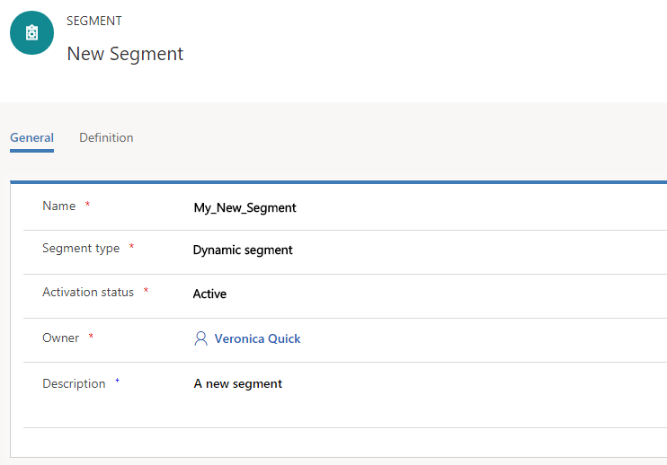
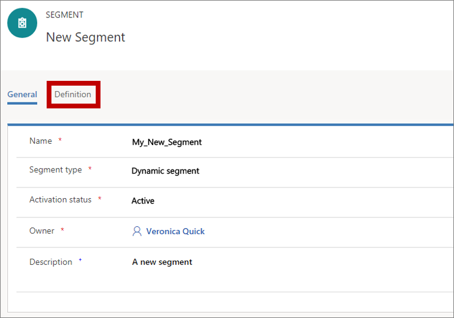
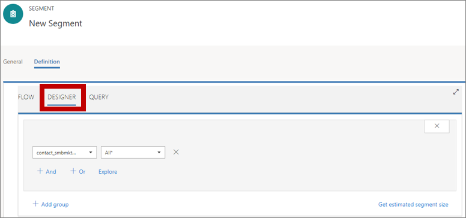
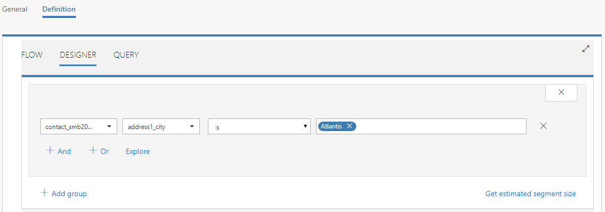

# Create a dynamic segment

[!INCLUDE[cc_applies_to_update_9_0_0](../includes/cc_applies_to_update_9_0_0.md)]

One of the first and most important decisions you'll make when you design any marketing piece is to choose the right audience. Only after you know this will you be able to tailor your message to best appeal to that group of people.

In [!INCLUDE[pn-marketing-business-app-module-name](../includes/pn-marketing-business-app-module-name.md)], you'll set up a collection of segments, which you'll define by using terms that resemble those you already use to describe groups of customers, such as "female wine enthusiasts over 40 living in San Francisco" or "craft beer fans from North Carolina who visited our booth at the festival." Then you'll use these segments to target marketing initiatives like email-marketing campaigns and customer journeys. Segments like these, which you define by using a set of rules and conditions, are called *dynamic segments* because membership in these segments changes constantly and automatically based on information in your customer engagement database. (Static segments are populated by adding contacts explicitly, one at a time.)

In this exercise, you'll create a couple of fictional contacts with email addresses that you can receive mail from, and then set up a test segment that includes those contacts. This test segment will be useful later when you begin to experiment with customer journeys.

1. Go to **Marketing** &gt; **Customers** &gt; **Contacts**. This takes you to a list of existing contacts. On the command bar, select **New**.  
    

2. The **New Contact** page opens.  
      
    Fill out the following fields:
      - **First Name**: Enter a fictional first name.
      - **Last Name**: Enter a fictional last name.
      - **Email**: Enter your own email address (or one that you can receive mail from).
      - **Address 1: City**: Enter a fictional city (for this example, we use **Atlantis**). This will make it easy to create a segment that only includes fictional contacts.

3. On the command bar, select **Save & Close**.

4. Create a second contact similar to the one you just made. Use the same email address and fictional city, but use a different first and last name.

5. Go to **Marketing** &gt; **Customers** &gt; **Segments**. This takes you to a list of existing segments. On the command bar, select **New**.  
    

6. The **New Segment** page opens, with the **General** tab shown. Enter information on the **General** tab to name and describe your new segment. Be sure to leave the **Segment type** set to **Dynamic segment**.  
    

7. Open the **Definition** tab. This is where you establish the rules of membership for your segment by building a database query.  
    

8. The **Definition** tab offers three ways to build and view your query: **Flow**, **Designer**, and **Query**. You can use whichever view you prefer—the result will be the same. For this procedure, you'll use the **Designer** view, which is both easy to use and compact.  
    

    > [!TIP]
    > Each of the three views on the **Definition** tab supports a different way of creating or viewing your segment design:
    > - **Flow** is optimized for combining segments by using logical operators.
    > - **Designer** is optimized for defining sets of logical rules and conditions that filter out contacts.
    > - **Query** presents the query as text, which is very compact and suitable for users who are used to working with database queries.

    > [!IMPORTANT]
    > While you are designing your segment, you can select the **Get estimated segment size** link to get an *estimate* for the number of contacts that will be included in the segment. This is only an estimate, and can be somewhat different from your actual segment size. You must go live with the segment to view its exact size and membership.

9. Because you're creating a new segment, you should see a single row in the **Designer**, where the **Contact** entity should already be selected (in the leftmost drop-down list) and set to **All&ast;**. This means that your segment currently finds *all* the contacts in your database, which is probably too many. Let's instead create a segment that just finds contacts who live in specific cities. To do that:  
   1. Change the drop-down list currently set to **All&ast;** to **addres1\_city**. This changes the query from one that finds all contacts to one that looks for contacts from a specific city or cities. It also adds two more inputs, which you'll use to finish defining this clause.
   2. Leave the next drop-down list set to **is**. This is the *operator* (other operators include **is not**, **greater than**, **less than**, and more, depending on which type of value you are working with).
   3. Enter the fictional city name that you chose for your test contacts in the field to the right of the operator list (**Atlantis**), and then select the Enter key on your keyboard. When you select the Enter key, your value becomes a button with an **X** on it. If you like, you can add more city names by entering them here, or remove existing ones by selecting the **X**. If you add several cities, they will be combined with an OR operator, which means you'll find contacts from each of the listed cities.

      Here's an example of how a simple query that finds all contacts from Atlantis might look on the **Designer** tab.  
      

      > [!TIP]
      > You can build very complex queries by using the tools here, combining AND clauses and OR clauses, and adding groups of additional clauses that you can combine with the main clause and other groups by using **Union**, **Exclude**, or **Intersect** operations. You can also move freely between the **Flow**, **Designer**, and **Query** tabs to see how your query looks when presented in these various ways.

10. On the command bar, select **Save** to save the work you've done on the segment so far.

11. On the command bar, select **Go Live** to publish the segment (you won't be able to use it in a customer journey until it goes live, even though you've saved it). [!INCLUDE[pn-marketing-business-app-module-name](../includes/pn-marketing-business-app-module-name.md)] checks the segment for errors and reports any problems it finds. If an error is reported, fix it and try again. If no error is found, your segment is copied to the [!INCLUDE[pn-marketing-business-app-module-name](../includes/pn-marketing-business-app-module-name.md)] email marketing service, which makes it available for use by a customer journey.

### See also

[Working with segments](segmentation-lists-subscriptions.md)  
[Set up subscription lists and subscription centers](set-up-subscription-center.md)
