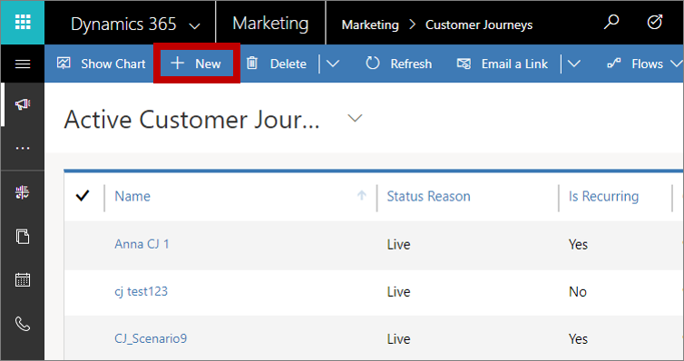
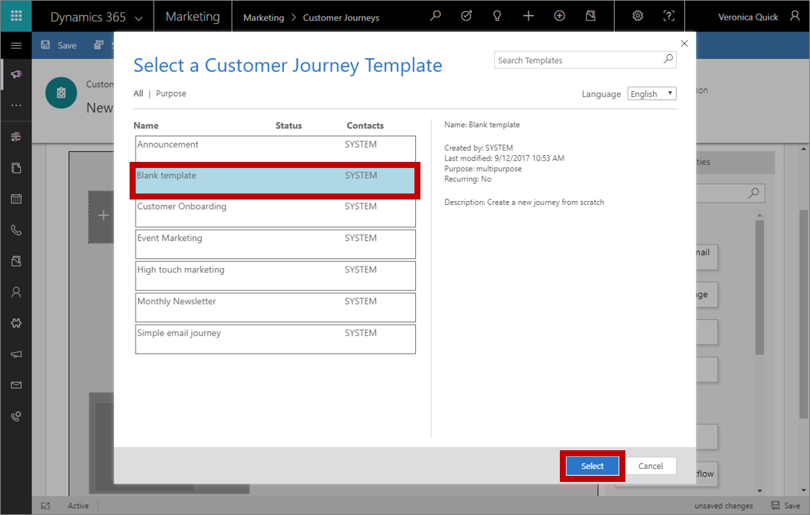
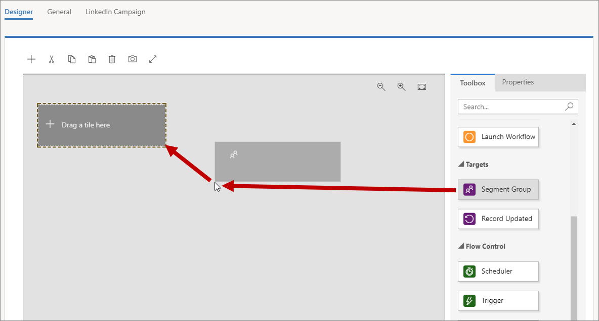
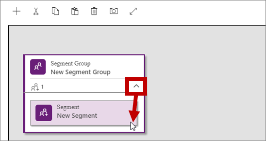
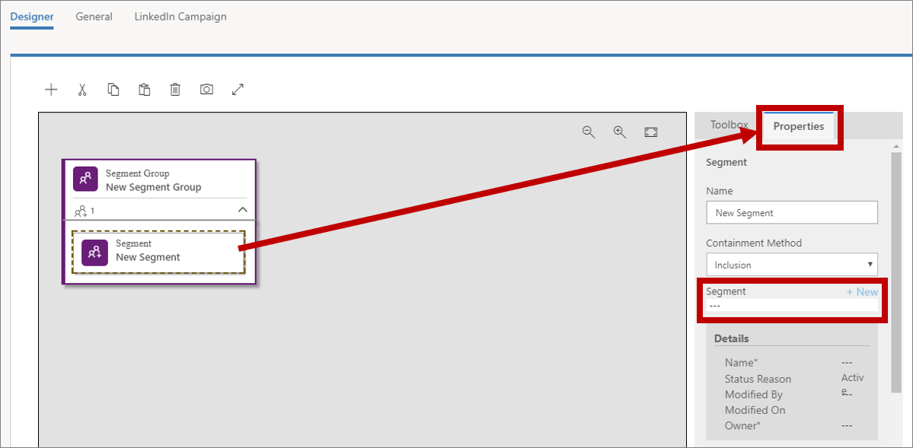
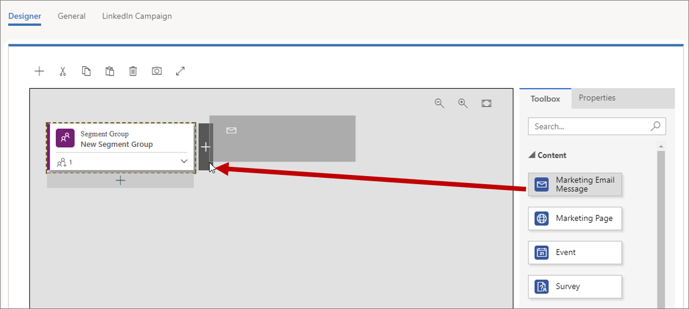
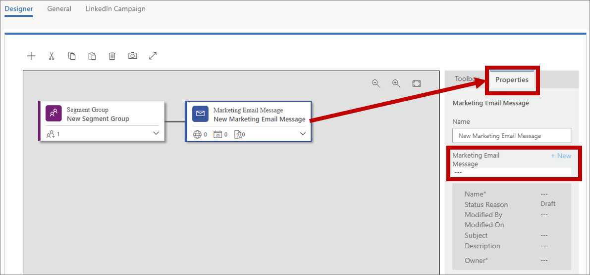
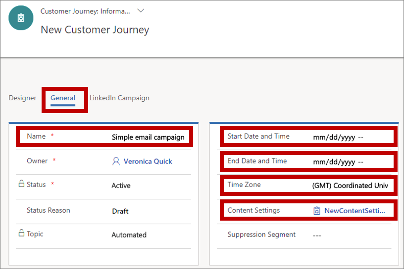
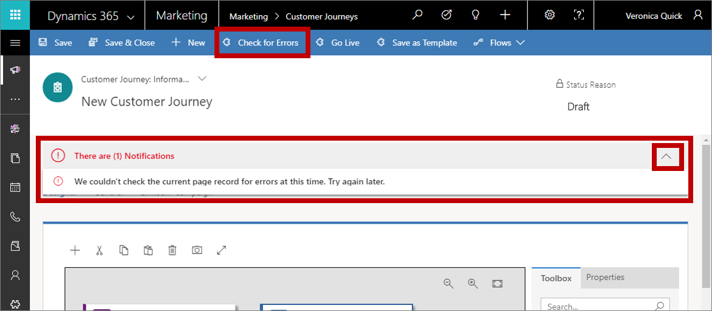

# Create a simple customer journey with email messaging

<iframe src="https://www.microsoft.com/videoplayer/embed/d73cc179-5984-4a32-ad84-0755f56b0399" frameborder="0" allowfullscreen=""></iframe>

As you engage potential customers, they start by discovering your product, evaluate whether it meets their needs, look for a good offer, and finally make a purchase. We call this process the *customer journey*. Use customer journeys to create a model that helps you guide the members of a selected marketing segment through this process by using automated messaging, activity generation, interactive decision points, and more.

A simple customer journey can include just two steps: identifying the target segment and creating an activity that addresses the members of that segment. In the following procedure, you'll set up a simple customer journey that sends an email message to all the members of a target segment.

Before you start, you'll need:

- A segment containing the contacts you will send your email to. Your segment should include just one or two fictional contacts with valid email addresses that you can receive mail from, like the one you set up in [Create a dynamic segment](create-segment.md).
- A marketing email that is both valid and live. You should be able to use the message you designed and published in [Create a marketing email and go live](create-marketing-email.md).

To create a customer journey that executes a one-time email blast:

1. Go to **Marketing** > **Marketing Execution** > **Customer Journeys**. This takes you to a list of existing customer journeys. Select **New** on the command bar.

    

1. The **New Customer Journey** page opens with the **Select a Customer Journey Template** dialog box shown. Each template provides a starting point for designing a particular type of customer journey. The template dialog box provides tools for searching, browsing, and previewing your template collection. Select **Blank template**, and then choose **Select**. The dialog box closes, and your selected template is copied to your new journey.

    

1. Now you are looking at the customer journey designer, where you will assemble a pipeline that defines each step of the journey. Like all journeys, this one starts with the participants, who in this case are the people you specify as part of a market segment. Drag a **Segment Group** tile from the **Toolbox** tab onto the first position of the pipeline.

    

1. Select the expand button at the lower-right corner of your new **Segment Group** tile to view the member segments of this group. Right now, there's just one, so select it.

    

1. With the nested segment still selected, open the **Properties** tab to the right of the canvas. The **Properties** tab provides settings that apply to the selected tile. Set the **Segment** to the name of the segment that you want to target with your campaign.

    

    > [!TIP]
    > When your customer journey is running, all contacts start at the **Segment Group** tile, and then step one tile forward and do whatever it says there, and so on down the pipeline—like in a simple board game. Some tiles hold on to contacts for awhile, while others do something immediately and then send the contact on to the next tile in the pipeline. Other tiles can split the path based on contact information or interactions. At runtime, you'll be able to see how many contacts are waiting at each tile, along with a few key results associated with the tile. In this simple example, you're going to add just one more tile—an **Email** tile—which sends an email message to each contact who enters the tile.

1. Go back to the **Toolbox** tab and drag an **Email** tile to the space immediately to the right of the **Segment Group** tile.

    

1. With the new **Email** tile still selected, open the **Properties** tab again. Set the **Marketing Email Message** to the name of the message that you want to send, such as the sample email message you created earlier in [Create a marketing email and go live](create-marketing-email.md).

      

    > [!TIP]
    > All the segments and email messages that you reference in your customer journey must be live before you can go live with the customer journey itself.

1. Until now, you've been working on the **Designer** tab. Now go to the **General** tab, where you can name your journey and configure its run schedule.

    Make the following settings here:
   - **Name**: Enter a name for the customer journey that you can easily recognize later. This name is internal-only.
   - **Start Date Time**: Enter the time when the journey should begin processing contacts. When you select the field, a suggested default time is provided.
   - **End Date Time**: Enter the time at which the journey should stop processing contacts. All actions will stop at this time, even if some contacts are still in the middle of the journey. If you're just testing, allow a couple of weeks.
   - **Time Zone**: Select your local time zone (if needed). The other dates and times on the page will be displayed relative to this zone.
   - **Content Settings**: This should already be set to the default content settings record set for your instance. These settings affect the dynamic content of marketing emails sent by this journey (as mentioned in [Create a marketing email and go live](create-marketing-email.md)).

    

    > [!TIP]
    > While your journey is running, it will continue to process new contacts that join its segment, even if they join after the start date. This means that new contacts can join in at any time until the end date arrives.

1. On the command bar, select **Save** to save the work you've done so far.  

1. To make sure your journey includes all required content and settings, select **Check for Errors** in the command bar. Dynamics 365 Marketing checks it and then displays results. If errors were found, you'll see a message at the top of the window and various indicators to show where the problems are. For example, if one of your tiles is misconfigured, you'll see an error count above the relevant tile, and you can read details about the error by selecting the tile and opening its **Properties** tab.

    

    If you followed this procedure and your email message is live, your journey should pass the error check. If it doesn't, read the error message, fix the reported issue, and try again until it passes.

1. Your journey is now ready to go. To start it running, publish it by selecting **Go Live** on the command bar.

    

    Dynamics 365 Marketing copies the journey to its email marketing service, which executes the journey by processing contacts, performing actions, and collecting results during the time it is set to run. The journey's **Status Reason** is updated to **Live**.

1. It might take several minutes for your messages to get sent, so allow some time for them to arrive in your inbox. After they do, open them and load the images. Then you can go back to Dynamics 365 Marketing and see how your journey is going. The **Designer** tab now shows information and results for each tile from your pipeline. Open the **Insights** tab to see detailed analytics.

    > [!TIP]
    > Many entities in Dynamics 365 Marketing provide an **Insights** tab for analyzing the results of your marketing initiatives. For example, try opening the email message you sent with this customer journey and check its **Insights** tab for even more information.

### See also

[Generate activities from a customer journey](generate-activities-from-customer-journey.md)  
[Create an interactive customer journey](create-interactive-customer-journey.md)  
[Use customer journeys to create automated campaigns](customer-journeys-create-automated-campaigns.md)  
[Customer journey tiles reference](customer-journey-tiles-reference.md)  
[Working with segments](segmentation-lists-subscriptions.md)
