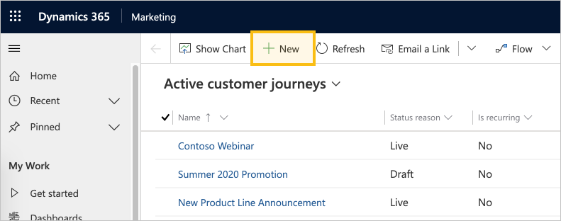
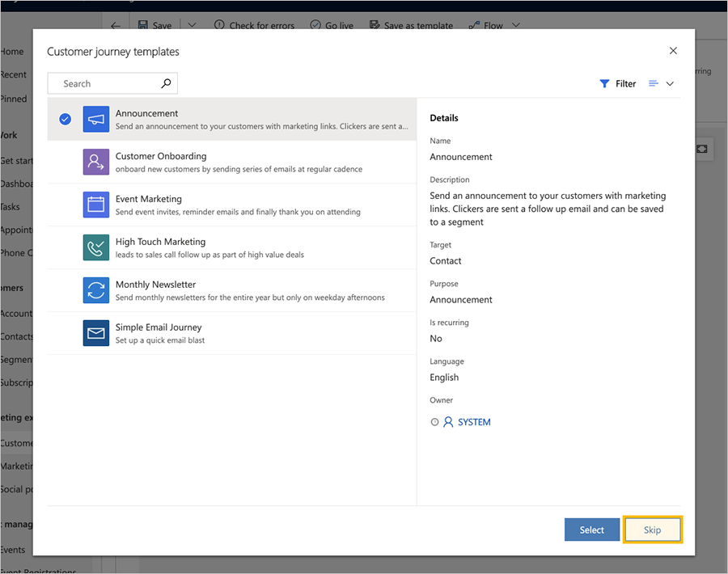
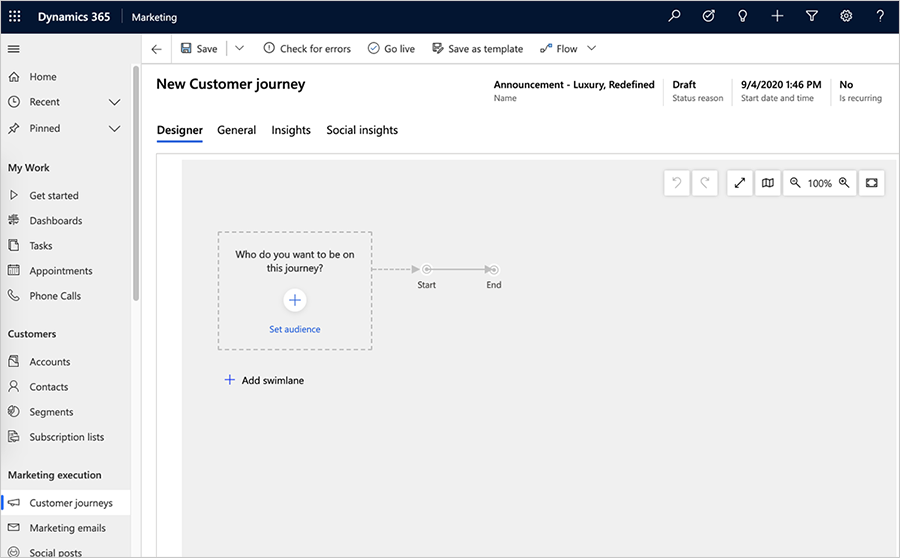
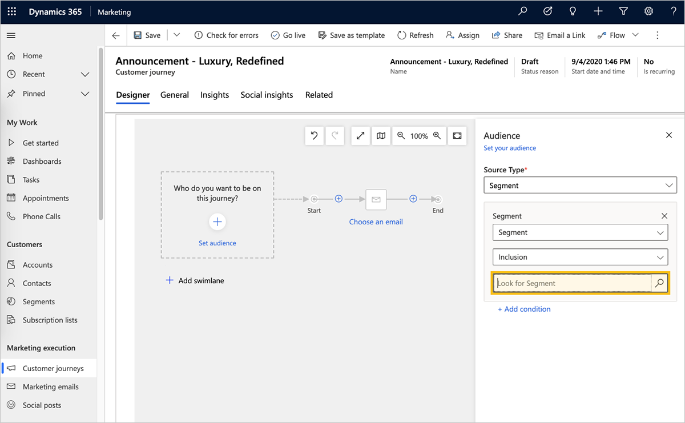
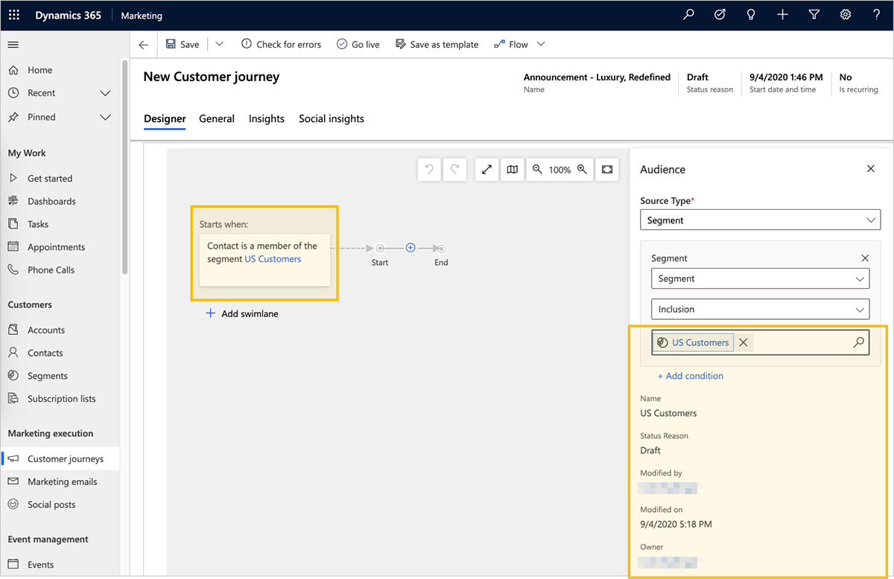
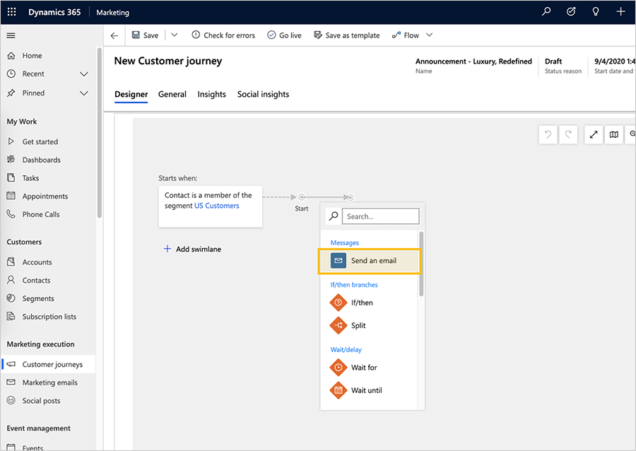
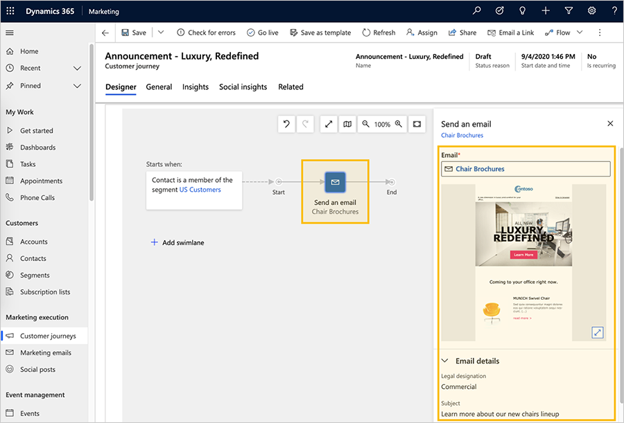
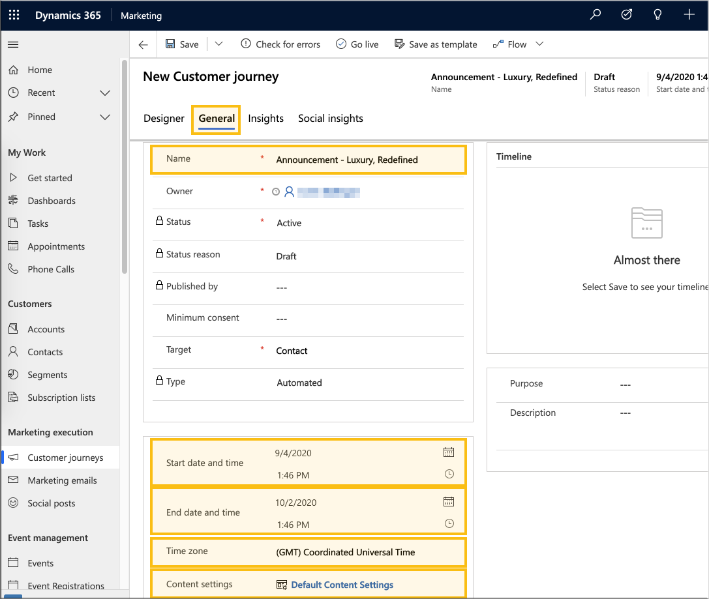
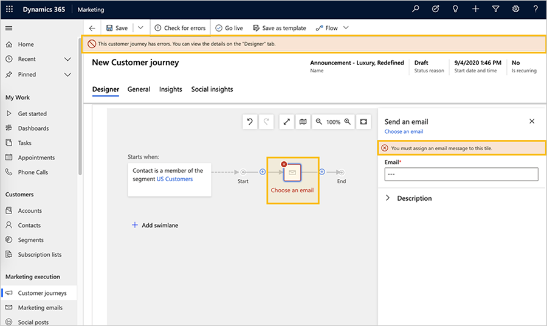
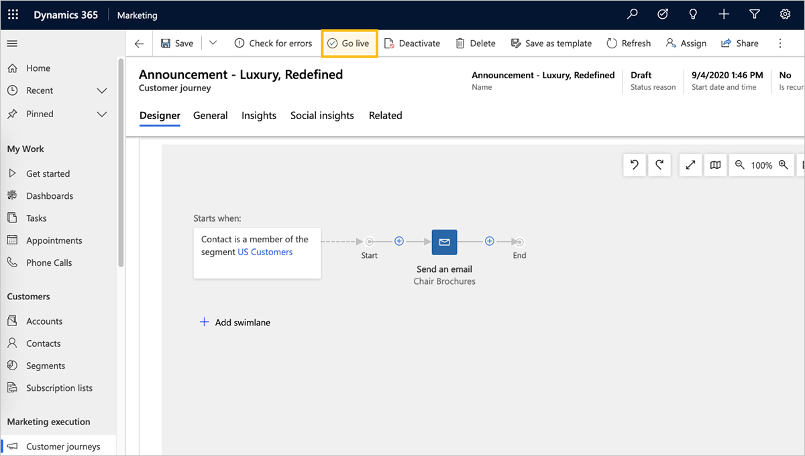

# Create a simple customer journey with email messaging

<iframe src="https://www.microsoft.com/videoplayer/embed/RE4IO58" frameborder="0" allowfullscreen=""></iframe>

As you engage potential customers, they start by discovering your product, evaluate whether it meets their needs, look for a good offer, and finally make a purchase. We call this process the *customer journey*. Use customer journeys to create a model that helps you guide the members of a selected marketing segment through this process by using automated messaging, activity generation, interactive decision points, and more.

A simple customer journey can include just two steps: identifying the target segment and creating an activity that addresses the members of that segment. In the following procedure, you'll set up a simple customer journey that sends an email message to all the members of a target segment.

Before you start, you'll need:

- A segment containing the contacts you will send your email to. Your segment should include just one or two fictional contacts with valid email addresses that you can receive mail from, like the one you set up in [Create a dynamic segment](create-segment.md).
- A marketing email that is both valid and live. You should be able to use the message you designed and published in [Create a marketing email and go live](create-marketing-email.md).

To create a customer journey that executes a one-time email blast:

1. Go to **Marketing** > **Marketing Execution** > **Customer Journeys**. This takes you to a list of existing customer journeys. Select **New** on the command bar.

    

1. The **New Customer Journey** page opens with the **Select a Customer Journey Template** dialog box shown. Each template provides a starting point for designing a particular type of customer journey. The template dialog box provides tools for searching, browsing, and previewing your template collection. Select **Skip** to start creating the journey from scratch.

    

1. Now you are looking at the customer journey designer. Here, you will assemble a pipeline that defines each step of the journey. Like all journeys, this one starts with the participants, who in this case are the people you specify as part of a market segment.

    

1. Select **Set audience** (or, alternatively, select **+**). The **Audience** properties pane will appear on the right side of the page. Leave the default settings there (for example, **Segment** selected as the audience source type). Select the segment that you want to target with your campaign in the segment lookup field.

    

1. After you select a segment, the first tile populates with the segment name and the **Audience** pane displays the segment properties.

    

    > [!TIP]
    > When your customer journey is live, all contacts start at the **Audience** tile (the initial step). Contacts move forward depending on the tile rules, similar to a board game. Some tiles hold on to contacts for a while, while other tiles complete an action immediately and send the contact to the next tile in the pipeline. Other tiles can split the path based on contact information or interactions. When the journey is live, you'll be able to see how many contacts are waiting at each tile, along with a few key results associated with the tile.
    >
    > In this example, you will add one more tile—an **Email** tile—which sends an email message to each contact who enters the tile.

1. Select **+** on the canvas, and then select **Send an email** from the contextual menu.

    

1. Select the email tile on the canvas and select the email message that you want to send. You can use the sample email message you created earlier in [Create a marketing email and go live](create-marketing-email.md).

    

1. Once the email is selected, the **Send an email** tile populates with the email name and the **Send an email** properties pane displays the segment preview and properties.

    > [!TIP]
    > All the segments and email messages that you reference in your customer journey must be live before you can go live with the customer journey itself.

1. Until now, you've been working in the **Designer** tab. Now go to the **General** tab, where you can name your journey and configure its run schedule.
    
    Make the following settings in the **General** tab:
    
    - **Name**: Enter a name for the customer journey that you can easily recognize later. This name is internal-only.
    - **Start date and time**: Enter the time when the journey should begin processing contacts. When you select the field, a suggested default time is provided.
    - **End date and time**: Enter the time at which the journey should stop processing contacts. All actions will stop at this time, even if some contacts are still in the middle of the journey. If you're just testing, allow a couple of weeks.
    - **Time zone**: Select your local time zone (if needed). The other dates and times on the page will be displayed relative to this zone.
    - **Content settings**: This should already be set to the default content settings record set for your instance. These settings affect the dynamic content of marketing emails sent by this journey (as mentioned in [Create a marketing email and go live](create-marketing-email.md)).

    

    > [!TIP]
    > While your journey is running, it will continue to process new contacts that join its segment, even if they join after the start date. This means that new contacts can join in at any time until the end date arrives.

1. On the command bar, select **Save** to save the work you've done so far.
1. To make sure your journey includes all required content and settings, select **Check for errors** in the command bar. Dynamics 365 Marketing examines the customer journey and then displays results. 

    If errors were found, you'll see a message at the top of the window and various indicators to show where the problems are. For example, if one of your tiles is misconfigured, you'll see an error icon in the relevant tile, and you can read details about the error by selecting the tile and opening its **Properties** tab. If you followed this procedure and your email message is live, your journey should pass the error check. If it doesn't, read the error message, fix the reported issue, and try again until it passes.
    
    

1. Your journey is now ready to go. To start the journey, publish it by selecting **Go live** on the command bar.

    Dynamics 365 Marketing copies the journey to its email marketing service, which executes the journey by processing contacts, performing actions, and collecting results during the time it is set to run. The journey's **Status Reason** is updated to **Live**.

    

1. If you have sent test messages to yourself, it might take several minutes for your messages to send, so allow some time for them to arrive in your inbox. After they do, open them and load the images. Then you can go back to Dynamics 365 Marketing and see how your journey is going. The **Designer** tab now shows information and results for each tile from your pipeline. Open the **Insights** tab to see detailed analytics.

    > [!TIP]
    > Many entities in Dynamics 365 Marketing provide an **Insights** tab for analyzing the results of your marketing initiatives. For example, try opening the email message you sent with this customer journey and check its **Insights** tab for even more information.

### See also

[Generate activities from a customer journey](generate-activities-from-customer-journey.md)  
[Create an interactive customer journey](create-interactive-customer-journey.md)  
[Use customer journeys to create automated campaigns](customer-journeys-create-automated-campaigns.md)  
[Customer journey tiles reference](customer-journey-tiles-reference.md)  
[Working with segments](segmentation-lists-subscriptions.md)

[!INCLUDE[footer-include](../includes/footer-banner.md)]