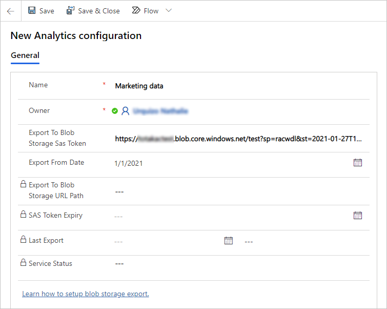
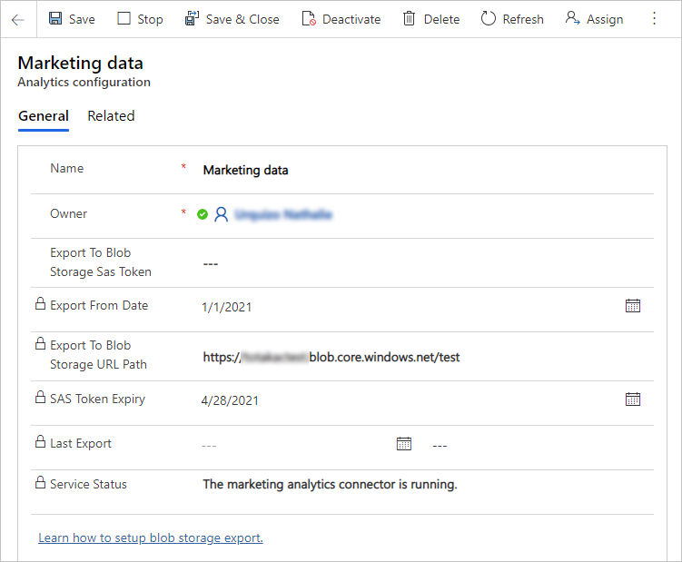

# Prepare for analytic reporting with Power BI

Dynamics 365 Marketing provides a wide selection of built-in analytics throughout the application. But you can also create your own custom analytics and reports from your Dynamics 365 Marketing data by using Power BI. We provide endpoints that you can use to connect Power BI to Dynamics 365 Marketing, plus a downloadable Power BI template that you can open in Power BI Desktop, connect to your Dynamics 365 data sources, and then customize as needed. When you're done setting it up, you can publish and share your Power BI report using the standard Power BI online tools.

## Data sources for custom analytics

To create custom analytics, you can connect two different data sources, each of which provides a different type of data:

- **Profile data** is stored in the organizational database and includes the entities and records that you see, edit, and create when working directly in Dynamics 365 Marketing. These include common entities like contacts, accounts, leads, events, customer journeys, and more. You'll use the Power BI data connector called "Common Data Services for Apps" for this type of data.
- **Interaction data** is stored in the marketing-insights service database and includes information about how your contacts interacted with your marketing initiatives, including email opens, email clicks, event registrations, page submissions, and more. You can see this type of information when you look at the insights built into Dynamics 365 Marketing, but you can't create these records nor view them directly. In the current release, you'll use the Power BI "Azure Blob Storage" connector for this type of data. In future releases, you'll also be able to use the dataflow connector.

You'll be able to connect directly to your Dynamics 365 Marketing  database from Power BI to fetch your profile data, but to access interaction data you'll need to set up Azure Blob Storage, configure Dynamics 365 Marketing to save interaction data there, and then connect Power BI to your blob storage.

<!-- [kfm: this video is being edited and will be hosted elsewhere. Revive this section and update the embed when it's ready]

Watch [the following video](https://www.youtube.com/watch?v=pBrB1BohUrE)
for a quick overview of all the data that is available for your marketing analytical reports.  

<iframe width="560" height="315" src="https://www.youtube.com/embed/pBrB1BohUrE" frameborder="0" allow="accelerometer; autoplay; encrypted-media; gyroscope; picture-in-picture" allowfullscreen></iframe>
 -->

## Set up Azure Blob storage and connect it to Marketing

> [!IMPORTANT]
> As of November 2021, blob naming and data update logic has changed. Previously, exporting Marketing insights created a new blob file each time a batch of new interactions arrived. Each batch typically contained a single or a few interactions. The file name was a randomly generated GUID, which prevented collision and any interpretation. Once the blob was created, it was never changed. The blob export process created a large number of small blobs in the storage, which significantly slowed Power BI refresh.
>
> The updated Marketing insights export process appends interaction batches to recent blobs. When a blob grows to the configurable size (10MB by default), the export creates a new blob. After, the blob name changes to allow the system to find the most recent blob to append, but the naming should be assumed random and not be interpreted as before. The internal format remains the same: a comma-separated list of interactions with header. All Power BI reports (out-of-the-box and custom) should keep working.
>
> If your organization implemented custom processing (on top of the Marketing export) which relies on the blobs' immutability or names, the process may need to be updated. Contact customer support for more details or for switching the export feature to the previous non-optimized mode.
>
> If your storage is overwhelmed by blobs from previous exports, resync the insights data from scratch. To resync the data:
>
> 1. Stop ongoing export using the configuration in the Marketing app.
> 1. Delete the container with existing interactions data.
> 1. Create a new container and start a new export as usual.

> [!IMPORTANT]
> Here are some considerations related to configuring the Azure Storage Account firewall (limited public network access) when exporting analytics data:
>
> 1. If you *do not* need to limit public network access to the Storage Account ([Configure Azure Storage firewalls and virtual networks](/azure/storage/common/storage-network-security?tabs=azure-portal)), proceed with further configuration steps. **If you do not need to limit public network access, you can complete this guide and connect Azure Blob storage to Marketing**.
> 1. If you need to limit public network access to the Storage Account&mdash;for example, if you want to limit access to selected virtual networks and IP addresses only&mdash;**you must [contact our customer support team](https://dynamics.microsoft.com/contact-us/) to assist you with the Azure Storage Account firewall configuration**. This is a complicated scenario and support team assistance is required based on the Storage Account location and service instance data. In the meantime, it is possible to continue with remaining steps, but the feature will only work once the firewall is properly configured.
> 1. If the Storage Account is required to have public network access disabled entirely and you want to limit access to Private Link Endpoint only, **then this is not a supported scenario for this feature**. Consider using a different Storage Account with lower access restrictions.

1. Sign into [portal.azure.com](https://portal.azure.com) using the same account where you're running Dynamics 365 Marketing.

1. If you don't already have one, then create a general-purpose storage account in the Azure Blob storage as described in [Quickstart: Upload, download, and list blobs using the Azure portal](/azure/storage/blobs/storage-quickstart-blobs-portal).

    > [!NOTE]
    > Your general-purpose storage account can be either V1 or V2. Both will work with the Power BI template supplied by Microsoft, but we recommend using V2 if possible because it will support more advanced Power BI capabilities in the future.

1. Create a blob storage container in your storage account, also as described in [Quickstart: Upload, download, and list blobs using the Azure portal](/azure/storage/blobs/storage-quickstart-blobs-portal).

1. Launch the Microsoft Azure Storage Explorer, which is a desktop app, and connect it to your Azure account. If  you don't already have it, you can download if for free from [https://azure.microsoft.com/features/storage-explorer/](https://azure.microsoft.com/features/storage-explorer/).

1. In the Storage Explorer, navigate down to the blob storage container you just created.

    

1. Right-click on your blob storage container and then select **Get shared access signature** from the context menu. The **Shared Access Signature** dialog opens.

    Make the following settings:

    - Choose a **Start time** and **Expiry time** to establish the period during which your signature will remain valid. Note that the signature must remain valid for as long as you intend to run the export&mdash;the export will stop immediately when the signature expires.
    - Enable the following **Permissions** by selecting their check boxes:
        - Read
        - Add
        - Create
        - Write
        - Delete
        - List

1. Select **Create** to create the signature. The dialog refreshes to show a **URL** and **Query string**. Select the **Copy** button to copy the **URL** shown here and paste in a temporary text file so you can use it later in this procedure.

    

1. Sign into Dynamics 365 Marketing and go to the **Settings** area in the area switcher, then go to **Data management** > **Analytics configuration**. A list of marketing analytics configurations opens. If a record is already listed here, then select it to open it; otherwise, select **New** from the command bar to create a new record.

1. The **Marketing analytics configuration** page opens.

    

    Make the following settings:

    - **Name**: Enter a name to identify this configuration record.
    - **Export to blob storage SAS token**: Paste the URL you copied earlier in this procedure.
    - **Export from date**: Optional. When left empty, all interactions available in the Marketing application will be exported. If a date value is specified, then only the interactions that happened after this date will be exported. This is useful for reducing the amount of data exported if you aren't interested in creating reports for older interactions.

    > [!NOTE]
    > Parallel exports are not supported, only one export configuration is allowed.

1. Save your settings.

    

    > [!NOTE]
    > The URL you pasted here has two parts: a storage URL identifying your storage account and container name, and an SAS token that allows Dynamics 365 Marketing to connect to your blob storage. To prevent other people from being able to connect to your blob storage, only the storage URL will be saved in the Dynamics 365 database. The full URL, including the SAS token, will be stored securely in Dynamics 365 Marketing. This is why you can never see the full URL in this form.

1. After a short time, Dynamics 365 Marketing will begin to export interaction data as individual files to your blob storage container, where you'll be able to pick it up using Power BI. You'll also be able to see these files and an associated JSON file in the Azure Storage Explorer.

    > [!NOTE]
    > Interactions are exported on the fly, but only until the provided SAS token expires. You can update the SAS token at any time by pasting a new URL in the **Export to blob storage sas token** field and saving the configuration. The already stopped export will be automatically restarted. This is only possible for the same storage account or container. If you need to export to a different storage account and container, stop the current export, delete the configuration, and create a new one.

## Get Power BI templates and connect them your Marketing data

Once your Azure Blob storage is set up and connected to Dynamics 365 Marketing, you're ready to start working in Power BI to connect to your data sources and design your analytics. Do help get you started, we provide a [gallery of pre-built templates and sample reports](marketing-analytics/analytics-gallery-start.md) that you can download, explore, customize, and connect to your Dynamics 365 Marketing instance.

More information: [Download and use marketing analytics templates and sample reports for Power BI](marketing-analytics/analytics-gallery-start.md)

[!INCLUDE[footer-include](../includes/footer-banner.md)]
