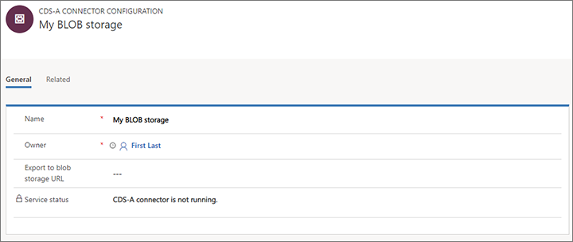

# Prepare for analytic reporting with Power BI

Dynamics 365 Marketing provides a wide selection of built-in analytics throughout the application. But you can also create your own custom analytics and reports from your Dynamics 365 Marketing data by using Power BI. We provide endpoints that you can use to connect Power BI to Dynamics 365 Marketing, plus a downloadable Power BI template that you can open in Power BI Desktop, connect to your Dynamics 365 data sources and then customize as needed. When you're done setting it up, you can publish and share your Power BI report using the standard Power BI online tools.

> [!IMPORTANT]
> [!INCLUDE[cc_preview_features_definition](../includes/cc-preview-features-definition.md)]
> [!INCLUDE[cc_preview_features_no_MS_support](../includes/cc-preview-features-no-ms-support.md)]  

## Data sources for custom analytics

To create custom analytics, you can connect two different data sources, each of which provides a different type of data:

- **Profile data** is stored in the organizational database and includes the entities and records that you see, edit, and create when working directly in Dynamics 365 Marketing. These include common entities like contacts, accounts, leads, events, customer journeys, and more. You'll use the Power BI data connector called "Common Data Services for Apps" for this type of data.
- **Interaction data** is stored in the marketing-insights service database and includes information about how your contacts interacted with your marketing initiatives, including email opens, email clicks, event registrations, page submissions, and more. You can see this type of information when you look at the insights built into Dynamics 365 Marketing, but you can't create these records nor view them directly. In the current release, you'll use the Power BI "Azure Blob Storage" connector for this type of data. In future releases you'll also be able use the dataflow connector.

You'll be able to connect directly to your Dynamics 365 Marketing  database from Power BI to fetch your profile data, but to access interaction data you'll need to set up Azure Blob Storage, configure Dynamics 365 Marketing to save interaction data there, and then connect Power BI to your blob storage.

## Set up Azure Blob storage and connect it to Marketing

1. Sign into [portal.azure.com](https://portal.azure.com) using the same account where you are running Dynamics 365 Marketing.

1. If you don't already have one, then create a general-purpose storage account in the Azure Blob storage as described in [Quickstart: Upload, download, and list blobs using the Azure portal](https://docs.microsoft.com/azure/storage/blobs/storage-quickstart-blobs-portal).

    > [!NOTE]
    > Your general-purpose storage account can be either V1 or V2. Both will work with the Power BI template supplied by Microsoft, but we recommend using V2 if possible because it will support more advanced Power BI capabilities in the future.

1. Create a blob storage container in your storage account, also as described in [Quickstart: Upload, download, and list blobs using the Azure portal](https://docs.microsoft.com/azure/storage/blobs/storage-quickstart-blobs-portal).

1. Launch the Microsoft Azure Storage Explorer, which is a desktop app, and connect it to your Azure account. If  you don't already have it, you can download if for free from [https://azure.microsoft.com/features/storage-explorer/](https://azure.microsoft.com/features/storage-explorer/).

1. In the Storage Explorer, navigate down to the blob storage container you just created.

    

1. Right-click on your blob storage container and then select **Get shared access signature** from the context menu. The **Shared Access Signature** dialog opens.

    

    Make the following settings:

    - Choose a **Start time** and **Expiry time** to establish the period during which your signature will remain valid. Please note that the signature must remain valid for as long as you intend to run the export&mdash;the export will stop immediately when the signature expires.
    - Enable all four **Permissions** by selecting their check boxes.

1. Select **Create** to create the signature. The dialog refreshes to show a **URL** and **Query string**. Select the **Copy** button to copy the **URL** shown here and paste in a temporary text file so you can use it later in this procedure.

    

1. Sign into Dynamics 365 Marketing and go to **Settings** > **Advanced settings** > **Marketing settings** > **Marketing analytics configuration**. A list of marketing analytics configurations opens. If a record is already listed here, then select it to open it; otherwise, select **New** from the command bar to create a new record.

1. The **Marketing analytics configuration** page opens.

    

    Make the following settings:

    - **Name** : Enter a name to identify this configuration record.
    - **Export to blob storage URL** : Paste the URL you copied earlier in this procedure.

    > [!NOTE]
    > The URL you pasted here includes a connection string to connect to your blob storage. Dynamics 365 Marketing will use this to set up a connection to the blob storage but will then discard it to prevent other people from being able to find it. For this same reason, the connection string will be hidden on the form after submit. This  URL _won't_ be stored in the Dynamics 365 database. That means that if you later copy your instance to a sandbox or restore from a backup, then you'll need to re-enter this URL to reestablish the connection to your blob storage in Azure.

1. Save your settings.

1. After a short time, Dynamics 365 Marketing will begin to export interaction data as individual files to your blob storage container, where you'll be able to pick it up using Power BI. You'll also be able to see these files and an associated JSON file in the Azure Storage Explorer.

<!-- kfm: the following section needs to be combined with the new template gallery info. Either move this there, or remove the duplicate information from there. Fix these links to match those too. -->

## Get the Power BI template and connect to your Marketing data

Once your Azure Blob storage is set up and connected to Dynamics 365 Marketing, you're ready to start working in Power BI to connect to your data sources and design your analytics.

1. If you haven't already, then [download the templates from GitHub](https://github.com/Microsoft/Dynamics-365-for-Marketing---Power-BI-Reporting/releases). The following templates are provided:

    - **Dynamics 365 Marketing template for Power BI**: This template is prepared to connect to your Dynamics 365 Marketing data sources, but doesn't include any pre-built analyzers. This is a good place to start when developing custom solutions from scratch.
    - **Email marketing analyzer for Power BI**: This template includes a feature-rich email marketing analyzer that is ready to connect to your Dynamics 365 Marketing data sources. It provides a comprehensive report of your email marketing results, including detailed analytics, charts, and views spread across multiple report pages. You can use this template as-is, or as inspiration for designing your own reports.

1. Open your selected template in Power BI Desktop. If you don't already have Power BI Desktop, you can download it for free from [https://powerbi.microsoft.com/desktop/](https://powerbi.microsoft.com/desktop/).

1. The first time you open the Power BI template you'll be asked to specify connection strings and credentials to connect to both Azure Blob storage and to Dynamics 365 Marketing.

    

    - To connect to the Dynamics 365 database, use the same user credentials that you use to sign into Marketing.
    - You can find connection details for your Azure Blob storage by using the Storage Explorer app.
    - Specify how many days of interaction data that you want to load (counting back from today).

1. Select **Load** to load the template or analyzer into Power BI.

    > [!NOTE]
    > If you see loading errors the first time you open a template or analyzer, then open the query editor, select a query that is highlighted with a warning icon and then select **Retry** on the notification message bar. Repeat for each query that shows a warning. After all queries have loaded, select **Close & Apply** and the refresh should work from now on.

The email marketing analyzer provides many views, charts, and analytics that marketers should find useful. Use the standard features of the Power BI Desktop to explore the data sources and analytical displays, and to customize them as required.

