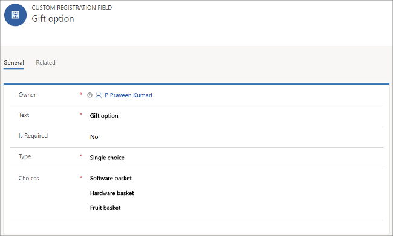
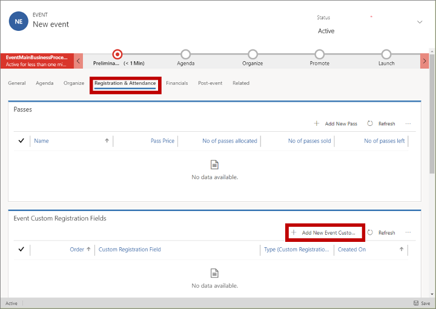
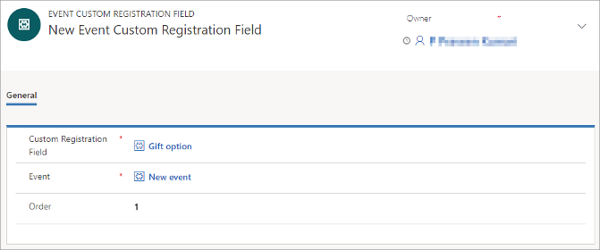
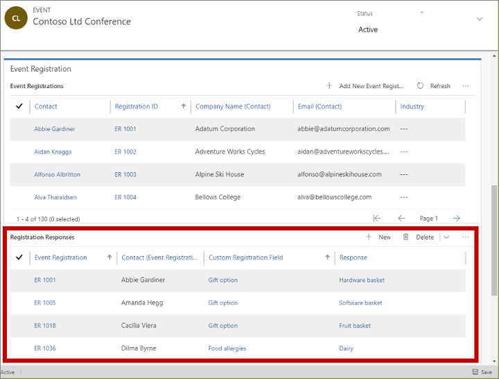
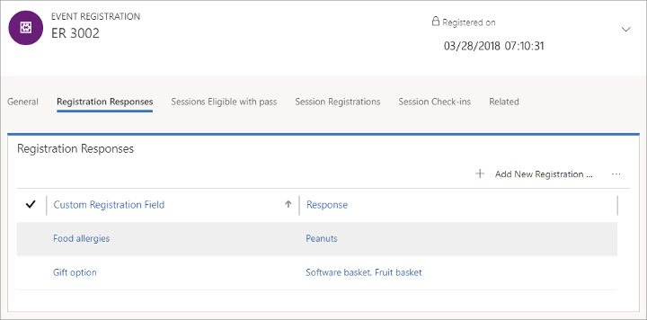

# Add custom fields to your event registration form

The default registration form presented by the event website includes fields for first name, last name, email address, and pass type (for paid events with at least one pass). If you'd like to receive additional information from attendees, such as for special needs, food allergies, or a gift preference, then you can easily add these as custom fields to your registration form. You can choose which custom fields to add to each event, and your registration records will include the values submitted by registrants.

## Set up a custom registration field

Go to the **Custom registration fields** page to view and create all the custom registration fields that are available for use with your various events. You'll be able to choose which of these to include for each of your events. To set up your custom fields:

1. [Open the Events work area](open-events.md) and go to **Events** > **Event** > **Custom registration fields**.

2. A list of your current custom fields is shown. Select **New** from the command bar to add a new field or select any listed field to edit that field.  
    

3. Make the following settings:

   - **Owner**: The name of the user who owns this record.
   - **Text**: The field label, exactly as it will be shown on the form.
   - **Is Required**: Sets whether Dynamics 365 Marketing should require registrants to specify a value for this field. Set this to **Yes** to mark the field as required.
   - **Type**: Sets the type of input field created on the form. **Simple text** creates a text field where registrants can type a value. **Boolean** creates a check box (yes or no option); **Single choice** creates a drop-down list, where registrants can choose just one value; and **Multiple choice** creates a set of check boxes, where registrants can enable as many options as they want.
   - **Choices**: This setting is only shown when the **Type** is set to **Single choice** or **Multiple choice**. Enter each available option here, with options separated by a carriage return.

4. Choose **Save** in the bottom-right corner of the window to save your settings.

## Add a custom registration field to an event

Once you have set up the custom fields you require, you can assign them to events as needed. To assign a custom field to an event:

1. Go to **Events** > **Event** > **Events**.

1. A list of your current events is shown. Select **New** from the command bar to add a new event or select any listed event to edit that event. (If you are creating a new event, then enter values for all required fields and choose **Save** in the bottom-right corner of the window to save it before continuing.)

1. Go to the **Registration &amp; attendance** tab and then look at the **Event custom registration fields** section, which lists all the custom fields already enabled for this event. If the field you are looking for isn't already listed, then select the **Add new event custom field** button at the top of this list.  
    

1. A new page opens, where you can set up the field for this event.
Make the following settings:  
     

    - **Custom registration field**: Select an existing custom field that is already set up for your instance as described in the previous section.
    - **Event**: This is the event where you will add this custom field. The current event should already be shown here.
    - **Order**: Enter an integer to control the position of this field (relative to other custom fields). Lowest values are displayed first in the registration form.

1. Choose **Save** in the bottom-right corner of the window to save your settings.

## Read all custom field values submitted for an event

Each event record provides a list that shows all the custom-field values submitted by registrants for that event. To see them:

1. Go to **Events** > **Event** > **Events** and open an event.

1. Go to the **Registration &amp; attendance** tab for your selected event.

1. Scroll down to the **Event registration** section. The **Registration responses** table here lists each value supplied by each registrant for each custom field.  
     

## Read custom field values submitted for individual registrations

Each event registration record includes the values that the registrant entered for each custom field. To read them:

1. Do one of the following to open a registration record:

    - Go to **Events** > **Event** > **Event registrations** to open a list of all registrations for all events. Find and open a registration in the list.
    - Go to **Events** > **Event** > **Events** and open an event. Then go to the **Registration &amp; attendance** tab. Find and open a registration from the **Event registration** section of the page.
    - Go to **Marketing** > **Customers** > **Contacts** and open a contact. Then go to the **Events Attended** tab and find and open a registration record in the **Registered events** section of the page.

1. Once you have an event registration record open, go to its **Registration Responses** tab.  
    

1. The **Registration responses** table here shows each custom-field value that was submitted together with this event registration.

[!INCLUDE[footer-include](../includes/footer-banner.md)]