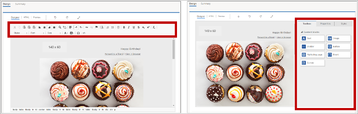
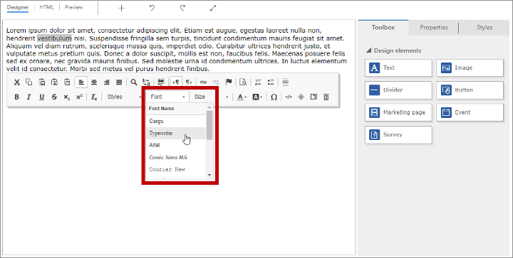
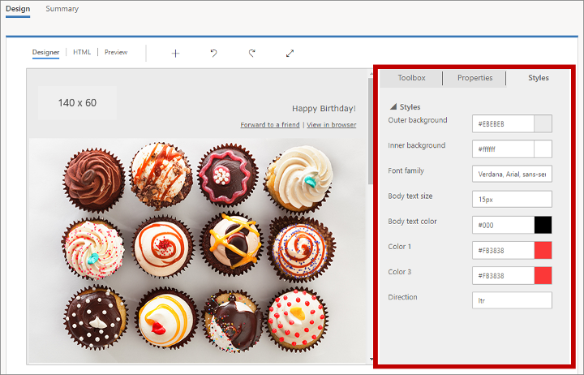

# Use custom attributes to enable designer features in emails, pages, and forms

The content designers provide both a graphical editor and an HTML code editor. The HTML that they generate is compatible with any HTML renderer, but they also support a few custom attributes that support the drag-and-drop design elements and general style settings provided by the graphical editor. The default message templates and page templates provided with Dynamics 365 Marketing make use of these custom attributes to make it easier for you to customize them in specific ways. You can also make use of these custom attributes when designing your own templates.

## Tag and attribute summary

The following table provides a quick reference to the custom attributes and meta tags described in this topic.

| Custom attribute | Description |
| --- | --- |
| `<meta type="xrm/designer/setting" name="type" value="marketing-designer-content-editor-document">` | When this tag is present in the `<head>` of your document, the **Designer** tab will provide drag-and-drop features. If this tag is not present, the **Designer** tab provides the simplified, full-page editor. More information: [Show the toolbox and enable drag-and-drop editing](#show-toolbox)|
| `<meta type="xrm/designer/setting" name="additional-fonts" datatype="font" value="<font-list>">` | When this tag is present in the `<head>` of your document, the fonts listed in the _&lt;font-list&gt;_ (semicolon-separated) will be added to the font menu in the formatting toolbar for text elements. More information: [Add new fonts to the text-element toolbar](#fonts)|
| `<div data-container="true"> … </div>` | Marks the start and end of a container where users can drag and drop design elements. More information: [Create a container where users can add design elements](#containers) |
| `<div data-editorblocktype="<element-type>"> … </div>` | Marks the start and end of a design element. The value of the attribute identifies which type of element it is (text, image, button, and so on). Some design elements support additional attributes here. More information: [Identify design elements](#elements) and [Lock elements in Designer view](#lock-element) |
| `<meta type="xrm/designer/setting" name="<name>" value="<initial-value>" datatype="<data-type>" label="<label>">` | This tag defines a document-wide style setting that users can edit using the **Designer** > **Styles** tab.  More information: [Add settings to the Styles tab](#styles) |
| `/* @<tag-name> */ … /* @<tag-name> */` | Use CSS comments like these to surround a CSS value to be controlled by a style setting, where &lt;_tag-name&gt;_ is the value of the _name_ attribute for the meta tag that established the setting. More information: [Add CSS comments to implement style settings in the head](#styles-css) |
| `property-reference= "<attr>:@< tag-name >;<attr>:@< tag-name >; …"` | Place this attribute in any HTML tag to place an attribute with a value controlled by a style setting, where _&lt;attr&gt;_ is the name of the attribute to be created and &lt;_tag-name&gt;_ is the value of the `name` attribute for the meta tag that established the setting. More information: [Add property-reference attributes to implement style settings in the body](#styles-attribute) |

The remaining sections of this topic provide more information about how to use each of the features summarized in the table.

<a name="show-toolbox"></a>

## Show the toolbox and enable drag-and-drop editing

You can paste HTML developed in any third-party tool directly into the **HTML** tab of the designer to start building a design very quickly. However, when you do this, the **Designer** tab will display as a single rich-text editor that provides a text-formatting toolbar, and shows all images, links, and styles included in your HTML, but doesn't otherwise provide the **Toolbox**, **Properties**, or **Styles** tabs, or any drag-and-drop functionality (this simplified **Designer** view is sometimes called the _full-page editor_). However, you can enable drag-and-drop functionality for any pasted-in design by adding the following meta tag to the `<head>` section of your document:

```xml
<meta type="xrm/designer/setting" name="type" value="marketing-designer-content-editor-document">
```

The following image shows the same design in full-page-edit mode (left) and drag-and-drop mode (right). The only difference is the design on the right includes the meta tag, so drag-and-drop is enabled, and the side panel is shown.



> [!NOTE]
> When using the full-page editor, you can still select, edit, and style text using the text-formatting toolbar (shown), and can also double-click on images, links, and other elements to set their properties using  a pop-up dialog. The toolbar also includes the **[Assist edit](dynamic-email-content.md#assist-edit)** button  for adding dynamic content, such as field values drawn from each recipient's contact record.

<a name="containers"></a>

## Create a container where users can add design elements

On the **Designer** tab, users can only edit content contained within a design element, and can only drag new design elements into those parts of the document that are set up as _data containers_. Therefore, you can create templates where some areas (outside of containers) are locked to editing on the **Design** tab, while other ares (inside unlocked containers) will accept edits and dragged content.

Use `<div>` tags that include the attribute `data-container="true"` to create data containers, such as:

```xml
<table aria-role="presentation">
    <tbody><tr>
        <td>
            LOCKED
        </td>
        <td>
            <div data-container="true">
                <!-- DRAG HERE -->
            </div>
        </td>
    </tr>
</tbody></table>
```

Any text or HTML tags that are nested within a **data-container** div-tag pair, and aren't part of a design element, will create a non-draggable, non-editable, area between two draggable areas. For example:

```xml
<div data-container="true">
    <!-- DRAG HERE --> <p> LOCKED </p> <!-- DRAG HERE -->
</div>
```

> [!NOTE]
> When the full-page editor is enabled, all drag-and-drop features are disabled, and you can edit all the content on the **Designer** tab, including content outside of `data-container` div tags (which have no effect in the full-page editor).

<a name="lock-container"></a>

## Lock a container in Designer view

You can lock a [container](#containers) to make all of its content read-only on the **Designer** tab. If a locked container contains [design elements](#elements), then all content and settings for those elements will remain locked, and the **Properties** tab will never be shown for them, even if you select them.

You might use the container-locking feature to lock a container after you are done adding and configuring design components for it.

To lock a container, add the `data-locked="hard"` attribute to the container tag, like this:

```xml
<div data-container="true" data-locked="hard">
    <!-- All elements and content here are locked, with no properties shown -->
</div>
```

> [!NOTE]
> You can also lock content at the design-element level. If content is locked at the container level, then that setting overrules the locked/unlocked status of all the design elements inside that container. More information: [Lock elements in Designer view](#lock-element) 

To further enforce container locking, you can limit access to the **HTML** tab, which will prevent selected users from accessing the code (where they could otherwise defeat this setting). More information: [Control access to designer features](designer-feature-protection.md) 

<a name="elements"></a>

## Identify design elements

Each time you add a design element using the **Designer** tab, the editor inserts a pair of `<div>` tags to mark the start and end of the element, and creates whatever HTML is required to display the element as specified in its settings on the **Properties** tab.

Design elements are marked with `<div>` tags that include an attribute of the form `data-editorblocktype="<element-type>"`, where the value of this attribute identifies the type of element that it is. For example, the following `<div>` tag creates a text element:

```xml
<div data-editorblocktype="Text">
    ...
    <!-- Don't edit the element content here -->
    ...
</div>
```

The following table lists the available values for the `data-editorblocktype` attribute.

| Design element name | Element type | `data-editorblocktype` attribute value |
| --- | --- | --- |
| Text element | Common&nbsp;design&nbsp;element | Text |
| Image element | Common design element | Image |
| Divider element | Common design element | Divider |
| Button element | Common design element | Button |
| Content block element | Common design element | Content<br>(This type of design element also includes a `data-block-datatype="<block-type>"` attribute, which identifies which type of content block it is, where *&lt;block-type&gt;* has a value of either `text` or `image`.)|
| Marketing-page element | Email | Marketing Page |
| Event element | Email | Event |
| Survey element | Email | Survey |
| Form element | Form | FormBlock |
| Field element | Form content | Field-_&lt;field-name&gt;_, for example: Field-email |
| Subscription-list element | Form content | SubscriptionListBlock |
| Forward-to-a-friend element | From content | ForwardToFriendBlock |
| Do-not- email element and Remember-me element | Form content | Field-checkbox<br>(These elements each create check boxes and are otherwise differentiated by their internal settings.) |
| Submit-button element | Form content | SubmitButtonBlock |
| Reset-button element | Form content | ResetButtonBlock |
| Captcha element | Form content | CaptchaBlock |

For more information about each of these design elements, see [Design elements reference](content-blocks-reference.md).

> [!IMPORTANT]
> When you are working on the **HTML** tab, you should avoid editing any of the content between the `<div>` tags of your design elements because the results of doing so can be unpredictable, and your edits are likely to be overwritten by the designer anyway. Instead, use the **Designer** tab to manage your design-element content and properties.

<a name="lock-element"></a>

## Lock elements in Designer view

You can lock the content and properties of any design element by adding the following attribute to its opening `<div>` tag:

`data-protected="true"`

For example:

```xml
<div data-editorblocktype="Divider" data-protected="true">
    …
        <!-- Don't edit the element content here -->
    …
</div>
```

When a design element is marked as protected, users working in the **Designer** tab for a page or email won't be able to edit the element's properties or content. This attribute is always included for the content-block element, but you can add it to any type of design element to protect it. Any design element that includes this attribute is shown as shaded on the **HTML** tab to indicate that it's protected, but you can still edit it there if you insist. Set this attribute to "false" (or just remove it) to remove protection from a design element.

> [!NOTE]
> You can also lock content at the container level, which will overrule the locked/unlocked status of all the design elements inside that container. More information: [Lock a container in Designer view](#lock-container) 

To further enforce content locking, you can limit access to the **HTML** tab, which will prevent selected users from accessing the code (where they could otherwise defeat this setting). More information: [Control access to designer features](designer-feature-protection.md)

## Import externally created HTML into the designer

You can use any tool you like to create the initial HTML layout and content for a marketing email, page, or form. When your HTML is ready, just paste it into the relevant designer and then add any Dynamics 365 Marketing features that you need as described in the following subsections.

### Import your HTML code

To bring HTML created externally into the designer, start by doing the following:

1. Create a new marketing email, page, or form in Dynamics 365 Marketing.
1. Go to the **Design** > **HTML** tab of the designer.
1. Clear all content from the HTML tab and paste in the HTML you created externally.
1. Go to the **Design** > **Designer** tab of the designer and inspect your design.
1. If you are working with a marketing email, be sure to use [assist edit](dynamic-email-content.md#assist-edit) to [place all required content and links](email-design.md#required-links) (including a subscription-center link and your physical sender address).

> [!TIP]
> Because you have just pasted in external HTML, your design probably doesn't include any code that is specific to Dynamics 365 Marketing, so the **Designer** shows the _full-page editor_, which provides features for basic text formatting, image formatting, and (for emails) [assist edit](dynamic-email-content.md#assist-edit) for adding dynamic content.  For more information about how to work with full-page editor, see [Show the toolbox and enable drag-and-drop editing](#show-toolbox). If the full-page editor provides all of the functionality that you need, then use it to fine-tune your design and then go live with it as usual. If you prefer to use the _drag-and-drop editor_ to fine-tune your design, see the next section for information about how to enable it.

### Enable the drag and drop editor after import

If you'd like to enable the full-featured drag-and drop editor and/or add advanced design elements while working in the **Designer** view, you can easily do so by further editing your imported HTML code as follows:

1. Go back to the **Design** > **HTML** tab of the  designer.
1. Enable the drag-and-drop editor by adding the required meta tag to the **\&lt;head\&gt;** section of your document as described in [Show the toolbox and enable drag-and-drop editing](#show-toolbox).
1. Do the following as needed while working on the **Design** > **HTML** tab:

    - At each part of your design where you'd like to be able to drag one or more design element, add code to create a data container as described in [Create a container where users can add design elements](#containers).
    - If you prefer to position design elements directly in your code without using drag-and-drop, you can enter the required code directly into the **Design** > **HTML** tab. Elements that you add in this way won't support drag-and-drop, but they will provide settings in the **Properties** panel of the **Design** > **Designer** tab. You can only place text, image, divider, and button elements using this technique (create containers and use drag-and-drop for other types of design elements). See the table after this procedure for the HTML structures required to create each of these elements; copy/paste this code directly from the table as needed.

1. You can now go to the **Design** > **Designer** tab and drag design elements into each of the containers you set up and then use the **Properties** panel to configure each design element that you dragged in or pasted directly into your code.

| **Design&nbsp;element type** | **Paste this code** | **Notes**&nbsp;&nbsp;&nbsp;&nbsp;&nbsp;&nbsp;&nbsp;&nbsp;&nbsp;&nbsp;&nbsp;&nbsp;&nbsp;&nbsp;&nbsp;&nbsp;&nbsp;&nbsp;&nbsp;&nbsp;&nbsp;&nbsp;&nbsp;&nbsp;&nbsp;&nbsp;&nbsp;&nbsp;&nbsp;&nbsp;&nbsp;&nbsp;&nbsp;&nbsp;&nbsp;&nbsp;&nbsp;&nbsp;&nbsp;&nbsp;&nbsp;&nbsp;&nbsp;&nbsp;&nbsp;&nbsp;&nbsp;&nbsp;&nbsp;&nbsp;&nbsp;&nbsp;&nbsp; |
| --- | --- | --- |
| Text | `<div data-editorblocktype="Text"><p> Enter your text here</p></div>` | You can enter HTML content between the `<p>` tags directly here, or go to the **Designer** to use the rich-text editor to do it. |
| Image | `<div data-editorblocktype="Image"><div align="Center" class="imageWrapper"><a href="example.com" title="example.com"></a></div></div>` | The easiest way to change your image source and/or image link is to go to the <strong>Designer</strong> and use the <strong>Properties</strong> panel. But you can also edit the following attributes directly in the HTML:<ul><li>Set the image link and/or title by editing the href and/or title attributes of the <code>&lt;a&gt;</code> element.</li><li>To remove the link from the image, clear the content of the <code>href</code> and <code>title</code> attributes of the <code>&lt;a&gt;</code> element (but keep the attributes and the quotes, such as <code>href=""</code>).</li><li>Set the image source by editing the src attribute of the <code>&lt;img&gt;</code> element.</li></ul>Don't edit any of the other code. |
| Divider | `<div data-editorblocktype="Divider"><div align="center" class="dividerWrapper"><table aria-role="presentation" style="padding: 0px; margin: 0px; width: 100%"><tbody><tr style="padding: 0px;"> <td style="margin:0px; padding-left: 0px; padding-right: 0px; padding-top: 5px; padding-bottom: 5px; vertical-align:top;"> <p style="margin: 0px; padding: 0px; border-bottom-width: 3px; border-bottom-style: solid; border-bottom-color: rgb(0, 0, 0); line-height: 0px; width: 100%;"><span>&nbsp;</span></p></td></tr></tbody></table></div></div>` | Don't edit any of this code directly in the HTML editor. Instead, go do the **Designer** and use the **Properties** panel. |
| Button | `<div data-editorblocktype="Button"><!--[if mso]><div align="center"><v:rect xmlns:v="urn:schemas-microsoft-com:vml" xmlns:w="urn:schemas-microsoft-com:office:word"`  | Don't edit any of this code directly in the HTML editor. Instead, go do the **Designer** and use the **Properties** panel. |

For more information about how design elements appear in code, see [Identify design elements](#elements).

<a name="fonts"></a>

## Add new fonts to the text-element toolbar

Text-elements provide a pop-up formatting toolbar in the designer, which includes a menu for applying a font to selected text.



To add new fonts to this font selector, add a `<meta>` tag that uses the following form to the `<head>` of the document:

```xml
<meta type="xrm/designer/setting" name="additional-fonts" datatype="font" value="<font-list>">
```
Where _&lt;font-list&gt;_ is a semicolon-separated list of font names.

<a name="styles"></a>

## Add settings to the Styles tab

One handy feature of the out-of-box templates is that they provide global style settings on the **Styles** tab, which let users quickly adjust the font family, color palette, and other global settings enabled for the template. Each template includes only those style settings that make sense for that specific design, and you can likewise design templates that provide just the right style settings for you and your users.



To add a setting to the **Styles** tab, you must do the following:

- Add a `<meta>` tag to the `<head>` of your document to create the setting.
- Set up styles and/or HTML tags that apply the settings created by the meta tag.

The following subsections explain how to do each of these things.

<a name="styles-meta"></a>

### Add a meta tag to create the setting

The required `<meta>` tag takes the following form:

```xml
<meta type="xrm/designer/setting" name="<name>" value="<initial-value>" datatype="<data-type>" label="<label>">
```

Where:

- _&lt;name&gt;_ identifies the meta tag, which you must also reference in the styles and HTML tags where the setting will be applied.
- _&lt;initial-value&gt;_ is an appropriate default value for the style.
- _&lt;data-type&gt;_ identifies the type of value users will provide. This setting affects the type of control that is presented on the **Styles** tab. You must use one of the values listed in the following table. 
- _&lt;label&gt;_ specifies the text to be shown in the **Styles** tab for the setting.

| Datatype&nbsp;value | Description |
| --- | --- |
| color | Sets a color using hash-tag values like #000 or #1a32bf. Creates a color-picker control on the **Styles** tab. |
| font | Sets a font-family name. You can also set up font stacks by using a comma-separated list of font names in order of preference. Creates a simple input field on the **Styles** tab. |
| number | Sets a numerical value with no unit (use text to allow units like _px_ or _em_ to be specified together with the value). Creates an input field with up/down buttons that can also be used to increment/decrement the current value on the **Styles** tab. |
| picture | Sets an image source (as a URL). Creates a simple input field on the **Styles** tab. |
| text | Sets a value that can include both text and numbers. Also use this data type for numerical values that may include a unit (like _px_ or _em_). Creates a simple input field on the **Styles** tab. |

> [!NOTE]
> The label shown on the **Styles** tab may appear in square brackets, such as "[My Style]". The square brackets indicate that the text being shown does not have a translation available. If you choose a value supported by any of the out-of-box templates (such as "Color 1"), then a translation will happen to be available, so the square brackets won't appear.

> [!NOTE]
> A style setting established using a `<meta>` tag, as described here, is only shown on the **Styles** tab when that setting is also referenced in at least one actual style or HTML tag, as described in the next sections.

<a name="styles-css"></a>

### Add CSS comments to implement style settings in the head

Settings made on the **Styles** tab can be applied to CSS styles established in the `<head>` of your HTML document by surrounding a CSS value with two CSS comments that contain the value of the `name` attribute for the matching `xrm/designer/setting` meta tag. The CSS comment pair takes the following form:

```css
/* @<tag-name> */ <value> /* @<tag-name> */
```

Where:

- _&lt;tag-name&gt;_ is the name attribute for the **xrm/designer/setting** meta tag that establishes the relevant **Styles** tab setting.
- _&lt;value&gt;_ is a value that will be replaced when a user edits the relevant **Styles** tab setting.

> [!IMPORTANT]
> You can only use these pairs of CSS comments in styles and classes defined within `<style>` tags in the `<head>` section. There must furthermore be only one set of `<style>` tags present, with all CSS styles set up there.

Here is an example where you can see an `xrm/designer/setting` meta tag that creates a color-picker control called "Color 1" on the **Styles** tab. A CSS style then applies this setting to establish the text color for `<h1>` elements.

```xml
<head>
    <meta type="xrm/designer/setting" name="color1" value="#ff0000" datatype="color" label="Color 1">
    <style>
        h1 {color: /* @color1 */ #ff0000 /* @color1 */;}
    </style>
</head>
```

<a name="styles-attribute"></a>

### Add property-reference attributes to implement style settings in the body

Settings made on the **Styles** tab can be applied as attribute values to any HTML tag in the `<body>` of your document by adding an attribute of the following form to each relevant tag:

```xml
property-reference= "<attr>:@< tag-name >;<attr>:@< tag-name >; …"
```

Where:

- _&lt;attr&gt;_ is the name of the attribute to be created.
- _&lt;tag-name&gt;_ is the value of the `name` attribute for the meta tag that established the setting.
- Multiple attributes, if needed, must be separated with a semicolon within a single property-reference attribute.

Here is an example where you can see `xrm/designer/setting` meta tags that create two settings for controlling a hero image (banner) in the document, with controls called "Hero image" and "Hero image height" on the **Styles** tab. The `property-reference` property is then used in an `` tag to implement those settings.

```xml
<head>
    <meta type="xrm/designer/setting" name="hero-image" value="picture.jpg" datatype="picture" label="Hero image">
    <meta type="xrm/designer/setting" name="hero-image-height" value="100px" datatype="text" label="Hero image height">
</head>
<body>
    
</body>
```

So, in this example, the `` tag would resolve to something like:

```xml

```

### See also

[Work with email, page, and form templates](email-templates.md)  
[Email marketing overview](prepare-marketing-emails.md)  
[Create a new email and design its content](email-design.md)  
[Create and deploy marketing pages](create-deploy-marketing-pages.md)


[!INCLUDE[footer-include](../includes/footer-banner.md)]