# Add custom validation rules for marketing pages

A standard feature of Dynamics 365 Marketing
 is its ability to check marketing pages for errors before going live. The validation (**Check for Errors**) feature checks the current record for missing content and technical errors (such as missing required settings, syntax errors, or code that won't compile) and then displays the validation results, including error messages that should help the user solve any issues that were found.

The validation feature works by implementing a *validation pipeline* with a series of rules that the content must pass. For each violation, an error or warning is added to the response and the content won't be allowed to go live. Customizers can extend the pipeline by adding custom validation stages that implement the required custom checks. You might use this capability, for example, to scrub for forbidden terms or to ensure that a required disclaimer is always present. Custom validation rules require custom coding to create the actual validation logic. Your code must parse the incoming text and generate messages as needed.

> [!IMPORTANT]
> Custom validation pipelines are only supported for marketing pages. You can't customize the validation pipelines for any of the other entities that also include a validation function (such as emails or customer journeys).

## Add a custom action to a validation pipeline

Each custom action must accept the results of the previous validation action from the **ValidationContext**, and set the cumulative results to the **ValidationResults** output variable. In the following screenshot, **ValidationPipeline** is the envelope custom action, which holds the entire pipeline. The child actions are similar, using the same interface, outputs, and registration.

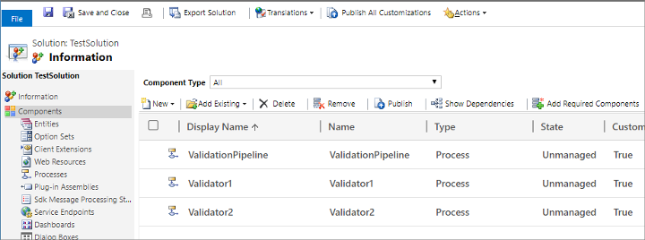

Note that after adding a new validation step to the pipeline, you must update the **SetResult** step of the **ValidationPipeline** action to take results from the previously called custom action. In this case, it's **Validator2**.

Here's an example for how to add a custom validation step to a pipeline:

1. Arrange the stages in the validation pipeline as indicated in the following screenshot.  
    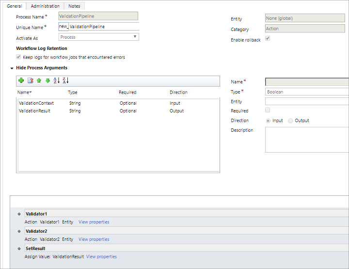

1. Set up the **Validator1** step as follows:  
    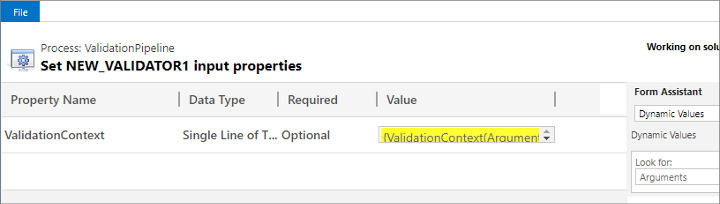

1. Set up the **Validator2** step as follows:  
    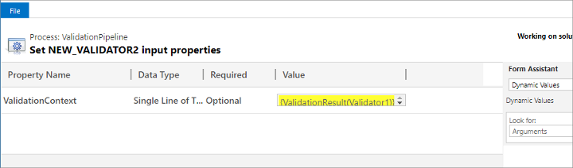

1. Set up the **SetResult** step as follows:  
    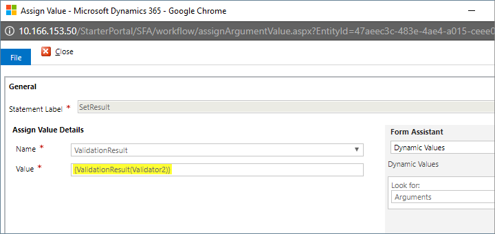

1. Set the custom action for **Validator1** as follows:  
    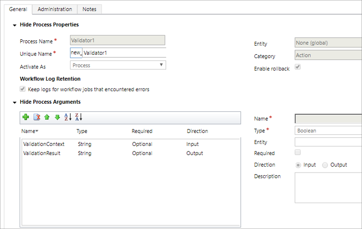

1. Set the plugin step for **Validator1** as follows:  
    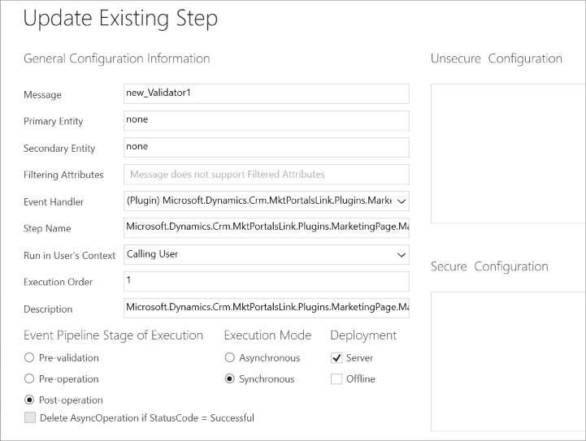

1. Set the custom action for **Validator2** as follows:  
    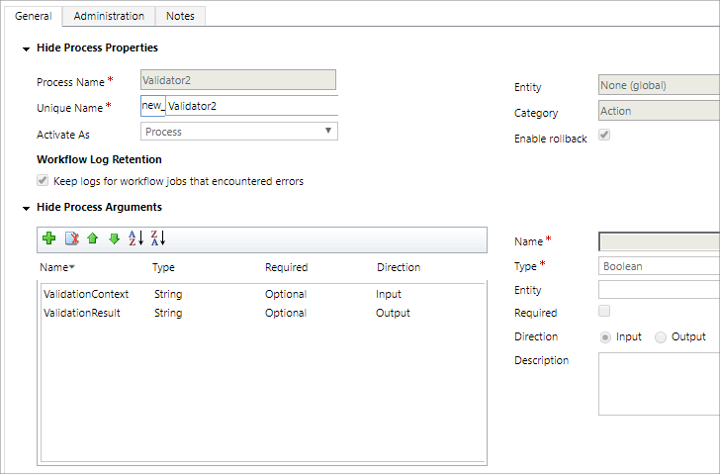

1. Set the plugin step for **Validator2** as follows:  
    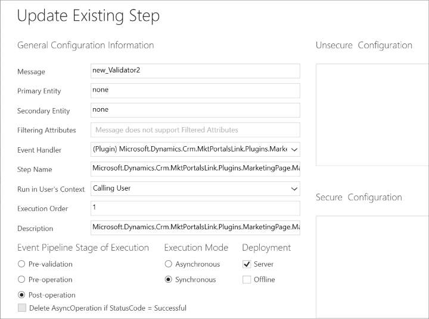

## Test the customized validation pipeline

To test your validation pipeline, do the following:

1. Open a Google Chrome console, and then execute the following code (where *&lt;YourDomain&gt;* is the domain where your system is running):  

    `$.ajax({type:"POST", url:"https://<YourDomain>/StarterPortal/api/data/v8.2/new_ValidationPipeline", data: JSON.stringify({ValidationContext: "val-ctx"}), contentType:"application/json", dataType:"json"})`

    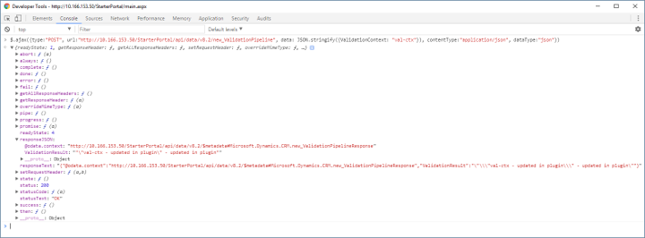

2. The results will be visible on the **Network** tab.

    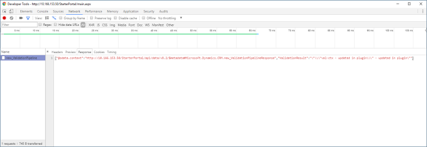

[!INCLUDE[footer-include](../includes/footer-banner.md)]