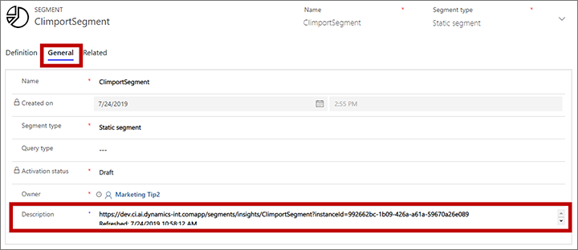
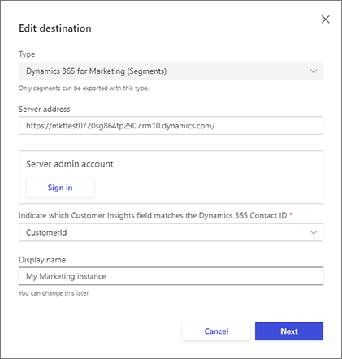
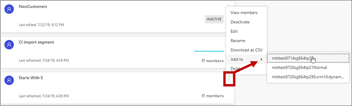
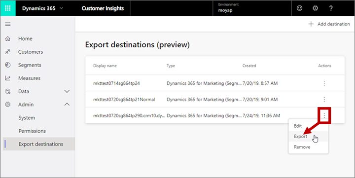

# Use segments from Dynamics 365 Customer Insights with Dynamics 365 Marketing

[!INCLUDE[cc-data-platform-banner](../includes/cc-data-platform-banner.md)]

Dynamics 365 Customer Insights applies artificial intelligence to analyze rich pools of customer data collected from across other apps like Dynamics 365 Sales, Service, and Marketing. Its standard functionality generates powerful analytical displays for each contact, which makes the information easy to understand and use. The integrated solution can:

- Load data from Dynamics 365 Marketing into Customer Insights and combine it with customer data from other sources.
- Apply data cleansing, enrichment, fuzzy matching, and more.
- Use segments created by Customer Insights to target customer journeys in Dynamics 365 Marketing.

For complete details, see the [Customer Insights documentation](https://docs.microsoft.com/dynamics365/ai/customer-insights/overview).

## Prerequisites

Dynamics 365 Customer Insights is a separate product from Dynamics 365 Marketing. To use the features described in this topic, you must already have a Customer Insights instance available before you can integrate it with Dynamics 365 Marketing. You can use either a trial or a production license of Customer Insights while to try out the integration, but must eventually purchase a full license if you decide to continue using it.

## Overview: Working with Customer Insights segments in Marketing

Read this section for an overview of how to work with segments shared between Customer Insights and Marketing. See the later sections in this topic for detailed instructions.

### Connect Customer Insights to Marketing to grant access to your contact records

Customer Insights has its own database for holding contact records and other information, and its own tools for working with that information, including tools for creating segments. That means that Customer Insights requires access to your Marketing database to enable it to work with your marketing contacts. You set this up by adding your Marketing instance as a data source in Customer Insights.

For complete instructions, see [Add a data source](https://docs.microsoft.com/dynamics365/customer-insights/audience-insights/data-sources#add-a-data-source) in the Customer Insights documentation.

### Export Customer Insights segments to get them into Marketing

You bring Customer Insights segments into Marketing by exporting them. The systems can communicate directly, so once the connection is set up, you'll be able to export segments with just a few clicks in Customer Insights. You set this up by adding your Marketing instance as an export destination in Customer Insights.

See the later sections of this topic for details about how to set this up.

### Customer Insights segments in Marketing are mirrored and refreshed periodically

You can configure the frequency of automatic refreshes for Customer Insights segments by changing your system preferences in Customer Insights. For more information, see the [Schedule tab](https://docs.microsoft.com/dynamics365/customer-insights/audience-insights/system#schedule-tab) topic in the Customer Insights documentation. You can also re-export manually at any time.

Each time a segment in Marketing is refreshed by Customer Insights, it completely replaces that segment on the Marketing side. It doesn't do an incremental update, so any customization you have made to the segment using the Marketing tools will be overwritten.

Even if the segment is live in Marketing, Customer Insights will still be able to refresh it without stopping the segment.

### Customer Insights segments look like static segments in Marketing

Segments exported from Customer Insights to Marketing look like static segments. In Marketing, you'll be able to see which contacts are in the segment, but not the logical rules used to create the segment in Customer Insights. To modify the query criteria for these segments, you must work in Customer Insights and then allow the systems to sync.

> [!NOTE]
> Static segments in Marketing look different from segments in Customer Insights. In Marketing, the **Designer** tab for draft segments displays a list of all contacts in your database, and uses checkboxes to indicate whether or not each listed contact is a member of that segment. For live segments, Marketing also provides a **Members** tab, which shows only the contacts that are members of the segment. In Customer Insights, you'll just see a list of contacts that are part of the segment.

### Customer Insights segments won't create new contacts in Marketing

When you export a segment to Dynamics 365 Marketing, the resulting segment will only contain contacts already in Marketing that match incoming contact IDs from the Customer Insights segment. Contacts in Customer Insights that have IDs that aren't present in Marketing (possibly because they came from another data source) will be ignored, so new contacts won't be created in Marketing.

### Customer Insights segments show details on the General tab in Marketing

One way to tell whether a segment in Marketing is being managed by Customer Insights is to open the segment and go to its **General** tab. The following fields here indicate that the segment comes from Customer Insights and provide information about the integration:

- **External source**: Shows a value of "Customer Insights" for segments that came from Customer Insights. This field is blank for segments defined natively in Dynamics 365 Marketing.
- **External Segment URL**: Shows the URL of the Customer Insights instance where the segment came from. Select the globe button at the edge of this field to open the URL. This field is blank for segments defined natively in Dynamics 365 Marketing.
- **Description** Shows the date and time the segment was last refreshed by being exported or re-exported from Customer Insights. This field is either blank or holds custom descriptive text for segments defined natively in Dynamics 365 Marketing.

### You must go live with your Customer Insights segments to use them in Marketing

When a new segment arrives in Marketing from Customer Insights, it will be in the draft state. To use it with a customer journey, you must go live, just as with segments created natively in Marketing.

Once a segment is live in Marketing, Customer Insights will still be able to refresh it without stopping the segment.

### Don't edit Customer Insights segments in Marketing

Though you can use the native tools in Marketing to add and remove contacts for a segment exported from Customer Insights, you shouldn't do so. Your changes will be overwritten the next time Customer Insights refreshes the segment. Instead, work directly in Customer Insights if you need to modify its exported segments.

## Bring your Marketing contacts into Customer Insights

To make your Marketing contacts available in Customer Insights, you must set Customer Insights to use your Marketing database up as a data source. From Customer Insights, use the **Common Data Service** connector to connect to Marketing and sign in using your usual Marketing credentials.

For complete instructions, see [Add a data source](https://docs.microsoft.com/dynamics365/customer-insights/audience-insights/data-sources#add-a-data-source) in the Customer Insights documentation.

Once your Marketing instance is connected as a data source, you'll probably also need to _unify_ the data with your Customer Insights customers. For details about this, see the [Unify](https://docs.microsoft.com/dynamics365/ai/customer-insights/pm-configure-data) topic in the Customer Insights documentation.

Once the data source is set up, it will continue to work and refresh automatically. Usually, you'll only need to do this once.

## Set your Marketing app as an export destination in Customer Insights

To make the segments you create in Customer Insights available in Dynamics 365 Marketing, you must set up your Marketing instance as an export destination in Customer Insights. You only have to do this once.

To configure your Dynamics 365 Marketing instance as an export destination in Customer Insights:

1. Sign into Customer Insights.
1. Go to **Admin** > **Export destinations**.
1. Select **Add destination** on the command bar.
1. The **Edit destination** dialog opens. Make the following settings:
   - **Type**: Select **Dynamics 365 Marketing (Segments)**.
   - **Server address**: Enter the full domain name for your Dynamics 365 Marketing instance.
   - **Server admin account**: Select **Sign in** to open a pop-up window where you can sign into your Dynamics 365 Marketing instance. Sign in using an account with admin privileges on the Marketing instance.
   - **Indicate which Customer Insights field matches the Dynamics 365 Contact ID**: Select the field in Customer Insights that stores contact IDs of contacts in Marketing. Unless you've customized this, you should usually select **CustomerId**.
   - **Display name**: Enter a name for this destination as you'd like it to appear in the destinations list in Customer Insights.

    

1. Select **Next** to continue to the **Select segments to export** page. If you have any segments available in Customer Insights, they are listed here. Mark the checkbox for each segment you'd like to export to Marketing right away. You can also do this later if you prefer, or if you haven't created your segments yet.

    

    > [!NOTE]
    > The segment list includes all currently defined segments, including **Draft** and **Inactive** segments. Though you are able to select draft and inactive segments here, these segments won't be exported to Dynamics 365 Marketing.

1. Select **Save** to save your export destination.

## Configure a Customer Insights segment to export to Marketing

Any time you create a new segment for export, or decide you want to start exporting an existing segment, add that segment to the appropriate export destination to make it available in the Marketing Instance it connects to. Once you have enabled export for a segment, it will continue to [refresh periodically](#refresh) until you [remove it](#edit-remove) from that export destination.

To export a new Customer Insights segment to a Marketing instance:

1. Sign in to Customer Insights.
1. Go to **Segments**.
1. Find the segment you want to start exporting, select the **Expand all actions** button (which looks like three vertical dots) to open the action menu. Then open the **Add to** menu and select the export destination that you want to add the segment to. 

    

    > [!NOTE]
    > The **Add to** menu only shows destinations that the current segment isn't already exporting to.

    > [!NOTE]
    > The segment list includes all currently defined segments, including **Draft** and **Inactive** segments. Though you are able to add draft and inactive segments to an export destination, these segments won't be exported to Dynamics 365 Marketing.

## Edit the selection of Customer Insights segments being exported to Marketing

You can edit the list of Customer Insights segments being exported to any destination, both to add or remove segments being exported and refreshed there. To do so:

1. Sign into Customer Insights.
1. Go to **Admin** > **Export destinations**.
1. Find the destination you want to edit, select the **Actions** button (which looks like three vertical dots) to open the actions menu, and then select **Edit** from the actions menu.
1. The **Edit destination** dialog opens, showing your destination setup.
1. Select **Next** to continue to the **Select segments to export** page. All of the segments currently available in Customer Insights are listed here. Select the check box for each segment you'd like to export and clear the check box for each segment you want to stop exporting.
1. Select **Save** to save your changes.

> [!NOTE]
> If you remove a segment from the export list, then that segment will no longer be refreshed by Customer Insights, but the last exported versions will still remain available in Dynamics 365 Marketing.

## Manually refresh integrated segments

Although your segments will automatically refresh a few times a day based on your [refresh schedule](https://docs.microsoft.com/dynamics365/ai/customer-insights/pm-settings) in Customer Insights, you can manually refresh your segments at any time. To do so:

1. Sign into Customer Insights.
1. Go to **Admin** > **Export** destinations.
1. Select the **Export** button at the top of the destinations list. This will trigger an export to all available destinations.

<!--     -->

### See also

[Working with segments](segmentation-lists-subscriptions.md)
