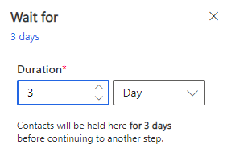
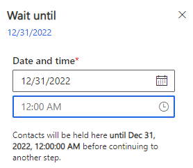
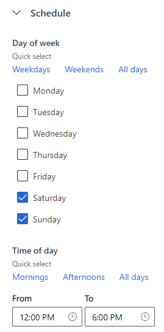

# Manually schedule contacts and email delivery

[!INCLUDE[consolidated-sku-rtm-only](../includes/consolidated-sku-rtm-only.md)]

Customer journeys feature multiple mechanisms that allow you to set schedules so you can target contacts at the right time. You can use these mechanisms to select the days and time window during which an action (such as sending an email or creating a task) should happen. This article discusses how to manually schedule actions in customer journeys.

## Set specific times for actions to take place

1. Use **Wait for** tiles to hold contacts for a specific amount of time before sending them to the next tile in the journey.

    > [!div class="mx-imgBorder"]
    > 

1. Use **Wait until** tiles to hold contacts until a certain date is reached. For example, you could set the tile to wait until December 31 before sending the contacts to the next tile in the journey.

    > [!div class="mx-imgBorder"]
    > 

1. Use the **Schedule** section in a **Send an email** tile to hold contacts until a specific time of the week is reached. For example, you could set the tile to wait until weekend afternoons before sending an email and progressing the contacts to the next tile in the journey.

    > [!div class="mx-imgBorder"]
    > 

> [!NOTE]
> You can also use the automated scheduler on the email tile (automated-scheduler.md) to help improve the email engagement.

> [!IMPORTANT]
> If you use a recurrent journey and your contacts are still being held after a new iteration starts, the held contacts will be blocked from further processing on the previous iteration.

[!INCLUDE[footer-include](../includes/footer-banner.md)]
