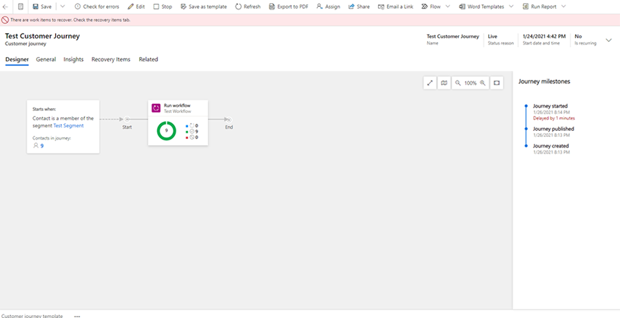
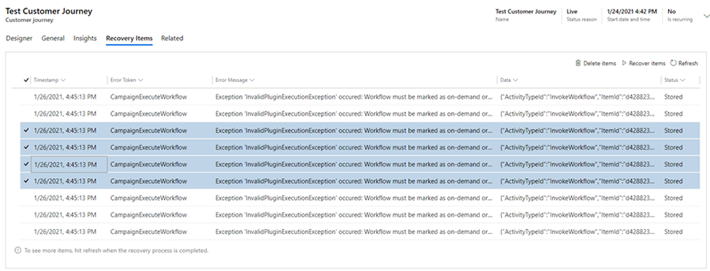

# Troubleshoot customer journey customization errors

The Recovery items tab allows system administrators to track customization errors, improving the customer journey workflow creation process. If there are items in the Recovery items tab, non-system admin users will receive a notification that says, "There are work items to recover. Check the recovery items tab."

> [!div class="mx-imgBorder"]
> 

The Recovery items tab contains a grid with customization errors and gives administrators options to handle them. For customer journeys, typical errors occur when a CRM workflow is used in a customer journey but is not marked as **On Demand** in the workflow properties.

> [!div class="mx-imgBorder"]
> 

After selecting rows in the Recovery items tab, you can delete the items (which will delete them from blob storage), or you can fix the issue and "recover" any item, which will replay the previously failed functionality.

### See also

[Use customer journeys to create automated campaigns](customer-journeys-create-automated-campaigns.md)  
[Create a simple customer journey](create-simple-customer-journey.md)  
[Create an interactive customer journey](create-interactive-customer-journey.md)  
[Create an inbound customer journey](create-inbound-customer-journey.md)  
[Generate activities from a customer journey](generate-activities-from-customer-journey.md)  