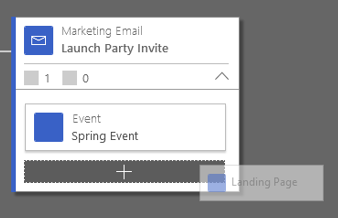
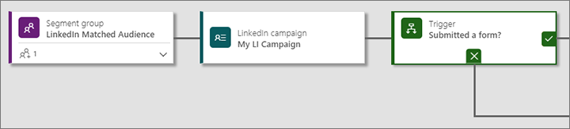
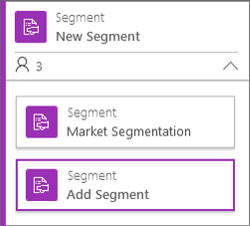
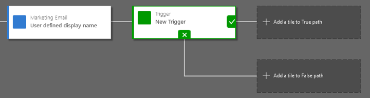
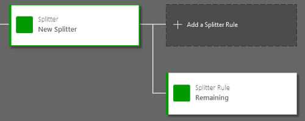

# Customer journey tiles reference

Read this article to find out more about how to work with each type of tile available for constructing your customer journeys. For general information about how to create a customer journey and work with its tile, see [Use customer journeys to create automated campaigns](customer-journeys-create-automated-campaigns.md).

## Content-type tiles

Content-type tiles represent the various types of content that your customer journey delivers to contacts as they traverse the pipeline. Content-type tiles include email, marketing-page, marketing-form, event, and survey tiles.

### Email

The email tile sends a marketing email message to each contact that enters it. It has the following settings, which you can set by using the **Properties** pane while an email tile is selected:

- **Tile name**: A local name for the tile. This name identifies the tile in the pipeline, but isn't used anywhere else.
- **Email**: Identify the marketing email message that the tile will send. Before you can publish your customer journey, all the marketing emails it references must also be finalized and published.
- **Description**: Add a description or other notes here (optional).

Your marketing email messages might contain special links to other Dynamics 365 Marketing features such as marketing pages, event websites, or voice-of-the-customer surveys, and you can set up customer-journey trigger tiles that react to customer interactions regarding each or any of these specifically. But even though you've selected a marketing email message that includes elements such as these, the customer journey won't know about them unless you also add a nested tile for each specific link that you want to trigger on. Add a nested marketing-page, marketing-form, event, or survey to an email tile to expose these elements and make them selectable in your trigger-tile configurations. (Triggers can also react to message opens and unspecified link clicks, but you don't need to do anything special to enable this.)

You can add nested tiles under an email even if the associated message doesn't yet include the link represented by the nested tile. This lets you plan your customer journey first and then finish your email designs later.

To add a nested tile, expand the email tile if needed by clicking on the expand button in its bottom-right corner, then drag a marketing-page, marketing-form, event, or survey tile to the next open slot at the bottom of the stack. You must then configure the nested tile to represent the same marketing page, marketing form, event, or survey that the email links to, and which you want to trigger on.

See the following sections for more information about working with the marketing-page, marketing-form, event, and survey tiles.

More information: [Email marketing overview](prepare-marketing-emails.md)

### Marketing form

The marketing-from tile represents an embedded or captured form hosted on an external website.  There two ways to use them:

- **Nest under an email tile to enable triggering**: Marketing-from tiles can be nested under email tiles, where they represent a link to an external page that is included in the email message's content. The external page must include the captured or embedded marketing form represented by the tile. The most important reason to add a nested marketing-form tile is to enable trigger tiles placed later in the pipeline to "know" about the external-page link and to react to contact interactions with it. Triggers can react either as soon as a contact clicks on the link in an email, or only after a contact submits the form after clicking it in the email.
- **Place at the start of a journey to create an inbound campaign**: When placed at the start of a journey (in addition to, or instead of, a segment tile), all new or existing contacts who submit the form will be sent on that journey. More information: [Create an inbound customer journey](create-inbound-customer-journey.md)

When you nest a marketing-form tile under an email tile, you must take care to ensure that the marketing email message itself also includes a link to a page that hosts that form (the system doesn't confirm this or modify the message when you add a nested tile).

Marketing-form tiles provide the following settings in the **Properties** pane while selected:

- **Tile name**: A local name for the tile. This name identifies the tile in the pipeline, but isn't used anywhere else.
- **Marketing form**: Identify the marketing form represented by the tile. Start typing a page name to select an existing form, or click on **New** to create a new one from here.
- **Description**: Add a description or other notes here (optional).

More information: [Create marketing forms](marketing-forms.md) and [Integrate with landing pages on external websites](embed-forms.md)

### Marketing page

The marketing-page tile represents a native marketing page designed in Dynamics 365 Marketing and running on a Dynamics 365 Portal. There are two ways to use them:

- **Nest under an email tile to enable triggering**: Marketing-page tiles can be nested under email tiles, where they represent a marketing-page link that is included in the email message's content. The most important reason to add a nested marketing-page tile is to enable trigger tiles placed later in the pipeline to "know" about the marketing page link and to react to contact interactions with it. Triggers can react either as soon as a contact clicks on the link in an email, or only after a contact submits the form after clicking it in the email.
- **Place at the start of a journey to create an inbound campaign**: When placed at the start of a journey (in addition to, or instead of, a segment tile), all new or existing contacts who submit the page will be sent on that journey. More information: [Create an inbound customer journey](create-inbound-customer-journey.md)

When you nest a marketing-page tile under an email tile, you must take care to ensure that the marketing email message itself also includes a link to the same marketing page (the system doesn't confirm this or modify the message when you add a nested tile).

Marketing-page tiles provide the following settings in the **Properties** pane while selected:

- **Tile name**: A local name for the tile. This name identifies the tile in the pipeline, but isn't used anywhere else.
- **Marketing page**: Identify the marketing page represented by the tile. Start typing a page name to select an existing page, or click on **New** to create a new one from here.
- **Description**: Add a description or other notes here (optional).

More information: [Create and deploy marketing pages](create-deploy-marketing-pages.md)

### Event

Event tiles are typically nested under email tiles, where they represent a link to an event website that is included in the message's content, but they can also be placed on their own. The most important reason to add an event tile is to enable trigger tiles placed later in the pipeline to "know" about the event link and to react to contact interactions with it (registered or attended). Triggers can react either as soon as a contact clicks on the link in an email, or only after a contact registers for or attends the event.

When you nest an event tile under an email tile, you must take care to ensure that the marketing email message itself also includes a link to the same event (the system doesn't confirm this or modify the message when you add a nested tile).

Event tiles provide the following settings in the **Properties** pane while selected:

- **Tile name**: A local name for the tile. This name identifies the tile in the pipeline, but isn't used anywhere else.
- **Event**: Identify the event record represented by the tile. Start typing an event name to select an existing event, or click on **New** to create a new one from here.
- **Description**: Add a description or other notes here (optional).

More information: [Event planning and management](event-management.md)

### Survey

Survey tiles are typically nested under marketing email tiles, where they represent a link to an online survey that is included in the message's content. <!-- The most important reason to add a survey tile is to enable trigger tiles placed later in the pipeline to "know" about the survey link and to react to contact interactions with it. Triggers can react either as soon as a contact clicks on the link in an email, or only after a contact submits the survey. -->

[!INCLUDE [cc-marketing-surveys-disclaimer](../includes/cc-marketing-surveys-disclaimer.md)]

When you nest a survey tile under an email tile, you must take care to ensure that the marketing email message itself also includes a link to the same survey (the system doesn't confirm this or modify the message when you add a nested tile).

Survey tiles provide the following settings in the **Properties** pane while selected:

- **Tile name**: A local name for the tile. This name identifies the tile in the pipeline, but isn't used anywhere else.
- **Survey**: Identify the voice-of-the-customer record represented by the tile.
- **Description**: Add a description or other notes here (optional).

> [!NOTE]
> Surveys are optional. If your system admin decided not to include Voice of the Customer as part of your Dynamics 365 Marketing installation, then the survey tile will be shown as unavailable (greyed out) in your **Toolbox**. Contact your system admin if you want to enable it.

More information: [Create and run online surveys](surveys.md)

## Action tiles

Action tiles launch workflows or create new action records within Dynamics 365. You'd typically use these to generate to-do assignments for internal personnel to follow up on things that happen during a customer journey.

### Activity

An *activity* is a record of a planned or completed real-world activity, such as an appointment, task, or phone call, that relates to some other record in Dynamics 365. Most forms in Dynamics 365 Marketing include an activity wall that shows all the activities that various users planned or completed in relation to that record, such as phone conversations with a specific contact, or meetings related to planning a particular event. Records for planned activities can function as a to-do list for the users they are assigned to, and records for completed activities can contain details about what happened or what the outcome was.

Activity tiles are stand-alone, so they can not contain or be nested under other tiles.

When a contact enters an activity tile, the tile generates a new Dynamics 365 Marketing activity related to that contact (or the company the contact works for), and then the contact proceeds immediately to the next step in their customer journey.

Activity tiles provide the following settings in the **Properties** pane while selected:

- **Tile name**: A local name for the tile. This name identifies the tile in the pipeline, but isn't used anywhere else.
- **Activity Type**: The type of activity (such as appointment, task, or phone call) the tile creates.
- **Activity Template**: The template to use when creating the activity. The template defines which type activity it is, who it should be assigned to, and other details. You can choose an existing template or create a new one from here, but you can only assign or create templates that have the same **Activity Type** as the tile. More information: [Create activity marketing templates for activity tiles](activity-templates.md)
- **Properties**: After you've selected a template, a summary of its settings is shown here.
- **Create for each**: If your journey is set to target accounts, then use this setting to choose whether to create and assign an activity for every contact that enters the tile, or for the company (account) they work for. If you create for each account, then you'll only create one activity per account, even if several contacts from that account pass through the tile. This setting only appears when the journey **Target** is set to **Account** (on the **General** tab). More information: [Account-based marketing](account-based-marketing.md)
- **Assigned To:** Choose which user to assign the activity to (contact owner, contact creator, customer journey owner, or, if you are targeting accounts, the account owner).
- **Description**: Add a description or other notes here (optional).

More information: [Generate activities from a customer journey](generate-activities-from-customer-journey.md)

### Launch workflow

Use a launch-workflow tile to invoke a custom workflow at any point in the customer journey. You can use them to advance a process stage, create alerts, and more. Workflows are highly customizable, and many organizations work with internal or external consultants to optimize them for their own unique, internal business requirements.

> [!IMPORTANT]
> Workflows invoked by this tile must meet the following requirements:
> - **On demand**: Customer journeys must be able to invoke the workflow on demand each time a contact flows through the tile.
> - **Based on contact or account records**: The only input provided to the workflow is a reference to the contact record that has entered the tile (or the account it belongs to). Your workflow must be prepared to perform its functionality on that contact or account, or on a record that is related to that contact or account.
> - **Activated as a process**: Only activated workflows can be used, and each workflow must be activated as a process (not as a process template).
> - **"Scope" and "Start when" fields are ignored**: These settings, if made for the workflow, are ignored when launched by a customer journey.

Launch-workflow tiles are stand-alone, so they can not contain or be nested under other tiles.

Launch-workflow tiles provide the following settings in the **Properties** pane while selected:

- **Tile name**: A local name for the tile. This name identifies the tile in the pipeline, but isn't used anywhere else.
- **Launch for each**: If your journey is set to target accounts, then use this setting to choose whether to launch the workflow for every contact that enters the tile, or for the company (account) they work for. If if you launch for each contact, then the tile will pass the contact record to the workflow. If you launch for each account, then the tile will pass the account record to the workflow, and you'll only run the workflow once per account, even if several contacts from that account pass through the tile. This setting only appears when the journey **Target** is set to **Account** (on the **General** tab). More information: [Account-based marketing](account-based-marketing.md)
- **Launch Workflow**: Choose an existing workflow to be invoked by the tile.
- **Description**: Add a description or other notes here (optional).

### Create lead

The create-lead tile creates a new lead for each contact or account that enters the tile. It doesn't try to match any existing leads, so it always creates a new one. Each lead created will be linked either to the contact that entered the tile, or to the account that contact belongs to (the company they work for).

Create-lead tiles provide the following settings in the **Properties** pane while selected:

- **Tile name**: A local name for the tile. This name identifies the tile in the pipeline, but isn't used anywhere else.
- **Create for each**: Choose whether to create a new lead for each contact who enters the tile, or for the account each contact belongs to. The tile doesn't try to match any existing leads, so it always creates a new one. However, for account-based leads, the tile will create just one new lead for each account even if multiple contacts from that account pass through the tile while the journey is running. This setting is only provided when the journey is set to target accounts. More information: [Account-based marketing](account-based-marketing.md)
- **Last name placeholder**: All lead records require a value for their last-name field. When the tile creates a contact-based lead, it uses that contact's last name here. For accounts, no last name is available, so if you are creating account-based leads, enter a placeholder value to use as the last name for each lead the tile creates. This setting is only provided when the journey is set to target accounts. More information: [Account-based marketing](account-based-marketing.md)
- **Description**: Add a description or other notes here (optional).

### LinkedIn campaign

The LinkedIn-campaign tile links each contact who passes through it to a specific LinkedIn campaign, thus making it possible for a subsequent trigger tile to react to submissions of any LinkedIn Lead Gen Forms that belong to that campaign on LinkedIn.

To use this tile, you must first do the following:

- Create an account on LinkedIn that is enabled for marketing.
- Create a campaign on LinkedIn that includes a LinkedIn Lead Gen Form.
- Set up the LinkedIn Lead Gen feature in Dynamics 365 Marketing so you can link to your LinkedIn account and sync your LinkedIn campaigns back to Dynamics 365 Marketing. More information: [LinkedIn Lead Gen integration](linkedin-lead-gen-integration.md)

[!INCLUDE [cc-linkedin-disclaimer](../includes/cc-linkedin-disclaimer.md)]

LinkedIn-campaign tiles provide the following settings in the **Properties** pane while selected:

- **Tile name**: A local name for the tile. This name identifies the tile in the pipeline, but isn't used anywhere else.
- **LinkedIn campaign**: Use this lookup field to select the LinkedIn campaign to monitor with this tile. You can choose from among all LinkedIn campaigns that you've synced using the  [LinkedIn Lead Gen feature](linkedin-lead-gen-integration.md) in Dynamics 365 Marketing. Be sure to choose a LinkedIn campaign that includes a Lead Gen Form.
- **Description**: Add a description or other notes here (optional).
- **Go to LinkedIn campaign**: Once you've configured a campaign for the tile, you can select this link to go straight to that campaign on LinkedIn.

When you use this tile, you'll nearly always arrange it in a pipeline that starts with a segment followed by the LinkedIn-campaign tile and then a trigger tile, as shown in the following illustration. Then, you'll follow the trigger with follow-up activities as needed for each true/false path (such as by sending messages, triggering workflows and/or assigning tasks).

You might configure these tiles as follows:

- **Segment tile**: Choose a segment of contacts that you might expect to encounter on LinkedIn. You might typically choose a segment that you have also used to create a [Matched Audience on LinkedIn](linkedin-matched-audience.md).
- **LinkedIn-campaign tile**: Choose a LinkedIn campaign that includes a Lead Gen Form.
- **Trigger tile**: Create a trigger rule with the **Source** set to the campaign you picked in the LinkedIn-campaign tile, and the **Condition** set to "Any LinkedIn campaign form submitted". Contacts will wait here until they submit a Lead Gen form that belongs to the specified LinkedIn campaign (which will send them down the upper, "true" path) or until the **Timeout** set for the tile expires (at which time remaining contacts will be sent down the bottom, "false" path).

> [!NOTE]
> The trigger will only react to LinkedIn form submissions that occur *while the journey is running*, not to form submissions that occurred earlier.

## Target tiles

Target tiles establish the segment of contacts that will be targeted by your customer journey.

### Segment

A segment is a collection of contacts grouped according to some common attribute or explicit assignment. More information: [Working with segments](segmentation-lists-subscriptions.md)

Usually, each of your customer journeys starts with a segment tile, which establishes the collection of contacts who you'll be working with for that journey. When your customer journey starts running, it immediately processes all the contacts found in its target segments at that time. As time goes on, any new contacts that join the target segments will also start their journey here for as long as the customer journey is active.

Each segment tile always either contains or is nested below another segment tile, so at minimum you'll have a container segment with a single nested segment. The container tile identifies itself as a *segment group*; it displays a name for the group and shows information about the total number of contacts it includes, and it establishes the logic for combining its various nested tiles (intersection or union). Each nested tile identifies an actual segment configured in Dynamics 365 Marketing.

The segment group tile provides the following settings in the **Properties** tab:

- **Tile name**: Enter a name that describes the tile.
- **Segment merge logic**: If the group includes more than one nested segment, then use this setting to establish the logic for combining the members of the nested segments. Choose one of the following:
  - **Union**: any contact that is on at least one of the nested segments will be included in the customer journey, but contacts that appear on more than one nested segment will still be processed just once.
  - **intersection**: only contacts that appear on *all* nested segments will be targeted, so customers that appear on just one of the lists will be ignored.
- **Description**: Enter a short description of how you are using the tile in this journey.

Each nested segment tile provides the following settings:

- **Tile name**: Enter a name that describes the tile.
- **Containment method**: Choose **Inclusion** to add all members of this segment to the group. Choose **Exclusion** to remove all members of this segment from the group (if present).
- **Segment source**: Choose **Segment** to add (or remove, depending on the **Containment method**) the members of a *segment* to the group. Choose **Subscription marketing list** to add the members of a subscription list (you can't remove members based on a subscription list).
- **Segment**: If your **Segment source** is a segment, then use this field to choose the segment record.
- **Marketing list**: If your **Segment source** is a subscription list, then use this field to choose the list.
- **Description**: Enter a short description of how you are using the tile in this journey.

### Record updated

Use the record-updated tile to monitor all records belonging to a specific entity, and then find the contact associated with any of those records that gets created, deleted, or updated while the journey is running. All contacts found by this tile will be sent down the customer journey starting at the location of the tile.

For example, you could use this tile to monitor lead records for a change in the email address field. Then, each time a user changes the email field of a lead record, the record-updated tile will find the contact associated with that lead and add the contact to the journey.

Record-updated tiles are stand-alone, so they can not contain or be nested under other tiles.

Record-updated tiles provide the following settings in the **Properties** pane while selected:

- **Tile name**: A local name for the tile. This name identifies the tile in the pipeline, but isn't used anywhere else.
- **Entity name**: Choose the entity to monitor for updates. The selected entity must have a lookup field that associates each of its records with a contact record.
- **Contact field name**: Choose the lookup field that associates each record from the monitored entity with a contact record. Some entities provide more than one field that links to the contact entity, so you might have more than one choice here.
- **Trigger event**: Choose which type of record change to look for (create, delete, or update). Choose **Create** to find contacts associated with newly created records; choose **Delete** to find contacts associated with newly deleted records; chose **Update** to find contacts associated with recently updated records (in this case, you must also choose which field to monitor for updates).
- **Trigger field**: If you set the **Trigger event to Update**, then you must choose which field from the target entity to monitor for updates. Updates to any other fields won't trigger the tile. This setting isn't shown for the other two types of trigger events.
- **Description**: Add a description or other notes here (optional).

## Flow-control tiles

Flow-control tiles create a pause or a branch in your pipeline, where contacts will go down just one of several available paths, depending on their interaction record or demographic data.

### Scheduler

The scheduler tile holds contacts for some amount of time before sending them on to the next tile in their journey. You could use this to insert a delay of, say, a week between sending an initial marketing email message and then sending a reminder. You can set the schedule using a relative time (such as: wait seven days) or an absolute time (such as: wait until May 21, 2018).

Scheduler tiles are stand-alone, so they can not contain or be nested under other tiles.

Scheduler tiles provide the following settings in the **Properties** pane while selected:

- **Tile name**: A local name for the tile. This name identifies the tile in the pipeline, but isn't used anywhere else.
- **Type**: Sets whether to use a relative or absolute schedule. Set this to **Duration** to set a relative time (such as wait seven days) or to **Date & Time** to choose a specific date.
- **Duration**: This setting is only shown when **Type** is set to **Duration**. Enter an integer in the field here to define the number of days to wait, starting from the day a contact first enters the tile. Use the links here to choose a **Simple** duration, which will wait the exact number of days you specify, or an **Advanced** duration, which enables you to define a restriction window (see below).
- **Date & Time**: This setting is only shown when **Type** is set to **Date & Time**. Use the fields here to define the specific date, hour, and minute at which contacts waiting here will be released (regardless of when they arrived). Use the links here to choose a **Simple** schedule, which will use the exact date and time you specify, or an **Advanced** schedule, which enables you to define a restriction window (see below). The time you specify uses the time zone set on the **General** tab for the journey itself.
- **Restriction Window**: This setting is available for both **Duration** and **Date & Time** schedulers when they are set to **Advanced**. It establishes rules about which day or the week and/or time of day contacts will be released by the scheduler. To open it, click on the **Advanced** link in the **Duration** or **Date & Time** section. Use these settings to restrict the set of weekdays and/or times when contacts will first be released by the scheduler. This might result in a slightly longer delay. For example, you might set the scheduler to hold contacts for at least seven days, but then release them on the first Monday, Wednesday, or Friday afternoon after that.
- **Description**: Add a description or other notes here (optional).

### Trigger

Trigger tiles hold contacts either until some condition is true, or until a defined amount of time expires. The trigger splits the path. Contacts that fulfill the trigger conditions in time will go down the *true* path. Contacts that still haven't met the condition when time is up will go down the *false* path.

A typical use of triggers is to set up an email tile followed by a trigger tile that holds each contact for seven days, or until the contact opens the message. As soon as a contact opens the message, the trigger sends that contact down the *true* path. The *true* path might include tiles designed for contacts that have shown an interest in your messages. However, if the time limit passes and the contact still has not opened the message, then the trigger will send that contact down the *false* path. The *false* path might send the original message again, just to make sure.

A wide range of trigger logic is available, and you can combine several rules into a complex logical expression. Some specialized trigger rules are even possible, such as reactions for specific marketing page submissions or event registrations, but for these to work, the relevant marketing page, marketing form, or event must be available to the trigger. So, to trigger on an email open or click, that email must be part of the current customer journey&mdash;and to trigger on a page submission or event registration related to that email, that email tile must also have a nested tile that links to the appropriate page or event. More information: [Email](#email).

Trigger tiles are stand-alone, so they can not contain or be nested under other tiles.

When you add a trigger to your pipeline, it immediately creates a fork, with the true path marked with a check and leaving the right edge of the tile, and the false path marked with an X and leaving the bottom edge of the tile.

Trigger tiles provide the following settings in the **Properties** pane while selected:

- **Tile name**: A local name for the tile. This name identifies the tile in the pipeline, but isn't used anywhere else.
- **Based on**: Choose whether to trigger based on account or based on contact. *Account-based* triggers treat accounts as a single unit, so they will always send all contacts from the same account down the same path (true or false). *Contact-based* triggers process contacts one at a time, so contacts from the same account are permitted to flow down different paths. This setting only appears when the journey **Target** is set to **Account** (on the **General** tab). More information: [Account-based marketing](account-based-marketing.md)
- **Timeout**: Set the maximum amount of time that the trigger should hold a contact before sending it down the false path, provided the true condition isn't met during that time. Contacts are sent down the true path as soon as the condition is met. Use the field and drop-down list here to establish that amount of time to wait.
- **Set Rules**: All triggers must have at least one rule, so new ones start with a rule. You can add more rules by clicking on the **+ New** button here.
- **Rule logic** If you have more than one rule, then use this setting to choose an operator for combining the rules. If you choose **And**, then *all* of the rules must evaluate to true before a contact will be sent down the true path. If you choose **Or**, then as soon as *any one* of the rules evaluates true, the contact will be sent down the true path.
- **Rule &lt;n&gt;**: Each rule that you add using the **+ New** button creates a numbered **Rule** block. Each rule must have a **Source**, which identities the source of a value to test, and a **Condition**, which defines the condition that the found value must fulfill. The **Source** drop-down list shows all the sources that are currently available to the trigger tile; if you don't find a source you are looking for, then you might need to add a tile or nested tile to make that source available.
- **Conditional expression**: This read-only field shows all of the rules you have defined as a single, compact, text-based expression.
- **Description**: Add a description or other notes here (optional).

> [!NOTE]
> When you trigger based on email interactions, options include: delivered, opened, hard bounce, soft bounce, click, or specific click. "Click" will react to any link click, but "specific click" requires you to choose a specific link from the message based on its label (the visible link text). If you have more than one link that opens the same URL, only the first label will be shown here, but the trigger will react if the recipient clicks on any of the links that open that same URL. For more information about the various types of email interactions, see the [Insights glossary](insights-glossary.md).

> [!IMPORTANT]
> Triggers based on "email delivered" interactions can occasionally follow the *true* path, even if an email bounces. In such cases, a contact will proceed to the next step of the journey on the *true* path, despite not receiving the email message.

### Splitter and splitter-branch tiles

Splitter tiles add a fork to the customer journey pipeline, sending a random selection of contacts down each available path.

You'll always use a splitter tile together with at least two splitter-branch tiles. The splitter tile initiates the split and establishes the basis for dividing the contacts (by percentage or absolute value), while each splitter-branch tile establishes the specific portion or number of contacts traveling down the path it controls. The bottom splitter-branch tile always implements a "remaining" rule, which applies to all contacts that don't fulfill any of the other available rules.

Splitter and splitter-branch tiles are stand-alone, so they can not contain or be nested under other tiles.

When you add a splitter to your pipeline, it immediately creates a fork and adds a new "remaining" splitter-branch tile at the bottom path.

On adding a splitter tile:

1. Configure the splitter first to establish its "split-by" parameter (by percentage or absolute value).

1. Add at least one splitter-rule tile in the empty spot provided.

1. If needed, add more paths by dragging additional splitter-rule tiles between the top and bottom splitter-rule tiles.

1. Define the portion of contacts to be sent down each splitter branch.

Splitter tiles provide the following settings in the **Properties** pane while selected:

- **Tile name**: A local name for the tile. This name identifies the tile in the pipeline, but isn't used anywhere else.
- **Split By**: Choose how to define the portion of contacts sent down each branch. Choose **Percentage** to define each branch by a percentage of total contacts. Choose **Value** to define each branch using absolute values.
- **Description**: Add a description or other notes here (optional).

Splitter-branch tiles provide the following settings in the **Properties** pane while selected:

- **Tile name**: A local name for the tile. This name identifies the tile in the pipeline, but isn't used anywhere else.
- **Percentage** or **Value**: When the preceding splitter tile is set to split by percentage, set the percentage of contacts that should be sent down this branch. When the preceding splitter tile is set to split by value, enter the total number of contacts that should go down that branch.
- **Description**: Add a description or other notes here (optional).

## Custom content tiles

Custom content tiles provide similar capabilities as the standard tiles described earlier (such as sending communication, tracking customer interactions, and adding triggers) but are created by partners and third-party developers to extend the marketing capabilities in Dynamics 365 Marketing. These custom tiles will appear in the designer if you have installed a partner-developed custom channel for customer journeys or have created and deployed your own custom channel for your Dynamics 365 Marketing instance. 

Custom channels take advantage of the existing extensibility infrastructure and tooling in Dynamics 365, such as custom entities, workflows, and plug-ins, which allow developers and partners to leverage their knowledge of Dynamics 365. More information:  [Extend customer journeys using custom channels](developer/extend-customer-journeys-custom-channels.md)

### See also

[Use customer journeys to create automated campaigns](customer-journeys-create-automated-campaigns.md)  
[Create a simple customer journey](create-simple-customer-journey.md)  
[Create an interactive customer journey](create-interactive-customer-journey.md)  
[Create an inbound customer journey](create-inbound-customer-journey.md)  
[Generate activities from a customer journey](generate-activities-from-customer-journey.md)  
