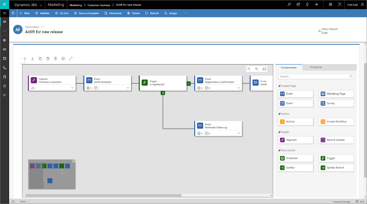
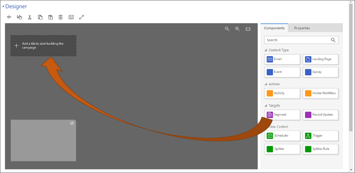
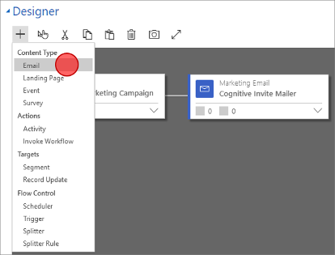
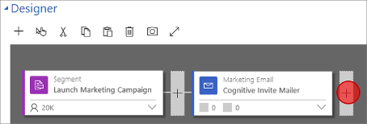
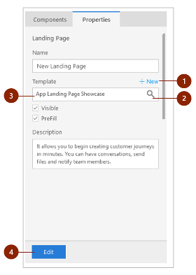
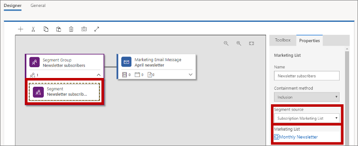
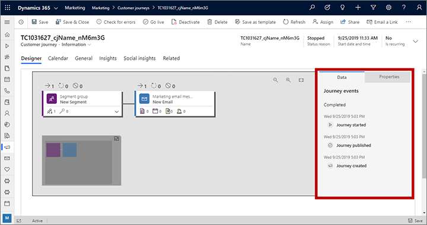

# Use customer journeys to create automated campaigns

<iframe src="https://www.microsoft.com/videoplayer/embed/d73cc179-5984-4a32-ad84-0755f56b0399" frameborder="0" allowfullscreen=""></iframe>

Dynamics 365 Marketing can help you visualize and automate the journey that customers will take on their way to making a purchase. A simple customer journey could include a short interaction, such as a single email campaign. A complex journey might include the full process from discovery, through nurturing, and on to marketing-qualified leads. Customer journeys can also generate and assign tasks (such as a scheduled follow-up phone call) and trigger business workflows.

Marketing provides a graphical, drag-and-drop, journey modeler that works something like a simple board game. Each contact starts on the first square (by becoming part of a target segment), and then progresses through one square at a time, with each square representing a marketing initiative, decision point, or internal action item.

The previous figure shows how a simple customer journey might look. A more complex example could work like this:

1. A new contact from New York wants to subscribe to your newsletter and fills out a marketing page. This results in a new contact record in your database.

2. You have a dynamic segment that finds all newsletter subscribers from New York, so the new contact automatically joins that list.

3. You've created a customer journey that starts with the New York subscribers' segment as tile one, so the contact starts there and moves directly to the next tile.

4. The next tile in the journey is an email tile, so the system automatically sends a marketing email to the new contact, and the contact moves on to the next tile. The email message offers a free white paper for download.

5. The next tile is a trigger (set to trigger on the email). It keeps the contact here until either a week goes by, or they click the download link. The trigger branches the path, so if the contact clicks to download the paper, they'll take the "true" path immediately; but if a week goes by without a click, they'll go down the "false" path.

6. The top ("true") path continues with more tiles designed to nurture the lead further. Because the contact clicked the link, Dynamics 365 Marketing generated a lead for that contact, which represents their expression of interest in the product promoted in that white paper. Some tiles along this path might initiate or evaluate lead interactions (such as event invitations), while others might generate internal events (like assigning a task or launching a workflow in the CRM system). As the contact interacts with your initiatives, the lead builds up its score until it's ready to forward to sales.

7. The bottom ("false") path starts with another email tile, which sends a reminder with a second chance to get the download, after which the contact might continue down the same type of nurturing path if they respond, or get dropped for now if they don't.

## Set up a customer journey

To view and create your customer journeys, go to **Marketing** > **Marketing Execution** > **Customer Journeys**. This brings you to a standard list view, where you can search, sort, and filter the list to find an existing journey.

To create a new journey, select **New** on the command bar.

When you create a new customer journey, you'll first be presented with a list of customer-journey templates, which can help you get started quickly. The **Journey templates** dialog box provides a categorized overview of templates and a search form to help you find the one you're looking for. Each template represents a particular type of campaign, and includes a preconfigured pipeline and a few related settings that will help you create a customer journey of the selected type.

You can also choose to start from scratch instead of using a template. The pipelines provided by a template represent the form and logic of your campaign, but you'll still need to configure the various tiles by&mdash;for example&mdash;assigning the specific marketing email message that should be sent by each email tile.

When creating or editing a customer journey, you'll be working on the customer-journey form page. At the top of this page, you'll see the canvas, where you'll build up your campaign pipeline by adding, arranging, and configuring the tiles that represent each step in the journey. General settings and fields for metadata are available further down on the page, below the canvas.

## Design your journey

Use the **Design** tab to design your campaign by arranging tiles into a logical flow, and then configure each tile.

### Working with tiles and the pipeline

You can add tiles to the pipeline by dragging tiles from the **Toolbox** tab on the right side of the canvas to the appropriate position on the canvas. You can also add tiles by using the command bar and arrow keys, as described in the next section.

The first tile in the pipeline establishes the target segment for the customer journey. This is what determines which contacts get sent down the pipeline. You'll typically start with a segment tile, which finds contacts based on a logical query (a dynamic segment) or on a static segment, where individual contacts are added and removed manually.

After they are added, most tiles provide features such as those illustrated in the following figure.

Legend:

1. **Tile type**: Shows what type of tile it is (segment, email, trigger, and so on). The icon and color also indicate this.
1. **Tile name**: Shows the name assigned to this particular tile.
1. **Tile status**: Shows key statistics about the tile, such as how many contacts are waiting here or how many messages it has sent so far. The information shown varies by tile type.
1. **Expand button**: Some types of tiles can contain nested tiles. Select the expand button to open or close the nested-tile display. Tiles that don't accept nested tiles don't show a button here.
1. **Nested tiles**: You can view, select, configure, or remove existing nested tiles here when the container tile is expanded. You can add new nested tiles by dragging them here or to the container tile (this also works when the container is collapsed).

To configure a tile or nested tile, select it in the pipeline and then go to the **Properties** tab to the right of the canvas, where you'll find all the settings that apply to the type of tile you've selected.

For a complete list of all available tiles, and information about how to use them, see the [Customer journey tiles reference](customer-journey-tiles-reference.md).

### Add tiles by using the command bar and arrow keys

Though most people add and arrange tiles by dragging them to the canvas, you can also do it by using the toolbar above the canvas, and you can even build up a pipeline without using the mouse at all. This makes the solution more adaptable to your working preferences while also making it more accessible for people who have trouble working with a mouse.

1. Select **Add** in the command bar to open the add-tile drop-down list. You can also select the Tab key until the **Add** button is highlighted or its name is read aloud by a screen reader.

1. Choose the type of tile you want to add from the drop-down list by using your mouse, or by using the arrow keys and the Return key.

    

1. The pipeline is now updated to show all the available insertion points where you can drop your new tile. Use your mouse, or arrow keys and Return key, to choose the location and drop the tile there.

    

More information: [Accessibility and keyboard shortcuts](designer-shortcuts.md)

### Configure tile settings

Each tile represents a step in the customer journey, and you'll make configuration settings to establish what happens at each of these steps. Most types of tiles interact with some other type of record in Dynamics 365 Marketing, such as a target segment, marketing email message, landing page, event, or action. Other types of tiles&mdash;like schedulers, triggers, and splitters&mdash;react to things that happen during the journey itself and control the path that each contact takes when these things happen.

To configure a tile, select it in the pipeline, and then go to the **Properties** tab to the right of the canvas, where you'll find all the settings that apply to the type of tile you've selected. When you add a new tile, its **Properties** tab is automatically activated so you can start configuring that tile right away.

For tiles that must refer to some other record in Dynamics 365 Marketing, like emails or events, you can choose to leave the record unspecified, choose an existing record, or create a new record to use with that tile. All tiles of this type include the **Properties** settings highlighted in the following figure.

Legend:

1. **New**: Creates a new record of the type required by the current tile. Select to open the quick-create flyout, which slides in at the top of the screen and requests values for all the required and most-import settings for your new record. When you complete the quick-create form, your new record will exist and be linked to your tile, but probably will require more work before you can use it. You might choose to finish it now by selecting **Edit** to open the full form for the record, or you could leave it for later and instead continue to concentrate on building the structure of your customer journey for now.
1. **Search button**: Select to find an existing record of the type required by the current tile. To narrow the search, start by entering part of the record name you are looking for in the field next to the search button, and then select the button.
1. **Current record**: If the tile is already configured, this shows the name of the record associated with the current tile. As mentioned, you can also use this as a search field, together with the search button, to look for other existing records.
1. **Edit**: If the tile is already associated with a record, select to open the full form for that record. From there, you'll have full access to all that record's information and settings.

More information: [Customer journey tiles reference](customer-journey-tiles-reference.md)

## Choose the journey's target segment

One of the most important choices you'll make when setting up a customer journey is deciding which of your contacts to include on the journey.

### Target a standard segment

The most common way to target a customer journey is to start with a segment tile and then choose a segment for it. You can combine several segments and choose the relevant logic for combining them (such as union/intersection or include/exclude).

- For information about how to create a segment, see [Working with segments](segmentation-lists-subscriptions.md)
- For information about how to configure a segment tile and set logic for combining segments, see [Customer journey tiles reference](customer-journey-tiles-reference.md#segment)

### Target a subscription list

All Dynamics 365 Marketing instances must provide a subscription center, which enables contacts to sign up for various mailing lists. You'll probably want to set up customer journeys to send messages to each of these mailing lists from time to time. To target a mailing list with a customer journey, place a segment tile configured to load a subscription list as the first tile in the journey. For more information about subscription lists and the subscription center, see [Set up subscription lists and subscription centers](set-up-subscription-center.md).

To set up a segment tile to target a subscription list:

1. Set up a customer journey that starts with a segment group tile, as usual.

1. Select a child segment tile and open the **Properties** tab.

1. Set the **Segment source** to **Subscription Marketing List**, which activates the **Marketing List** field. Then set the **Marking List** to the name of the subscription list you want to use for this journey.  
    

> [!IMPORTANT]
> When a customer journey targets a subscription list, then any contact that unsubscribes from that list using a subscription center will automatically be removed from that journey within about 24 hours, even if they are already partway through it. However, if a user removes a contact from the list manually using the Dynamics 365 Marketing interface, that contact will continue to be processed by any journeys they already are on, and may continue to receive messages until all active journeys are complete. For this reason, it is usually best to request all contacts to manage their own subscriptions using the subscription center.

### Create an inbound customer journey

An inbound customer journey is one that contacts join by filling out an online form rather than being part of a target segment. To create an inbound journey, start with a marketing page or marketing form tile instead of a segment (or with a segment configured to find contacts who submitted a particular form). More information: [Create an inbound customer journey](create-inbound-customer-journey.md)

## Set general options, including execution schedule and content settings

Use the **General** tab to give your journey a name, assign ownership, set its execution schedule, choose content settings, view its timeline history, and more.

### Target contacts or accounts

You must set each customer journey to target _either_ contacts _or_ accounts. Use the **Target** setting on the **General** tab to configure this option for each journey.

- When you target *contacts*, the journey will treat each contact as an individual, without considering the company (account) that the contact works for.
- When you target *accounts*, the journey can group contacts by the company (account) that each contact works for, which can affect the way contacts are processed as they traverse the journey, for example:
  - Trigger tiles can send all contacts from the same account down the same path.
  - Activity tiles can generate just one activity (such as a task or phone call) for each account, even if several contacts from that account are included in the journey.
  - Launch-workflow tiles can trigger their workflow once for each account, even if several contacts from that account are included in the journey.
  - Create-lead tiles can generate leads associated with accounts rather than contacts.
  - Journey insights shown in the **Data** panel can be filtered by account.

More information: [Account-based marketing](account-based-marketing.md)

### Set the minimum consent level

If data protection is enabled for your instance (for example, because you need to comply with the GDPR), then use the **Minimum consent** setting to control the minimum level of consent that each contact must have provided to be included on this journey. The level you choose should depend on the types of operations your journey will execute.

It is your organization's responsibility to ensure that it is operating in full compliance with all relevant data-privacy regulations when you use customer journeys and all other features of Dynamics 365 Marketing.

More information: [Data protection and the GDPR](gdpr.md)

### Set the business-unit scope

Business-unit scopes are an optional feature. When they are enabled for your instance, then the **General** tab includes a **Scope** setting, which controls which contacts will be permitted to join the journey based on business-unit ownership.

When business-unit scopes are enabled:

- The **Scope** setting is available and can have a value of **Organization** or **Business unit**. 
- **Business unit** scoped journeys will only process contacts that belong to the same business unit as the journey owner&mdash;even if the journey targets segments, lists, and/or pages that include contacts belonging to other business units.
- **Organization** scoped journeys will process all targeted contacts, regardless of which business unit owns the journey.
- Only users with organization-level create/update permissions can choose the **Organization** scope setting. Less privileged users are limited to creating journeys scoped at the **Business unit** level.

When business-unit scopes are disabled:

- The **Scope** setting isn't shown.
- All journeys are scoped at the organization level, which means that they will process all contacts in the targeted segments, lists, and/or pages, regardless of which business unit owns the journey and each contact.

More information: [Use business units to control access to Marketing records](business-units.md)

### Set the execution schedule

All customer journeys are active for a limited time. During this time, the journey processes all contacts that are part of its target segments, stepping them through each tile according to its settings. The journey starts by processing all contacts that are already in its segments, and it will continue to process new contacts that are added to the segment during the time it is active. At the end of the schedule, it stops processing all contacts, regardless of where they are in the journey. Use the **Start date and time** and **End date and time** settings on the **General** tab to set up the start and end dates, and use the **Time zone** setting to establish the time zone to use when interpreting these values.

### Choose your content settings

Content settings are sets of standard and required values that are available for use in marketing email messages. Each includes a subscription-center link, a forward-to-a-friend link, social-media links, your postal address, and other information that can be placed into the message as dynamic values by using the [assist-edit](dynamic-email-content.md#assist-edit) feature. You'll set up each customer journey to use a specific content-settings record, which means that all messages sent by that journey will use the same content settings. However, each journey can use a different content-settings record, which means that you can use an identical marketing-email design in two or more customer journeys, each specifying a different set of content settings. 

To choose the content settings used by a journey, go to its **General** tab and make a selection for the **Content settings** field.

For more information about how to create and configure content-settings records, see [Use content settings to set up repositories of standard and required values for email messages](dynamic-email-content.md#content-settings)

If you have more than one set of content settings, exactly one of them will be the default and will be applied automatically to each new customer journey that you create. For more information about how to establish the default content-settings record for new journeys, see [Configure default marketing settings](mkt-settings-default-marketing.md).

### Set up a recurring journey

Usually, a journey takes each contact through its pipeline exactly once. Even if you use several segments, and a given contact appears in more than one of them, each contact is processed at most once. However, you can also set up a recurring journey in which all contacts are reprocessed at regular intervals during the active period.

To set up a recurring journey:

1. Open your journey and go to the **General** tab.
1. Set **Is recurring** to **Yes**. This opens two additional settings here.
1. Set the **Recurrence interval** to the number of days each recurrence should last.
1. Set the **Recurrence count** to the maximum number of recurrences each contact can experience.

> [!NOTE]
> Your recurrence schedule must fit within your start and end dates, such that:  
**interval * count &le; end date &ndash; start date**.

> [!IMPORTANT]
> When the last iteration of a recurring journey is complete, the journey will change to a **Stopped** state. When the journey is stopped, it is assumed that the iteration schedule is completed. Attempting to restart the stopped customer journey will immediately result in the journey transitioning back to the stopped state.
>
> You can extend the customer journey after the last iteration of a recurring journey by increasing the **Iterations count** value. After you've increased the iterations count, the customer journey will go back to a **Live** state.
>
> To see the iterations that are already executed and executing, go to **Related** > **Customer Journey Iterations**. For each iteration, the **Created On** value marks the time that the iteration was started.

### Add a suppression segment

A journey's suppression segment contains a list of contacts that the journey won't send any messages to, even if those contacts are also included among the segments explicitly targeted by the journey, and even if those contacts are already partly through the journey. 

You can use any existing segment as a suppression segment. To choose a suppression segment for your journey, open its **General** tab and then choose a segment in the **Suppression segment** lookup field.

> [!IMPORTANT]
> The marketing-insights service processes changes to segment membership asynchronously, which means you can't predict the order in which changes are processed. In some cases, such as when processing very large databases, it can take up to six hours for a given segment to get updated. You therefore can't rely on any one segment being processed before or after a specific other segment, so be careful when orchestrating related campaigns and/or using  suppression segments.

## Go live to start running the journey and processing contacts

When you first create a new customer journey, and while you're working on it, the journey shows a **Status reason** of **Draft**. While it's still in draft, the journey is inactive and it won't try to send any messages or do any other processing. When everything's in place and you're ready to start running the journey, you publish it. This updates the journey's **Status reason** to **Live**, and as soon as the specified **Start Date** arrives, the journey will start processing all contacts in its target segment.

When you've finished designing your customer journey, do the following to verify and publish it:

1. Double-check the **Start Date** and **End Date** on the **General** tab. The customer journey won't do anything until the **Start Date** arrives and it will stop processing all contacts, no matter which tile they're on, as soon as the **End Date** arrives. Remember also that any contact who joins the target segment while a journey is running will also be processed by that journey, starting at the first tile.

2. Select **Check for Errors** in the command bar to verify your campaign setup and check it for errors. This step makes sure that all required marketing emails and pages are assigned and published, and also checks for other prerequisites and common errors. If problems are found, you'll see an error message with advice for how to fix it. Continue to check, fix reported errors, and check again until your journey passes the test.

3. Now you're ready to publish, so select **Go Live** in the command bar. Dynamics 365 Marketing runs the error check one last time. If your journey passes, it is published to the marketing services, which also host your published marketing email messages and marketing pages.

[!INCLUDE [cc-marketing-email-size](../includes/cc-marketing-email-size.md)]

## Gain insights by monitoring journey progress and results

As soon as your journey starts running, it will begin to generate and collect information about where your contacts are in their journey and how they've interacted with its various elements such as emails, pages, and events. Dynamics 365 Marketing provides a wealth of information, including analytics, KPIs, graphs, and more, to help you gain insights from your marketing results. More information: [Analyze results to gain insights from your marketing activities](insights.md)

## View milestones in the customer journey life cycle

Customer journeys pass through many states while you create, edit, and run them. You can now view a full history of these milestones for any customer journey. To see them, open any live or previously live journey, go to its Designer tab, make sure no tile is selected, and then view the Data panel.
 

### See also

[Customer journey tiles reference](customer-journey-tiles-reference.md)  
[Create a simple customer journey](create-simple-customer-journey.md)  
[Create an interactive customer journey](create-interactive-customer-journey.md)  
[Create an inbound customer journey](create-inbound-customer-journey.md)  
[Generate activities from a customer journey](generate-activities-from-customer-journey.md)  
[Working with segments](segmentation-lists-subscriptions.md)  
[Accessibility and keyboard shortcuts](designer-shortcuts.md)  
[Go live with publishable entities and track their status](go-live.md)
