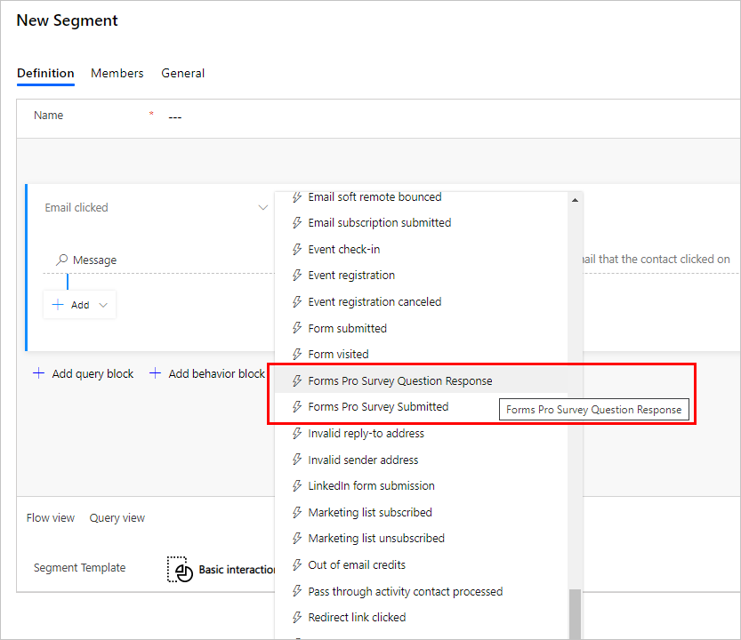
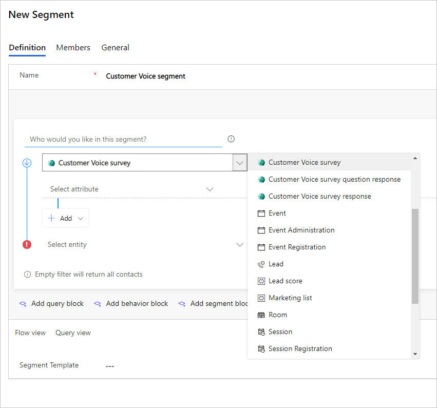
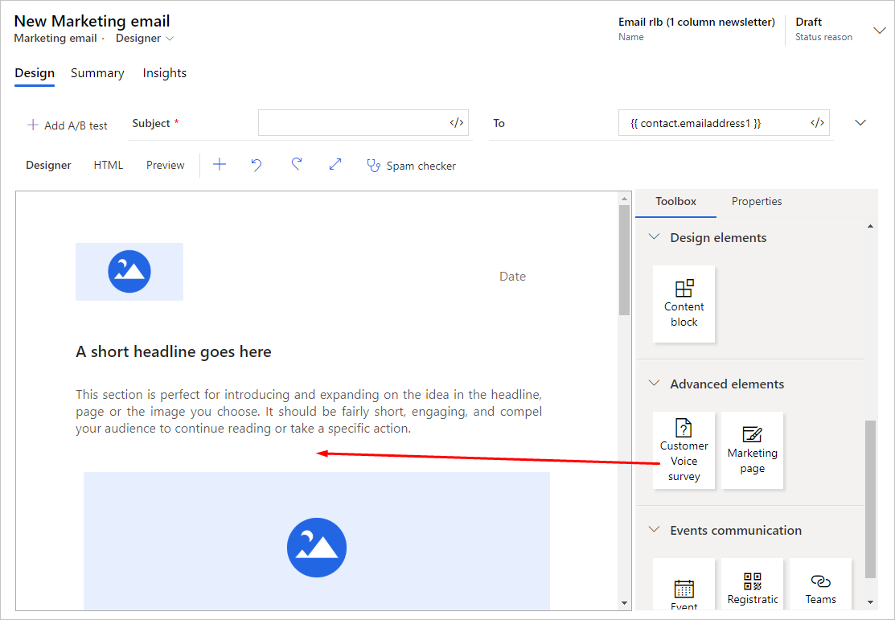
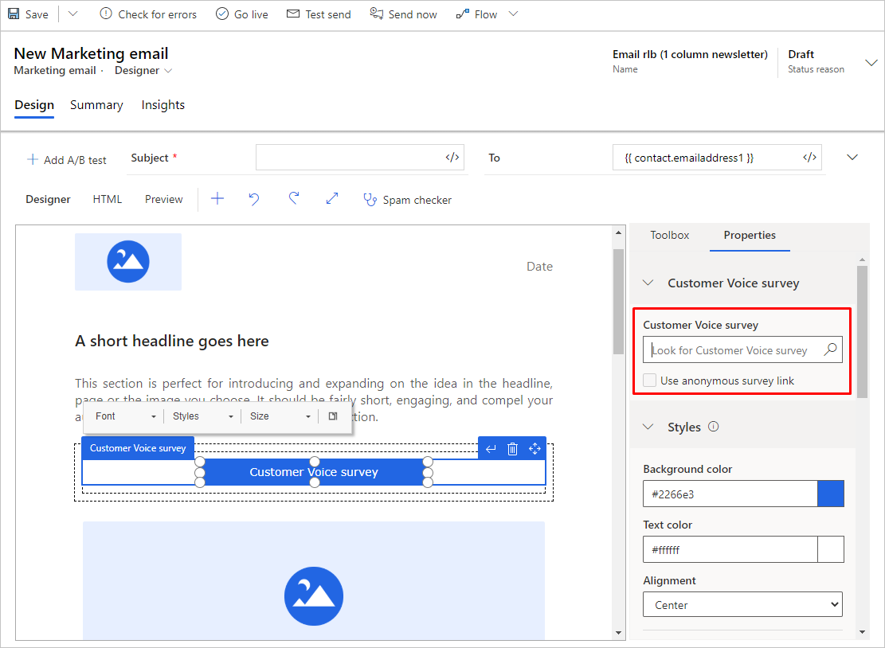
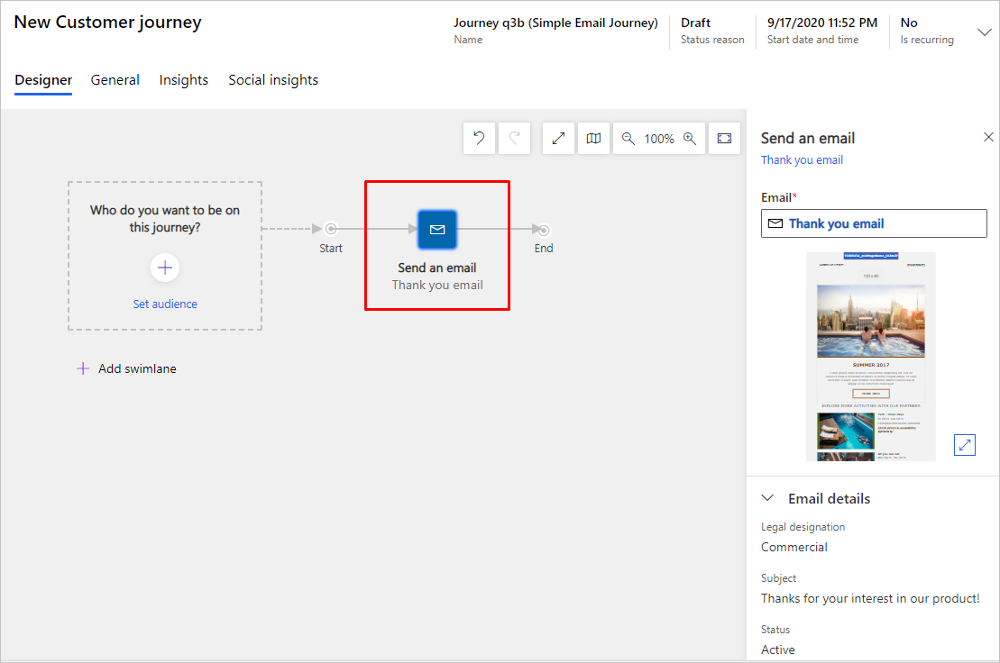
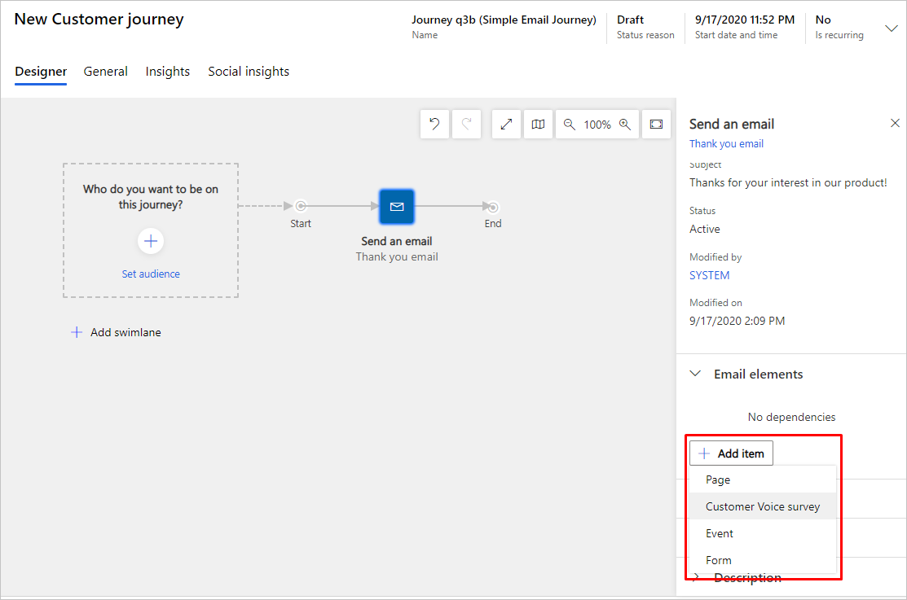
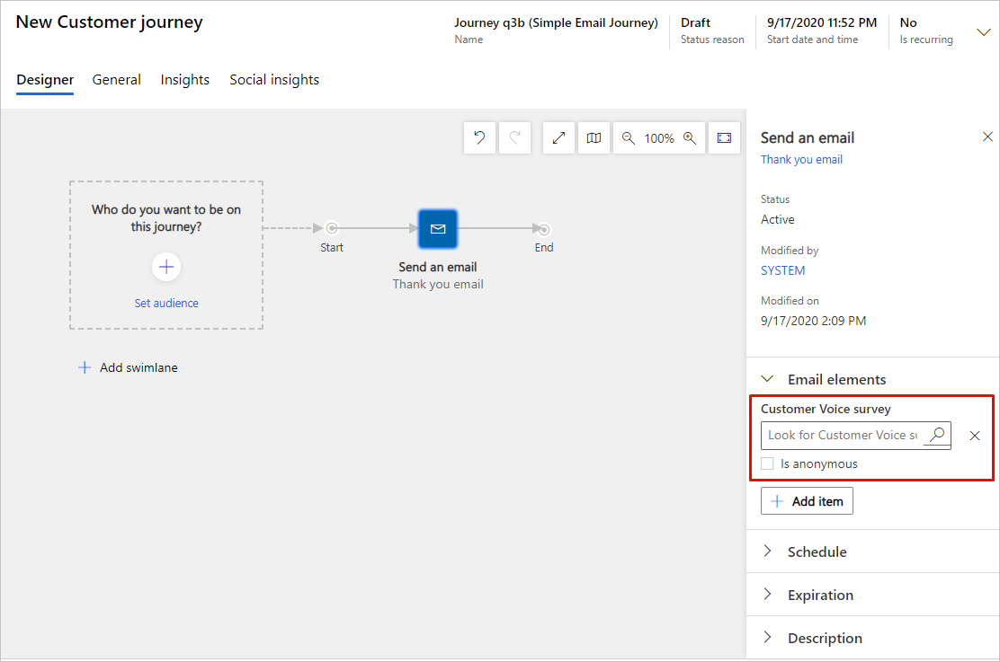
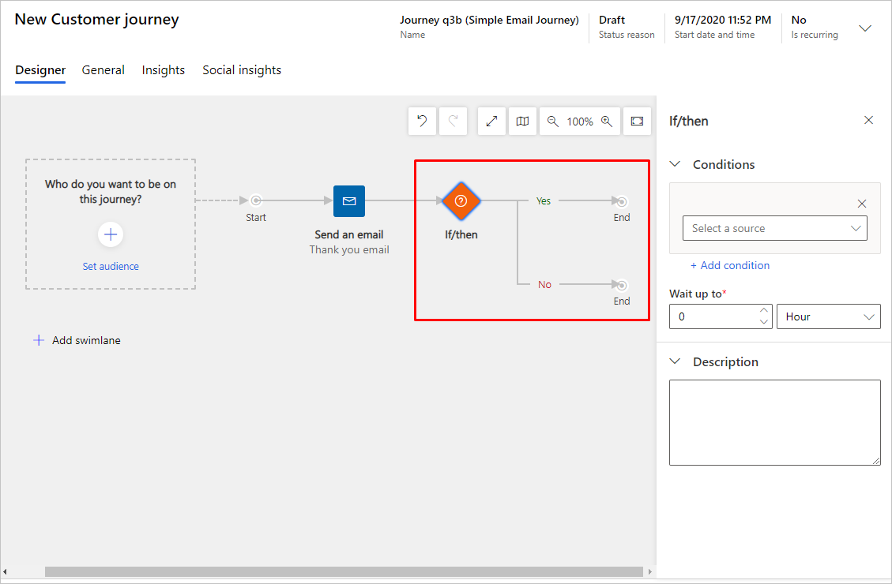

# Add surveys to your marketing campaigns

> [!NOTE]
> Microsoft Forms Pro has evolved into Dynamics 365 Customer Voice, providing you with additional survey capabilities and business benefits. The change is being introduced in phases and will be available in all geographical regions in the next few weeks, except for US Government Community Cloud customers. Dynamics 365 Customer Voice will be available on US Government Community Cloud by October 2020. For more information, see the [Dynamics 365 Customer Voice](/dynamics365/customer-voice) documentation.

Dynamics 365 Marketing includes built in support for adding surveys to your marketing campaigns. Build surveys using [Dynamics 365 Customer Voice](https://dynamics.microsoft.com/customer-voice) and access them directly from Marketing components including the segment builder, the email designer, and the customer journey design. You can use surveys to make data-driven decisions and apply your findings to your marketing initiatives. You can even automate survey experiences and use data generated from surveys for advanced segmentation and customer profiling.

> [!IMPORTANT]
> You will need your administrator to [turn on the feature switch](admin-feature-switches.md) for the "Dynamics 365 Customer Voice Marketing integration" functionality before you are able to access it.

## Step one: Create a survey in Dynamics 365 Customer Voice

All surveys that you create in a Dynamics 365 Customer Voice environment are ready to use in Marketing. To learn about creating surveys, refer to the [Create a survey](/dynamics365/customer-voice/create-survey) article.

## Use surveys with dynamic segments

Your entire Dynamics 365 Customer Voice dataset is available for your Marketing scenarios. With survey data, you can segment based on surveys, survey responses, specific questions answered, etc.

To use survey data in segments:

1. Go to **Customers** > **Segments** in the left navigation bar.
1. Create a new [dynamic segment](segmentation-lists-subscriptions.md#create-and-go-live-with-a-new-segment) by clicking **New** > **New Dynamic Segment** in the top menu.
1. You can choose from Dynamics 365 Customer Voice data options depending on whether you create an [interaction based or a profile based segment](segmentation-lists-subscriptions.md#segments-in-dynamics-365-marketing).

    Interaction-based segment Dynamics 365 Customer Voice options (these may still be listed as Forms Pro options in the menu):

    

    Profile-based segment Dynamics 365 Customer Voice options:

    

## Dynamics 365 Customer Voice survey links in email messages

To add a Dynamics 365 Customer Voice survey to an email message, go to the [email content designer](email-design.md). Then go to **Toolbox** > **Advanced elements** > **Dynamics 365 Customer Voice**. Drag and drop the **Customer Voice survey** element into your email.

In the **Properties** tab, choose the survey you would like to use.

After you choose a survey, you can customize the email styling just as you would with any other email message.

## Dynamics 365 Customer Voice automation in customer journeys

Marketing gives you the option to automate customer journey actions based on Dynamics 365 Customer Voice survey data.

> [!NOTE]
> As of the October 2020 Marketing release, the Dynamics 365 Customer Voice tile no longer appears in the contextual window that appears when adding a new tile to the canvas. To add the tile, you must set the options for an email tile as shown below.

To add a Dynamics 365 Customer Voice survey to customer journey:
1. Go to the [customer journey designer](customer-journeys-create-automated-campaigns.md). Then create or choose an existing customer journey with an email tile. Make sure the email tile is associated with an existing email.

    

1. Select the email tile. In the right pane, go to **Email elements** > **+ Add item** and select **Customer Voice survey** in the dropdown menu.

    

1. In the **Email elements** section, select a Dynamics 365 Customer Voice survey from the lookup field.

      

1. In the **Email elements** section, check the **is anonymous** box if you do not want to distribute a named survey.

1. You can add an If/then tile to further understand how contacts engage with the survey.

    

    You can use following If/then options:
    - If/then based on source (email or survey)
    - If/then based on a specific question
    - If/then based on an answer

> [!IMPORTANT]
> Entity names related to Forms Pro have changed to "Customer Voice." For example, if you are using [Advanced Find](../customerengagement/on-premises/basics/save-advanced-find-search.md) to search entities related to your surveys, you will need to search for Customer Voice, not Forms Pro.
> 
> The entities associated with Dynamics 365 Customer Voice surveys are listed below:
>
> - Customer Voice localized survey email templates
> - Customer Voice projects
> - Customer Voice satisfaction metrics
> - Customer Voice survey questions
> - Customer Voice survey activities
> - Customer Voice email templates
> - Customer Voice survey invites
> - Customer Voice survey question responses
> - Customer Voice survey responses
> - Customer Voice surveys
> - Customer Voice unsubscribed recipients

### See also

[Create marketing forms](marketing-forms.md)

[!INCLUDE[footer-include](../includes/footer-banner.md)]