# Create and customize marketing calendars

The [marketing calendar](marketing-calendar.md) is supplied as a standard control that you can add to any entity or form. The following subsections explain how to customize the settings of any calendar, and how to add a calendar display to an entity or form.

## Types and locations of marketing calendars

There are two basic types of marketing calendars:

- **Entity-level calendars**: Entity-level calendars appear when you first open an entity from the main navigator, such as events, customer journeys, or the main marketing calendar. They appear where you'd normally see a list view, and when present, you can switch between the calendar view and list view. Here you'll see relevant records plotted on the calendar according to their scheduled dates, and you can open any listed record from here. This type of calendar can show several types of entities and provides a system view selector for filtering the records shown.
- **Form-level calendars**: Form-level calendars appear while you are viewing a specific record, such as a specific event. They are integrated into the form view. These might appear in their own tab on the form, or as a section on a tab with other sections of settings also available. This type of calendar can only show and create records of one type of entity and they don't provide a system-view selector. They are often configured to show information that is related to the specific record where they appear.

Other than the differences noted here, both types of calendars look the same and work in similar ways.

## Add a marketing calendar to an entity

When you add the calendar control at the entity level, it becomes available on that entity's list view either by default or via the **Show as** button (as described in [Work with marketing calendars](marketing-calendar.md)).

> [!IMPORTANT]
> You can only add entity-level calendars to entities that have start and end dates. (However, you can add form-level calendars to any entity.)

To add an entity-level calendar to an entity:

1. [Open a Power Apps customization window](customize-open-powerapps.md). In the left panel, expand **Components** > **Entities** to see a list of all entities. Then select the entity where you want to add the calendar.

    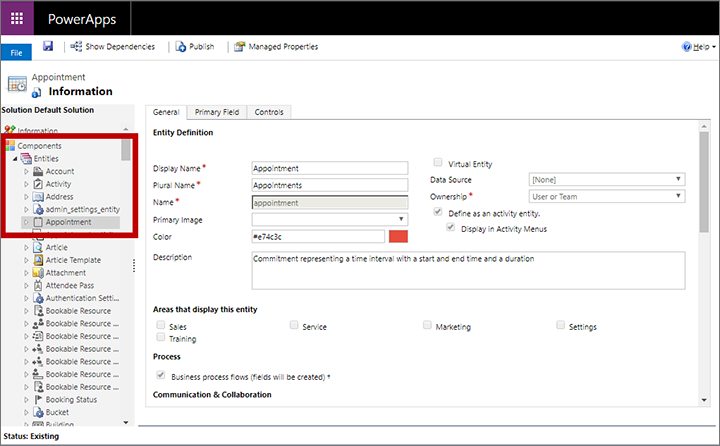

1. Go to the **Controls** tab and choose **Add control**.

    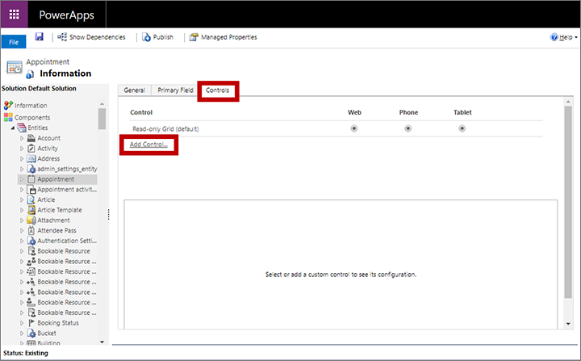

1. The **Add Control** dialog box opens. Use it to find and add the control called **Marketing Calendar**.

1. The **Controls** tab updates to show configuration settings for the new calendar.

    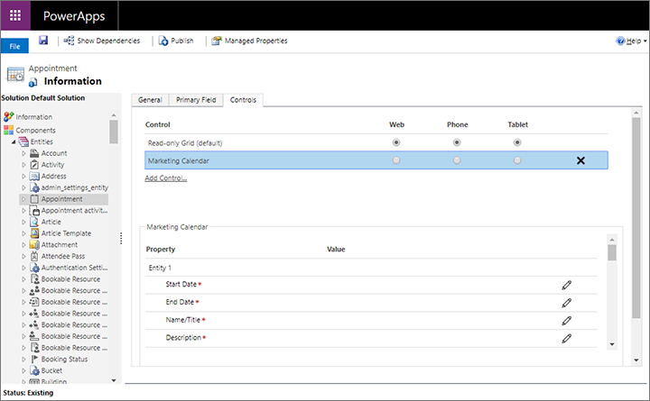

    Do the following:
    - Select the **Marketing Calendar** in the **Control** section and then configure the mappings and quick-view form IDs for each entity you'd like to include in this calendar, plus other configuration settings. For details about these settings, see [Configure the entities available to a calendar](#config-calendar).
    - Make the calendar the default view for any or all the available form factors (web, phone, and tablet) by using the radio buttons at the top, as required.

1. Save and publish your settings.

## Add a marketing calendar to a form

You can add a marketing calendar to any form where you think it could be useful. You can position it as a new section for any existing form tab or create a tab that's dedicated to showing the calendar by itself. Calendars that you add at the form level can only show one type of entity (such as events, appointments, _or_ sessions).

1. [Open a Power Apps customization window](customize-open-powerapps.md).. In the left panel, expand **Components** > **Entities** to see a list of all entities. Then expand the entity where you want to add the calendar and choose **Forms** to see a list of forms currently available to that entity. Select or create the form where you want to add the calendar.

    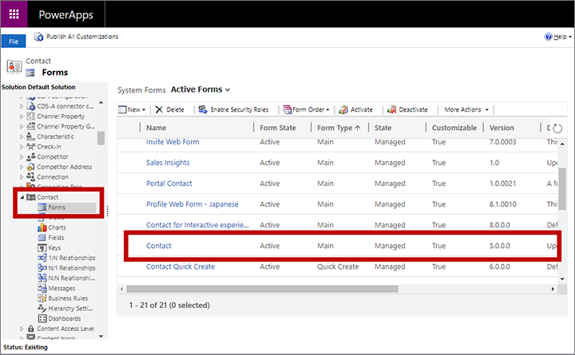

1. In the form editor, go to the **Insert** tab and add a container to host the calendar (such as a tab or a section):

    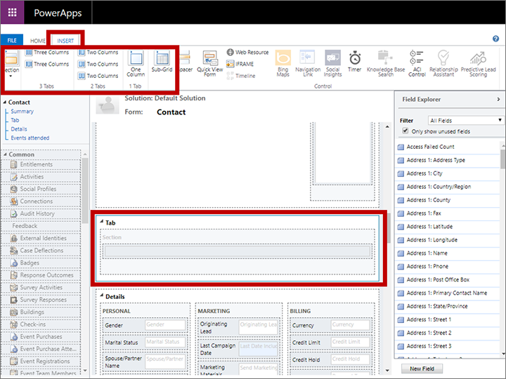

1. With the newly created tab or section selected, choose **Insert** > **Sub-Grid**.

1. The **Set Properties** window opens. On the **Display** tab, give the sub-grid a **Name** and **Label**.

    

1. In the **Data Source** section, choose the type of entity that you want to show in your calendar. Make the following settings:
    - **Records:** Choose **All record types** to show any type of record, or choose **Only related records** to show only records that have a relation to a currently shown record (such as rooms reserved for a displayed event, or engagements assigned to a displayed speaker).
    - **Entity**: Choose the type of entity you want to show in the calendar. The entity you choose must include fields for a start date and end date, and must also have a quick-create form available.
    - **Default view**: Choose a system view defined for your selected entity. This setting will filter the collection of records shown on the calendar.

1. Go to the **Controls** tab and select **Add control**.

1. The **Add Control** dialog box opens. Use it to find and add the control called **Marketing Calendar**.

    > [!NOTE]
    > There could be several types of calendar controls available. Be sure to check the name carefully.

1. The **Controls** tab updates to show configuration settings for the new calendar.

    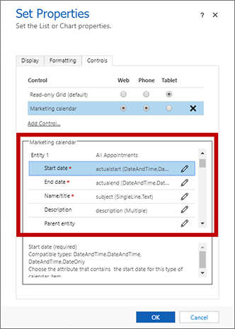

    Do the following:
    - Select the **Marketing Calendar** in the **Control** section and then configure the mappings and quick-view form IDs for the entity you chose to include in this calendar, plus other configuration settings. For details about these settings, see [Configure the entities available to a calendar](#config-calendar).
    - Make the calendar the default view for any or all the available form factors (web, phone, and tablet) by using the radio buttons at the top, as required.

1. Save and publish your settings.

## Configure the entities available to a calendar

After you have added a marketing calendar to an entity or form, you must configure it with the collection of entities that it should display and create. The settings are the same in each case.

1. [Open a Power Apps customization window](customize-open-powerapps.md) and go to the entity or form where you are creating or editing the calendar.

    - For entity-level calendars, go to the **Controls** tab for the entity. More information: [Add a marketing calendar to an entity](#add-to-entity)
    - For form-level calendars, open the properties for the sub-grid that is positioning the calendar and then open the **Controls** tab on the **Set properties** page. More information: [Add a marketing calendar to a form](#add-to-form)

    From this point on, the procedure is the same whether you are creating or editing an entity-level or form-level calendar.

    

1. Select **Marketing Calendar** in the **Control** section to open its configuration settings in the bottom section of the window.

1. You can add up to five entities to show in entity-level calendars, or just one for form-level calendars. Note the following:
    - **Entity 1** is fixed. For an entity-level calendar, this is always the entity itself. For form-level calendars, this is the entity selected for the sub-grid that hosts the calendar.
    - Form-level calendars can only display the entity set for **Entity 1**. You can add more entities to enable users to create those types of records from the calendar, but the calendar won't display them so doing so is likely to confuse users.
    - Entity-level calendars can display up to five entities of any type that has a start date, end date, and quick-create form.

1. Use the **Configure property** buttons  to make each of the following settings for **Entity 1**:

    - **Start Date**: Select the field from the target entity where the start date is defined for each record.
    - **End Date**: Select the field from the target entity where the end date is defined for each record.
    - **Name/Title**: Select the field that defines the record name for the target entity. This value will be shown on the calendar to identify the record.
    - **Description**: Select the field that describes the record name for the target entity. This value is shown for calendar items when in day or week view.
    - **Color**: Select the field that holds a custom background-color value for the target entity (optional). If you don't assign a field here (or if the assigned field has no value for a given record), then the [default color](#entity-color) for the entity will be used. Some additional customizations are also required to enable this feature for any entity. More information: [Set up record-level custom colors](#record-color)
    - **Parent entity**: Select a parent entity (optional). In the future, this will be used to group child items under parent items when they are displayed in the calendar, but in the current version this setting has no effect. This will eventually be useful, for example, for sessions, which have events as a parent entity.
    - **Entity 1 quick view form ID**: When users select an item in the calendar, it displays a quick-view form with information about the selected record that includes a button for opening the full record for editing. You can choose any form for this purpose—you might create a custom one, but many people simply use the existing quick-create form. If you don't provide a value here, then users who select this type of calendar item will go straight to the edit form. To set this, choose the **Configure property** button for this setting, then choose the **Bind to a static value** radio button and paste the ID in the field provided here. For details about how to find the ID for a quick-view form, see [Find the form ID for a quick-view form](#find-form-id).

      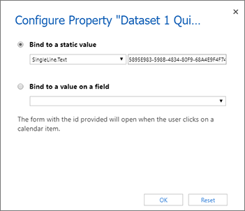

1. If you are creating an entity-level calendar and want to add another entity to the current calendar, then choose an entity for **Entity 2** and repeat the previous step for that entity. You can add up to five entities to entity-level calendars.

1. Make the following general settings as required (they are optional). They appear after the **Entity** settings and apply to the calendar as a whole:

    - **Default duration for new items**: Specify the default duration (in minutes) applied to new items created by this calendar. When a user creates a new item (for example, an appointment), they will select a start date and time. The end date and time for that item will then automatically be set this number of minutes later, but the user is free to change it as needed.
    - **Default view**: Choose which calendar view to show when the calendar is first opened (day, month, year, or agenda).
    - **Default view date**: Usually, you'll leave this blank to show the current date, but you could instead specify a static date. Don't choose the **Bind to a value on a field** option because it doesn't work in the current version of the calendar.

1. Save and publish your settings.

<!-- ## Configure the main marketing calendar

The main marketing calendar is available directly from the side navigator, where it is provided at **Marketing** > **My work** > **Marketing calendar**. This calendar functions like an entity-level calendar, but there is no marketing calendar entity. Instead, the calendar is created as a custom view for the customer journey entity.

To configure the main marketing calendar:

1. [Open a Power Apps customization window.](customize-open-powerapps.md) In the left panel, expand **Components** > **Entities** > **Customer journey** > **Views** to see a list of views for the customer journey entity. Then open the view named **Marketing Calendar**.

    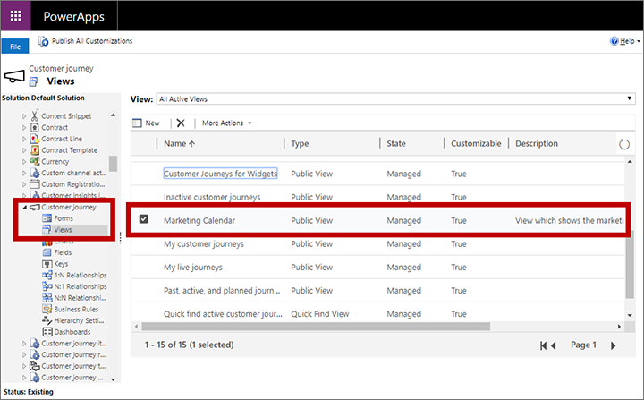

1. A configuration dialog box opens for your selected view. Under **Common Tasks**, select **Custom Controls**.

    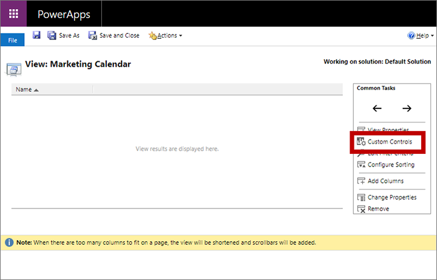

1. The **Custom Controls** dialog box opens, which provides the same settings as for other instances of the marketing calendar control. Proceed as described in [Configure the entities available to a calendar](#config-calendar).-->

## Find the form ID for a quick-view form

Part of the calendar configuration gives you the option of choosing a quick-view form for each entity displayed by the calendar. When a user selects a calendar item, the content of this form is displayed in a read-only pop-up dialog box. You can choose any form for this purpose—you might create a custom one, but many people simply use the existing quick-create form. More information: [Configure the entities available to a calendar](#config-calendar)

When specifying the form, you must use the ID of the form you want to use. Here is how to find the required ID:

1. [Open a Power Apps customization window](customize-open-powerapps.md) and expand **Components** > **Entities** to see a list of all entities. Then expand the entity you are adding to your calendar and choose **Forms** to see a list of forms currently available to that entity.

2. Select the form you want to use as a quick-view form. The form opens in a new window.

    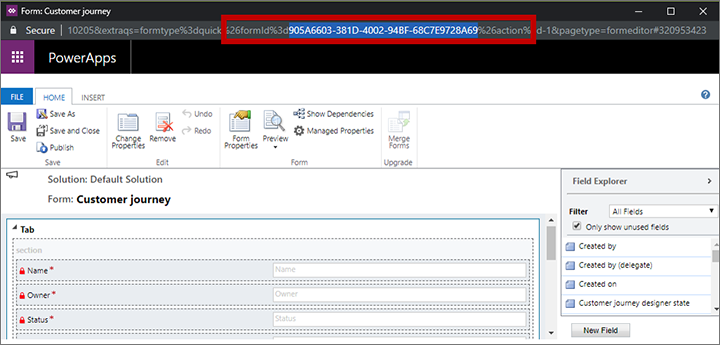

3. Inspect the URL at the top of the new window and find the part that looks something like the following:

    `… formId%3d5895E983-598B-4834-80F9-68A4E9F4F744%26 …`

1. Copy the value shown between **formId%3d** and **%26** (&quot;5895E983-598B-4834-80F9-68A4E9F4F744&quot; in the previous example).

1. Paste this value into the **Entity *&lt;n&gt;* quick-view form ID** setting described in [Configure the entities available to a calendar](#config-calendar).

## Set the default color used for each type of entity shown in the calendar

Each item displayed on the calendar uses a background color to indicate which type of item it is. By default, events are green, sessions are blue, and appointments are red. Entities with no color configured show as gray. To customize the color for any entity:

1. [Open a Power Apps customization window.](customize-open-powerapps.md) In the left panel, expand **Components** > **Entities** to see a list of all entities. Then select the entity you want to assign a color to.

    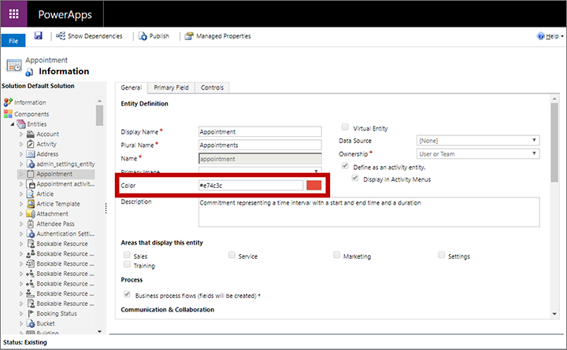

1. Use the **Color** setting on the **General** tab to set a color for the entity.

1. Save and publish your settings.

## Set up record-level custom colors

In addition to the default entity color, you can also customize a calendar to enable users to select a custom color for each record as they add it. If no custom color is selected for a new record, the [default color](#entity-color) for the entity will be used.

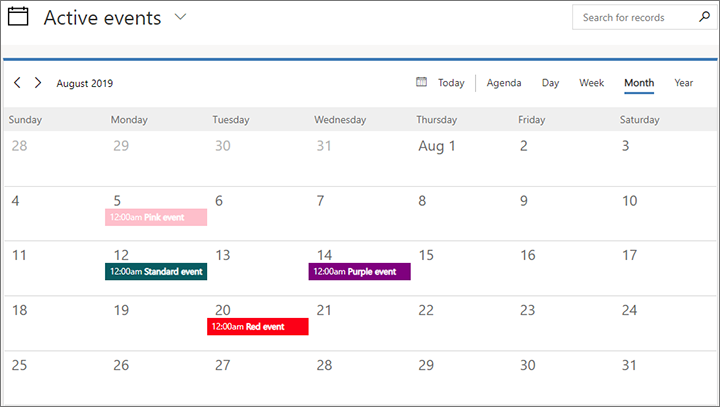

To set up record-level custom colors using a free text field:

1. [Add a custom field](/powerapps/maker/common-data-service/create-edit-fields) to the entity where you want to enable for record-level custom colors. This is the target entity (such as Event) to be displayed by the calendar you are customizing. This field will hold the custom color value assigned to each record, so give it name such as "Calendar color". The field must be of type **Single line of text**.

1. [Customize the quick-create form of the target entity](/powerapps/maker/model-driven-apps/create-edit-quick-create-forms) to include the new color field. This will enable users to choose a color while they create a record from the calendar. Be sure to use the same quick-create form that you have [configured for use with your calendar](#config-calendar). You might also consider adding the color field to other forms where users may want to view or edit it (possibly including the main form).

1. [Configure your calendar](#config-calendar) to identify the color field for the target entity.

1. Publish your customizations.

Users can choose any of the available HTML standards when entering color values, including:

- Color name (such as `red`)
- Hex value (must start with #) (such as `#FF0000`)
- Short hex value (for colors that support it) (such as `#F00`)
- RGB value (such as `rgb(255,0,0)`)

To set up record-level custom colors using an option set:

1. Choose an **option set** field from the entity under which you would like to change the color of the record. This is the target entity (such as an event) that will display by the calender you are customizing.

1. [Ensure that the option set for the field has the colors you like for the options](/powerapps/maker/common-data-service/create-edit-global-option-sets-solution-explorer#create-a-global-option-set). These colors will be displayed for the record on the calendar when that option is set for the field.

Users can choose any of the available HTML standards when entering color values, including:

- Color name (such as `red`)
- Hex value (must start with #) (such as `#FF0000`)
- Short hex value (for colors that support it) (such as `#F00`)
- RGB value (such as `rgb(255,0,0)`)

1. [Configure your calendar](#config-calendar) to identify the color field for the target entity.

1. Publish your customizations.

[!INCLUDE[footer-include](../includes/footer-banner.md)]