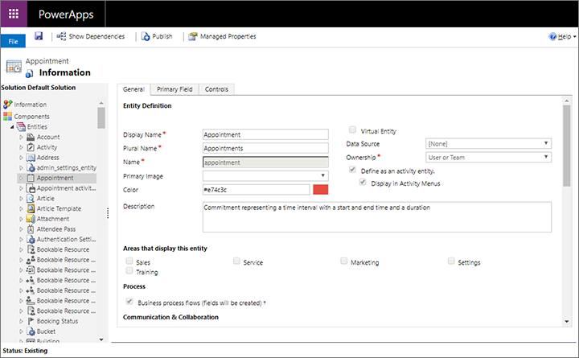

# Open the Power Apps customization window

Most types of customizations require you to work in the **Power Apps** customization window. To get there:

1. Open the **Settings** menu  at the top of the page and select **Advanced settings**. The advanced-settings area then opens in a new browser tab. Note that this area uses a horizontal navigator at the top of the page instead of a side navigator.

1. Navigate to **Settings** > **Customization** > **Customizations** and then choose **Customize the System** from the **Customization** page.

1. A **Power Apps** customization pop-up window opens. Use the left panel to navigate and select the item you want to customize. Then use the area on the right to make your settings.

    

For complete details about how to customize model-driven apps in Dynamics 365, see the [Power Apps documentation](/powerapps/?panel=getstarted#pivot=home).

[!INCLUDE[footer-include](../includes/footer-banner.md)]