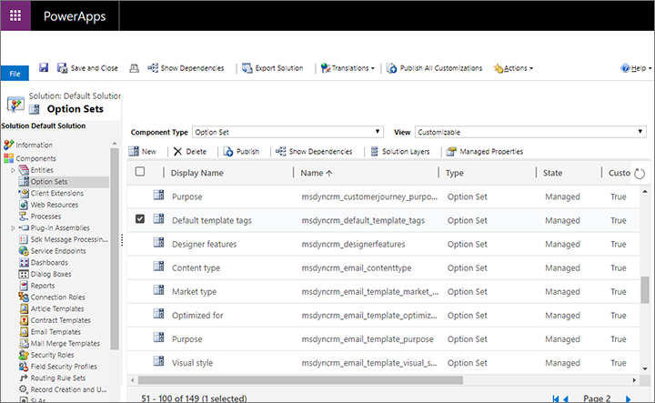
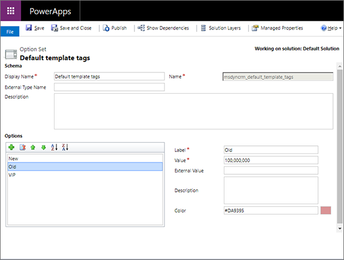
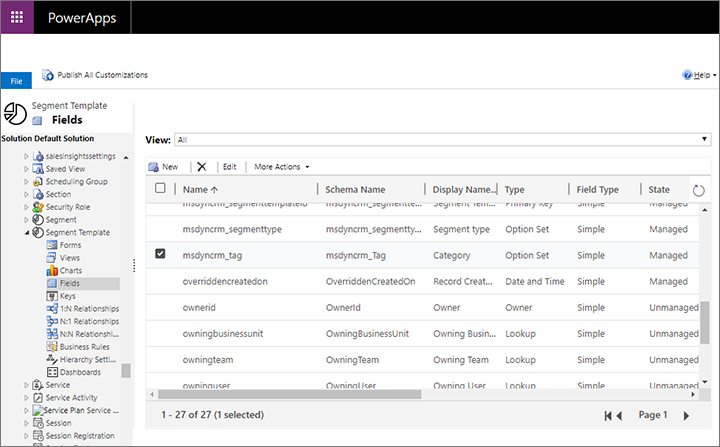
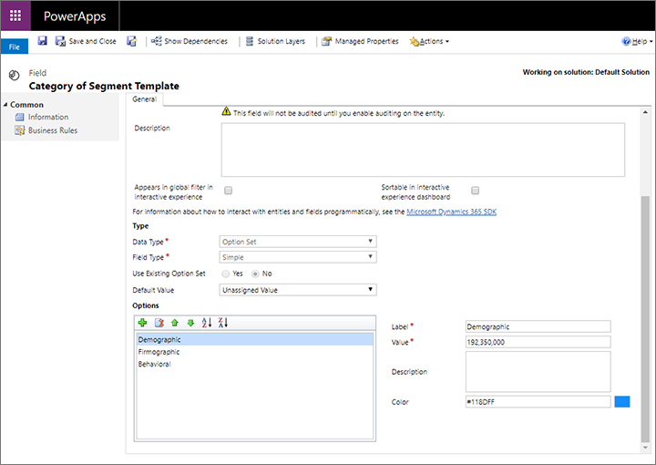
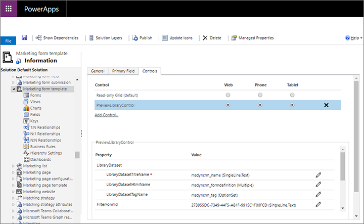
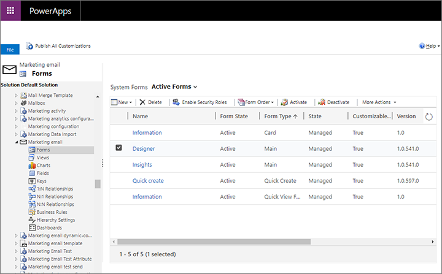
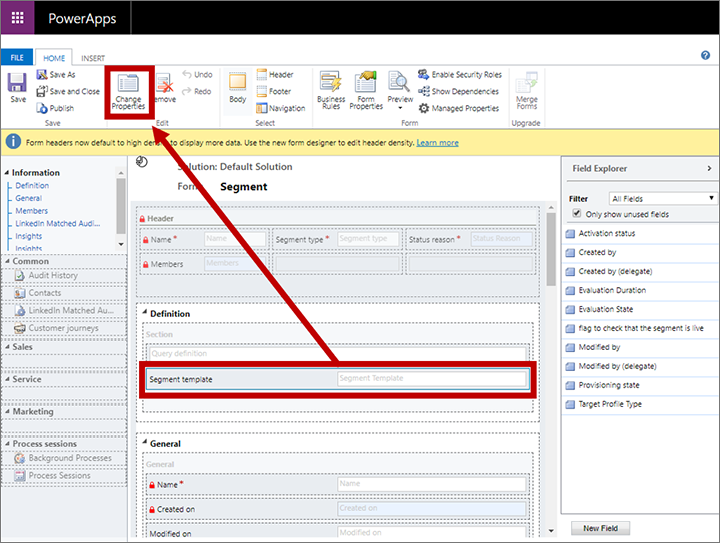
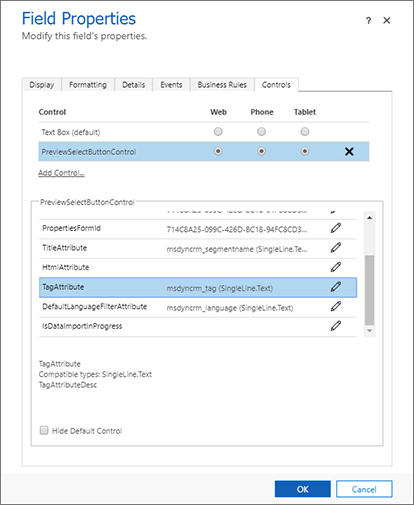
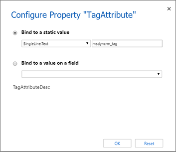

# Create and customize template labels

The template labelling feature enables users to add any of several available labels to list and tile displays of templates for emails, pages, forms, and segments. Read this topic to learn how to create and customize the labelling options available to users for each type of template. You'll establish these options by creating option-set fields and values for each relevant entity (these can be local or global option sets), and by configuring each entity to identify the option-set field to use for the labels.

## Set label values and colors for the default global option set

In a default installation, the email template, page template, and form template entities are all configured to share the same global option set to establish their template-label options (segments use a [local option set](#label-values-colors) instead). That means that you can edit just one option set and make your customizations available to all these template types at once. 

> [!NOTE]
> The field that's preconfigured to hold label values for each of these entities can't be changed to use a local option set or another global option set. If you need to use unique labels for one of these entities, you must create a new field that is either a local option set or uses another global option set, and then [configure the template entity](#label-field-templates) and its [related design entity](#label-display-design) to use that new field for their labels.

To establish label values and colors for the default global option set:

1. [Open a Power Apps customization window](customize-open-powerapps.md).

1. In the left panel, select **Components** > **Option Sets** to see a list of all global option sets.

    

1. Find and open the option set with **Name** = **msdyncrm\_default\_template\_tags**.

1. The **Option set** window opens. Use the buttons in **Options** section to add or remove option-set values until you have the collection of options that you need.

    

1. To configure a label, select it in the **Options** list and then use the **Label** and **Color** fields to establish the visual text and background color for that label.

1. Continue working until you have established the selection, names, and colors for all the labels you need.

1. Select **Save** on the command bar to save your settings.

1. Select **Publish** on the command bar to make your new settings available to application users.

## Set label values and colors for a local option set

In a default installation, the segment template entity is configured to use a local option set to establish its template-label options (email, page, and form templates all [share the same global option set](#global-option-set) by default).

To establish label values and colors for a local option set:

1. [Open a Power Apps customization window](customize-open-powerapps.md).

1. In the left panel, expand **Components** > **Entities** to see a list of all entities.

1. Find and expand the template entity you want to work with (such as **Segment template** ) then select the **Fields** item under here.

    

1. Find and open the field that your selected entity is using to define its label options. (In a default installation, the segment-template entity uses the field with **Name = msdyncrm_tag** and **Display Name = Category**.) If you're not sure which field your entity is using for labels, see [Configure the field used to hold label options for each entity](#label-field-templates) to learn how to find out.

1. The **Field** window opens. Use the buttons in the **Options** section to add or remove option-set values until you have the collection of options that you need.

    

1. To configure a label, select it in the **Options** list and then use the **Label** and **Color** fields to establish the visual text and background color for that label.

1. Continue working until you have established the selection, names, and colors for all the labels you need.

1. Select **Save** on the command bar to save your settings.

1. Select **Publish** on the command bar to make your new settings available to application users.

## Configure the field used to hold label options for each template entity

Each relevant template entity is delivered with a preselected field configured as the source for its label options. But you can use a different field if you prefer. The following table lists each relevant template entity and its related design entity:

| **Feature** | **Template entity** | **Design entity** |
| --- | --- | --- |
| Marketing emails | Marketing email template | Marketing email |
| Marketing pages | Marketing page template | Marketing page |
| Marketing forms | Marketing form template | Marketing form |
| Segments | Segment template | Segment |

You must configure your label field for both the template entity and its related design entity. This enables your labels to appear and be editable for the templates, and to appear in template galleries presented by the design entity. Use the following procedure to identify the label field for a template entity. See [Configure the field used to display labels in the gallery for each design entity](#label-display-design) for details about how to do this for the related design entity.

To set the field used to define label options for a template entity:

1. [Open a Power Apps customization window](customize-open-powerapps.md).

1. In the left panel, expand **Components** > **Entities** to see a list of all entities.

1. Find and expand the template entity you want to work with.

1. Select the **Fields** item under your selected entity to see the collection of fields defined for that entity. Identify the field you want to use for defining label values. The field must be of type **Option Set**. Note the value it shows in the **Name** column.

    

    > [!NOTE]
    > If you don't yet have the field you need, then create one as usual. It must be of type option set. You can set your new field to use a [global option set](#global-option-set) if you want to share it's options with other entities, or use a local option set to create unique labels for your current entity. See [Work with fields](/powerapps/maker/common-data-service/fields-overview) and its related topics for more information about to create and configure fields.

1. In the left panel, select the template entity itself to open its general setting in the right panel. Then open the **Controls** tab in the right panel.

    

1. Select **PreviewLibraryControl** under the **Controls** heading to configure this control.

1. In the bottom part of the right panel, note the **Value** shown for the property **LibraryDatasetTagName**. This is the field currently used to define the label options for this entity. If it doesn't match the field name you found or created earlier in this procedure, select the **Configure property** button 
 to open a pop-up dialog where you can select the field you want.

1. Select **Save** on the command bar to save your settings.

1. Select **Publish** on the command bar to make your new settings available to application users.

## Configure the field used to display labels in the gallery for each design entity

As mentioned previously, you must configure both the template entity and its related design entity to identify the field that provides your label settings. This enables your labels to appear and be editable for templates, and to appear in template galleries presented by the design entity. Use the following procedure to identify the label field for a design entity. See [Configure the field used to hold label options for each template entity](#label-field-templates) for a table that lists each relevant template entity and its related design entity, and for details about how to do this for the related template entity.

To set the field used to define label options for a design entity:

1. [Open a Power Apps customization window](customize-open-powerapps.md).

1. Find and take note of the exact **Name** value for the label field you have already configured for the template entity that is related to the design entity you will set up now, as described in [Configure the field used to hold label options for each template entity](#label-field-templates).

1. In the left panel, expand **Components** > **Entities** to see a list of all entities.

1. Find and expand the design entity you want to work with and then select the **Forms** item under here.

    

1. Select and open the form that is responsible for displaying the template gallery, which varies by entity as shown in the following table (you'll use the other columns of this table later in this procedure):

    | **Entity** | **Form** | **Field name and section** | **Control name** |
    | --- | --- | --- | --- |
    | Marketing email | **Name = Designer** | **Design** > **Template** | TemplatePickerControl |
    | Marketing form | **Name = Information** and **Form type = Main** | **Designer** > **Marketing form template** | PreviewSelectButtonControl |
    | Marketing page | **Name = Setup** | **Content** > **Marketing page template** | PreviewSelectButtonControl |
    | Segment | **Name = Information** and **Form type = Main** | **Definition** > **Segment template** | PreviewSelectButtonControl |

1. A form designer opens. In the form, locate the field identified in the previous table for the type of entity you are working with. Select this field and then select **Change properties** in the ribbon (or double-click the field). The following screenshot provides an example of how to find the relevant field for the segment entity.

    

1. The **Field properties** dialog box opens. Go to the **Controls** tab here and select the control listed in the previous table for the type of entity you are working with. Then, in the bottom panel, scroll down until you see the property called **TagAttribute**.

    

1. If the label field whose name you found at the start of this procedure isn't shown for the **TagAttribute** property, then select the **Configure property** button  here.

1. A pop-up dialog opens to let you define the property. Select the **Bind to a static value** radio button, leave the drop-down list here set to **SingleLine.Text** , and then enter the label field value that you found at the start of the procedure. This isn't a drop-down list, so you must enter the value exactly as you saw it earlier.

    

1. Select **OK** to close the configuration dialog, then select **OK** again to close the **Field properties** dialog and return to the form designer.

1. In the form designer, select **Save** in the ribbon to save your changes and then select **Publish** to make your new settings available to application users.

## Make label values and settings visible in lists and forms

If you've customized the fields used to present your labels, then you must also update the relevant template-entity forms to provide the field as a setting for users. Use standard techniques for model-driven apps in Power Apps to make these settings. More information: [Create and design model-driven app forms](/powerapps/maker/model-driven-apps/create-design-forms) and [Understand model-driven app views](/powerapps/maker/model-driven-apps/create-edit-views).

[!INCLUDE[footer-include](../includes/footer-banner.md)]