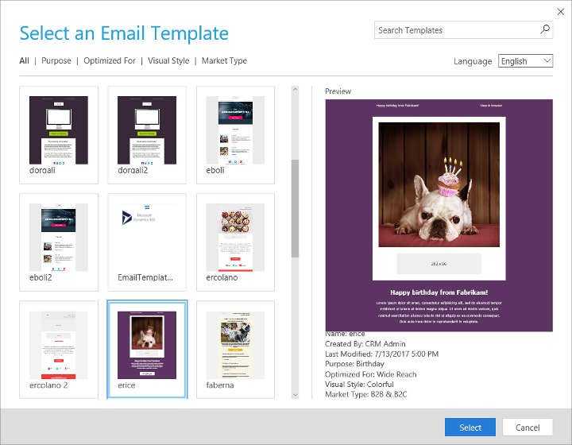

# Design your digital content

Dynamics 365 Marketing provides an advanced digital-content designer for creating, styling, and previewing the various types of digital content that you can produce and manage with the system, including:

- Marketing email messages and templates  
    More information: [Email marketing overview](prepare-marketing-emails.md)
- Marketing pages and templates  
    More information: [Create and deploy marketing pages](create-deploy-marketing-pages.md)
- Marketing forms and templates  
    More information: [Create, view, and manage marketing forms](marketing-forms.md)

The designer features a drag-and-drop interface for building and working with the design, plus an optional HTML editor for working directly with code and a preview tool that can show how your design will look on various form factors and orientations.

The designer adapts itself to your current context (email, landing page, and so on) to provide only those design elements and settings that apply there, but its basic functionality remains the same. It also provides a "foreign content mode", which is activated if you paste HTML from a third-party application directly into the HTML code editor; in this case, the designer 0 know which type of content you are designing and therefore hides context-specific features and provides a more generic design interface.

This topic describes how to work with the designer in general, in all contexts. For more information about how the designer fits into the various specific contexts, and for details specific to just one context, see the topics linked in the list at the start of this introduction.

## Start by choosing a template

Most non-template entities that provide the content designer also support templates, so when you first create a marketing email, page, or form, you'll be asked to choose a template.

The template picker provides many controls for searching, sorting, and filtering the templates. Use these controls to find templates that might meet your requirements, then select a template to see a preview and more details about it in the **Preview** area. When you've found the right template, select **Select** to apply it to your new design.

The template you choose will initiate your design by establishing the following:

- **Column layout and initial content**: Sets the basic layout (such as one-column or two-column) and includes initial content (such as images, required links, boilerplate text, and more).
- **Page or form type**: If you're creating a marketing page or form, this tells whether the page is a subscription center, forward-to-a-friend, or landing page and establishes the basic capabilities of the page or form.
- **Sample design and content**: Some templates already include basic design elements, such as logos, typography, color palette, sample content, and more. Other templates provide a blank page that includes only the page type and column layout. You can freely change the sample design and content as you edit and design the page.

After you've chosen a template, the designer shows your selected template content and you can start editing it. Your new email, page, or form is created as a simple copy of the template, so any local changes you make won't affect the template, and any future changes to a template won't affect anything you created based on it.

## Establish your basic layout

Use section elements to establish the basic layout of your emails, marketing pages, and marketing forms. Each section element creates a row of columns into which you can drag various other design elements, like text boxes, images, buttons, dividers, and more. There are five different section elements, each of which creates a row with one of five different layout options (one column, two columns (1:1), two columns (1:2), two columns (2:1), or three columns). You can stack several section elements as needed to create complex designs with various column layouts in each row.

### Add section elements to layout your design

When you're designing an email, page, or form starting with the blank template (or a custom template based on the blank template), all design elements (other than section elements) must be placed into a _section element_. Section elements are provided in the **Toolbox** panel under the **Layout** heading.

The blank templates provide a one-column section by default, but you can edit its column layout and/or add more section elements as needed.

To add a section element, open the **Toolbox** panel, choose the section element that provides the column layout you'd like to start with and drag it into position above or below any existing section element in your design.

> [!NOTE]
> If you choose a template that implement layouts using custom HTML instead of section elements, then section elements aren't available. Instead, you'll be able to drag design elements into any container defined by the template. This may also apply to other custom templates that use custom HTML to create layouts. This will usually only apply to templates created using an older version of Dynamics 365 Marketing.

### Edit and configure a section element

When you add a new section element, you'll choose one of five initial column layouts. But once your element is placed, you can change the column layout and/or design options.

To edit and configure a section element:

1. Select the section element on the canvas. It now displays a blue border and tabs showing the element type and buttons for deleting or moving the element.
1. The **Properties** panel opens to show the settings for your selected section.

    

1. Make settings in the following sections as needed:

    - **Section layout**: Select a button here to change the column layout to the one indicated by the graphic on each button. If you remove a column, all of its content will be moved into one of the remaining columns. If you add a column, the new column will initially be empty.
    - **Section border styles**: Use these settings to set the style (none, solid, dotted, dashed, or double), line width, line color, and corner radius for the border that goes around the entire section (but not between columns).
    - **Section padding**: Specify how much padding (in pixels) you'd like to place between the columns and the colored border. You can enter separate values for top, bottom, left, and right.
    - **Section margin**: Specify how much margin (in pixels) you'd like to place between the colored border and the outside edge of the section element. You can enter separate values for top, bottom, left, and right.

> [!NOTE]
> Microsoft Windows Outlook clients don't support all border-style and border-radius settings.

## Add, configure, and edit design elements to create content for your layout

Section elements create a structure onto which you can drag other types of design elements to create your content. If you are using section elements, then all of your design elements must be placed into a section-element column.

- To add a design element, drag the required element from the **Toolbox** onto the appropriate section-element column. When you drop most types of elements, the **Properties** panel will open or, for text  elements, the formatting toolbar will open and you'll be able to start entering text.
- To configure an existing element's properties, or start entering text into a text element, first select the containing section-element to activate it, then select the target element to begin editing it. For non-text elements, this will open the **Properties** panel for the selected element. For text elements, this will open the floating text-formatting toolbar.
- To remove a design element, select it and then select the delete button  provided at the upper-right corner of the element.
- To move a design element, select it, then click on the move button   provided at the upper-right corner of the element and drag the element to its new location.

## Work with the designer

Most of the time you spend creating a marketing email, page, or form, you'll be using the designer or the HTML editor to add content, configure design elements, load images, apply styles, and more.

The designer features a toolbar and a content area. The toolbar provides a few basic commands and three navigation tabs (**Design**, **HTML**, and **Preview**), which control what you can see and do in the content area.

### Use the graphical designer

Choose **Designer** in the designer toolbar to open the graphical designer. It lets you assemble and design your content without using any code at all. In most cases, you'll never need to go to the **HTML** view unless you want to.

The graphical designer provides an editable preview (canvas), where you can select, edit, or remove content; and a set of tabs for adding design elements and working with the design:

- **Toolbox**: To add a new design element to your design, drag an element from here to an appropriate place in the canvas; or select an element here (without dragging) to highlight each position on the canvas where  you could place that element, and then select the highlighted position where you'd like to place it. Each design element represents a specific type of content, such as a text element, image, or input form. The settings and features of each design element vary by type.
- **Properties**: Most design elements need to be configured to work. For example, an image needs to point to an image file, a form needs to point to a marketing-form record, and a button needs some text and a destination. When you add a new design element, that element is automatically selected and its **Properties** tab opens so you can set it up. To configure (or reconfigure) any design element already in your design, select it first, and then open the **Properties** tab.
- **Styles**: Use these settings to apply color, spacing, and other graphical options for the overall design.

More information: [Design elements reference](content-blocks-reference.md)

### Work directly in HTML

If you prefer to work directly with HTML code, open the designer's **HTML** tab. You might do this to touch up a few properties that you can't get to by using the graphical editor, or you might paste in HTML code that you created by using some other program. You could also add advanced scripts and styling to introduce new functionality. For example, if you're designing a marketing page, you might write scripts to implement the following features:

- Change the properties of one field (or form) based on the values of another field, for example:
    - Make the **Customer No.** field visible only if **Existing customer** is true.
    - Make the **Customer No.** required if **Existing customer** is true.
    - Clear the **State** address field if the **Country** field is changed.
    - Change the list of **State** values based on the country chosen.
    - Change the styles of fields to make them visible, required, and so on.
- Add custom field-value validations (either when the form is submitted or the field value is changed), such as requiring that **Customer No** has only six digits.
- Perform actions on form load or submission, such as:
    - Hide certain fields by default
    - Disable the submit button until all mandatory fields are filled
    - Set field values based on values passed in the calling URL

Be careful when working here, though, because the graphical editor expects specific types of markup to implement its drag-and-drop elements. Without this markup, you won't be able to edit your design elements any more and might even break them. More information: [Use custom attributes to enable designer features in emails, pages, and forms](custom-template-attributes.md)

The HTML editor provides a few handy code-editing features such as syntax coloring and line numbers. You can also apply formatting to add line breaks and indents to make the code more readable; to do this, right-click anywhere in the editor and select **Format document** from the context menu.

> [!IMPORTANT]
> When pasting HTML code, ensure you do not have nested sections. Nested sections are not supported in the email designer. For example, you should not paste elements containing "data-section" or "data-container" attributes into elements already containing these attributes. Doing so will result in layout rendering problems.

### Preview your design

Though the drag-and-drop editor provides an editable preview, this preview is still just an approximation, and includes a few compromises in its presentation to allow for its editing features. To get a better idea of how your design will look, go to the designer's **Preview** tab.

Use the buttons in the left column of the **Preview** tab to see how your design will look on different screen sizes and orientations, such as desktop, tablet landscape, or mobile portrait. The preview also reflects the responsive design features built into many of the templates. However, the preview doesn't run any custom scripts you might have added (such as for validating form input).

> [!NOTE]
> Marketing email messages can be trickier to design than webpages because they typically contain dynamic content, and email clients vary much more widely in the way they render HTML. Therefore, Dynamics 365 Marketing provides a few extra features for previewing your emails that aren't available for marketing pages or forms. These include sample contact records, a choice of content settings, and an advanced inbox preview. More information: [Check your work using previews and test sends](email-preview.md)

### See also

[Accessibility and keyboard shortcuts](designer-shortcuts.md)  
[Design elements reference](content-blocks-reference.md)  
[Email marketing overview](prepare-marketing-emails.md)  
[Work with email, page, and form templates](email-templates.md)  
[Create and deploy marketing pages](create-deploy-marketing-pages.md)  
[Accessibility and keyboard shortcuts](designer-shortcuts.md)  
[Go live with publishable entities and track their status](go-live.md)

[!INCLUDE[footer-include](../includes/footer-banner.md)]