# Build approvals feature using Power Automate

[!INCLUDE[cc-data-platform-banner](../../includes/cc-data-platform-banner.md)]

By integrating your approvals feature with Power Automate, you can implement features such as these:

- Automatically generate and send request-for-approval emails to approvers.
- Include active approve and reject buttons in request-for-approval emails.
- Easy customization of the approval steps, using a framework that most administrators will be able to understand and adjust for themselves.

To set up an approval workflow in Power Automate:

1. Sign in to [Power Automate](https://flow.microsoft.com/) with your Dynamics 365 Marketing credentials.
1. Select the **Solutions** tab from the left pane and then from the list of available solutions, select **Sample Approval**. 
1. Select **New** and then select **Flow**.
1. Enter the **Flow Name** in the upper left corner, select the **Triggers** tab, search for **When a record is updated**, and then select it.
    
   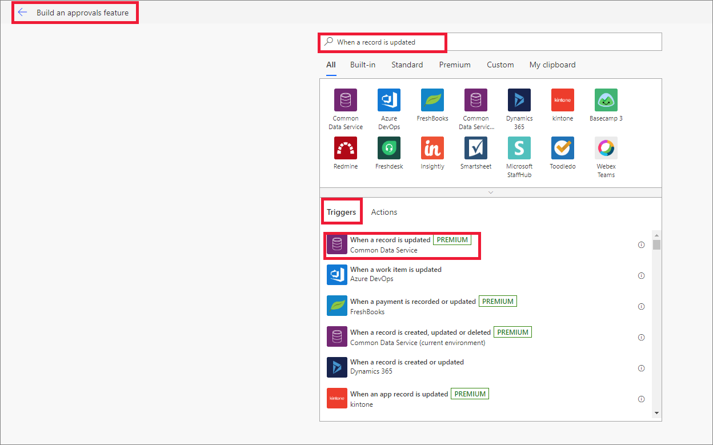

1. Enter the following values in the required fields and select **New step**.
   - Environment: Select the environment.
   - Entity Name: Select the customer journey entity.
   - Scope: Set the scope to Organization.

1. In the **Choose an action** step, search for **Common Data Service** and select **Condition** from the **Actions** tab.

   
    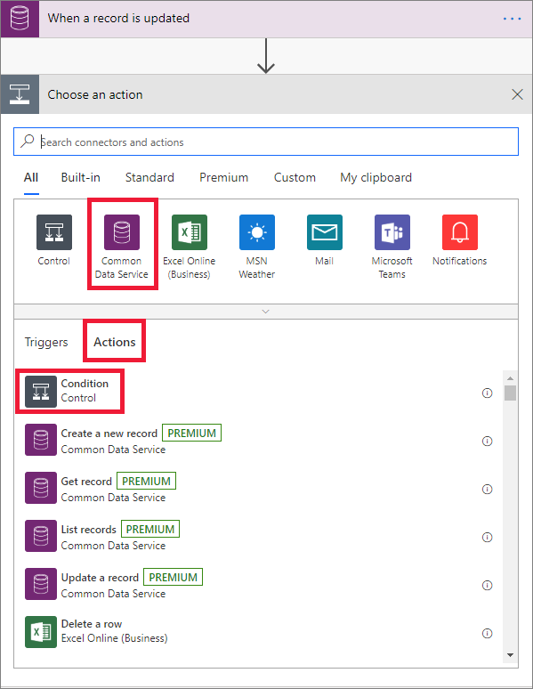

1. In the **Condition** section, enter the condition parameters as shown here.

   > [!NOTE]
   > The value of the Approval requested should be entered in the value parameter.

    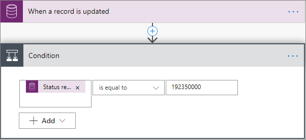

1. Select **Add an action** in the **If yes** tab, search for **approvals**, and then select **Start and wait for an approval** from the list.

    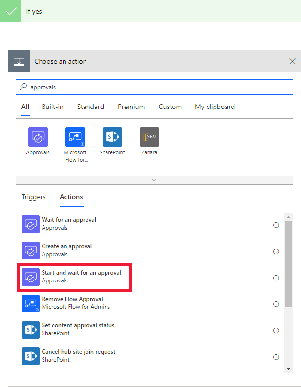

1. In the **Start and wait for an approval** tab, select **Approve/Reject - First to respond** for **Approval type**. Then enter the following details:
   - Title: Enter a title of your choice.
   - Assigned to: Enter the email address of the approver. 
     
      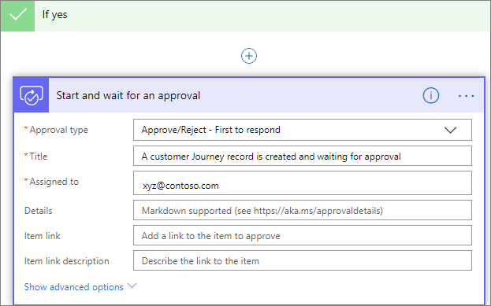

1. Select **Add an action** to add one more action to the **Start and wait for an approval** tab, select **Condition** from the **Actions** tab.

1. Enter the condition parameter values as shown below.

   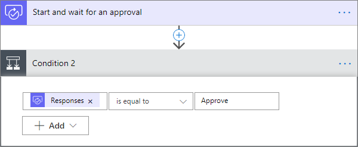

1. Select **Add an action** in the **If yes** tab, select **Common Data Service**, and then select **Update a record**.

    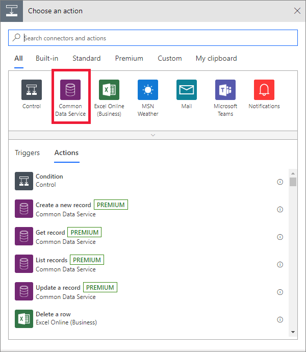

1. Enter the details as shown here:

    - Environment: Select the environment. It should be the same as the one you selected earlier.
    - Entity Name: Select customer journey entity from the list.
    - Record identifier: Set the customer journey ID.
    - Select **Show advanced options** and set the Status reason value to **Approved**.
      
       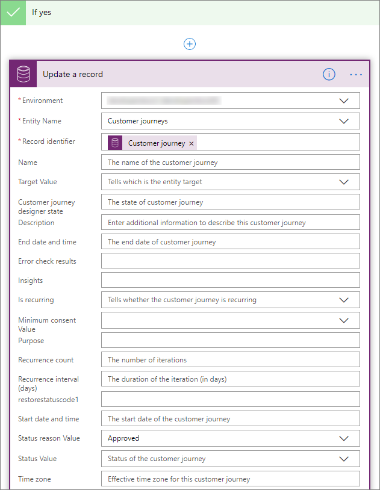

1. In the **If no** tab, select **Add an action**, select **Common Data Service**, and then select **Get record** from **Actions** tab.

    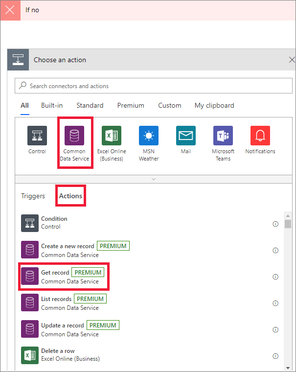

1. Enter the details in the required fields as shown below.

    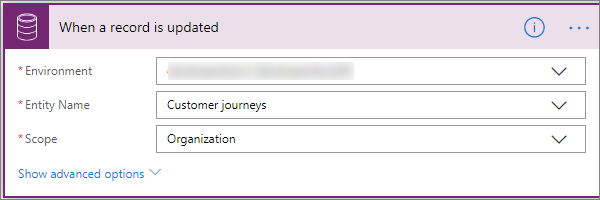

1. Select **Add an action**, select **Common Data Service**, and then select **Update a record** from the **Actions** tab.

    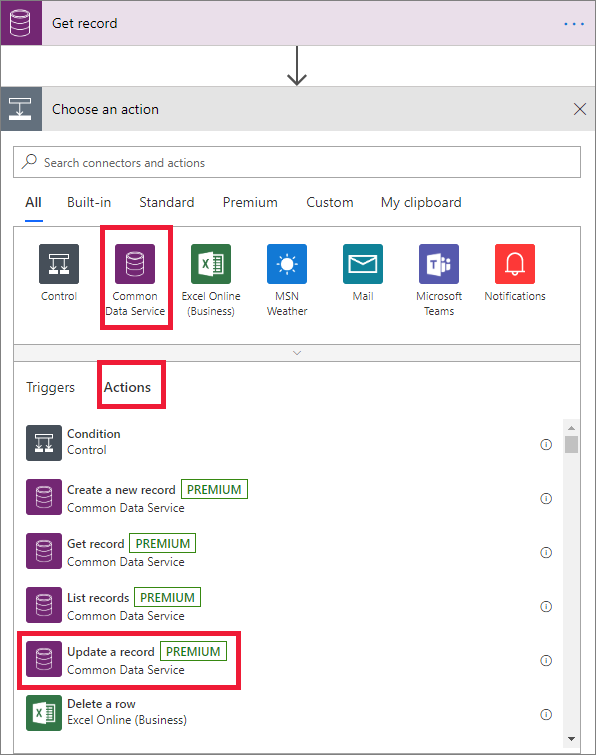

1. Enter the values as shown below.

    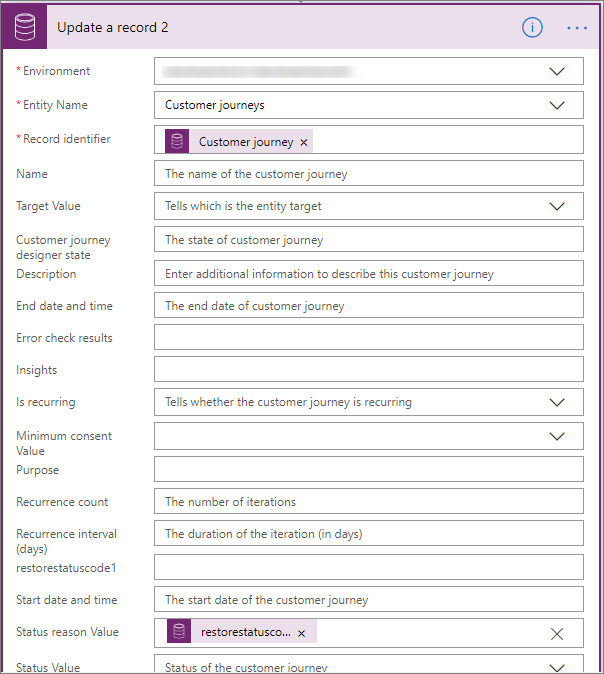

1. Select **Save** and then select **Flow Checker** to verify if there are any errors in the flow.

## See also
[Build an approvals feature](marketing-approvals-feature.md)

[!INCLUDE[footer-include](../../includes/footer-banner.md)]