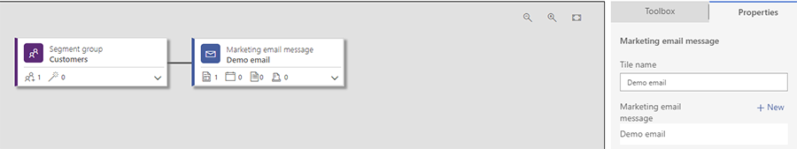
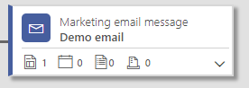
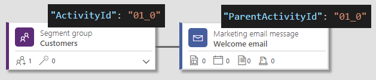
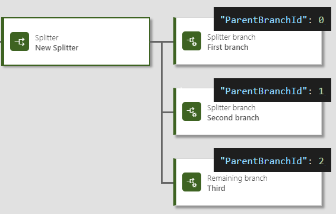
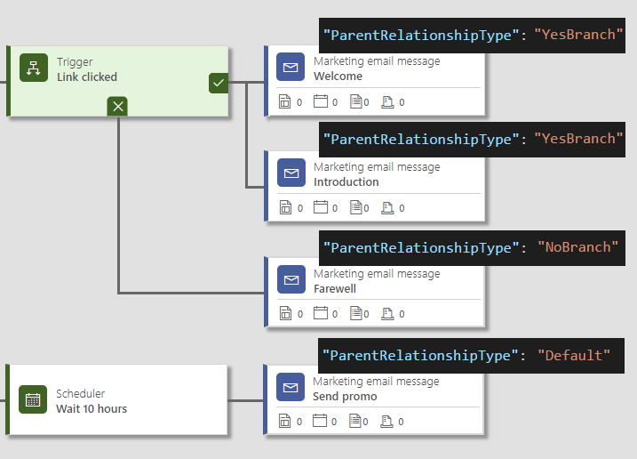
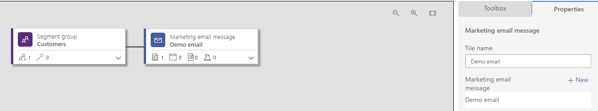

# Customer Journey workflow definition

The Customer Journey design is persisted in JSON format in the **msdyncrm_workflowdefinition** attribute of the **msdyncrm_customerjourney** entity. The JSON serialized customer journey design is called *Customer Journey workflow definition*.  
 
The customer journey designer control on the main form of the Customer Journey entity is data bound to the **msdyncrm_workflowdefinition** field. The customer journey designer can present, edit, serialize, and deserialize workflow design.

This topic explains the basics of the workflow definition schema. After persisting workflow definitions in Dynamics 365, you can use the customer journey main form and customer journey designer to visualize the workflow definition.

## Concepts

### Workflow design

Workflow design is the actual customer journey design, consisting of workflow tiles. A simple customer journey example contains one Segment group and one Marketing email message tile.

  > [!div class="mx-imgBorder"] 
  > 

### Workflow tile

A workflow tile is a node in the workflow design with associated properties—for example, an email tile.

   > [!div class="mx-imgBorder"] 
   > 

### Nested workflow tile

A nested workflow tile is a tile with associated properties, which is nested inside a workflow tile—for example, a Marketing page nested inside a Marketing email message tile.

   > [!div class="mx-imgBorder"] 
   > 

### Workflow definition

A workflow definition is a JSON serialized workflow design, represented by an array of workflow activities. 

### Workflow activity

A workflow activity is a JSON representation of the workflow tile. Each workflow activity is interpreted as an array of workflow activity items. The first item in the array corresponds to the header tile, and the following items are the nested tiles.
 
A workflow activity object has several important properties, shown in the following table.

|Property|Type|Description|
|------|-------|--------|
|ActivityId|String|The identifier of workflow activity. Must be unique in the scope of the workflow definition of the current customer journey.|
|ParentActivityId|String|The identifier of parent workflow activity (the value of the **ActivityId** of the parent activity). The following example demonstrates how to declare parent-child relationship between workflow activities using **ActivityId** and **ParentActivityId**<br /> |
|ActivityTypeId|String|The type of workflow activity. It has the following values<br />**bpf_root**: The hidden root of the workflow definition<br />**Email**: Marketing email message<br />**LandingPage**: Marketing page<br /> **Event**: Event<br /> **CreateCrmActivity**: Activity<br /> **InvokeWorkflow**: Launch workflow<br /> **CreateLead**: Create lead<br />**Scheduler**: Scheduler<br /> **Trigger**: Trigger<br /> **Splitter**: Splitter<br /> **SplitterBranch**: Splitter branch<br />**Segment**: Segment group<br />**Survey**: Survey<br /> **RecordUpdate**: Record updated<br />**LinkedInCampaign**: LinkedIn campaign<br /> **MarketingForm**: Marketing form<br />|
|ParentBranchId|Number|0-based sequential position of a child tile among its siblings (for example, when parallel flows or multiple Splitter branches are used).<br /> |
|ParentRelationshipType|String|Defines the relationship type of a workflow activity with its parent. It has the following values<br />**yesBranch**: If the parent workflow activity is a trigger tile, this value denotes the positive branch of the trigger.<br />**noBranch**: If the parent workflow activity is a trigger tile, this value denotes the negative branch of the trigger.<br /> **default**: Default value, used when the parent is any workflow activity other than the trigger activity. This value is not valid for the trigger.<br />The following example demonstrates how the **ParentRelationshipType** property is used to denote the positive and negative flows for a trigger.<br />|
|EntityTarget||Defines the target of the activity. It has the following values<br /> **contact**: For contact-based customer journey<br />**account**: For account-based customer journey|
|Properties|Object|Defines the properties of the current workflow tile and nested tiles. Contains a single property, **Items**, which holds an array of workflow activity item objects.|
 
### Workflow activity item

A workflow activity item defines the properties of a single item within the workflow activity (title, description, related marketing email record, or trigger condition). The properties of the workflow item object differ from the workflow item type, but there are some common properties.

   > [!div class="mx-imgBorder"] 
   > 


|Property|Type|Description|
|------|-------|--------|
|ActivityTypeId|String|The item type. In the case of the header item (at index 0 in the Items collection containing workflow activity), this is equal to the **ActivityTypeId** property of the containing workflow activity. Otherwise, the following values should be used:<br />**SegmentItem**: Segment item participating in the definition of the segment group<br />**LandingPage**: Marketing page nested in the Marketing email message<br />**Event**: Event nested in the Marketing email message<br />**Survey**: Survey nested in the Marketing email message<br />**MarketingForm**: Marketing form nested in the Marketing email message|
|ItemId|String|In the case of an activity that refers to a record using lookup (for example, a Marketing email message), this property holds the record ID of the referenced entity record.|
|Name|String|The value of **Title name** property|
|IsNameSystemDefined|Boolean|If set to true, changing the selection in the customer journey designer updates the **Title name** property. If set to false, the customer journey designer treats the **Title name** as user specified.|
|ActivityItemId|Number|Workflow activity item identifier. Must be unique in the scope of the entire workflow definition of the current customer journey.|
|Description|String|The value of the **Description** property.|
|Title|String|Unused; set it to **Undefined**.| 

### Example

The following example shows how to define a simple customer journey design with a segment group and a Marketing email message:

1. Create a segment group with the following properties:

   - Segment group
   - Direct child of root 
   - Title name: **Customers**
   - Segment merge logic: **Union**
   - One segment with:
      - Title name: **Demo segment**
      - Segment record ID: 51d2115b-544a-e911-a873-000d3a1fe344; internal name: Demo_segment_09c58544

2. Create a Marketing email message with the following properties:

     - Direct child of the segment **Customers**
     - Title name: **Demo email**
     - Marketing email record ID: 184e5a1a-464a-e911-a873-000d3a1fe344
     - Nested marketing page with
     - Title name: **Demo page**
     - Marketing page record ID: 46dece00-464a-e911-a873-000d3a1fe344


The following shows how the preceding example is represented in a customer journey workflow definition:

```JSON
[ 
    { 
        "ActivityTypeId": "bpf_root", 
        "ParentBranchId": 0, 
        "ParentRelationshipType": "Default", 
        "ActivityId": "01", 
        "Properties": { 
            "Items": [ 
                { 
                    "ItemId": null, 
                    "ActivityTypeId": "bpf_root", 
                    "Title": "Undefined", 
                    "IsNameSystemDefined": true, 
                    "Name": "New ActivityTypeName_bpf_root_TitleText", 
                    "ActivityItemId": 0 
                } 
            ] 
        } 
    }, 
    { 
        "ActivityTypeId": "Segment", 
        "ParentActivityId": "01", 
        "ParentBranchId": 0, 
        "ParentRelationshipType": "Default", 
        "ActivityId": "01_0", 
        "Properties": { 
            "Items": [ 
                { 
                    "ItemId": null, 
                    "ActivityTypeId": "Segment", 
                    "Title": "Undefined", 
                    "IsNameSystemDefined": false, 
                    "Name": "Customers", 
                    "ActivityItemId": 23, 
                    "SegmentMergeMethod": "Union", 
                    "Description": "" 
                }, 
                { 
                    "ItemId": "51d2115b-544a-e911-a873-000d3a1fe344", 
                    "ActivityTypeId": "SegmentItem", 
                    "Title": "Undefined", 
                    "IsNameSystemDefined": false, 
                    "Name": "Demo segment", 
                    "ActivityItemId": 24, 
                    "ContainmentMethod": "Inclusion", 
                    "SegmentSourceType": "Segment", 
                    "Description": "", 
                    "DciSegmentName": "Demo_segment_09c58544", 
                    "SegmentDisplayName": "Demo segment" 
                } 
            ] 
        }, 
        "EntityTarget": "contact" 
    }, 
    { 
        "ActivityTypeId": "Email", 
        "ParentActivityId": "01_0", 
        "ParentBranchId": 0, 
        "ParentRelationshipType": "Default", 
        "ActivityId": "01_0_3", 
        "Properties": { 
            "Items": [ 
                { 
                    "ItemId": "184e5a1a-464a-e911-a873-000d3a1fe344", 
                    "ActivityTypeId": "Email", 
                    "Title": "Undefined", 
                    "IsNameSystemDefined": true, 
                    "Name": "Demo email", 
                    "ActivityItemId": 36, 
                    "Description": "" 
                }, 
                { 
                    "ItemId": "46dece00-464a-e911-a873-000d3a1fe344", 
                    "ActivityTypeId": "LandingPage", 
                    "Title": "Undefined", 
                    "IsNameSystemDefined": true, 
                    "Name": "Demo page", 
                    "ActivityItemId": 51, 
                    "Description": "" 
                } 
            ] 
        }, 
        "EntityTarget": "contact" 
    } 
]
```

### See also

[Extend customer journey using API](basic-operations-on-customer-journey.md)<br />
[Extend customer journey using code](extend-customer-journey-using-code.md)


[!INCLUDE[footer-include](../../includes/footer-banner.md)]