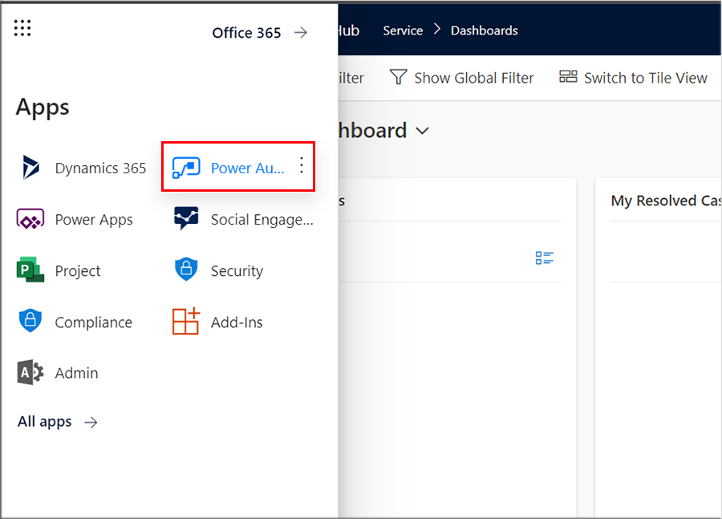
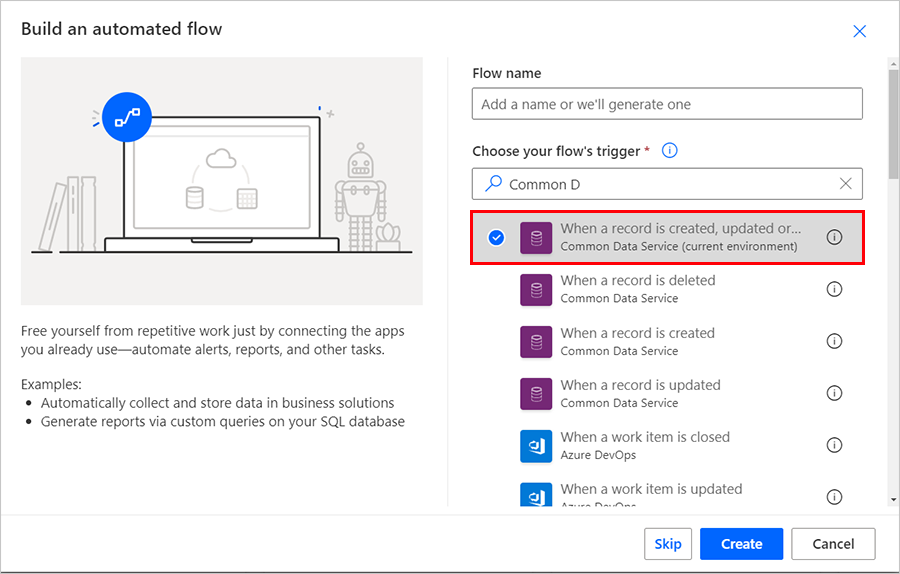
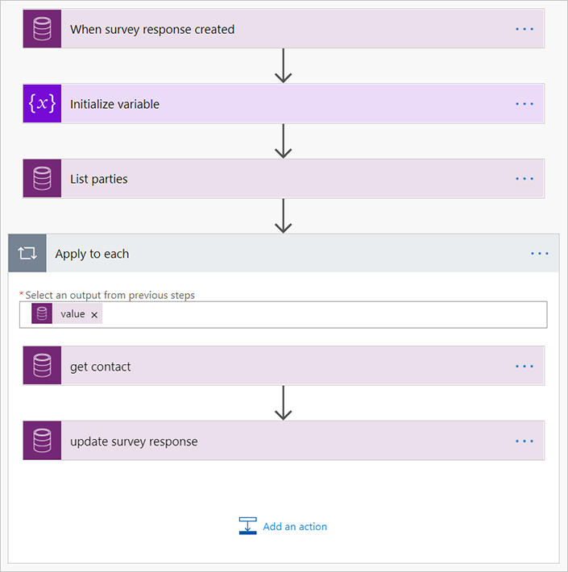
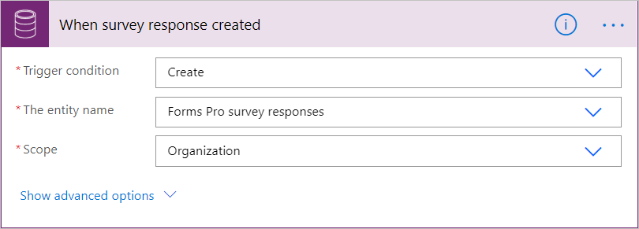
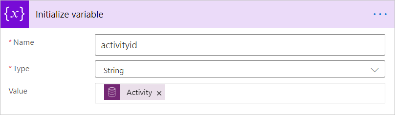
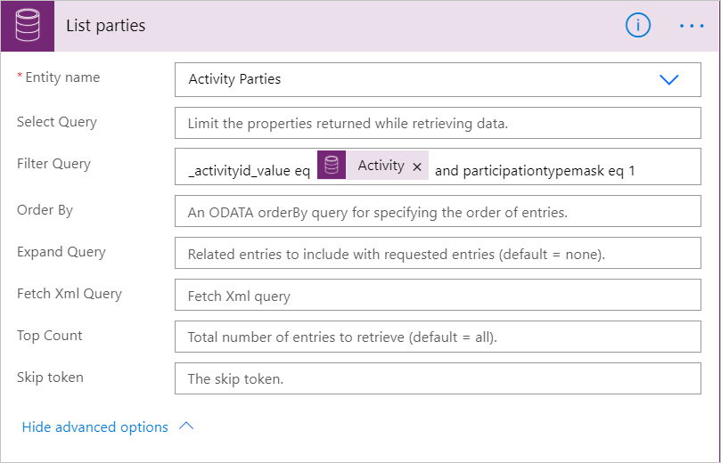
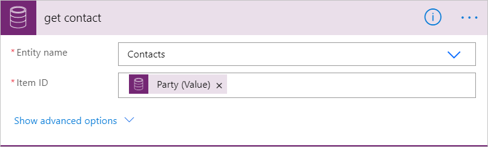
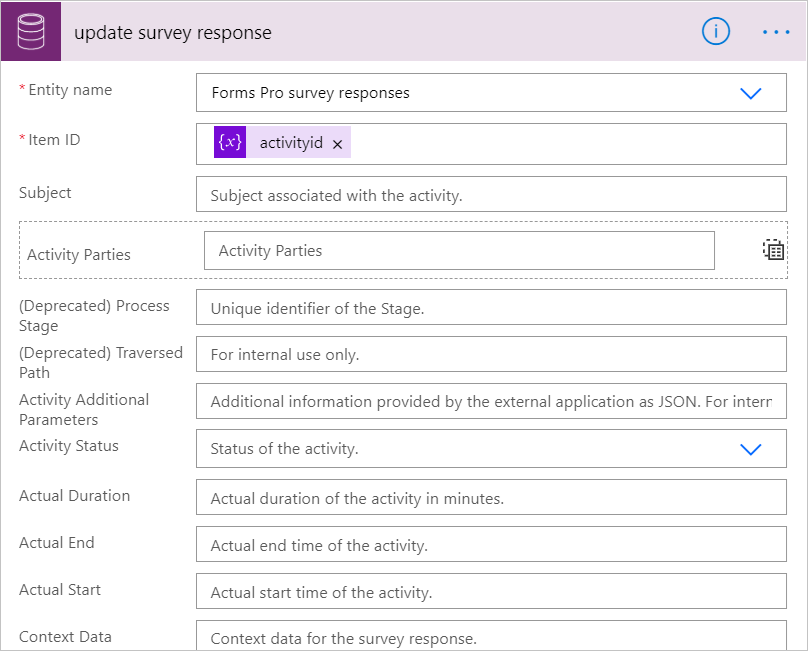

# Attach names and emails to Customer Voice surveys sent from Dynamics 365 Marketing

When a [Customer Voice](customer-voice.md) survey is sent from Dynamics 365 Marketing, the survey responses always return as anonymous. The responses do not include names or email addresses. This is a known limitation of Marketing's functionality with Customer Voice. To address this issue, we have created the two part workaround detailed below.

> [!NOTE]
> Standalone Customer Voice surveys function as expected, returning names and email addresses when a survey is filled out. The steps below only apply to Customer Voice surveys sent from Dynamics 365 Marketing.

## Step 1: Create a Power Automate flow to populate respondent names and email addresses

1. In the Dynamics 365 navigation menu, go to the **Power Automate** app.

    

1. In Power Automate, create a new **Automated flow**.

1. Under **Choose your flow's trigger**, select the **When a record is created, updated or deleted** Common Data Service connector.

    

    > [!NOTE]
    > Ensure that you are connected to the same environment as the CDS org.

1. Your flow should look like the image below.

    

1. For each title, select the three dots on the right side and set the "peek code" as follows:

    - **When survey response created**:

        ```{ "inputs": { "host": { "connectionName": "shared_commondataserviceforapps", "operationId": "SubscribeWebhookTrigger", "apiId": "/providers/Microsoft.PowerApps/apis/shared_commondataserviceforapps" }, "parameters": { "subscriptionRequest/message": 1, "subscriptionRequest/entityname": "msfp_surveyresponse", "subscriptionRequest/scope": 4 }, "authentication": "@parameters('$authentication')" } }```

        

    - **Initialize variable**:
        
        ```{ "inputs": { "variables": [ { "name": "activityid", "type": "string", "value": "@triggerOutputs()?['body/activityid']" } ] } }```

        

    - **List parties**:
        
        ```{ "inputs": { "host": { "connectionName": "shared_commondataserviceforapps", "operationId": "ListRecords", "apiId": "/providers/Microsoft.PowerApps/apis/shared_commondataserviceforapps" }, "parameters": { "entityName": "activityparties", "$filter": "_activityid_value eq @{triggerOutputs()?['body/activityid']} and participationtypemask eq 1" }, "authentication": "@parameters('$authentication')" } }```

        

    - **get contact**:
        
        ```{ "inputs": { "host": { "connectionName": "shared_commondataserviceforapps", "operationId": "GetItem", "apiId": "/providers/Microsoft.PowerApps/apis/shared_commondataserviceforapps" }, "parameters": { "entityName": "contacts", "recordId": "@items('Apply_to_each')?['_partyid_value']" }, "authentication": "@parameters('$authentication')" } }```

        

    - **update survey response**:
        
        ```{ "inputs": { "host": { "connectionName": "shared_commondataserviceforapps", "operationId": "UpdateRecord", "apiId": "/providers/Microsoft.PowerApps/apis/shared_commondataserviceforapps" }, "parameters": { "entityName": "msfp_surveyresponses", "recordId": "@variables('activityid')", "item/msfp_respondent": "@outputs('get_contact')?['body/fullname']", "item/msfp_respondentemailaddress": "@outputs('get_contact')?['body/emailaddress1']" }, "authentication": "@parameters('$authentication')" } }```

        

## Step 2: In the Customer Voice app, export named responses to Microsoft Excel

Customer Voice includes the capability to export survey responses to Excel. The export to Excel feature uses CDS information to join and pull the contact record information for Marketing integration customers, making it available in Excel.

To export survey data from Customer Voice to Excel:

1. Enter the following URL into your browser, replacing the value for {surveyid} with the ID of your chosen survey:

    ```https://forms.office.com/FormsPro/Pages/DesignPage.aspx?experienceType=Pro#Analysis=true&FormId={suveyid}```

1. After the page loads, select the **Responses** tile.

1. To export the response data, select **Export all**.

### See also

[Use Dynamics 365 Customer Voice surveys with Dynamics 365 Marketing](customer-voice.md)  