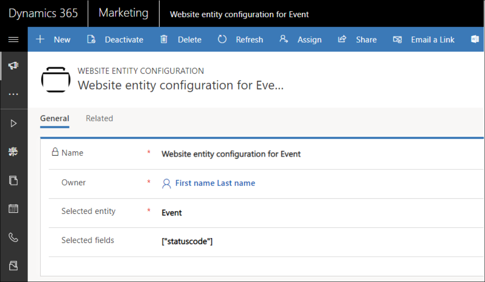

# Customize the response from the Events API

The Events API allows you to expose custom fields of event management entities. That means you can access all those fields that have been added to an entity by the customer.

By default, when adding a new field to an entity (for example: `msevtmgt_pass`), it is not exposed by the corresponding API endpoint (for example: `api/v2.0/events/{readableEventId}/passes`). 

However, it is possible to expose the new field in the Events API by creating a so-called *website entity configuration*. 

To create a new website entity configuration: 

1. Open your Dynamics 365 Marketing instance. 
2. Go to **Dynamics 365** > **Marketing** > **Settings** > **Website Entity Configurations**. 
3. Enter a name of your choice in the `Name` field. 
4. Select the entity for which you would like to expose an extra field in the `Selected Entity` field. 
5. Write a JSON array that contains the new custom field that should be visible through the API in the Selected fields. This exposes the new custom field through the Events API.

> [!div class="mx-imgBorder"]
> 

**Example**

```
[“statuscode”, “my_custom_field”]
```

## See also
[Using Events API](using-events-api.md)<br />
[User authentication using Events API](user-authentication-events-api.md)


[!INCLUDE[footer-include](../../includes/footer-banner.md)]