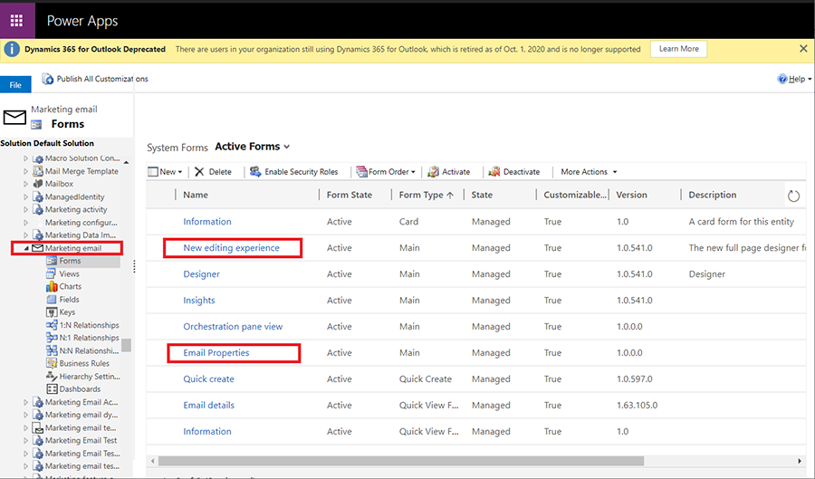
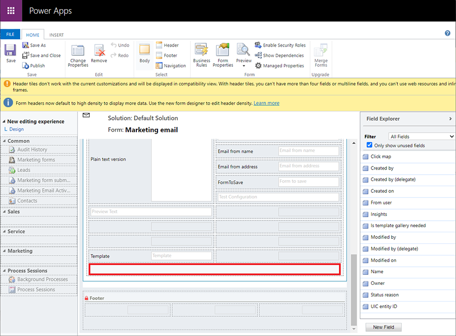

# Customize the email designer

The latest [email editor](../email-design.md) improves the design process by providing more screen real estate for the design canvas. You can further tailor the email designer to suit your needs by providing your own customizations.

To customize the email designer:

1. Open the **Settings** menu  at the top of the Marketing app window and select **Advanced settings**. The advanced-settings area then opens in a new browser tab. Note that this area uses a horizontal navigator at the top of the page instead of a side navigator.
1. Navigate to **Settings** > **Customization** > **Customizations** and then choose **Customize the System** from the **Customization** page.
1. A **Power Apps** customization pop-up window opens. Use the left panel to navigate to **Components** > **Entities** > **Marketing email** > **Forms**.
1. On the **Forms** page, locate the **Email properties** and **New editing experience** forms.
    > [!div class="mx-imgBorder"]
    > 
1. Open the **Email properties** form. You can customize the form as you would any CRM form. You can add or hide new fields and sections, change the order of the fields, or put extra logic in the Webresource handlers.
    > [!div class="mx-imgBorder"]
    > 
1. Select **Save**.
1. Because the **Email properties** form is working in the context of the main form (**New editing experience**), you must add **new** attributes to the **New editing experience** form in order for the customizations to take effect. To add new attributes to the main form, open the **New editing experience** form and add any new attributes at the end. The attributes won't be visible to users.
    > [!div class="mx-imgBorder"]
    > 

    > [!IMPORTANT]
    > The first field in the **New editing experience** form is reserved for the email editor. Adding any field before the first field will break the user experience.
1. Select **Save**, then **Publish** your changes.