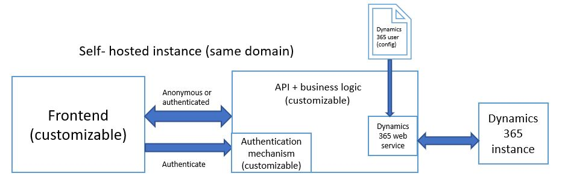

# Build and host a custom event portal

The Dynamics 365 Event Management feature helps you to organize, manage and process the events. When you install the Event Management solution, you will get an **Event Portal** which gives the users a web application where they can know more about the event details. More information: [Event Portal](https://docs.microsoft.com/en-us/dynamics365/customer-engagement/marketing/set-up-event-portal).

The Event Management web application consists of two parts:
- Angular frontend
- REST API backend

The frontend part is a single page application which is created using [Angular](https://angular.io) framework. The frontend part of the web application is fully customizable. Backend and customizability of the backend depends on hosting type.

There are two ways in which the Event Management web application can be hosted.
- [Dynamics 365 Portal hosted](#dynamics-365-portal-hosted)
- [Self-hosted](#self-hosted)

## Dynamics 365 Portal hosted
Event Management web application comes as a Dynamics 365 Portal hosted web when you install the Event Management solution.

The frontend part of the application is bundled into two resource files that are stored as Dynamics 365 Portal web files, and the main single page application entry-point is stored as Dynamics 365 Portal web template. More information [web files](https://docs.microsoft.com/en-us/dynamics365/customer-engagement/portals/web-files) and [web templates](https://docs.microsoft.com/en-us/dynamics365/customer-engagement/portals/store-content-web-templates).

Although, the frontend definition is hosted on Dynamics 365 Portal, you can still fully customize it. The backend part of the web application is not customizable since the **REST API** endpoints are hosted on Dynamics 365 Portal as a set of [web pages](https://docs.microsoft.com/en-us/dynamics365/customer-engagement/portals/web-page), and the code containing the business logic behind it resides in Event Management plugins which is not customizable.

### Developing and customizing the web application on Dynamics 365 Portal hosted backend

To develop and customize the frontend part of the web application:

1. Download the [Source code](https://go.microsoft.com/fwlink/?linkid=2020107).
1. Install [Node](https://nodejs.org/en/download).
1. Open Node cmd (or reopen if you have it opened) and run `Node -v` to check whether the installation is successful or not. More information: [Node](https://nodejs.org/en/about).
1. Run the command `npm install -g @angular/cli` to install Angular command line interface (cli). This is required to build and run the angular app. More information: [Angular](https://angular.io).
1. Go to the directory where you have downloaded the source code and run the command `npm install`to fetch all the necessary packages that are required to run the website.
1. Create a new Chrome shortcut and add `--disable-web-security --user-data-dir="C:\chromeTest"` to bypass the same origin policy.
1. Go to `\src\app\providers\url.providers.ts` in the source code to point the frontend to the correct API endpoint and change the return value in the `baseURL()` method to your API. You need to add a trailing slash at the end of the url.
1. Bypass anti-CSRF token for local development. To do that, you need to go to **Portals > Web Templates** and open the **PortalAPI** web template and flip the flag `bypassTokenVerification` to `true`. 
1. Restart the Dynamics 365 Portal website to see the changes.

> [!NOTE]
> The **PortalAPI** web template is added by default when you install the Event Management data.

- Run the command `ng serve` from your working directory to build the website and open the website url in the chrome instance with the shortcut you have created.

After the website is successfully built, your output files will show up in `/dist/ClientApp` directory. You need to replace the files hosted under portals. You don’t need to change all the files, usually main.js and styles.css files are enough, but it is always good to use some kind of source control tool to track the changes. 

To replace the files in Dynamics 365, follow the steps below:

1.	Open your Dynamics 365 instance.
2.	Navigate to **Portals** and click on **Web Files**.
3.	Open the web file `style.css` .
4.	Scroll down to **Notes** section and delete the existing attachment. 
5.	Upload your `style.css` file as attachment. 
6.  Now, open the web file `main.js` and scroll down to **Notes** section and delete the existing attachment.
7.  Rename your `main.js` to `main.es` and upload the file as attachment.
9.	Restart the portal website and reopen your browser.

## Self-hosted
The advantage of self-hosted backend is that you have more freedom with the customization, implement the backend with the technology of  your choice. 

You can use the demo frontend but you will need to implement and host the backend part, either using the existing data contract we have declared on the frontend, or define your own contract and modify the frontend accordingly.

For the backend to communicate with your Dynamics 365 instance, you need to take care of the Dynamics 365 authentication and use the Dynamics 365 webservices. You need to implement the authentication mechanism by yourself, depending on the technology you have selected for the backend. If you want event registration to be linked to the appropriate user who created it, make sure that you create the Dynamics 365 contact for every new website user. 

Dynamics 365 authentication and web application authentication are two different things. In the first case we are talking about Dynamics 365 user that backend needs to consume Dynamics 365 web API, and in second case we are talking about the  `local` website users, that you don’t strictly need to have. It is always a good practice to host both frontend and backend on the same domain to comply to same-origin policy. 

### Developing and Customizing web application on self-hosted backend

To develop and customize the frontend part of the web application:

1. Download the [Source code](https://go.microsoft.com/fwlink/?linkid=2020107).
1. Install [Node](https://nodejs.org/en/download).
1. Open Node cmd (or reopen if you have it opened) and run `Node -v` to check whether the installation is successful or not. More information: [Node](https://nodejs.org/en/about).
1. Run the command `npm install -g @angular/cli` to install Angular command line interface (cli). This is required to build and run the angular application. More information: [Angular](https://angular.io).
1. Go to the directory where you have downloaded the source code and run the command `npm install`to fetch all the necessary packages that are required to run the website.
1. Create a new Chrome shortcut and add `--disable-web-security --user-data-dir="C:\chromeTest"` to bypass the same origin policy.
1. Go to `\src\app\providers\url.providers.ts` in the source code to point the frontend to the correct API endpoint and change the return value in the `baseURL()` method to your API. You need to add the trailing slash at the end of the url.
1. Run the command `ng serve` from your working directory to build the website and open the website url in the chrome instance with the shortcut you have created.

After the website is build successfully, the output files will show up in `/dist/ClientApp`. You need to copy those files to the root directory of your web server, replacing the existing ones.

## Building and deploying website

let's make some simple changes on the website that you have created. 
- Go to `\src\app\components\home\home.component.html` to add extra paragraph or content that describes the event details or about the event.
- You can change or add styling to the website by editing the `home.component.css` file in `\src\app\components\home\home.component.css`.
- After you make necessary changes, run the command `ng build --prod --output-hashing none` to build and deploy the latest changes for self-hosted backend.
- Run the command `BuildForPortalHosting.ps script`, if you are using Dynamics 365 Portal hosted backend.

> [!NOTE]
> For extensive customization of the frontend you need to be familiar with the [Angular framework](https://angular.io/guide/quickstart).

## Considerations for self-hosted website 
There are some specifics that should be considered when you self-host your web application in contrast to Dynamics 365 Portal hosted.

- If you prefer to implement backend using **.NET Core** technology, you need to set up **IIS** to work with **.NET Core**. More information: [Set up IIS](https://docs.microsoft.com/en-us/aspnet/core/host-and-deploy/iis/?view=aspnetcore-2.1&tabs=aspnetcore2x) 
- Self-hosted type doesn’t have captcha and it’s up to you to implement your own captcha, whereas Dynamics 365 Portal hosted type uses **Microsoft HIP** captcha  
- Portal hosted version supports localization, and self-hosted version doesn’t. If you want to support the localization you can re-use the mechanism that portal hosted version has, you just have to implement the API endpoint to return the JSON containing labels. There is an Angular directive already in place that utilizes that endpoint to get the localized content and overwrite appropriate HTML elements with translated text.

