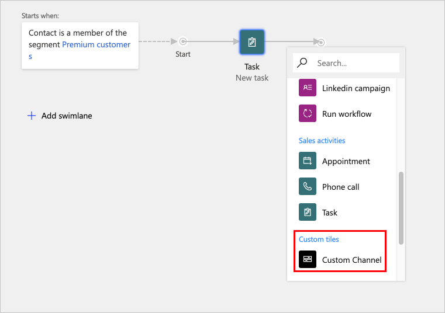

# Extend customer journeys using custom channels

Customer journey orchestration in Dynamics 365 Marketing lets marketers create multi-step, multi-channel marketing campaigns that target a specific segment, deliver marketing email messages, respond to contact interactions, launch workflows, and more. More information: [Use customer journeys to create automated campaigns](../../marketing/customer-journeys-create-automated-campaigns.md)

Customer journeys are built by adding tiles from the in-place menu on the designer canvas to build the journey execution flow. Beyond the [out-of-the box tiles](../../marketing/customer-journey-tiles-reference.md) provided for customer journeys, partners can create **custom channels** to extend the marketing capabilities in Dynamics 365 Marketing. 

You can create a custom channel, such as text (SMS) or social media, and expose the channel as a “tile” in the journey designer and make it accessible from the in-place menu on the canvas under the "Custom tiles" category. These custom channels provide similar capabilities to the out-of-the box channels, including sending communication, tracking customer interactions, and adding if/then conditions to branch the paths within a customer journey.     
  
### See also

[Customer journey tiles reference](../../marketing/customer-journey-tiles-reference.md)
  
[Marketing Help & Training](../../marketing/help-hub.md)   

[!INCLUDE[footer-include](../../includes/footer-banner.md)]