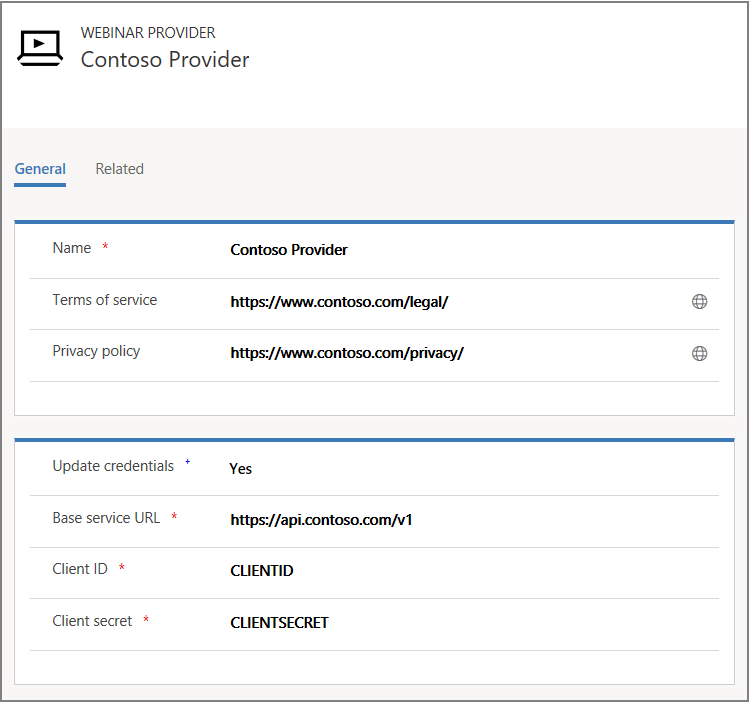

# Preview: Connect event management to third-party webinar providers

[!INCLUDE [cc-beta-prerelease-disclaimer](../../includes/cc-beta-prerelease-disclaimer.md)]

[On24](https://www.on24.com/) is the only webinar provider currently supported out-of-the-box for use with Dynamics 365 Marketing to plan and manage events. More information: [Event settings](../events-settings.md)

Other webinar providers can implement the new Webinar Extension API to become a supported webinar provider for Dynamics 365 Marketing, just like On24. Once a webinar provider implements the API on their webinar service, the webinar provider can be configured in Dynamics 365 Marketing to use their webinar service for event management.

> [!IMPORTANT]
> - [!INCLUDE[cc_preview_features_definition](../../includes/cc-preview-features-definition.md)]
> - [!INCLUDE[cc_preview_features_expect_changes](../../includes/cc-preview-features-expect-changes.md)]  
> - [!INCLUDE[cc_preview_features_no_MS_support](../../includes/cc-preview-features-no-ms-support.md)]

## Prerequisites

The webinar provider must create a service that implements the Webinar Extension API so that it can be used as webinar provider in Dynamics 365 Marketing. More information: [Webinar Extension API Reference](#webinar-extension-api-reference)

## Add a webinar provider

When adding a new webinar provider in Dynamics 365 Marketing, you will need to have **Client ID** and **Client secret** values. This information is provided when you sign up for a webinar provider. The authorization of the webinar service to Dynamics 365 Marketing uses OAuth 2.0 standard protocol. More information: [OAuth, Client ID and Client secret](https://www.oauth.com/oauth2-servers/client-registration/client-id-secret/).

To add a new webinar provider:

1. Open **Settings** > **Advanced settings** > **Event management** > **Webinar providers** and select **New**. 
2. Fill in the required fields as shown below. The field **Base service URL** is the URL of the webinar service that implements the API.

> [!NOTE]
> If you want to integrate with existing webinar provider, it isn't enough to just set their API URL as a base URL, because it isn't likely that the webinar provider will have the required API. In this case, you must create your own service to serve as an adapter between event management and the  webinar provider, and then put the base URL for your service in the **Base service URL** field.

## Add a webinar configuration

To create a new webinar configuration, 

1. Open **Settings** > **Advanced Settings** > **Event Management** > **Webinar Configuration**. Here you'll see a list of existing     configurations (if any). To create a new configuration, select **New**.
2. Enter a **Name** that you and others will recognize.
3. Choose the previously created webinar provider. Once you select the webinar provider you will be prompted with a consent message whether you agree the terms of service and privacy policy. 
4. Accept the consent and **Save**.
5. Click on the **Authenticate** button on the ribbon. This button will trigger the authentication flow to the authentication endpoint of the webinar provider with the specified Client ID and Client secret.
6. Login using the **User** created in the pre-requisites, this will trigger the OAuth flow with the provider.

## Webinar Extension API Reference

Download the API reference [here](https://go.microsoft.com/fwlink/?linkid=2006678)

## Webinar configuration authentication flow

This section provides additional details about what happens when a user selects the authenticate button during the webinar configuration flow. This can help you to adjust your provider implementation accordingly.

1. On clicking the ***/auth/authorize*** endpoint on the webinar configuration form, your provider implementation should be called.

1. You should return authorization-form HTML from that call. That HTML will be loaded into the pop-up on the Dynamics 365 Marketing side. One of the parameters passed to the ***/auth/authorize*** endpoint is ***redirect_uri***. You should either embed it in the form HTML that you return or temporarily store it on your side, depending on your implementation. Another parameter is ***state***, you should keep track of that too.

1. After authentication has been done on your side, you should generate one-time code and call the ***redirect_uri*** together with the ***code*** parameter and **state** parameter that you already have. It will look like this: `{redirect_uri}?code={code_you_generated}&state={state_you_got_before}`

1. After you call ***redirect_uri***, we will again call your provider implementation, this time to obtain the bearer token. The ***/auth/token*** endpoint will be called with the following request body:

    - **grant_type**: "authorization_code"
    - **code**: The code you generated in the previous step&mdash;check against it
    - **client_id**: Client ID from the provider that this webinar configuration is using
    - **client_secret**: Client secret from the provider that this webinar configuration is using
    - **refresh_token**: null
    - **redirect_uri**: https://YOUR_ORG/WebResources/msevtmgt_AuthorizationResult.html

   You should now generate the bearer token for us to use and return it from this call.

1. If we get the token, we will mark the configuration as authenticated and use that token in further communication with your provider implementation.
