# Filter cities based on countries using lookup fields and custom entities

> [!IMPORTANT]
> This article refers to outbound marketing forms only.

To make marketing forms easier to navigate, you may want to filter cities based on the country that a user selects. Out-of-the-box form fields don't support this functionality because City (`address1_country`) and Country (`address1_city`) properties are a "single line of text" type. To implement filtering, you'll need to first customize the Contact entity, then leverage lookup fields.

## 1. Create Country and City entities

Before you can use lookup fields, you need to create custom entities that you're going to look up. You'll create two entities: one for Country and one for City.

To create the Country custom entity, go to the top bar in the Marketing app and navigate to **Settings** > **Advanced Settings**. You'll be taken to a page titled Business Management. On this page, select the drop-down next to the word **Settings** in the top menu bar, then go to **Customizations** > **Customize the system**. A new window will open. Expand **Components** and select **New** > **Entity**.

Enter the Display Name, Plural Name, set the Ownership to Organization, and select Marketing in "Areas that display this entity." Next, enable Auditing, Change Tracking, and Enable for Unified Client.

> [!div class="mx-imgBorder"]
> 

On the **Primary Field** tab, leave the Name as the Primary field.

Repeat the above steps for the City entity.

Learn more about creating custom entities: [Create a custom entity](/dynamics365/customerengagement/on-premises/customize/create-entities).

## 2. Add an N:1 relation and lookup field to the City entity that links the Country to the City

To know which City corresponds with which Country, you'll need to establish a relationship between the two entitles. Countries have multiple cities, but each City belongs to only one Country, so you'll use an N:1 relationship on the City entity.

To create the relationship, go back to the **Components** menu, expand the **Entities** section, and navigate to the newly created City entity. Expand the entity by selecting the arrow next to its name then select **N:1 relationships**. A pane will open displaying the relationships for the entity. Select **New Many-to-1 Relationship** from the top menu bar of the pane.

For the primary entity, select Country and enter the Relationship Name, Lookup Field Display Name, and Lookup Field Name.

> [!div class="mx-imgBorder"]
> 

Add the Country lookup field to City's main form.

> [!div class="mx-imgBorder"]
> 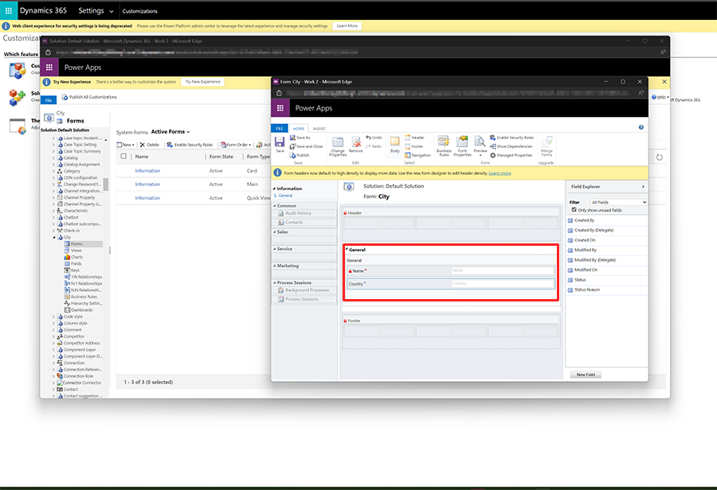

Finally, save and publish the customization.

## 3. Add read permission for the service user

To add a new privilege to an existing role, go back to the main Dynamics 365 Marketing screen, then navigate to **Settings** > **Advanced settings**. You'll be taken to a page titled Business Management. On this page, select the drop-down next to the word **Settings** in the top menu bar, then select **Security**. On the **Security** page, select **Security Roles**.

> [!div class="mx-imgBorder"]
> 

Select the **Marketing Service User Extensible Role**. A new window will open. Select the **Custom Entities** tab and add privileges for the new entities.

> [!div class="mx-imgBorder"]
> 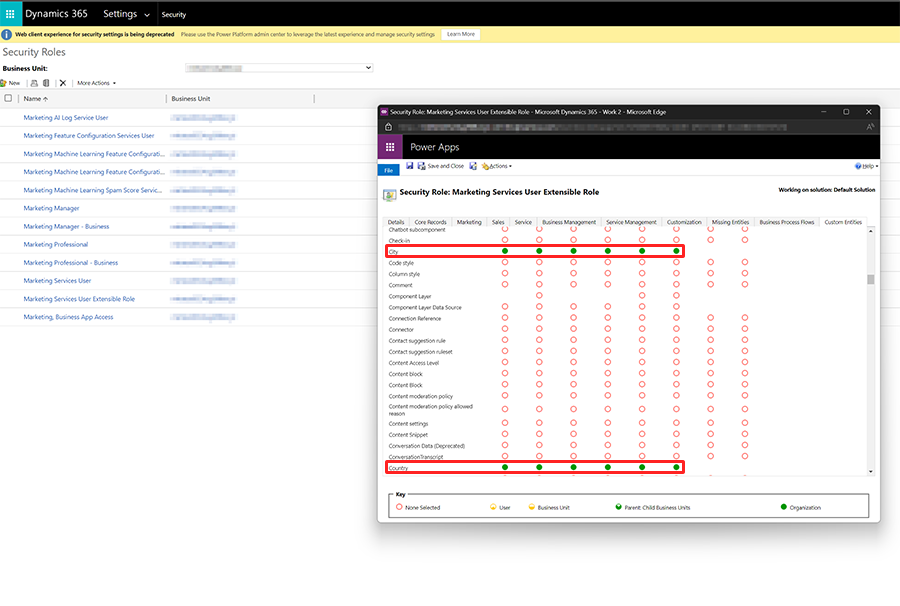

Learn more about adding privileges for the service user: [Adding lookup fields and troubleshooting](/dynamics365/marketing/marketing-fields#adding-lookup-fields-and-troubleshooting).

## 4. Customize the Contact entity to use lookup fields for Country and City

Now that you've set up the custom entities, you'll create lookup fields on the Contact entity so that you can use them instead of text fields.

To start, go back to the main Dynamics 365 Marketing screen, then navigate to **Settings** > **Advanced Settings**. You'll be taken to a page titled Business Management. On this page, select the drop-down next to the word **Settings** in the top menu bar, then go to **Customizations** > **Customize the system**. In the left pane, go to **Components** > **Entities** > **Contact**. Expand the entity by selecting the arrow next to its name then select **Fields**.

Create a new field for the City lookup by selecting the **New** button in the top bar of the pane. Give the field a Display Name and a Name. Choose **Lookup** for Data Type and select the City entity name for Target Record Type.

> [!div class="mx-imgBorder"]
> 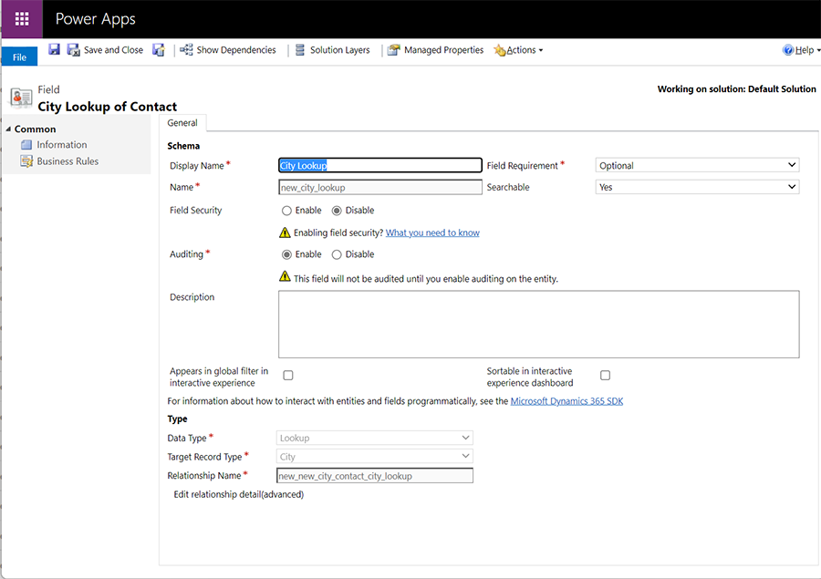

Repeat the same field creation process for the Country lookup.

Next, add the newly created fields to the main Contact form to make them visible in the user interface. In the left pane, go to **Components** > **Entities** > **Contact**. Expand the entity by selecting the arrow next to its name then select **Forms**. Make sure you select the **Contact** form that's described as the "Updated default contact form."

> [!div class="mx-imgBorder"]
> 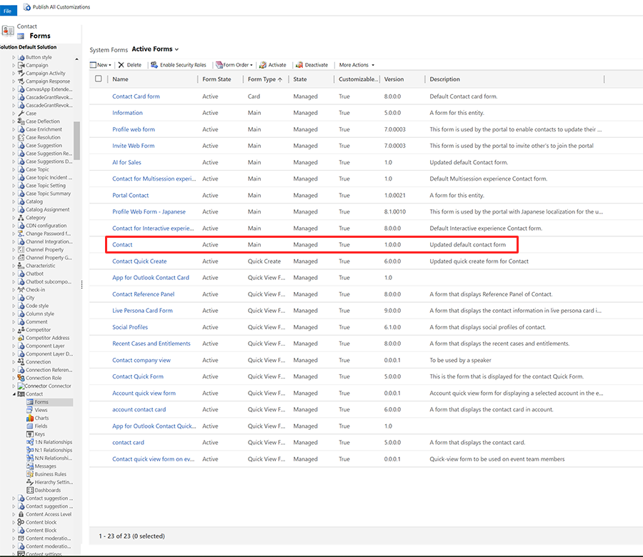

Add the Country and City lookups from the Field Explorer to the Contact form.

> [!div class="mx-imgBorder"]
> 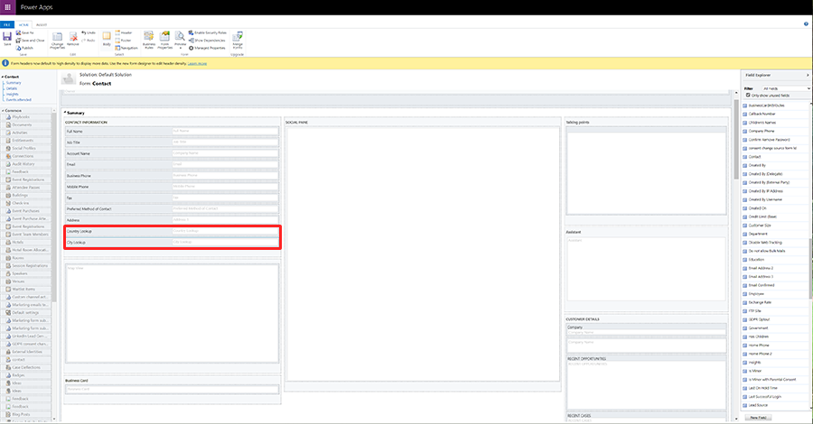

Save and publish the customizations.

## 5. Add City and Country to the sidebar

Now, you'll need to create City and Country records that will be used in your forms.

But before you can do that, you'll need to add a way to navigate to the new entities from the Marketing app. To do so, go back to the main Dynamics 365 Marketing screen. Select **Marketing** on the top left of the page to open the **Apps** window. Then select the three dots on the Marketing app tile and select **Open in App Designer**.

> [!div class="mx-imgBorder"]
> 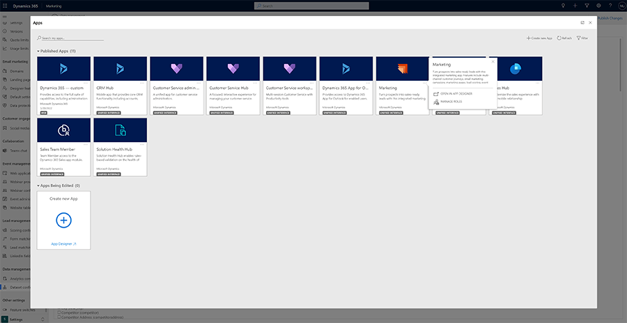

Add the new City and Country entities by navigating to **Components** > **Artifacts** > **Entities**.

> [!div class="mx-imgBorder"]
> 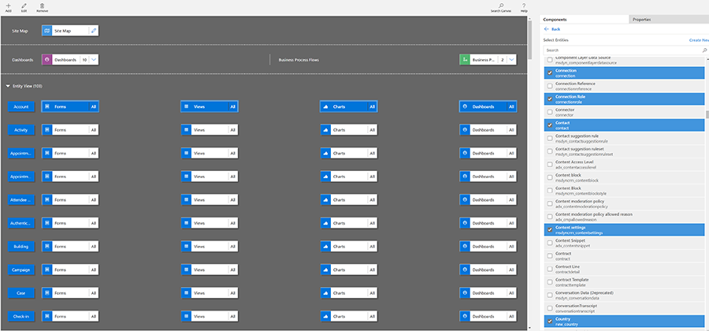

Next, you'll add the entities to the site map. To edit the site map, select the pencil next to the site map at the top. Add a new group called **Lookups**.

> [!div class="mx-imgBorder"]
> 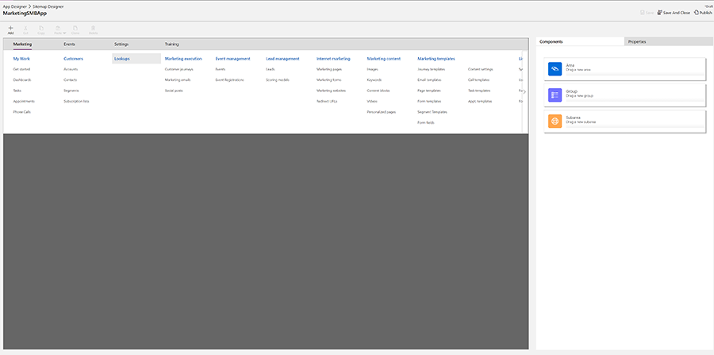

Add entity sub areas for City and Country.

> [!div class="mx-imgBorder"]
> 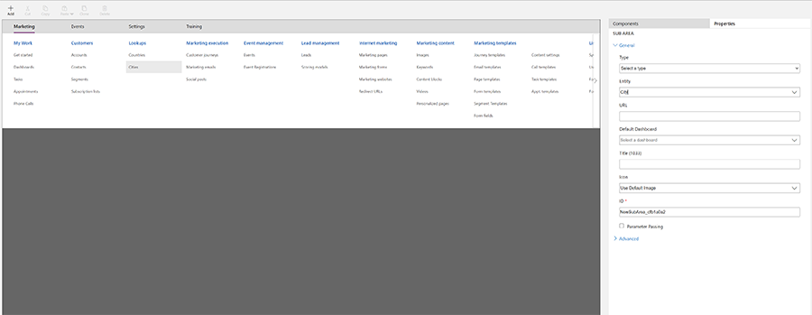

To finish, select **Save**, then **Publish**, and the **Play**.

## 6. Create the countries and cities

Now, you're all set with customizations and you can create a marketing form that filters cities based on country.

To do this, first, create the country and city data. In the Marketing app, navigate to **Lookups** > **Countries**. Add your desire countries by selecting **+New** and entering one country name per record.

Repeat this process for cities by going to **Lookups** > **Cities**, entering the city name, then selecting the appropriate country from the search.

> [!div class="mx-imgBorder"]
> 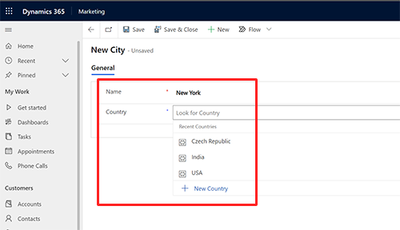

You'll end up with a list of active countries and a list of active cities.

> [!div class="mx-imgBorder"]
> 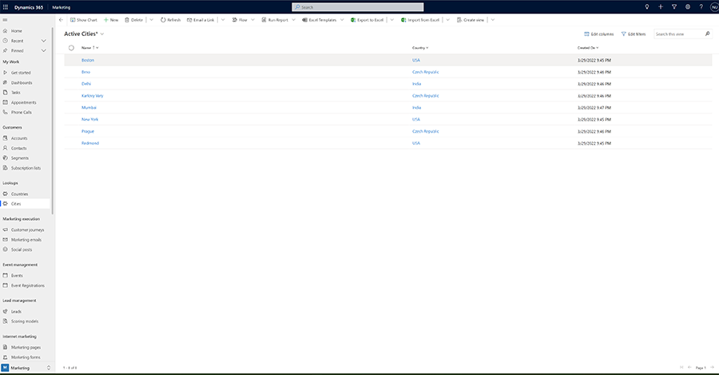

## 7. Create lookup form fields for City and Country

To use the lookup properties in your marketing forms, you need to create lookup form fields. You can remove existing city and country fields if you aren't planning to use out-of-the-box text fields.

To create the form fields, go to **Marketing templates** > **Form fields** and select **+New** on the top bar.

For the City form field, enter the following information:

- **Name**: City Lookup
- **Field type**: Lookup
- **Make lookup data publicly viewable**: Yes
- **Contact mapping**: City Lookup (City)
- **City filter**: Active Cities
- **City attribute**: Name
- **Label**: City

City lookup form field:

> [!div class="mx-imgBorder"]
> 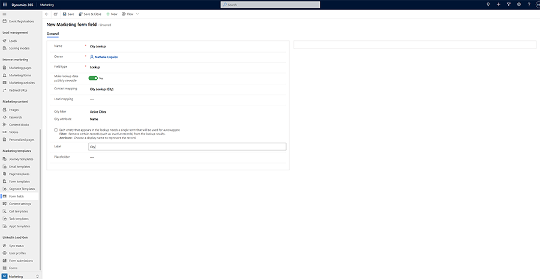

For the Country form field, enter the following information:

- **Name**: Country Lookup
- **Field type**: Lookup
- **Make lookup data publicly viewable**: Yes
- **Contact mapping**: Country Lookup (Country)
- **City filter**: Active Countries
- **City attribute**: Name
- **Label**: Country

Country lookup form field:

> [!div class="mx-imgBorder"]
> 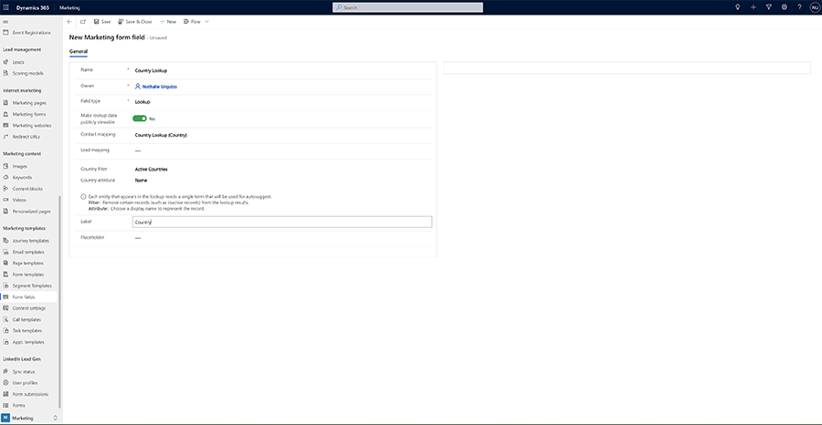

## 8. Enable filtering for City lookup in Form Designer

Next, create a new marketing form that uses the new fields. Because the lookup fields are mapped to Contact only, the form needs to update Contacts only. If you want to use them with Leads, you'll need to repeat the [fourth step](filter-cities.md#4-customize-the-contact-entity-to-use-lookup-fields-for-country-and-city) with the Lead entity. Make sure to use lookup form fields.

> [!div class="mx-imgBorder"]
> 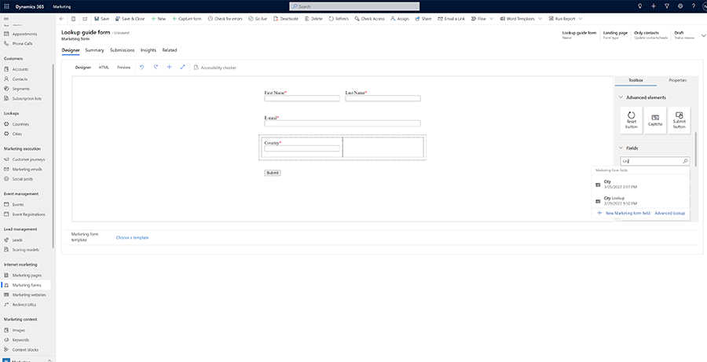

Lastly, you need to enable filtering. Select the City field and go to the **Properties** pane. Select the **Filter by** dropdown and select **Country Lookup**. If this option is missing, then relevance search isn't correctly configured. Go back to [step three](filter-cities.md#3-add-read-permission-for-the-service-user) and make sure that all properties are added to both "Add view columns" and "Add search columns" in the "Quick Find Active..." view. Then, the number in the brackets should be the same as in the screenshot below.

> [!div class="mx-imgBorder"]
> 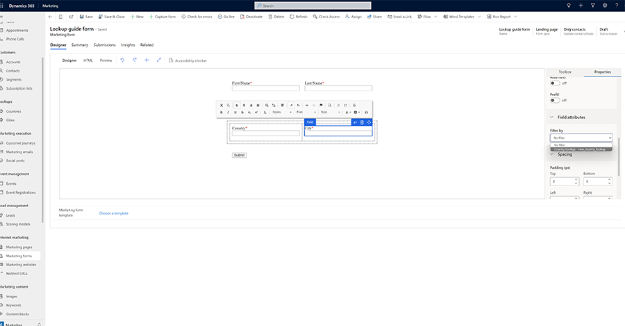

## 9. Publish and host the form

The form can be hosted on a marketing page or an external site. In both cases, Cities will be filtered based on the Country value.

> [!div class="mx-imgBorder"]
> 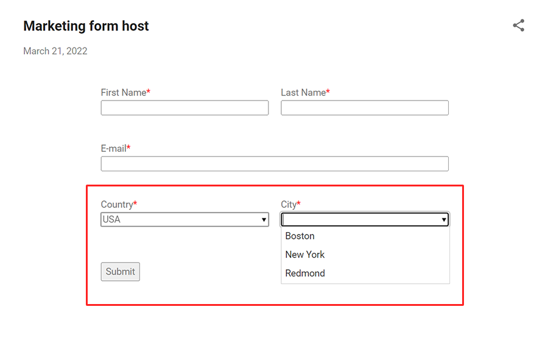

[!INCLUDE[footer-include](../../includes/footer-banner.md)]