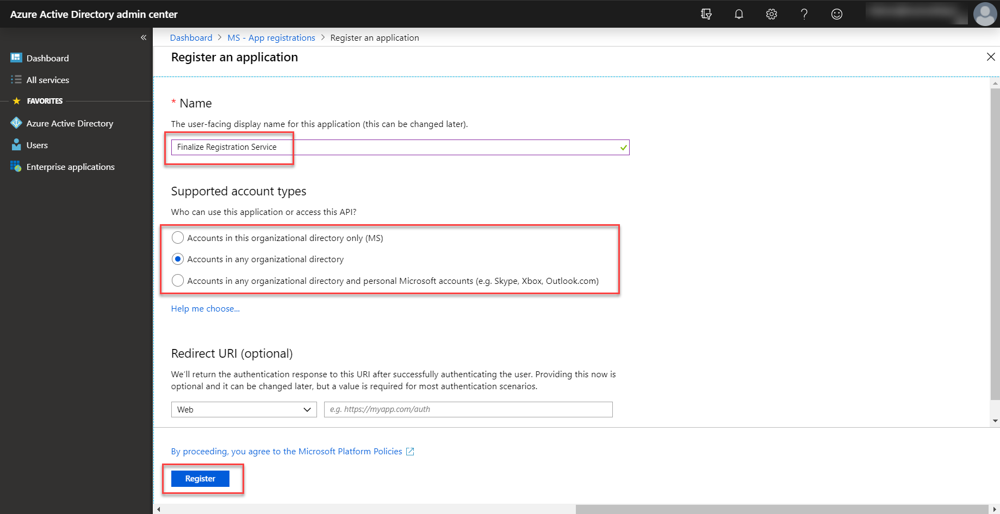
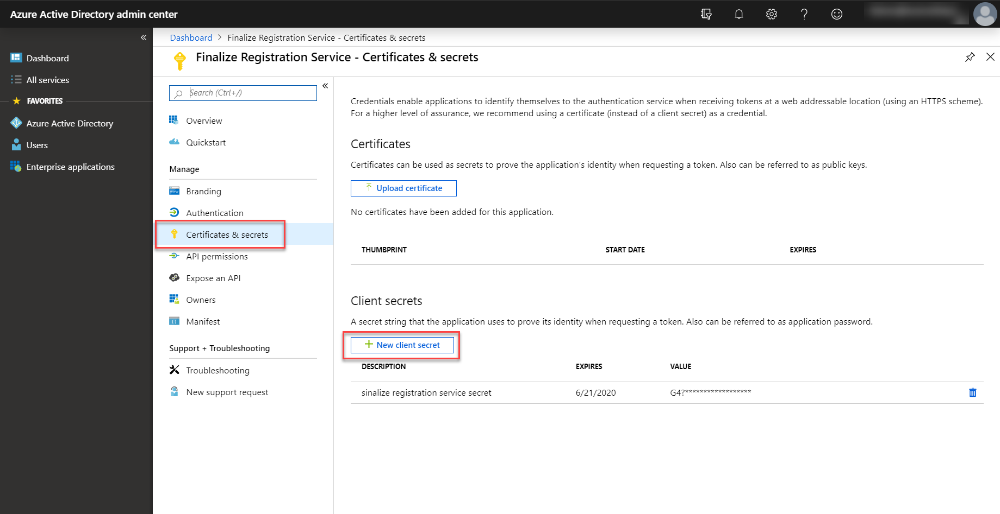
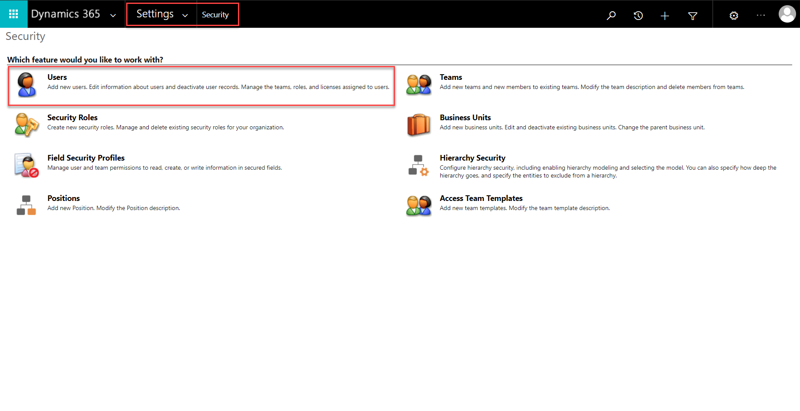
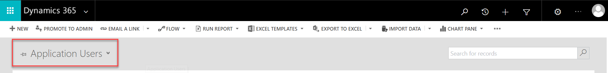
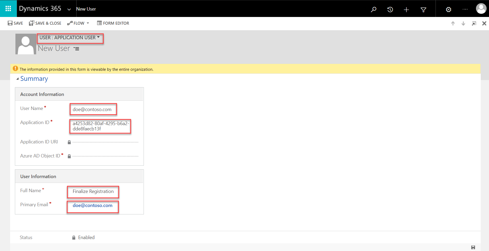

# Finalizing registration for paid events

This topic walks you through the process of developing a .NET Core application that authenticates against Dynamics 365 Marketing and triggers a custom action that finalizes the registration process for paid events. Before going through the topic, make sure that you read and understand [Set up online payments for events](https://docs.microsoft.com/dynamics365/customer-engagement/marketing/event-payment-gateway#develop-a-service-to-finalize-event-registration).  

In this topic, we use [OAuth]( https://docs.microsoft.com/powerapps/developer/common-data-service/authenticate-oauth) as an authentication mechanism and [Dynamics 365 Web API](https://docs.microsoft.com/dynamics365/customer-engagement/developer/use-microsoft-dynamics-365-web-api) to trigger the custom action. This approach works universally with most of the programming languages and frameworks, which means that you’re not forced to use C# or .NET Core for building the service that finalize the paid registrations. 

> [!NOTE]
> If you choose to use .NET Framework for developing your service, you can use the XRM tooling library to authenticate and connect to the organization service. This library makes it more convenient to communicate with Dynamics 365 Marketing. More information: [Authenticate with .NET Framework applications](https://docs.microsoft.com/powerapps/developer/common-data-service/authenticate-dot-net-framework) 
 
## Prerequisites 

1. Create a .NET Core CLI project. 

2. Install all the required dependencies.

3. Install the following NuGet packages: 
   - [Microsoft.IdentityModel.Clients.ActiveDirectory](https://www.nuget.org/packages/Microsoft.IdentityModel.Clients.ActiveDirectory) is used to simplify the authentication with OData. If you’re using a programming language that is not supported by this library, you need to use another library that supports your programming language or take care of the authentication manually.
   
   - [Newtonsoft.Json]( https://www.nuget.org/packages/Newtonsoft.Json/) is used to serialize and deserialize the data. 
 
## Step 1: Register your application 

Before we start to authenticate against Dynamics 365 Marketing, we need to register the application in the **Azure Active Directory** to get the authentication credentials. More information: [How to register an application in Azure Active Directory](https://docs.microsoft.com/powerapps/developer/common-data-service/use-single-tenant-server-server-authentication) 

Follow these steps to register your application:

1. Navigate to **Microsoft 365 Admin center** by expanding the **Admin centers** tab in the left navigation pane, and select **Azure Active Directory**. 

1. Navigate to **Azure Active Directory**, select **App registrations**, and then select **New registration**. 

    
 
1. Enter a name for your application. Select the **Accounts in any organizational directory** option in the **Supported account types** section. You don’t need to add a redirect URI. 
 
    

1. Select **Register**. 
1. After the application is registered, you should be redirected to the **Overview** page. Look for the **application ID** and **tenant ID** values and save them. 

1. Navigate to **Certificates & secrets** and select **New client secret**. Make note of the client secret value.  

    

## Step 2: Create an application user 

In this step, create an application user and associate the application user with the created application. More information: [Application user creation](https://docs.microsoft.com/powerapps/developer/common-data-service/use-single-tenant-server-server-authentication#application-user-creation) 

1. Go to your Dynamics 365 Marketing instance and navigate to **Settings** > **Security** and then select **Users**. 
 
    

1. Switch the view to **Application Users** and select **New**. 

    

1. Make sure the **User: Application User** view is selected. If not, select the drop-down arrow, select **Application User**, and then enter the **User Name**, **Application ID**, **Full Name** and **Primary Email** values.

   

1. Select **Save**. After you save the record, the **Application ID URI** and **Azure AD Object ID** values should be automatically filled. If not, make sure that you entered the correct application ID and that you registered your application correctly. 

## Step 3: Assigning a security role to an application user 

The next step is to assign the required security roles to the application user. You have to create a security group on your own. You need the following privileges: 

> [!NOTE]
> In the upcoming August 2019 release, a new security role that contains all the required privileges to finalize the registration will be introduced. To assign this role, select **Manage roles** and then select **Finalize RegistrationService**. 

``` XML
    <RolePrivilege name="prvAppendContact" level="Global" /> 
    <RolePrivilege name="prvAppendLead" level="Global" /> 
    <RolePrivilege name="prvAppendmsevtmgt_AttendeePass" level="Global" /> 
    <RolePrivilege name="prvAppendmsevtmgt_customregistrationfield" level="Global" /> 
    <RolePrivilege name="prvAppendmsevtmgt_eventpurchasepass" level="Global" /> 
    <RolePrivilege name="prvAppendmsevtmgt_EventRegistration" level="Global" /> 
    <RolePrivilege name="prvAppendmsevtmgt_registrationresponse" level="Global" /> 
    <RolePrivilege name="prvAppendmsevtmgt_Session" level="Global" /> 
    <RolePrivilege name="prvAppendmsevtmgt_SessionRegistration" level="Global" /> 
    <RolePrivilege name="prvAppendmsevtmgt_waitlistitem" level="Global" /> 
    <RolePrivilege name="prvAppendToAccount" level="Global" /> 
    <RolePrivilege name="prvAppendToContact" level="Global" /> 
    <RolePrivilege name="prvAppendToLead" level="Global" /> 
    <RolePrivilege name="prvAppendTomsevtmgt_customregistrationfield" level="Global" /> 
    <RolePrivilege name="prvAppendTomsevtmgt_Event" level="Global" /> 
    <RolePrivilege name="prvAppendTomsevtmgt_eventadministration" level="Global" /> 
    <RolePrivilege name="prvAppendTomsevtmgt_eventpurchasepass" level="Global" /> 
    <RolePrivilege name="prvAppendTomsevtmgt_EventRegistration" level="Global" /> 
    <RolePrivilege name="prvAppendTomsevtmgt_pass" level="Global" /> 
    <RolePrivilege name="prvAppendTomsevtmgt_registrationresponse" level="Global" /> 
    <RolePrivilege name="prvAppendTomsevtmgt_Session" level="Global" /> 
    <RolePrivilege name="prvAppendTomsevtmgt_SessionRegistration" level="Global" /> 
    <RolePrivilege name="prvAppendTomsevtmgt_waitlistitem" level="Global" /> 
    <RolePrivilege name="prvCreateAccount" level="Global" /> 
    <RolePrivilege name="prvCreateContact" level="Global" /> 
    <RolePrivilege name="prvCreateLead" level="Global" /> 
    <RolePrivilege name="prvCreatemsevtmgt_AttendeePass" level="Global" /> 
    <RolePrivilege name="prvCreatemsevtmgt_bucket" level="Global" /> 
    <RolePrivilege name="prvCreatemsevtmgt_customregistrationfield" level="Global" /> 
    <RolePrivilege name="prvCreatemsevtmgt_eventmanagementconfiguration" level="Global" /> 
    <RolePrivilege name="prvCreatemsevtmgt_eventpurchasepass" level="Global" /> 
    <RolePrivilege name="prvCreatemsevtmgt_EventRegistration" level="Global" /> 
    <RolePrivilege name="prvCreatemsevtmgt_registrationresponse" level="Global" /> 
    <RolePrivilege name="prvCreatemsevtmgt_SessionRegistration" level="Global" /> 
    <RolePrivilege name="prvCreatemsevtmgt_waitlistitem" level="Global" /> 
    <RolePrivilege name="prvCreateSharePointData" level="Global" /> 
    <RolePrivilege name="prvReadAccount" level="Global" /> 
    <RolePrivilege name="prvReadAsyncOperation" level="Global" /> 
    <RolePrivilege name="prvReadAttribute" level="Global" /> 
    <RolePrivilege name="prvReadContact" level="Global" /> 
    <RolePrivilege name="prvReadEntity" level="Global" /> 
    <RolePrivilege name="prvReadLead" level="Global" /> 
    <RolePrivilege name="prvReadmsevtmgt_AttendeePass" level="Global" /> 
    <RolePrivilege name="prvReadmsevtmgt_bucket" level="Global" /> 
    <RolePrivilege name="prvReadmsevtmgt_customregistrationfield" level="Global" /> 
    <RolePrivilege name="prvReadmsevtmgt_EntityCounter" level="Global" /> 
    <RolePrivilege name="prvReadmsevtmgt_Event" level="Global" /> 
    <RolePrivilege name="prvReadmsevtmgt_eventadministration" level="Global" /> 
    <RolePrivilege name="prvReadmsevtmgt_eventcustomregistrationfield" level="Global" /> 
    <RolePrivilege name="prvReadmsevtmgt_eventmanagementconfiguration" level="Global" /> 
    <RolePrivilege name="prvReadmsevtmgt_eventpurchasepass" level="Global" /> 
    <RolePrivilege name="prvReadmsevtmgt_EventRegistration" level="Global" /> 
    <RolePrivilege name="prvReadmsevtmgt_pass" level="Global" /> 
    <RolePrivilege name="prvReadmsevtmgt_registrationresponse" level="Global" /> 
    <RolePrivilege name="prvReadmsevtmgt_Session" level="Global" /> 
    <RolePrivilege name="prvReadmsevtmgt_SessionRegistration" level="Global" /> 
    <RolePrivilege name="prvReadmsevtmgt_waitlistitem" level="Global" /> 
    <RolePrivilege name="prvReadmsevtmgt_webinarconfiguration" level="Global" /> 
    <RolePrivilege name="prvReadmsevtmgt_WebinarProvider" level="Global" /> 
    <RolePrivilege name="prvReadmsevtmgt_WebinarType" level="Global" /> 
    <RolePrivilege name="prvReadmsevtmgt_websiteentityconfiguration" level="Global" /> 
    <RolePrivilege name="prvReadOptionSet" level="Global" /> 
    <RolePrivilege name="prvReadPluginAssembly" level="Global" /> 
    <RolePrivilege name="prvReadRelationship" level="Global" /> 
    <RolePrivilege name="prvReadSdkMessage" level="Global" /> 
    <RolePrivilege name="prvReadSharePointData" level="Global" /> 
    <RolePrivilege name="prvReadSharePointDocument" level="Global" /> 
    <RolePrivilege name="prvReadTransactionCurrency" level="Global" /> 
    <RolePrivilege name="prvReadUserSettings" level="Global" /> 
    <RolePrivilege name="prvReadWorkflow" level="Global" /> 
    <RolePrivilege name="prvWriteAccount" level="Global" /> 
    <RolePrivilege name="prvWriteContact" level="Global" /> 
    <RolePrivilege name="prvWriteLead" level="Global" /> 
    <RolePrivilege name="prvWritemsevtmgt_bucket" level="Global" /> 
    <RolePrivilege name="prvWritemsevtmgt_customregistrationfield" level="Global" /> 
    <RolePrivilege name="prvWritemsevtmgt_EntityCounter" level="Global" /> 
    <RolePrivilege name="prvWritemsevtmgt_Event" level="Global" /> 
    <RolePrivilege name="prvWritemsevtmgt_eventadministration" level="Basic" /> 
    <RolePrivilege name="prvWritemsevtmgt_eventmanagementconfiguration" level="Global" /> 
    <RolePrivilege name="prvWritemsevtmgt_eventpurchasepass" level="Global" /> 
    <RolePrivilege name="prvWritemsevtmgt_EventRegistration" level="Global" /> 
    <RolePrivilege name="prvWritemsevtmgt_registrationresponse" level="Global" /> 
    <RolePrivilege name="prvWritemsevtmgt_Session" level="Global" /> 
    <RolePrivilege name="prvWritemsevtmgt_SessionRegistration" level="Global" /> 
    <RolePrivilege name="prvWritemsevtmgt_waitlistitem" level="Global" /> 
    <RolePrivilege name="prvWritemsevtmgt_webinarconfiguration" level="Global" /> 
    <RolePrivilege name="prvWriteSharePointData" level="Global" />  
``` 

## Step 4: Authenticate against Dynamics 365 Marketing

Implement the custom logic to authenticate against Dynamics 365 Marketing. The outcome of the authentication should be an access token. If you’re not able to retrieve an access token, check your configuration. 

> [!NOTE] 
> For a fully working example, check the code from the [Sample Code](#sample-code) section. More information: [Authenticate using OAuth](https://docs.microsoft.com/powerapps/developer/common-data-service/authenticate-oauth#use-the-accesstoken-with-your-requests)

```csharp
public static string AuthenticateToDynamics365()
{
    var authContext = new AuthenticationContext($"https://login.microsoftonline.com/{tenantId}", false);
    var credential = new ClientCredential(clientId, clientSecret);

    var authenticationResult = authContext.AcquireTokenAsync(organizationUrl, credential).Result;

    return authenticationResult.AccessToken;
}
``` 
 
## Step 5: Calling custom action to finalize registration 

After the access token is successfully retrieved, we can call the custom action `msevtmgt_FinalizeExternalRegistrationRequest`. 

>[!NOTE]
> If you’re using a solution version prior to the April 2019 release, the custom action is called `adx_FinalizeExternalRegistrationRequest` (different prefix). More information: [Calling custom actions with Web API](https://docs.microsoft.com/powerapps/developer/common-data-service/webapi/use-web-api-actions)

```csharp 
private static HttpResponseMessage FinalizeRegistration(string accessToken)
{
    using (var client = new HttpClient())
    {
        client.BaseAddress = new Uri(organizationUrl);
        client.DefaultRequestHeaders.Accept.Add(new MediaTypeWithQualityHeaderValue("application/json"));

        var request = CreateFinalizeRegistrationRequest(accessToken);

        return client.SendAsync(request).Result;
    }
}

public static HttpRequestMessage CreateFinalizeRegistrationRequest(string accessToken)
{
    var finalizeRegistrationData = new Dictionary<string, string>
    {
        { "PurchaseId", "<purchase-id-as-guid>" },
        { "ReadableEventId", "<readable-event-id" },
        { "UserId", "<optional-user-id>" }
    };

    var encodedRequestBody = JsonConvert.SerializeObject(finalizeRegistrationData);
    
    var request = new HttpRequestMessage(HttpMethod.Post, FINALIZE_REGISTRATION_ROUTE);
    request.Content = new StringContent(encodedRequestBody, Encoding.UTF8, "application/json");
    request.Headers.Authorization = new AuthenticationHeaderValue("Bearer", accessToken);

    return request;
}
``` 
 
## Sample Code 

The following sample code shows how to authenticate and trigger the custom action to finalize the registration process for paid events. 

> [!IMPORTANT]
> In this example we have hard coded the `finalizeRegistrationData` method. In a real application, this data should be retrieved from the event website through the payment gateway to finalize registration service.

> [!NOTE]
> You should not enter either client ID or client secret values directly in code. This is only done to improve the readability of the sample code. 

```csharp 
using Microsoft.IdentityModel.Clients.ActiveDirectory;
using Newtonsoft.Json;
using System;
using System.Collections.Generic;
using System.Net.Http;
using System.Net.Http.Headers;
using System.Text;

namespace TriggerFinalizeRegistration
{
    class Program
    {
        /// <summary>
        /// The route to trigger the `msevtmgt_FinalizeExternalRegistrationRequest` custom action.
        /// </summary>
        private const string FINALIZE_REGISTRATION_ROUTE = "/api/data/v9.0/msevtmgt_FinalizeExternalRegistrationRequest";

        /// <summary>
        /// The base URL of your organization.
        /// E.g.: https://contoso.crm.dynamics.com/
        /// </summary>
        static string organizationUrl = "<org-url>";

        /// <summary>
        /// The tenant ID (GUID) of your application. Can be retrieved from the overview section of your application in
        /// Azure Active Directory.
        /// </summary>
        static string tenantId = "<tenant-id>";

        /// <summary>
        /// The client ID (GUID) of your application which is used for authentication against Dynamics 365.
        /// Can be retrieved from the overview section of your application in Azure Active Directory.
        /// </summary>
        static string clientId = "<client-id>";

        /// <summary>
        /// The client secret that can be generated in the certificates & client secrets section in your
        /// Azure Active Directory. 
        /// </summary>
        static string clientSecret = "<client-secret>";

        static void Main(string[] args)
        {
            var accessToken = AuthenticateToDynamics365();
            var response = FinalizeRegistration(accessToken);

            if (response.IsSuccessStatusCode)
            {
                var result = response.Content.ReadAsStringAsync().Result;
                // Handle response. 
                // The respones contains an attribute called 'status' which indicates
                // if the registration was successful or not. 
            }
            else
            {
                // Something went wrong. 
                // This most probably means that there is an issue with your configuration.
            }

            Console.WriteLine(response.StatusCode);
        }

        public static string AuthenticateToDynamics365()
        {
            var authContext = new AuthenticationContext($"https://login.microsoftonline.com/{tenantId}", false);
            var credential = new ClientCredential(clientId, clientSecret);

            var authenticationResult = authContext.AcquireTokenAsync(organizationUrl, credential).Result;

            return authenticationResult.AccessToken;
        }

        private static HttpResponseMessage FinalizeRegistration(string accessToken)
        {
            using (var client = new HttpClient())
            {
                client.BaseAddress = new Uri(organizationUrl);
                client.DefaultRequestHeaders.Accept.Add(new MediaTypeWithQualityHeaderValue("application/json"));

                var request = CreateFinalizeRegistrationRequest(accessToken);

                return client.SendAsync(request).Result;
            }
        }

        public static HttpRequestMessage CreateFinalizeRegistrationRequest(string accessToken)
        {
            var finalizeRegistrationData = new Dictionary<string, string>
            {
                { "PurchaseId", "ab62525b-7a63-47c0-b6e8-17ad1a2c67a6" },
                { "ReadableEventId", "Paid_Event1479011247" },
                { "UserId", "" }
            };

            var encodedRequestBody = JsonConvert.SerializeObject(finalizeRegistrationData);
            var request = new HttpRequestMessage(HttpMethod.Post, FINALIZE_REGISTRATION_ROUTE);
            request.Content = new StringContent(encodedRequestBody, Encoding.UTF8, "application/json");
            request.Headers.Authorization = new AuthenticationHeaderValue("Bearer", accessToken);

            return request;
        }
    }
}

``` 

### See also

[Self-hosted customer event website](self-hosted.md)<br />
[Power Apps portal hosted](portal-hosted.md)<br/>
[Customer Event Portal Localization](event-portal-localization.md)<br />
[Host your custom event website on Azure](host-custom-event-website-on-azure.md)
