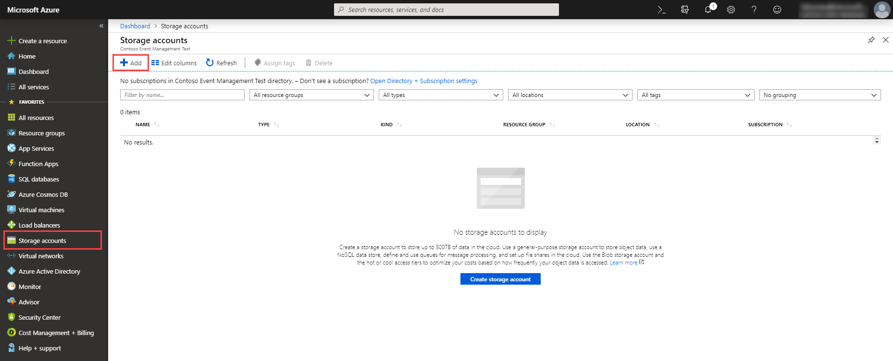
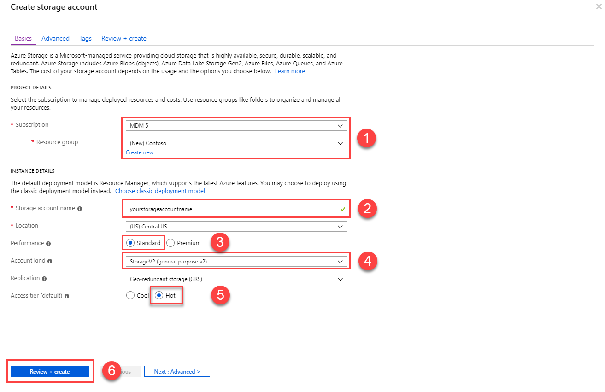
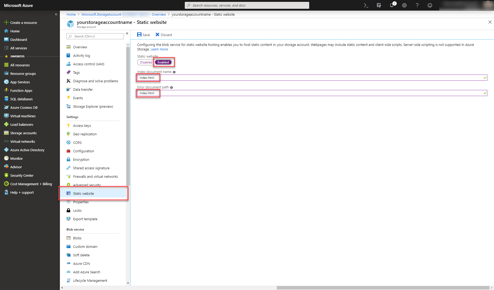
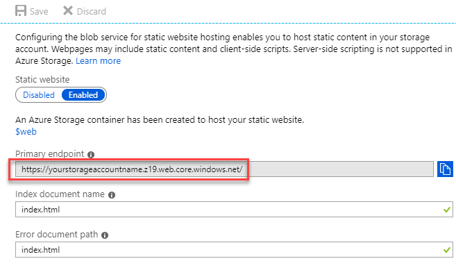
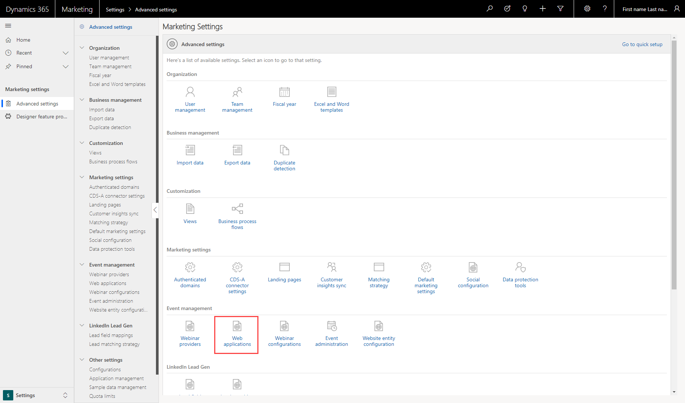
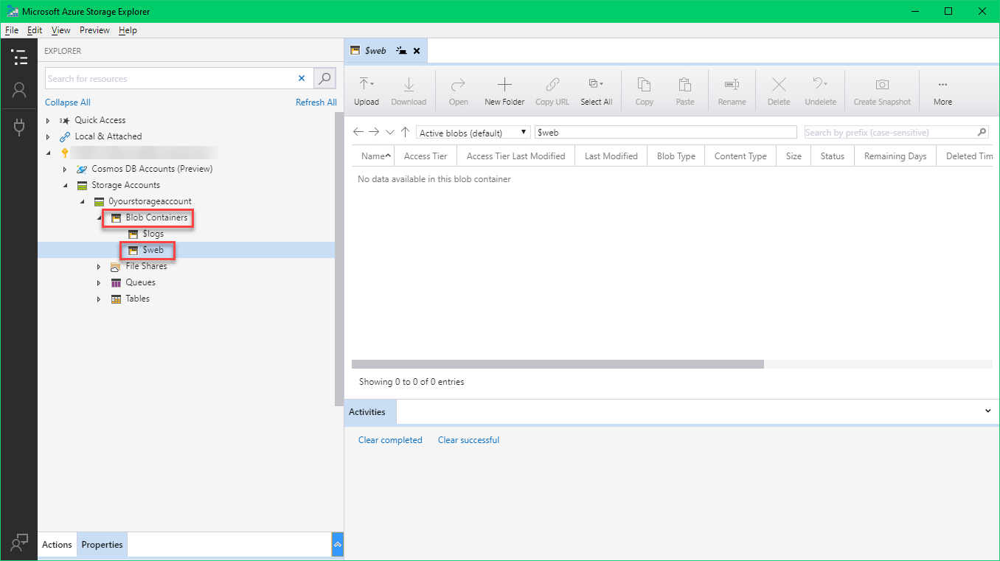

# Host your custom event website on Azure

This topic will walk you through how to host your custom event website on Azure. You can either build your frontend or customize the provided demo website build using the [Angular](https://angular.io/) framework. More information [Build and host custom event website](event-management-web-application.md)

## Prerequisites

1. Download the [source code](https://go.microsoft.com/fwlink/?linkid=2042224) to customize the provided demo website.
2. Install [Node.js](https://nodejs.org/en/download/) version 10.x or higher.
3. Download the [Azure storage explorer](https://docs.microsoft.com/en-us/azure/vs-azure-tools-storage-manage-with-storage-explorer?tabs=windows)

## Step 1:  Create an Azure storage account

To create an Azure storage account, follow the steps below:

1. Login into [Azure portal](https://portal.azure.com) and click on **Sign in**, if you dont have an Azure account, register for it.

2. Click on **Storage accounts** and click on **Add** to create a new storage account.
  
    

3. In the **Subscription and Resource group** dropdown, select your subscription from the existing list of subscriptions. When you select an existing **Subscription**, the **resource group** field displays the available resource groups. If you don't have an existing one, create a new **Resource group**.

    

4. Enter the **Storage account name**and also select the **Location**.

5. Set the values as shown in the screenshot and click on **Review + create**

   > [!NOTE]
   > You can modify all the settings that suits to your needs.

6. Review your configuration and click on **Save**

### Enabling static website hosting

1. Select the newly created **Storage account** and click on **Static website**

2. Enable the **Static website** by flipping the switch and name the **Index document name** and **Error document path** as **Index.html**

    
3. Click on **Save**. A new field **Primary endpoint** is shown. Copy the URL from the **Primary endpoint** field. This is the URL from which you reach your custom event website.
  
     

## Step 2: Register your web application

To use event management public API, you need a web application token. The web application token is used to control API requests that are associated with your organization.

1. Open your Dynamics 365 and navigate to Event Management
2. Click on the dropdown and select **Settings**

    
    
3. Click on the **Web applications**
    
    
    
4. Click on the **New** to create a new web application token.
5. Enter details in the **Name** field.
6. For the **Origin** field enter the **Primary endpoint** value that you got while enabling the static website.

   
   
   > [!NOTE]
   > When you enter the Primary endpoint value, make sure that you don't have a trailing slash (/) at the end of the url.
   
7. Click on **Save**. You will get the web application token and the API endpoint. 

## Step 3: Create environment.ts file

1. Open the [source code](https://go.microsoft.com/fwlink/?linkid=2042224) with your favorite IDE (we recommend Visual Studio Code).  
2. Navigate to `src/environments/` directory. 
3. Create an empty `environment.ts` file.
4. Open the file `environment.selfhosted.ts`. This file contains all the configuration settings for your event website. 
5. Enter the **Endpoint** field value from the web application record that you have created in the `apiEndpoint` field. Append `EvtMgmt/api/v2.0/` to the `apiEndpoint` value. It should look like this `https://yourorg.crm.dynamics.com/EvtMgmt/api/v2.0/`
6. Make sure to set the `useAadB2C` value to false.
7. Enter the generated **Token** field value from the web application record in the `emApplicationtoken` field and save the file. 
8. Open a terminal in the root of your custom event website directory and run the command
    ```CLI 
     ng build --prod --output-hashing none --configuration selfhosted 
    ``` 
9. This will build the website. You can find the generated files in `dist\ClientApp` folder. 

## Step 4: Upload your custom event website

1. Open **Microsoft Azure Storage Explorer** 
2. Sign in with your Azure account. 
3. Select your **Storage account** 
4. Select the **$web blob container**

   
   
5. Upload all the files that you have generated before located in `dist/ClientApp` folder into the `$web` blob container. 
6. To see the custom event website in run time, copy the **Origin** field value from the web application record in Dynamics 365 for Marketing and open it in the browser.

### See also

[Build and host custom event website](event-management-web-application.md)
