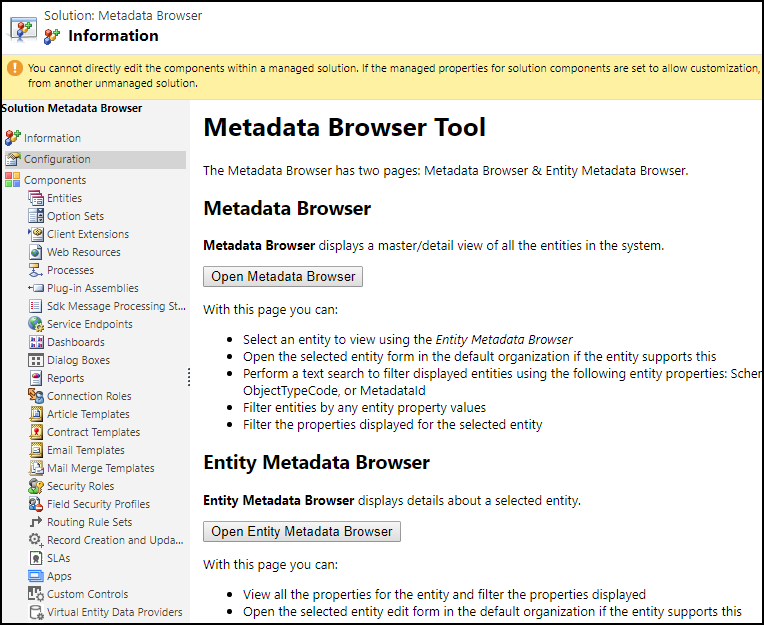

# Dynamics 365 for Marketing entity reference

[!INCLUDE[cc-applies-to-update-9-0-0](../../includes/cc_applies_to_update_9_0_0.md)]

All the entities that are installed as part of the Dynamics 365 for Marketing solutions adhere to the standard extensibility model in Dynamics 365. This implies that developers/ISVs can perform standard create, retrieve, update, and delete (CRUD) operations on entities if their user account has the appropriate privileges. This section provides entity reference for only those entities in Dynamics 365 for Marketing that has a specif developer use case scenario.

If you want to view information about all the entities and their properties, attributes, and relationships, use the Entity Metadata Browser tool. Entity Metadata Browser is a managed solution that you need to install in your Dynamics 365 for Marketing instance to view the entity reference.

## Install Entity Metadata Browser

1. [Download](http://download.microsoft.com/download/8/E/3/8E3279FE-7915-48FE-A68B-ACAFB86DA69C/MetadataBrowser_3_0_0_5_managed.zip) Entity Metadata Browser solution (.zip) to your computer.
2. Sign in to your Dynamics 365 for Marketing instance, and import the Entity Metadata Browser solution file to install it. For information about how to install a managed solution, see [Import, update, and export solutions](../../customize/import-update-export-solutions.md) 

## Use Entity Metadata Browser

You can use Entity Metadata Browser in one of the following two ways:

- **Open as an app**: Select **Dynamics 365** >  **Metadata Tools** to open the app.

    

    **Entities** is the default view when you open the app. You can select **Tools** > **Entity Metadata** to inspect individual entities.

    

- **Open from the solution configuration page**: Open the managed solution by double-clicking the row in the solutions list and view the **Configuration** page to view information about the Entity Metadata Browser and buttons to launch two different views.
    - **Metadata Browser** is equivalent to the **Entities** view in the app.
    - **Entity Metadata Browser** is equivalent to the **Entity Metadata** view in the app.
    
    

## Entities view in Entity Metadata Browser
You can perform the following actions:

- **View Entity Details**: Select an entity to view using the **Entity Metadata** view.
- **Edit Entity**: Open the selected entity form in the default organization, if the entity supports this.
- **Text Search**: Perform a text search to filter displayed entities using the following entity properties: <xref:Microsoft.Xrm.Sdk.Metadata.EntityMetadata.SchemaName>, <xref:Microsoft.Xrm.Sdk.Metadata.EntityMetadata.LogicalName>, <xref:Microsoft.Xrm.Sdk.Metadata.EntityMetadata.DisplayName>, <xref:Microsoft.Xrm.Sdk.Metadata.EntityMetadata.ObjectTypeCode>, or <xref:Microsoft.Xrm.Sdk.Metadata.MetadataBase.MetadataId>.
- **Filter Entities**: Set simple criteria to view a sub-set of entities. All criteria are evaluated using AND logic.
- **Filter Properties**: Filter the properties displayed for any selected entity. There are nearly 100 properties in the list. Use this to select just the ones you are interested in.

## Entity Metadata view in Entity Metadata Browser
 You can perform the following actions for a single entity:

- **Entity**: Change the entity that you want to view.
- **Properties**: View all the properties for the entity and filter the properties displayed.

    - **Edit Entity**: Open the selected entity edit form in the default organization, if the entity supports this.
    - **Filter Properties**: Filter the properties displayed for any selected entity. There are nearly 100 properties in the list. Use this to select just the ones you are interested in.

- **Attributes**: View the entity attributes in a master/detail view. With this view you can:

    - **Edit Attribute**: Open the selected attribute form in the default organization, if the attribute supports this.
    - **Text Search**: Perform a text search to filter displayed attributes using the following attribute properties: <xref:Microsoft.Xrm.Sdk.Metadata.AttributeMetadata.SchemaName>, <xref:Microsoft.Xrm.Sdk.Metadata.AttributeMetadata.LogicalName>, <xref:Microsoft.Xrm.Sdk.Metadata.AttributeMetadata.DisplayName>, or <xref:Microsoft.Xrm.Sdk.Metadata.MetadataBase.MetadataId>.
    - **Filter Attributes**: Filter attributes by any attribute property values.
    - **Filter Properties**: Filter the properties displayed for the selected attribute.

- **Keys**: If alternate keys are enabled for an entity you can examine how they are configured.

- **Relationships**: View the three types of entity relationships: One-To-Many, Many-To-One, and Many-To-Many. With these views you can:  
    - **Edit Relationship**: Open the selected relationship form in the default organization, if the relationship supports this.  
    - **Text Search**: Perform a text search to filter displayed relationships using values relevant to the type of relationship.  
    - **Filter Properties**: Filter the relationship by any relationship property value.

- **Privileges**: View entity privileges. With this view you can:  
    - Filter the displayed privilege using the `PrivilegeId`.

> [!NOTE]
> When viewing the entity detail properties, you’ll see that many complex properties are expandable. The most useful value is displayed with a link that allows toggling to a more detailed view. The detailed view reflects the structure of the data if you were to retrieve it programmatically. The detailed view also reveals other relevant data that can be retrieved in the same area, for example, if any localized labels are present for **Display Name** properties.

> [!TIP]
> To copy text from the page, simply select the text and use the Ctrl+C keyboard shortcut or the context menu **Copy** command.

## Community tools

**Metadata Browser** is a tool that XrmToolbox community developed for [!INCLUDE[pn_dynamics_crm](../../includes/pn-dynamics-crm.md)] Customer Engagement. See the [Developer tools](../../developer/developer-tools.md) topic for community developed tools.

> [!NOTE]
> The community tools are not a product of [!include[pn_microsoft_dynamics](../../includes/pn-microsoft-dynamics.md)] and does not extend support to the community tools. If you have questions related to the tool, please contact the publisher. More Information: [XrmToolBox](https://www.xrmtoolbox.com).