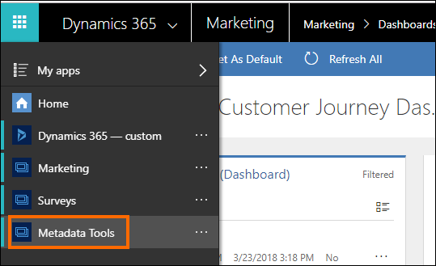
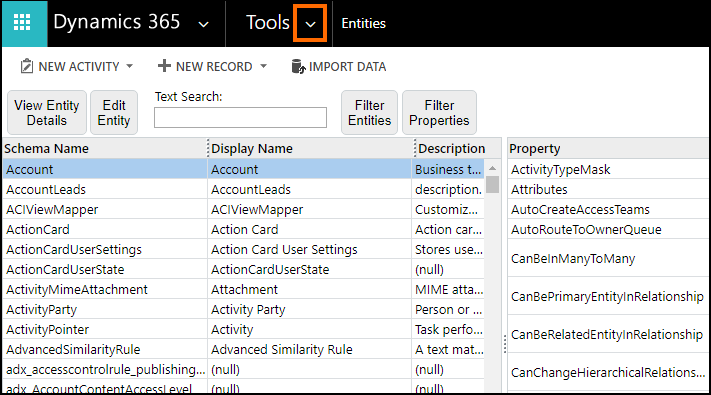
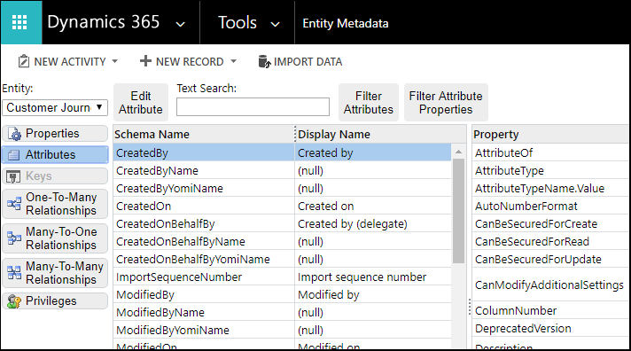

# Dynamics 365 Marketing entity reference

All the entities that are installed as part of the Dynamics 365 Marketing solutions support the [standard extensibility/programming model](../../developer/programming-models.md) in Dynamics 365 to perform operations on entities using the **Web API** or **Organization Service**. For example, developers can programmatically create, retrieve, update, and delete (CRUD) entity records provided they have the required privileges to do so.

> [!IMPORTANT]
> While all the entities in Dynamics 365 Marketing support the standard extensibility/programming model, you should be careful while programmatically creating, updating, or deleting these entity records. This is because some entities have a dependency on each other and the web application to provide the requisite user experiences and functionalities in the Marketing app. Manipulating these entities programmatically will prevent you from using the functionalities in the intended and supported way. Some examples of the complex functionality that cannot be achieved by programmatically working with the entities are:
>- Changes of Status and Status Reason fields, especially if the status schema is more complex than binary Active/Inactive case (mostly entities with “Go Live” button on ribbon).
>- Manipulation of fields, which contain complex pieces of information, usually encoded as JSON. For example, customer journey design/workflow.  Therefore, you should use the user interface in our app to reliably perform your operations unless it’s explicitly called out in this documentation that programmatic access to an entity or feature is supported.

To view information about all the entities and their properties, attributes, and relationships in your Dynamics 365 Marketing instance, use the **Entity Metadata Browser** app. It is available as a managed solution that you need to install in your Dynamics 365 Marketing instance to view the entity reference.

## Install Entity Metadata Browser

1. [Download](https://download.microsoft.com/download/8/E/3/8E3279FE-7915-48FE-A68B-ACAFB86DA69C/MetadataBrowser_3_0_0_5_managed.zip) Entity Metadata Browser solution (.zip) to your computer.
2. Sign in to your Dynamics 365 Marketing instance, and import the Entity Metadata Browser solution file to install it. For information about how to install a managed solution, see [Import, update, and export solutions](../../customize/import-update-upgrade-solution.md) 

## Use Entity Metadata Browser

In your Dynamics 365 Marketing instance, select **Dynamics 365** >  **Metadata Tools** to open the app.

The app provides entity reference data under two views:

- **Entities** is the default view when you open the app. More information: [Entities view in the Entity Metadata Browser](#entities-view-in-the-entity-metadata-browser) 

    

- Select **Tools** > **Entity Metadata** for the **Entity Metadata** view to inspect individual entities. More information: [Entity Metadata view in Entity Metadata Browser](#entity-metadata-view-in-entity-metadata-browser)

    

## Entities view in the Entity Metadata Browser
You can perform the following actions:

- **View Entity Details**: Select an entity to view using the **Entity Metadata** view.
- **Edit Entity**: Open the selected entity form in the default organization, if the entity supports this.
- **Text Search**: Perform a text search to filter displayed entities using the following entity properties: <xref:Microsoft.Xrm.Sdk.Metadata.EntityMetadata.SchemaName>, <xref:Microsoft.Xrm.Sdk.Metadata.EntityMetadata.LogicalName>, <xref:Microsoft.Xrm.Sdk.Metadata.EntityMetadata.DisplayName>, <xref:Microsoft.Xrm.Sdk.Metadata.EntityMetadata.ObjectTypeCode>, or <xref:Microsoft.Xrm.Sdk.Metadata.MetadataBase.MetadataId>.
- **Filter Entities**: Set simple criteria to view a sub-set of entities. All criteria are evaluated using AND logic.
- **Filter Properties**: Filter the properties displayed for any selected entity. There are nearly 100 properties in the list. Use this to select just the ones you are interested in.

## Entity Metadata view in Entity Metadata Browser
 You can perform the following actions for a single entity:

- **Entity**: Change the entity that you want to view.
- **Properties**: View all the properties for the entity and filter the properties displayed.

    - **Edit Entity**: Open the selected entity edit form in the default organization, if the entity supports this.
    - **Filter Properties**: Filter the properties displayed for any selected entity. There are nearly 100 properties in the list. Use this to select just the ones you are interested in.

- **Attributes**: View the entity attributes in a master/detail view. With this view you can:

    - **Edit Attribute**: Open the selected attribute form in the default organization, if the attribute supports this.
    - **Text Search**: Perform a text search to filter displayed attributes using the following attribute properties: <xref:Microsoft.Xrm.Sdk.Metadata.AttributeMetadata.SchemaName>, <xref:Microsoft.Xrm.Sdk.Metadata.AttributeMetadata.LogicalName>, <xref:Microsoft.Xrm.Sdk.Metadata.AttributeMetadata.DisplayName>, or <xref:Microsoft.Xrm.Sdk.Metadata.MetadataBase.MetadataId>.
    - **Filter Attributes**: Filter attributes by any attribute property values.
    - **Filter Properties**: Filter the properties displayed for the selected attribute.

- **Keys**: If alternate keys are enabled for an entity you can examine how they are configured.

- **Relationships**: View the three types of entity relationships: One-To-Many, Many-To-One, and Many-To-Many. With these views you can:  
    - **Edit Relationship**: Open the selected relationship form in the default organization, if the relationship supports this.  
    - **Text Search**: Perform a text search to filter displayed relationships using values relevant to the type of relationship.  
    - **Filter Properties**: Filter the relationship by any relationship property value.

- **Privileges**: View entity privileges. With this view you can:  
    - Filter the displayed privilege using the `PrivilegeId`.

> [!NOTE]
> When viewing the entity detail properties, you’ll see that many complex properties are expandable. The most useful value is displayed with a link that allows toggling to a more detailed view. The detailed view reflects the structure of the data if you were to retrieve it programmatically. The detailed view also reveals other relevant data that can be retrieved in the same area, for example, if any localized labels are present for **Display Name** properties.

> [!TIP]
> To copy text from the page, simply select the text and use the Ctrl+C keyboard shortcut or the context menu **Copy** command.

## Community tools

**Metadata Browser** is a tool that the XrmToolBox community developed for Dynamics 365 apps and Power Apps. See the [Community tools](/powerapps/developer/common-data-service/community-tools) topic for community developed tools.

> [!NOTE]
> The community tools are not a product of Microsoft. Microsoft does not extend support to the community tools. If you have questions related to the tools, please contact the publisher. More information: [XrmToolBox](https://www.xrmtoolbox.com)

[!INCLUDE[footer-include](../../includes/footer-banner.md)]