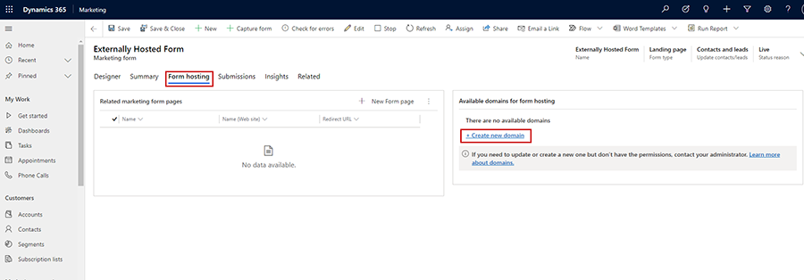
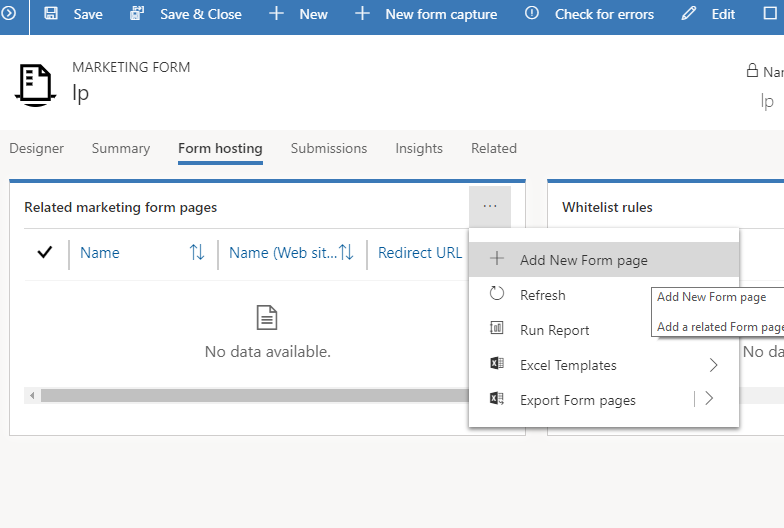
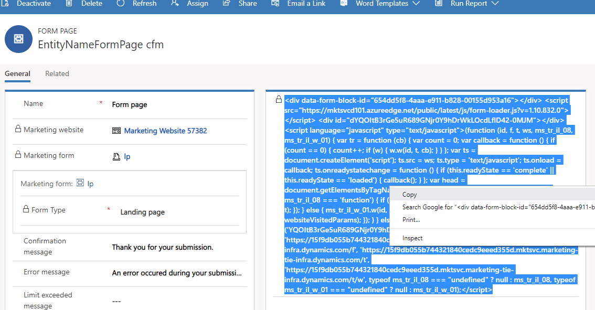
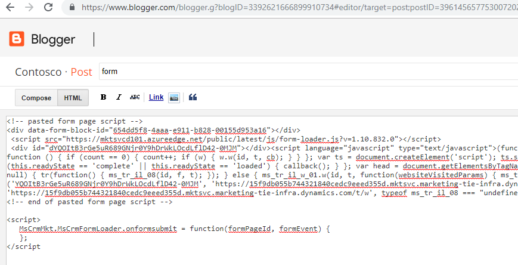

# Extend marketing forms using code

A marketing form defines a set of input fields arranged into a form layout. You'll probably build a small library of reusable forms that you can place on all your various marketing pages as needed. To add a marketing form to a specific marketing page, use a form element to position the form, and choose local settings for it, which applies to that page only. More information [Marketing forms](/dynamics365/customer-engagement/marketing/marketing-forms)

Marketing forms can be extended using JavaScript to perform custom business actions in the [Dynamics 365 Marketing](/dynamics365/customer-engagement/marketing/overview). Following are the methods that are available to extend marketing forms.

## JavaScript API

We're consuming the latest version of JavaScript API. Make sure that your references to `form-loader.js` or `loader.js` script look like `https://mktdplp102cdn.azureedge.net/public/latest/js/form-loader.js?v=...` or `https://mktdplp102cdn.azureedge.net/public/latest/js/loader.js?v=...` respectively. 

Place the custom code right after the `form-loader.js` script.

Code sample:
```JS
<script src="https://mktdplp102cdn.azureedge.net/public/latest/js/form-loader.js?v=..."></script>
<script>
// correct - the script will attach event handlers right after form loader script
MsCrmMkt.MsCrmFormLoader.on("afterFormLoad", function() {});

// wrong - the script will attach event handlers after window has finished loading, form already might have been loaded in the meantime and no events will trigger anymore
// window.onload = function() { MsCrmMkt.MsCrmFormLoader.on("afterFormLoad", function() {}); };
</script>
```

### MsCrmMkt.MsCrmFormLoader methods

|Function Name|Description|Parameter name| Parameter type|Parameter Description|Returns|
|------|-------|--------------|------|-------|----------|
|`.on(eventType,callback)`|Registers a callback to a type of form lifecycle event|`eventType`|`string`, one of `"afterFormLoad"`, `"afterFormRender"`, `"afterFormSubmit"`, `"formLoad"`, `"formRender"`, `"formSubmit"` | Event type to hook to | `undefined`
|`callback`|Callback function | |`Function`||
|`.off(eventType)`|Unregister a callback(s) of given form  lifecycle event|`eventType` optional|`string`, one of `"afterFormLoad"`, `"afterFormRender"`, `"afterFormSubmit"`, `"formLoad"`, `"formRender"`, `"formSubmit"` |Event type to hook to|`undefined`
| `.sendFormCaptureToCrm(form)`| Send a form submission to Dynamics 365 Marketing, supported only for form capturing scenario|`form`|DOM element representing the form or JQuery selector representing the form|Form DOM element|`Promise<string>`

### Form events

|Event Name|Triggered for captured forms|Syntax|Description|
|------|-------|------|------|
|`formLoad`|Yes|`MsCrmMkt.MsCrmFormLoader` <br/> `.on("formLoad", function(event) {})`|Triggers when the form placeholder is recognized before the actual form content is fetched, for captured forms triggers when form is recognized
|`formRender`|No|`MsCrmMkt.MsCrmFormLoader` <br/>`.on("formRender", function(event) {})`|Triggers after the form content is fetched and before the form content is injected to a page.
|`afterFormRender`|No|`MsCrmMkt.MsCrmFormLoader` <br/>`.on("afterFormRender", function(event) {})`|Triggers after the form content is injected to a page before the validation hooks are attached.
|`afterFormLoad`|No|`MsCrmMkt.MsCrmFormLoader` <br/>`.on("afterFormLoad", function(event) {})`|Triggers after the form content is injected to a page and after the validation hooks are attached.
|`formSubmit`|No|`MsCrmMkt.MsCrmFormLoader` <br/>`.on("formSubmit", function(event) {})`|Triggers on form submit before the form submission is sent to the server.
|`afterFormSubmit`|Yes|`MsCrmMkt.MsCrmFormLoader` <br/>`.on("afterFormSubmit", function(event) {})`|Triggers on form submit after the form submission is sent to the server. It triggers only when the submission is successful. It triggers before the redirect or showing the confirmation message.

For each event callback following methods are available:

|Method Name|Description|Return type|
|----|----|----|
|`.getType()`|Gets the event type|`string`, one of `"afterFormLoad"`, `"afterFormRender"`, `"afterFormSubmit"`, `"formLoad"`, `"formRender"`, `"formSubmit"` 
|`.getFormPageId()`|Gets the form page ID - this relates to `msdyncrm_formpage` entity unique identifier|`string`
|`.getFormPlaceholder()`|Gets the DOM element representing the form| DOM element
|`.preventDefault()`|Cancels the form submission, valid only for event of `formSubmit` type|`undefined`
|`.preventFormLoadingProgressBar()`|Hides the spinner while the form is loading, valid only for event `formLoad` type|`undefined`
|`.setFormNotification(function (n) {})`|Overrides a callback for rendering form notification (like a form submission message). Without a function body, no notifications will be rendered. Valid only for an event of `formLoad` type.| `undefined`

### Form capturing behavior customization

The form capturing is directed by the configuration element that looks like `<div class="d365-mkt-config" style="display:none" data-website-id="..." data-hostname="...">`. You can change the behavior of the form capturing by adding the following attributes:

|Attribute name|Description|
|------|-------|
|`data-ignore-prevent-default="true"`|When specified, the form will be submitted regardless of the fact that `.preventDefault()` was invoked on the event.|
|`data-no-submit="true"`|When specified, the form capturing script won't capture the form submit event, you should trigger the `MsCrmMkt.MsCrmFormLoader.sendFormCaptureToCrm(form)` explicitly. This is useful for cases when you want to do your form submission first and sync to Dynamics 365 Marketing later.

> [!NOTE]
> The Javascript API is available only for forms hosted as a script, it is not supported for the iframe hosting option.

## Add your code snippet while using Portals

To add the JavaScript code, you need to follow the steps below:

1. Navigate to **Marketing** app and go to **Marketing pages**.
2. Choose **New** to create a new marketing page.
3. Drag and drop **Form** element from the **Toolbox** tab into the **Designer** tab and select the marketing form you want to use.
   > [!div class="mx-imgBorder"]
   > 
   
4. Switch to **HTML** tab and your code snippet.
   > [!div class="mx-imgBorder"]
   > 

5. Select **Save** to save your changes and then select **Go live**.

## Add your code snippet when you're using your own CMS and form hosting

To add the code snippet, you need to follow the steps below:

1. Navigate to the **Marketing** app and go to **Marketing forms**
2. Choose **New** to create a new marketing form.
3. Select **Go live**.
4. Select the **Form hosting** tab and under the **Available domains for form hosting**, select the domain if it is available, or select **+ Create new domain**.
    > [!div class="mx-imgBorder"]
    > 

5. Add your own CMS domain and select **Save**.
6. In the **From hosting** tab, under the **Related marketing form pages** tab, select **...** and **+ New Form Page** to add a marketing form page.
    > [!div class="mx-imgBorder"]
    > 

7. Select **Save**.
8. Now select the form page you have created and copy the script to the clipboard.
    > [!div class="mx-imgBorder"]
    > 

9. Now in your CMS, edit the page where you want to include the form, add your customizations and script.
    > [!div class="mx-imgBorder"]
    > 

## Examples 

1. Sample validation - checks if the textbox is either Fabricam or Contoso, otherwise prevents the form submission.

    ```JS
    MsCrmMkt.MsCrmFormLoader.on('formSubmit', function(event) {
      // sample validation - check if 
      document.getElementById('txt-company-name-message').style.visibility = 'hidden';
      var companyName = document.getElementById('txt-company-name').value;
      if (companyName !== 'Fabricam' && companyName != 'Contoso') {
      document.getElementById('txt-company-name-message').style.visibility = 'visible';
      event.preventDefault();
    });
   ```

2. Filling the incoming query string parameters to hidden fields.

    ```JS
     MsCrmMkt.MsCrmFormLoader.on('afterFormLoad', function(event) {
     var self = window.location.toString();
     var queryString = self.split("?");
     var hiddenFields = document.querySelectorAll("input[type=hidden]");
     if (queryString.length > 1) {
       var pairs = queryString[1].split("&");
       for (var pairIndex in pairs) {
       var pair = pairs[pairIndex].split("=");
       if (pair.length !== 2) {
            continue;
        }
       var key = pair[0];
       var value = pair[1];
       if (key && value) {
         for (var i = 0; i < hiddenFields.length; i++) {
         if (hiddenFields[i].id === key) {
         hiddenFields[i].value = value;
           }
         }
       }
     }
      }
    });
    ```

3. Localize the form (picklist) - You can use client-side extensibility to localize marketing forms. Localization must occur after the form is loaded (`afterFormLoad` event). Inside the marketing page (or in the CMS where you host the form), add the following localization script:

    ```JS
    <script>
    function translatePicklists(lcid) {
        var picklists = document.querySelectorAll("select");
        for(var i = 0; i < picklists.length; i++) {
            var picklist = picklists[i];
            var relatedDatalist = document.getElementById("localize-" + picklist.name + "-" + lcid.toString());
            if (relatedDatalist) {
                for(var j = 0; j < picklist.options.length; j++) {
                    if (j >= relatedDatalist.options.length) {
                        break;
                    }
                    picklist.options[j].text = relatedDatalist.options[j].text;
                }
            }
        }
    }
    MsCrmMkt.MsCrmFormLoader.on("afterFormLoad", function(event) { translatePicklists(1029); });
    </script>
    ```
    
    In the marketing form, make sure that you have prepared the translations. Edit the marketing form in the HTML designer, format it (right-click in the designer, then choose **format**), and add the necessary translations.

    ```HTML
    <div data-editorblocktype="Field-dropdown">
	  <div class="marketing-field">
	      <div class="lp-form-field" data-required-field="false">
	        <label for="f7ae1a98-0d83-4592-afe0-272c85ce607d" class="lp-ellipsis" title="">Marital status</label>
	        <select id="f7ae1a98-0d83-4592-afe0-272c85ce607d" name="f7ae1a98-0d83-4592-afe0-272c85ce607d" class="lp-form-fieldInput" title="" style="width: 100%; box-sizing: border-box;">
                <option value=""></option>
                <option value="1">Single</option>
                <option value="2">Married</option>
                <option value="3">Divorced</option>
                <option value="4">Widowed</option>
            </select>
        </div>
	    </div>
    </div>
    <!-- format is localize-fieldid-lcid -->
    <datalist id="localize-f7ae1a98-0d83-4592-afe0-272c85ce607d-1029">
        <option></option>
        <option>Svobodny(a)</option>
        <option>Zenaty(a)</option>
        <option>Rozvedeny(a)</option>
        <option>Vdovec(vdova)</option>
    </datalist>
    ```

[!INCLUDE[footer-include](../../includes/footer-banner.md)]
