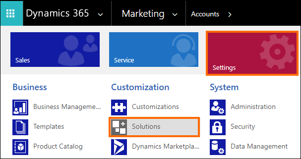
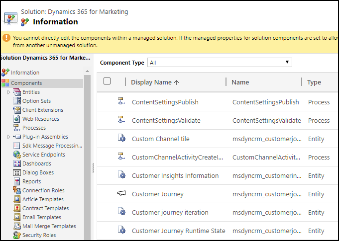

# Dynamics 365 for Marketing solutions

[!INCLUDE[cc-applies-to-update-9-0-0](../../includes/cc_applies_to_update_9_0_0.md)]

Dynamics 365 for Marketing adds the following solutions to your Dynamics 365 instance:

|Name  | Display Name  |Description  |
|--|--|--|
|MicrosoftDynamics_EventManagement|Event Management for Dynamics 365|A core solution for Event Management. Provides event management features for Dynamics 365.|
|MicrosoftDynamics_EvtMgmtPortalsLink|Portals—Event Management Integration|Part of Event Management for Dynamics 365.  Integrates the portal capabilities for Dynamics 365 solution with Event Management  to provide the event portal.|
|MicrosoftDynamics_EvtMgmtVocLink|Voice of the Customer—Event Management Integration|Part of Event Management for Dynamics 365. Integrates the Voice of the Customer solution  with Event Management to provide customer-survey features.|
|MicrosoftDynamics_Marketing|Dynamics 365 for Marketing|A core solution for Dynamics 365 for Marketing. Provides email marketing, campaign automation, and other core marketing features.|
|MicrosoftDynamics_MktEmailTemplates|Email Templates for Marketing|Part of Dynamics 365 for Marketing. Provides templates for designing marketing emails.|
|MicrosoftDynamics_MktEvtMgmtLink|Event Management - Marketing Integration|Part of Dynamics 365 for Marketing. Integrates the Event Management for Dynamics 365 solution with Marketing.|
|MicrosoftDynamics_MktIntegration|Marketing App Module|A core solution for Dynamics 365 for Marketing. Provides dashboards, navigation, and other unifying elements.|
|MicrosoftDynamics_MktLeadGenLink|LinkedIn Lead Gen Forms - Marketing Integration|Part of Dynamics 365 for Marketing. Integrates the LinkedIn Lead Gen Forms solution with Marketing to enable configuring the LinkedIn integration and viewing LinkedIn information for leads.|
|MicrosoftDynamics_MktLeadManagement|Lead Management for Marketing|A core solution for Dynamics 365 for Marketing. Provides automatic lead scoring and other lead management features for Marketing.|
|MicrosoftDynamics_MktPageTemplates|Page Templates for Marketing|Part of Dynamics 365 for Marketing. Provides templates for designing marketing pages.|
|MicrosoftDynamics_MktPortalsLink|Portals - Marketing Integration|Part of Dynamics 365 for Marketing. Integrates the portal capabilities for Dynamics 365 solution with Marketing to provide marketing-page features.|
|MicrosoftDynamics_MktVocLink|Voice of the Customer - Marketing Integration|Part of Dynamics 365 for Marketing. Integrates the Voice of the Customer solution with Marketing to provide customer-survey features.|

## View entity and other components in a solution

To view entities and other components in a solution, use the solution browser in your Dynamics 365 for Marketing instance.

1. Select **Settings** > **Solutions**.

    

2. From the list of solution, select the **Display Name** of the solution that you want to view the information for.
3. In the solution explorer, select **Components** in the left pane to view entities and other solution components in the solution. You can select each component in the left pane to view just the selected component.

    

For detailed information about entities and their properties, attributes, and relationships, see [Dynamics 365 for Marketing entity reference](marketing-entity-reference.md)
