# Use an API call to generate an .ics file with personalized calendar content for events and sessions

Using an API call, you can create a button for registration confirmation emails that generates a personalized .ics (iCalendar) file containing details about the event or session.

## Prerequisites

To create the .ics file, you will first need to create an [event management web application](event-management-web-application.md). The web application enables you to access the REST API backend. You will need to know the [events API endpoint](using-events-api.md#endpoint), as it will be used to make the API call.

## API structure

``https://service_endpoint/EvtMgmt/api/v2.0/calendar/personal/ics?data=jsonarray``<br>

where 'data' is an array consisting of objects with JSON structure:

``{'readableEventId':'example','sessionId':'example','data':{'custom_data':'custom_value'}}``

## API call example

To make the API call, your email button should link to a URL with the following format:

``https://{service-public-endpoint}/EvtMgmt/api/v2.0/calendar/personal/ics?api-version=2016-06-30&data=[{"readableEventId":"your-readable-event-id","data":{"registrationId":"{{this.msevtmgt_name}}","firstname":"{{contact.firstname}}"}}]``

### Required fields

- **service-public-endpoint**: The data for this field is located under **Event Website** > **General** > **Endpoint**
- **readableEventId**: Located under **Event management** > **Events** > (your event) > **Website and form** > **Readable event ID**
- **registrationId**: {{this.msevtmgt_name}} automatically populates this field using the method described in the next section
- **firstname**: {{contact.firstname}} automatically populates this field from the contact information associated with the email

## Add event information in the calendar content field

To begin the process of generating an .ics file, you will create a message that you want to include in your calendar invite. You will enter the message in the **Calendar content** field under the **Additional information** tab in your event.

You can create a short message to welcome registrants to your event, such as:

``Hi {{firstname}},``<br>
``Welcome to my event.``

> [!div class="mx-imgBorder"]
> 

{{firstname}} is a wildcard that pulls the registrant's first name from the contact information. You can add any wildcards that you want to be replaced during calendar file creation. Wildcards are marked between double brackets {{my_example}} and are replaced with values provided in the parameters of the data fields.

> [!IMPORTANT]
> ``msevtmgt_checkin_url`` is a reserved wildcard.  This wildcard will be replaced by the Teams event or session check-in url. You should not feed this as a parameter in the request data. You can use this to construct buttons or links in your calendar content to automatically check-in registrants to your events or sessions.

> [!NOTE]
> A Teams check-in button will automatically be generated for a calendar that was not previously customized and belongs to a streamed teams event or session.

### Activate the calendar content field

If you do not see the calendar content field, you may have to activate it. To activate the field:

1. Go to the top ribbon in Dynamics 365 Marketing, then select the **Settings** gear. Next, select **Advanced Settings**.

    > [!div class="mx-imgBorder"]
    > 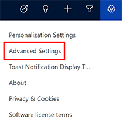

1. A new window will open, showing the Advanced Settings. In the new window, select the chevron next to **Settings** in the top ribbon, then select **Customizations**.

    > [!div class="mx-imgBorder"]
    > 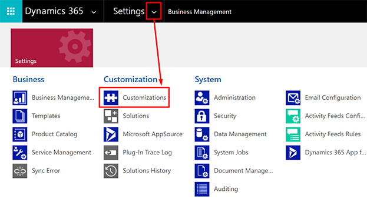

1. On the next screen, select **Customize the System**. A new window will pop up containing component customization options.

    > [!div class="mx-imgBorder"]
    > 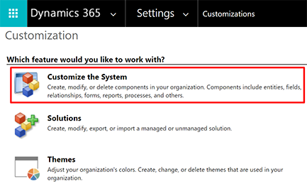

1. In the left navigation of the new window, go to **Components** > **Entities** > **Event** > **Forms**. The right pane will display **Active Forms** for events. To open the main event form, select **Event** from the list.

    > [!div class="mx-imgBorder"]
    > 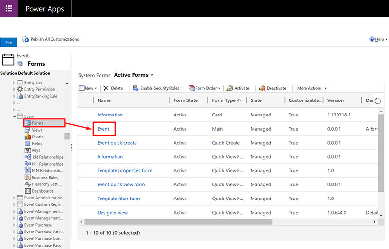

1. A new window titled Solution: Default Solution, Form: Event will open. Scroll down to the section titled **Additional information**.
1. Select the **Calendar content** field, then select **Change properties** in the top ribbon. A new properties overlay will open.

    > [!div class="mx-imgBorder"]
    > 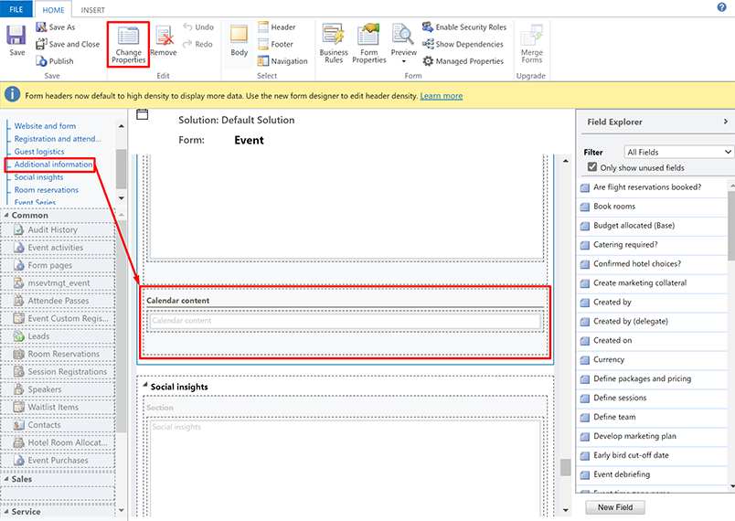

1. To make the calendar content field visible, select the checkbox next to **Visible by default**. Select **OK** to close the pane.

    > [!div class="mx-imgBorder"]
    > 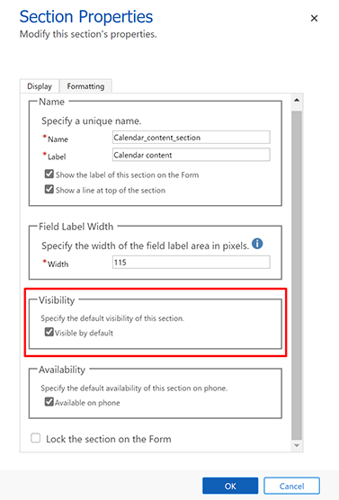

1. To save the changes you've made, select **Save** in the top ribbon. Then, to publish your updates, select **Publish**.

    > [!div class="mx-imgBorder"]
    > 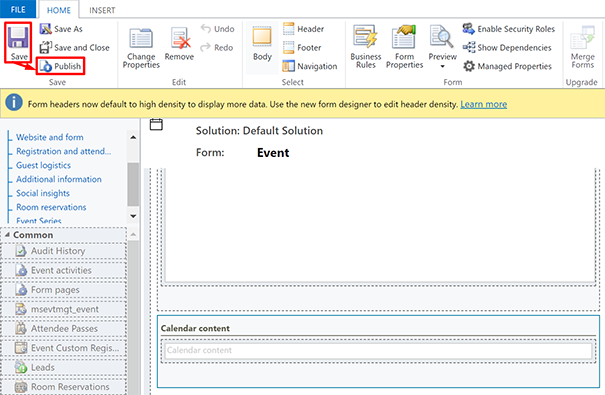

> [!NOTE]
> To see the **Calendar content** field under **Events** > **Additional information**, you will have to log out of, then log back into your Dynamics 365 Marketing app.

## Create the event registration email

After you have created your calendar content, you will create an email that welcomes registrants to the event or session and has a button to download the .ics file. The button will link to the API call, which will generate the .ics file with personalized information.

Your registration email can be as simple or as complex as you'd like. In this example, we'll create an email that welcomes the contact, automatically combs the registration database for the registration ID, and provides a button to download the .ics file.

#### 1. Create the greeting

Go to **Marketing execution** > **Marketing emails** > **+ New**. Choose a template. In this example, we'll select **1 column newsletter**. At the top, add a greeting using dynamic data to add the registrant's first name:

``Hey {{contact.firstname}}, thank you for registering!``

> [!div class="mx-imgBorder"]
> 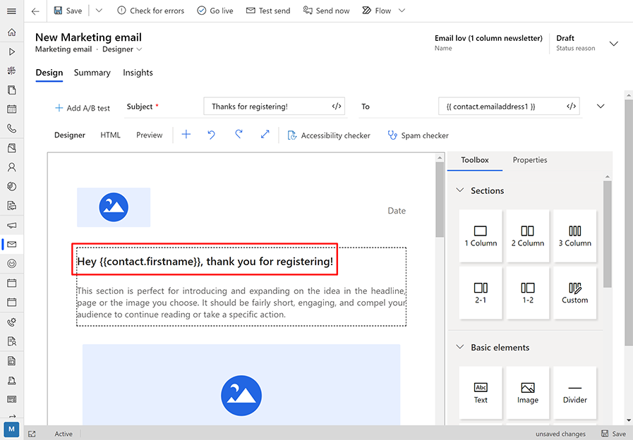

#### 2. Add a calendar invite button

Next, add a button to the email to download the calendar invite. Title the button:

``📅 Add to calendar``

> [!div class="mx-imgBorder"]
> 

#### 3. Add a QR code to match the contact with the event registration

Next, you will create an #each loop to automatically find the email recipient's registration. To simplify the process, you can reuse the loop from the QR button code.

To generate the code for the #each loop, add a QR code to the email below the greeting. In the **Properties** tab for the QR code, choose the event that you are creating the event registration email for. You will use the if/else condition that the QR code generates to find the email recipient's registration for the event. To use the condition, complete the following steps:

- Go to the **HTML** tab in the email designer. Find locate the QR code in the HTML by searching for ``<div data-editorblocktype="ERQRCode">``.
- Copy the HTML within the QR code ``<div>``. The HTML will look like the following, but will contain your unique event ID:
    - `` <!-- {{#each contact.msevtmgt_eventregistration_contact_msevtmgt_contactid }} -->``<br>
          ``<!-- {{#if (eq this.msevtmgt_eventid 'your-msevtmgt-event-id')}} -->``<br>
          ````<br>
          ``<!-- {{/if}} -->``<br>
          ``<!-- {{/each}} -->``

    > [!div class="mx-imgBorder"]
    > 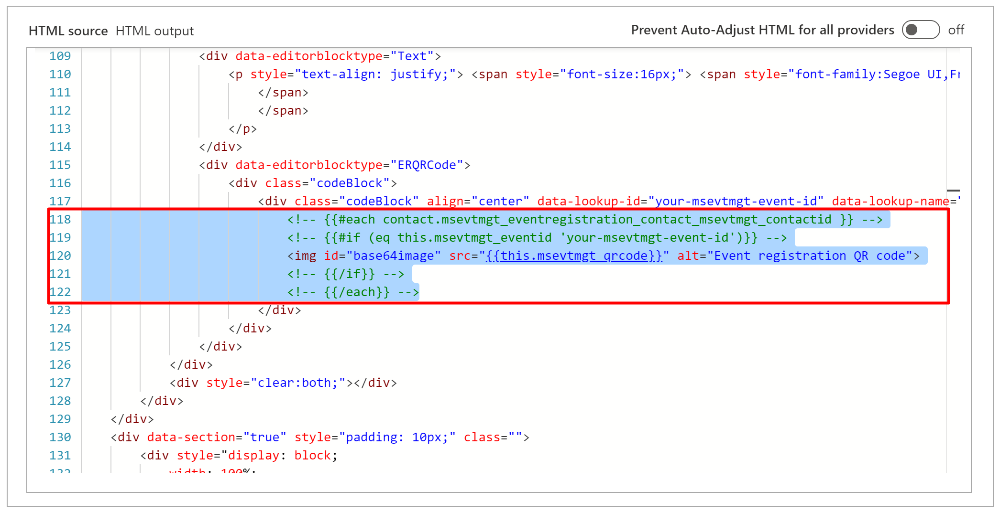

- Paste the QR code HTML into the ``<div>`` from the button that you created in the previous step. The correct location is in the line below ``<div data-editorblocktype="Button">``.
- Remove the QR code image from the QR code block by deleting the  tag and the content within it.
- Replace the image tag with the link (``<a>``) HTML from the button.
- Remove the original QR code **using the HTML editor**.

    > [!div class="mx-imgBorder"]
    > 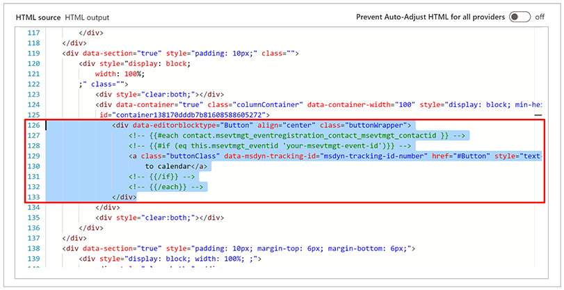

> [!IMPORTANT]
> You must remove the original QR code using the HTML editor, not the visual editor. If you use the visual editor to remove the original QR code, it will remove both instances of the QR code, including the instance that you created with your button link.

#### 4. Add the API call to the button

Using the HTML editor, add the API call as the href link that the button opens:

``https://{service-public-endpoint}/EvtMgmt/api/v2.0/calendar/personal/ics?api-version=2016-06-30&data=[{%22readableEventId%22:%22your-readable-event-id%22,%22data%22:{%22registrationId%22:%22{{this.msevtmgt_name}}%22,%22firstname%22:%22{{contact.firstname}}%22}}]``

The API call pulls the event and contact information and personalizes the .ics file. In this example, dynamic text passes the value of the contact first name ({{contact.firstname}}) to the {{firstname}} placeholder.

Make sure to enter your unique **service public endpoint** and **readable event ID**. Select **Save** *before* you exit the HTML editor.

> [!div class="mx-imgBorder"]
> 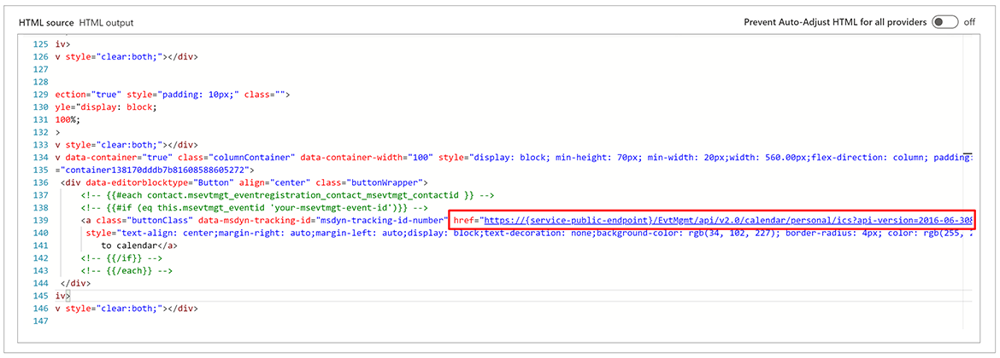

> [!IMPORTANT]
> If you do not save *before* exiting the HTML editor, the if/else condition will not be saved.

> [!NOTE]
> To pass the JSON parameters, you must substitute URL encoding (%22) for the quotation marks in the JSON structure. The above example already includes URL encoding.

#### 5. Customize, save, and go live with the event registration email

You can finish adding any further customizations you want to the registration email. After you are done, save the email again and select **Go live**.

## Using the .ics file

The above-detailed method creates an .ics file that downloads from a web browser when the recipient selects the button. If the recipient uses Outlook, this file will create a new calendar when he or she opens the file. It will not add the event to the recipient's default calendar.

You may want to provide a note in your email that alerts the recipient that he or she can add the event to the default calendar in Outlook by going to **File** > **Import/Export**, selecting the .ics file, and importing to the default calendar.

## Example HTML for the API call button for an event

``<!-- {{#each contact.msevtmgt_eventregistration_contact_msevtmgt_contactid }} -->``<br>
``<!-- {{#if (eq this.msevtmgt_eventid 'your-msevtmgt-event-id')}} -->``<br>
``<a class="buttonClass" href="https:{service-public-endpoint}/EvtMgmt/api/v2.0/calendar/personal/ics?api-version=2016-06-30&data=[{%22readableEventId%22:%22your-readable-event-id%22,%22data%22:{%22registrationId%22:%22{{this.msevtmgt_name}}%22,%22firstname%22:%22{{contact.firstname}}%22}}]" style="text-align: center;margin-right: auto;margin-left: auto;display: block;text-decoration: none;background-color: rgb(34, 102, 227); border-radius: 4px; color: rgb(255, 255, 255);line-height:30px;max-width:100%;mso-hide: none !important;width: 280px; height: 30px;"data-msdyn-tracking-id="1342ba1c4e7341606331766444">📅 Add to Calendar</a>``<br>
``<!-- {{/if}} -->``<br>
``<!-- {{/each}} -->``

## Example API response for an event

``“``<br>
``Ics file containing``<br>
``BEGIN:VCALENDAR``<br>
``VERSION:2.0``<br>
``CALSCALE:GREGORIAN``<br>
``METHOD:PUBLISH``<br>
``X-WR-CALNAME:test``<br>
``BEGIN:VEVENT``<br>
``DTSTART:20201113T185600Z``<br>
``DTEND:20201113T205600Z``<br>
``SUMMARY:test``<br>
``LOCATION:``<br>
``X-ALT-DESC;FMTTYPE=text/html:<div data-wrapper="true" style="font-size:14px;font-family:'Segoe UI','Helvetica Neue',sans-serif;"><div>&nbsp;</div><div>&nbsp;</div><div><span style="font-size:22px;"><span style="color:#e67e22;">Test this</span></span></div><div>&nbsp;</div><div><span style="background-color:#2ecc71;">bla bla 12345</span></div><div>&nbsp;</div><div><span style="font-size:72px;">This is big text</span></div><div>&nbsp;</div><div><span style="font-family:'Lucida Handwriting','Apple Chancery',cursive;">ALMOST COMIC SANSA</span></div><div>&nbsp;</div><div><span style="color:#e67e22;"></span></div></div>``<br>
``PRIORITY:3``<br>
``END:VEVENT``<br>
``END:VCALENDAR``<br>
``“``

## See also

[Using Events API](using-events-api.md)   
[Event management web application overview](event-management-web-application.md)
