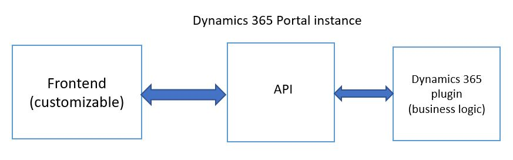
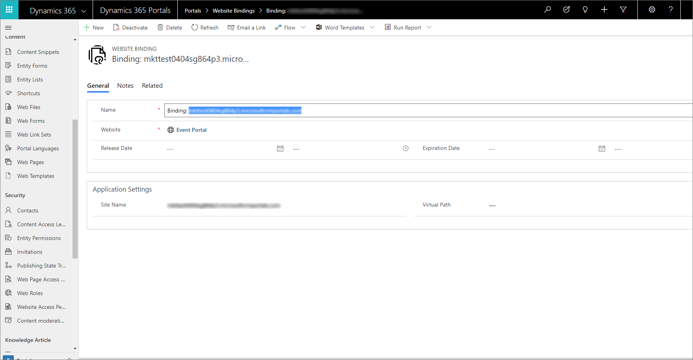
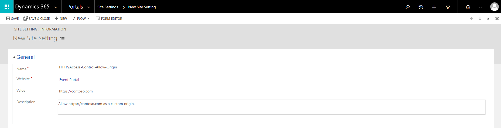

# Power Apps portal hosted

Before you start hosting a custom event website, complete the actions mentioned in the [Prerequisites](event-management-web-application.md) topic. The custom event website comes as a Power Apps portal hosted web application when you install the Event Management solution.

The frontend part of the application is bundled into two resource files that are stored as Power Apps portal [web files](https://docs.microsoft.com/dynamics365/customer-engagement/portals/web-files). The main single page application entry-point is stored as Power Apps portal [web template](https://docs.microsoft.com/dynamics365/customer-engagement/portals/store-content-web-templates).

Although the frontend definition is hosted on Power Apps portals, you can still fully customize it. The backend part of the web application is not customizable since the **REST API** endpoints are hosted on Power Apps portal as a set of [web pages](https://docs.microsoft.com/dynamics365/customer-engagement/portals/web-page). The code containing the business logic behind it resides in Event Management plugins which are not customizable.

> [!div class="mx-imgBorder"]
> 

## Additional project setup

## Environment configuration 

1. Duplicate the `environment.d365.ts` configuration file located in the **\src\environments** folder and name it as **environment.ts**.
1. Open the **environment.ts** configuration file in the developer environment of your choice.
1. Change the `apiEndpoint` variable to point to the **Website Bindings** value.
    > [!div class="mx-imgBorder"]
    > 

    > [!NOTE]
    > You need to add a trailing slash at the end of the URL.

1. Make sure that the `useRestStack` variable is set to false.

## Local Development

#### Bypass CSRF

You need to bypass the **anti-CSRF** token for local development. To do that, navigate to **Dynamics 365 > Portals > Web Templates** and open the **PortalAPI** web template and flip the flag `bypassTokenVerification` to `true`. Restart Portals to make sure that the settings are applied.

> [!NOTE]
> The **PortalAPI** web template is added by default when you install the Event Management data.

## Serving page locally

To serve the application locally, you need to follow the steps below:

1. Open Command Prompt or Windows PowerShell.

1. Run the command to install all the dependencies.

    ```CLI
    npm install
    ```
1. Run the command to generate the style.css file 

   ```CLI
   ng build --prod --output-hashing none
   ```

1. Run the command to start the local development server to see the changes immediately.

   ```CLI
   ng serve
   ```

    > [!NOTE]
    > You can find more information on serving an Angular application locally here [Serving an Angular application locally]( https://angular.io/guide/quickstart#step-3-serve-the-application)

## Deployment

To make your customizations visible in the event website, update the web files in **Portals**. This can be done automatically by using the provided script `DeployToDynamics365Instance.ps1`.

### Automatic Deployment

To deploy the customized Angular application, run the **PowerShell** script `DeployToDynamics365Instance.ps1` located under the **Scripts** directory. The script builds the application, prepares the output files suitable for hosting under the Power Apps portal instance. It takes the localization files from the `Localization` folder and prepares them for hosting.

After all the files are built, it asks you to sign in to your Dynamics 365 Marketing instance that you want to use to host your application. After you sign in, it pushes the files to the instance. If you don't see your changes, clear the browser cache and restart your **Portals**.

If you want to deploy some specific files rather than all the files at once, you can specify the list of files as a parameter for the script: `.\DeployToDynamics365Instance.ps1 -inputFiles main.es`. You can find the list with all the supported files in the scripts content.

> [!NOTE]
> - If you can't run the Powershell script because of your execution policy, then you need to [disable or bypass the execution policy](https://docs.microsoft.com/powershell/module/microsoft.powershell.security/set-executionpolicy?view=powershell-6&preserve-view=true).
> - We recommend not to upload files manually becuase of the accessibility issues. Use the `DeployToDynamics365Instance.ps1` script to bring your customizations automatically in to your instance.

## Configuring cross-origin resource sharing (CORS)

If you want to serve the custom event website from a **custom domain**, you need to configure CORS to allow that custom domain, to do that:

1. Go to **Dynamics 365&mdash;custom** > **Portals** > **Site Settings** and select **New** to create a  Site Settings record.
1. Insert `HTTP/Access-Control-Allow-Origin` in the name field.
1. Select your website.
1. Add the custom origin that should be allowed. For example, if the custom event website is hosted on `https://contoso.com/` custom domain than the value field must be set to `https://contoso.com/`.
1. Select **Save**.
1. Restart Portals to make sure that the settings are applied.
    > [!div class="mx-imgBorder"]
    > 

    > [!NOTE]
    > More information about CORS can be found here [CORS](https://developer.mozilla.org/docs/Web/HTTP/CORS) [Access-Control-Allow-Origin](https://developer.mozilla.org/docs/Web/HTTP/Headers/Access-Control-Allow-Origin)

### Manually overwriting sample website

If you want to overwrite the sample website to match the version of event management that you have currently, see [Manually overwriting sample website](manually-overwriting-sample-website.md)<br />

### See also

[Localization](event-portal-localization.md)<br />
[Build and host custom event website](event-management-web-application.md)
