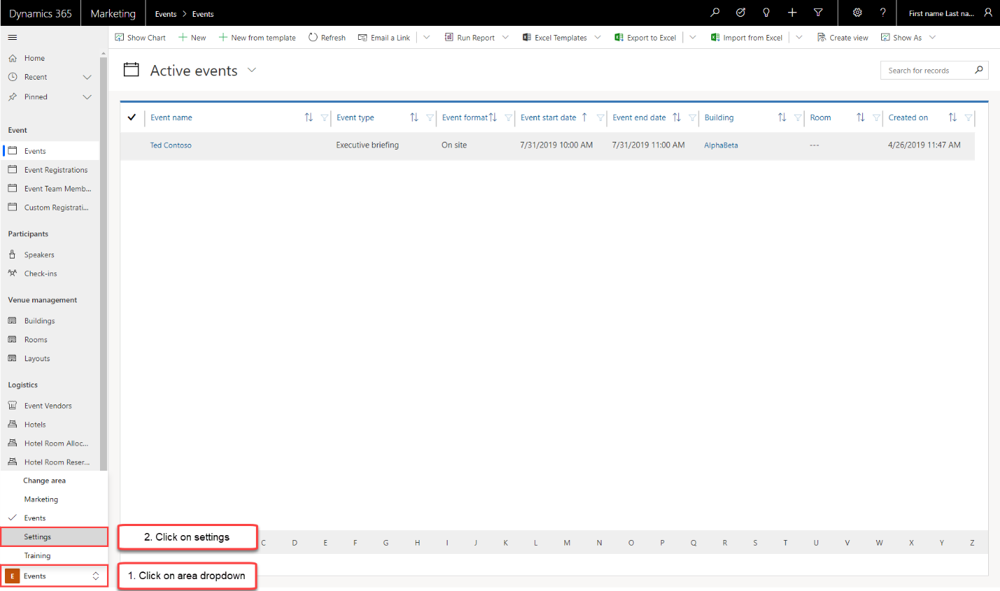
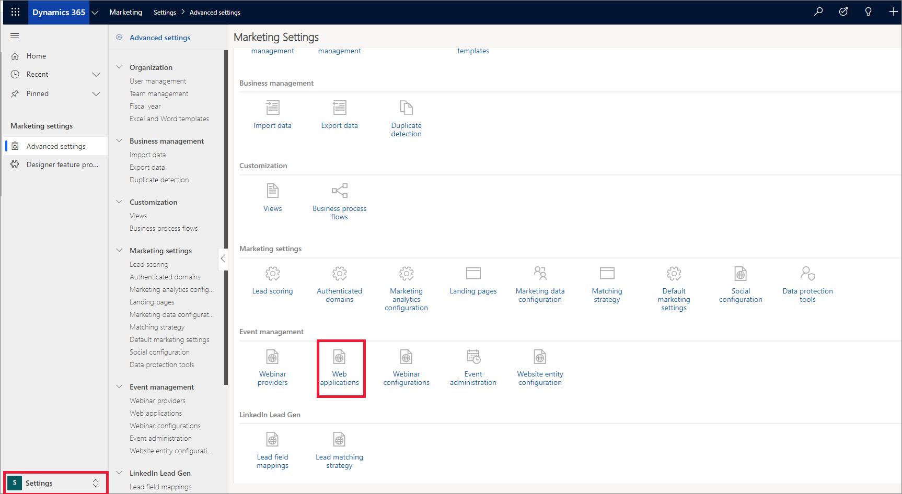
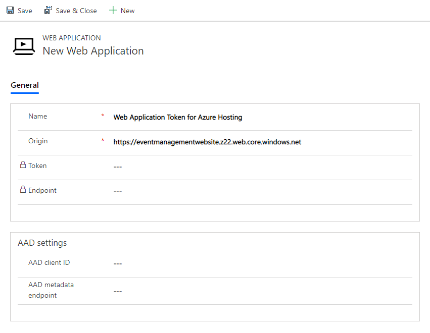

# Register your web application to use Events API

To use the Events API, you need to provide a web application token in each request. The web application token is used to control API requests that are associated with your organization. Follow the steps given below to register your web application:

1. Open your Dynamics 365 Marketing instance and navigate to **Event Management**.
2. Select the drop-down and select **Settings**

    
    
3. Select **Web applications**.
    
    
    
4. Select **New** to create a new web application token.
5. Enter details in the **Name** field.
6. For the **Origin** field enter the  URL from where your application is served in the **Primary endpoint** value that you got while enabling the static website. For example: `https://localhost:4200` or `https://contoso.com`.

   
   
   > [!NOTE]
   > When you enter the Primary endpoint value, make sure that you don't have a trailing slash (/) at the end of the url.
   
7. Select **Save**. You will get the web application token and the API endpoint. 

## See also

[Using Events API](using-events-api.md)
