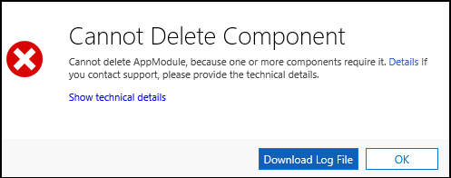

# Remove custom channel

This step is typically performed by administrators of your Dynamics 365 Marketing instance.

To remove a custom channel app from your Dynamics 365 Marketing instance, you will first have to ensure that none of the components of the custom channel app are in use. This implies that before removing a custom channel app, you will have to remove the custom tile from your customer journeys, or delete the customer journeys containing the custom tile altogether. This includes journeys in any state: draft, live or even past journeys in stopped/expired state. 

This is because the custom channel app is a [managed solution](/powerapps/developer/common-data-service/introduction-solutions#managed-and-unmanaged-solutions), and the solution component [dependency tracking](/powerapps/developer/common-data-service/dependency-tracking-solution-components) feature *prevents* you from deleting a managed solution if any of the managed solution component is used by other components in a customization.

After you have taken care of the dependencies, delete the managed solution to remove the custom channel app from your Dynamics 365 Marketing instance. More information: [Uninstall or delete a solution](/powerapps/developer/common-data-service/uninstall-delete-solution)

If there are any customer journeys that still use one or more components of the custom channel app solution, you will receive the following error on deleting the custom channel app solution:

Review your customer journey records to identify the ones still using the custom tile, remove the custom tile from the customer journey or the customer journey record itself, and then retry deleting the custom channel app solution.

## See also 

[Configure and use custom channel](configure-use-custom-channel.md)

[Introduction to solutions](/powerapps/developer/common-data-service/introduction-solutions)

[Work with solutions](/powerapps/developer/common-data-service/work-solutions)

[!INCLUDE[footer-include](../../includes/footer-banner.md)]