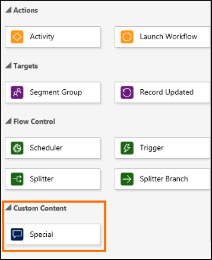

# Step 4: Test your custom channel tile

To make the custom channel tile available in the customer journey designer:

1. Create a solution. More information: [Create a solution](/powerapps/maker/common-data-service/create-solution)
2. Add the tile CSS file as a **Style Sheet (CSS)** web resource to the solution you created. Note the generated file name as the name will contain publisher prefix (for example, sample_). This file name needs to be used in the tile XML file. More information: [Create or edit web resources to extend a web application](/powerapps/maker/model-driven-apps/create-edit-web-resources)
3. Add the tile XML file as a **Data (XML)** web resource to the solution you created. The file name must end with 'CustomerJourneyDesignerTileConfig.xml’.
4. Save the solution and publish all customizations.
5. Create a customer journey to open the customer journey designer. Go to **Marketing** > **Marketing Execution** > **Customer Journeys**, and then select **New**. For more information about creating a journey, see [Create a simple customer journey](../../marketing/create-simple-customer-journey.md).
    
    The tile should show up in the **Custom Content** section of the tile library in the customer journey designer.

    

> [!div class="nextstepaction"]
> [Publish custom channel on AppSource](publish-custom-channel-appsource.md)

## See also

[Web resources in model-driven apps](/powerapps/developer/model-driven-apps/web-resources)

[!INCLUDE[footer-include](../../includes/footer-banner.md)]