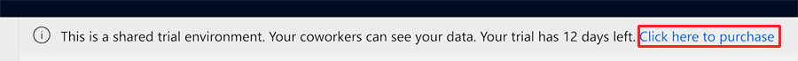
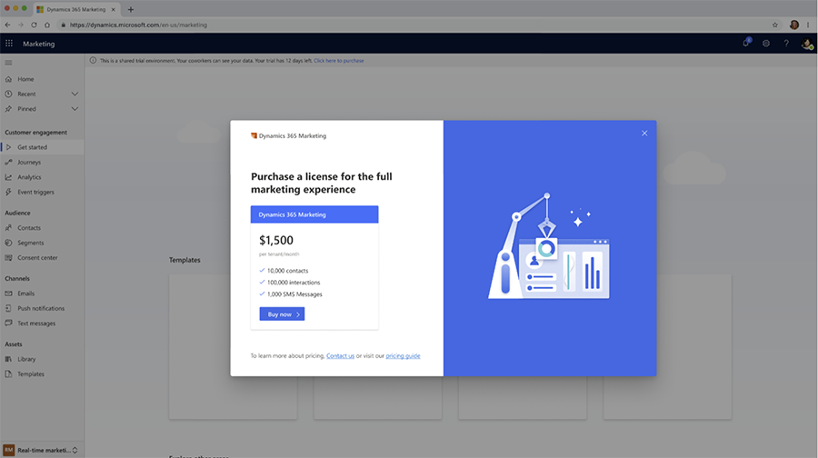
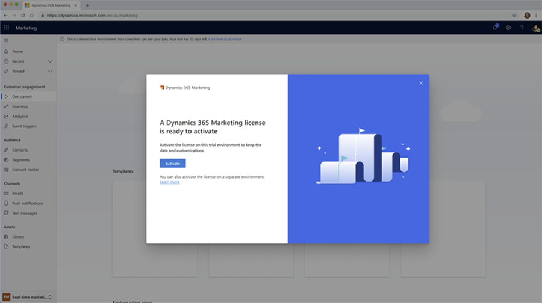

# Purchase a license directly from a Marketing trial

> [!VIDEO https://www.microsoft.com/videoplayer/embed/RE55wwx]

You can now purchase a Marketing license directly from a Marketing trial. Both tenant admin and non-tenant admins (users), like marketing department heads, can now directly purchase the Marketing environment SKUs (Dynamics 365 Marketing App, Dynamics 365 Marketing Attach, Additional Production Environment, and Additional Non-Production Environment) and convert the trial environment to a paid, production environment in one streamlined workflow.

This article details who can purchase a license within the app, how can they purchase a license, and what happens after the purchase.

## Who can purchase a license from a trial?

From a trial, tenant admins can enter the direct purchase flow. If tenant admins haven't disabled self-service purchases for non-tenant admins (users), non-tenant admins (also called departmental purchasers) can enter the purchase flow and sign-up for a subscription with a credit card.

## Purchase a license within a trial

To purchase a license within a Marketing trial, select **Click here to purchase** from the information banner at the top of the screen in your trial.

> [!div class="mx-imgBorder"]
> 

A modal window opens and shows you the appropriate license for your tenant based on existing licenses that are on the tenant. You'll see one of the following:

- **Dynamics 365 Marketing license**: Includes one production environment, 10,000 contacts, and 100,000 interactions. You'll see this if your company’s tenant has no pre-existing Dynamics 365 licenses.
- **Dynamics 365 Marketing Attach**: This is a discounted price Dynamics 365 Marketing license if your company’s tenant has a pre-existing Dynamics 365 license (Dynamics 365 Sales, Dynamics 365 Customer Service, Dynamics 365 Field Service, Dynamics 365 Supply Chain Management, Dynamics 365 Finance, Dynamics 365 Commerce).
- **Dynamics 365 Marketing Additional Production or Non-production Environments**: These licenses don't have additional quota and appear if your tenant already has a Dynamics 365 Marketing or Attach license.

> [!div class="mx-imgBorder"]
> 

> [!NOTE]
> The license shown depends on whether you already have another qualifying Dynamics 365 app with 10 or more users. Learn more: [Get started with Dynamics 365 Marketing licensing](marketing-license.md).

Next, enter your purchase information to finalize the transaction.

## What happens after the purchase

After your purchase is processed, the page will return to the trial and inform you that your license is ready to activate. You have two options:

1. To convert the existing trial environment to a paid instance using any available license on the tenant, select the **Activate** button.
1. To create a new environment to apply the license to or to apply the license to an existing Dynamics 365 environment with other apps already installed, select the **Learn more** link.

> [!div class="mx-imgBorder"]
> 

> [!NOTE]
> If you do not have the required administrator user privileges to activate a license in the current environment, you will be shown a window that informs you that the license is ready to activate and to contact the system admin for the environment. To apply the license, the app administrator must assign you app admin rights or they can also activate the trial and apply the license. Learn more: [Manage user accounts, user licenses, and security roles](admin-users-licenses-roles.md).
>
> Alternatively, you can activate the license on a separate environment you create on which you are the app admin. Learn more: [Create and manage environments in the Power Platform admin center](/power-platform/admin/create-environment).

After you activate the license, your trial environment will change to a full production environment. This means that the database environment will be moved to a production scale group and some other optimizations will take place. This process can take 20 to 30 minutes to complete. The app may experience some downtime while the upgrade is in progress.

> [!IMPORTANT]
> - Your new Marketing license will appear on your tenant instantly, but will take up to 24 hours to replicate in the Power Platform admin center. 
> - Additionally, you will experience some Marketing app downtime while your trial app is being upgraded. The downtime may last from 15 minutes to an hour.

## Manage your subscription

You can go to the [Power Platform admin center](https://admin.microsoft.com/) to manage your subscription and limit and control the purchase experience. Management capabilities depend on whether have an administrator or user role.

In the admin center, *tenant admins* can:
- Disable purchase by product ID of any product.
- View all departmental purchases made in the org.
- Cancel any departmental purchase and (optionally) move assigned users to an org purchase.

Learn more: [Manage self-service purchases (Admin)](/microsoft-365/commerce/subscriptions/manage-self-service-purchases-admins).

In the admin center, *non-tenant admins* (departmental purchasers) can:
- Acquire a departmental license through a paid/trial motion.
- Add/remove licenses as needed.
- Pay their bill/manage their account.

Learn more: [Manage self-service purchases (Users)](/microsoft-365/commerce/subscriptions/manage-self-service-purchases-users).

Put simply, the purchaser controls anything money-related. The tenant administrator can cancel the subscription but can't make a user pay more or less and can't take something a user paid for and give it to someone else.

[!INCLUDE[footer-include](../includes/footer-banner.md)]