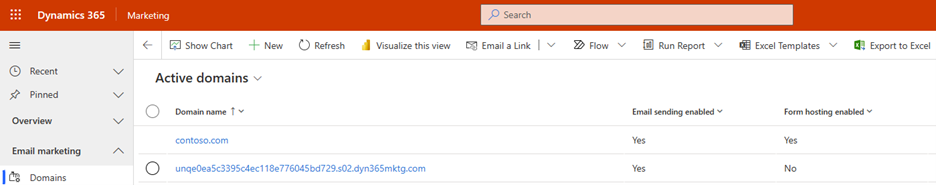
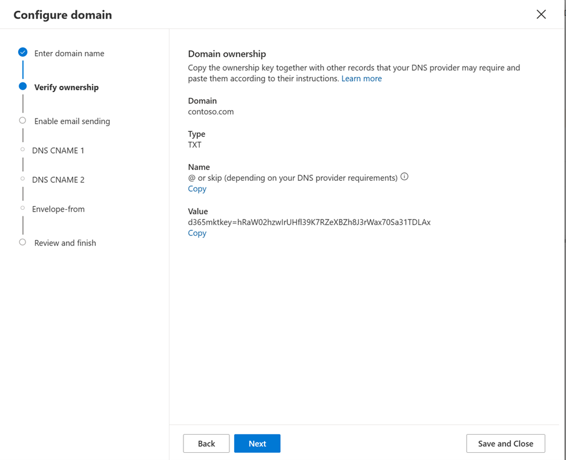
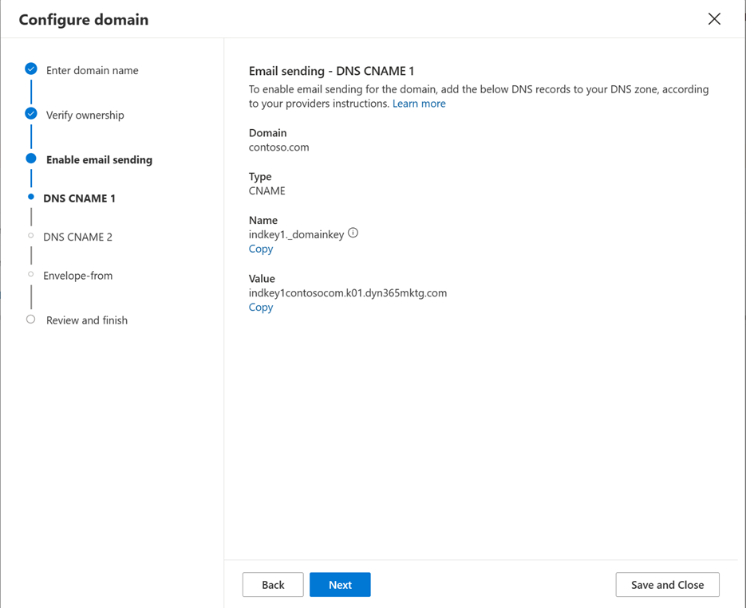
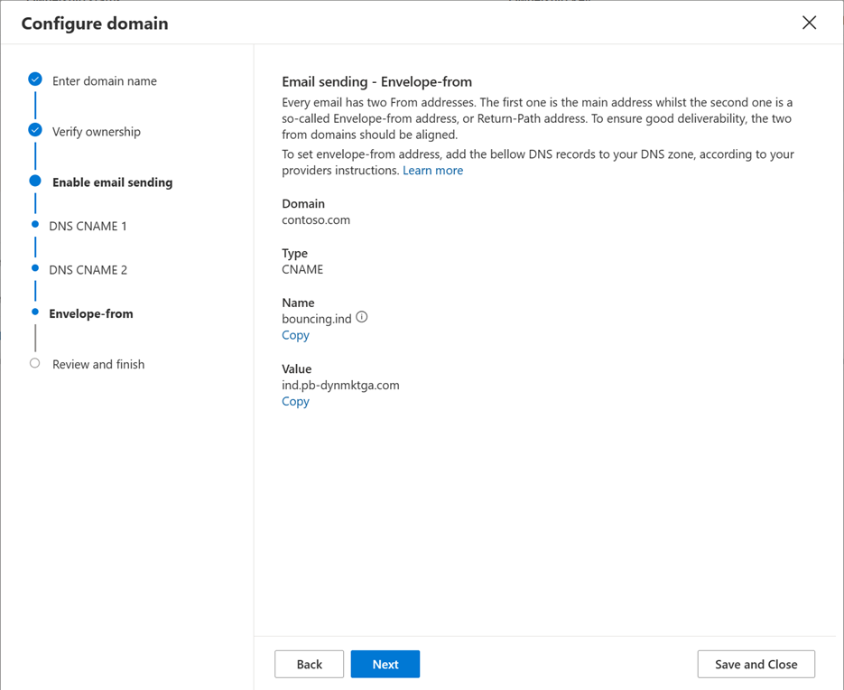
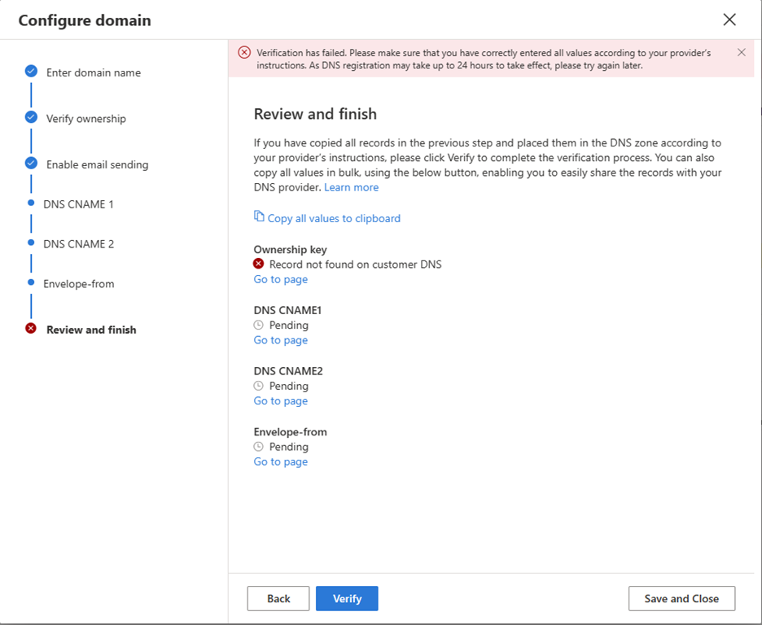
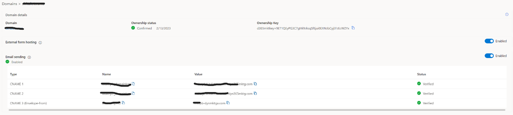

# Authenticate your domains in real-time marketing

Domain authentication is important for many reasons:
- For marketing email messages, domain authentication enables recipient email servers to confirm that the from-address shown on each of your messages belongs to your organization. Authentication also confirms that your organization has approved Dynamics 365 Marketing to send messages on its behalf. Messages that fail this test are increasingly likely to get filtered away as spam, which can dramatically impact your deliverability.
- For externally hosted forms, domain authentication confirms that you own the domain, establishing an enhanced trust relationship with your domain. The enhanced trust relationship enables embedded marketing forms to be prefilled with data for known contacts.
- Domain authentication will also enable DomainKeys Identified Mail (DKIM), Sender Policy Framework (SPF) protection for your emails and ensure your From and Return-Path addresses align, improving your brand representation in the email.

The primary purpose of email-domain authentication is to protect both the sender and the recipient from any potentially fraudulent activities using email like spam, phishing, or scams by enabling SPF and DKIM. 

DomainKeys Identified Mail (DKIM) is a method that helps to protect email content and headers. It's based on public/private key encryption and signatures verified using published DNS records for sender domain. This type of encryption provides valuable feedback to the recipient, that the email is sent from a verified sender. And its content hasn't been modified during the transfer phase.

SPF is another type of protection and authentication that ensures that an email was sent from a trusted source (IP address) set up by a sender domain owner.

When you error check or go live with a marketing email message, the verification system requires that the message uses a from-address from an authenticated domain registered and confirmed for your organization. You get an error if you try to send a message that has a from-address from an unregistered domain. 

To learn more about email marketing and deliverability, see [Best practices for email marketing](get-ready-email-marketing.md). To learn more about embedded forms and prefilling, see [Integrate with landing pages on external websites](embed-forms.md).

## The default authenticated domain

By default, all new Dynamics 365 Marketing installations come with a preauthenticated sending domain ending in dyn365mktg.com. The preauthenticated domain is there to help you start sending authenticated emails right away. This domain is designed only for initial feature testing or demo purposes as it doesn’t have an email reputation and isn't connected to your organization. It's required that you authenticate your own actual sending domains right away so your authenticated messages will show a from address that recipients recognize as coming from your organization. Authenticating your own domain allows you to manage your sending reputation and will improve brand recognition and deliverability results.

When a user creates a new email, the **From address** is automatically set to the email address registered for that user's Dynamics 365 Marketing user account. However, if that email address uses a domain that isn't yet authenticated using DKIM, then the initial **From address** will be modified to use an authenticated domain (email addresses use the form account-name*@*domain-name). The resulting **From address** will still show the account-name of the user creating the message, but will now show a DKIM-authenticated domain-name that's registered for your Marketing instance (for example, MyName@contoso.s01.dyn365mktg.com), which will provide the deliverability benefit, but probably isn't a valid return address. 

## Which domains to authenticate

Set up as many authenticated domains as you need to cover all the from-addresses you use in your marketing emails, plus all domains and subdomains where you want to support embedded forms with prefill enabled.
- When you're authenticating a domain for email, use the full domain name as it appears in your email return addresses. Email addresses take the form \<MailAccount\>@\<domain\>, so if your email address is lamar.ferrari@contoso.com, then the domain you need to authenticate is contoso.com (not www.contoso.com or any other subdomain).
- When you're authenticating a domain to support prefilled forms, you must authenticate each subdomain individually. So if you have forms on contoso.com, www.contoso.com, and events.contoso.com, then you must set up a separate domain-authentication record for each of them and specify the full subdomain each time.

> [!IMPORTANT]
> To use form pre-filling, the page hosting the form must be served over HTTPS (not HTTP).
>
> Form pre-filling is **only** supported in outbound marketing forms.

> [!NOTE]
> All new instances and trials automatically authenticate their instance domain with DKIM and SPF and set that domain as the default sending domain for your instance. Therefore, you'll usually see at least one authenticated domain already set up for all new instances. It should not be used for production email sending purposes, as it is designed only for initial testing purposes.  Make sure to authenticate your own domain before you go live. 

## Prevent sending emails from unauthorized domains

To benefit from domain authentication, the from-address for each message you send must show a domain that you've previously authenticated. Microsoft is dedicated to helping our customers achieve maximum email deliverability, so we've added a few features to help make sure you don't overlook or inadvertently work around your domain setup:
- The error check for email messages will show an error if you try to go live with an email message that has a from-address not associated with any of your domains.
- We recommend that you [set a default sending domain](mkt-settings-default-marketing.md) that is your authenticated domain. When this is set, then the from-address for all your email messages will automatically be adjusted to show your selected default domain (if it initially uses a non-authenticated domain) each time you create a new email message or change the user shown in the **From** field. More information: [Default marketing settings](mkt-settings-default-marketing.md) and [Set sender and receiver options](email-properties.md#set-sender-and-receiver-options)
- All new instances and trials will automatically authenticate the default instance domain with SPF/DKIM enabled and set that domain as the default sending domain for your instance.

## Authenticate a domain

To set up an authenticated domain in Dynamics 365 Marketing you'll need to access your domain’s DNS control panel to be able to add new records as you go through the domain authentication process. 
To authenticate a domain:
- Go to **Settings > Email marketing > Domain authentication**. A list of existing authenticated domains opens.  

> [!div class="mx-imgBorder"]
> 

- Select **New** on the command bar to add a new domain. The wizard guides you through the whole domain authentication process step by step. On the first step you'll need to enter the domain name that you want to authenticate and select if it will be used for forms hosting and email sending capabilities.

> [!div class="mx-imgBorder"]
> 

- On the next step you'll be asked to add your first DNS record, which will check and confirm the ownership of your domain. Use “Copy” buttons to accurately copy the values of TXT record to avoid typos. 

> [!div class="mx-imgBorder"]
> 

- The next two steps guide you through the setup process of CNAME records (CNAME1 and CNAME2) that stand for DKIM protection functionality.

> [!div class="mx-imgBorder"]
> 

> [!div class="mx-imgBorder"]
> 

- The next step stands for the last required CNAME DNS record, which is for Envelope-From (Return-Path) domain alignment and SPF protection functionality.

> [!div class="mx-imgBorder"]
> 

- On the last step you'll be able to review and check your published DNS records. After your checkup is finished, select **Verify**. The system will check and validate all published DNS records and will show you the result summary on the dashboard. If there’s something wrong with your DNS records, you'll see which exact record fails on the dashboard.

Here’s an example of an error message that states that TXT Ownership key wasn't found published in the DNS, which means either the record wasn't yet published, or it has some mistake/typo.

> [!div class="mx-imgBorder"]
> 

After everything is finished, you'll see green checkmarks next to each DNS record and Confirmed status on your dashboard, which means that your domain authentication is ready.

> [!div class="mx-imgBorder"]
> 

> [!NOTE]
> You can authenticate more than one domain or subdomain of your choice.  
www.yourdomain.com and yourdomain.com are 2 different domains and should be added separately. 
Technically it is possible to add www.yourdomain.com to use it for sending emails, but we do not recommend doing that as the From email address would look like markreting@www.yourdomain.com instead of marketing@yourdomain.com.

> There are known issues when it is not possible to add a TXT record to a domain or subdomain due to DNS limitations, as it already has existing working CNAME record published.
>
> In such cases you may use an alternative method for domain ownership confirmation. Instead of adding TXT record to the root of domain/subdomain you need to create a TXT record for a subdomain dynmktown.yourdomain.com.
>
> This will validate your ownership for domain yourdomain.com.
>
> The same scenario will work for a subdomain. For example, to validate domain mail.yourdomain.com you will need to add a TXT record to dynmktown.mail.yourdomain.com.

### Updating a domain's SPF record

The domain authentication wizard described above provides all the configuration needed according the RFC standards. However, there are a few email providers that don't follow the RFCs and validate received emails by verifying the From address with the SPF record. To prevent email bounces from these email providers, you can update the SPF record in your domain to include the Dynamics Marketing domain. To do this, update the existing SPF record by adding `include: &lt;dynamicssendingdomain&gt;`, where `&lt;dynamicssendingdomain&gt;` is the value as obtained in the registration for the Envelope-From (*ind.pb-dynmktga.com* in the screenshot shown above).

## Domain authentication for modernized business units

When [modernized business units](real-time-marketing-modernized-business-units.md) are turned on, and [business unit scoping](real-time-marketing-business-units.md) is enabled, the domain authentication wizard gives users the ability to select on what business unit they want their domain to be authenticated. 

When a business unit is selected for a domain, this domain is accessible only for this business unit unless you select to make it shareable across your organization. 

To authenticate a domain for a business unit: 

1. Go to Settings > Domains > and select “**New**” button. 
1. The domain authentication wizard pops up with the following items: 
    1. Business unit – Lookup field to select the needed Business Unit. You’ll see only the business units that you're authorized to access. 
    1. Enable across organizations – Checkbox that: 
        1. If selected, your domain belongs to the selected business unit, and all other business units can access and utilize. 
        1. If not selected, your domain belongs to the selected business unit only, and no other business unit can access. 
        1. Domain name – Is the domain you want to authenticate. 
1. The rest of the wizard follows the usual process of domain authentication. 

### See also

[Domain authentication in Outbound marketing](mkt-settings-authenticate-domains.md)

[!INCLUDE[footer-include](../includes/footer-banner.md)]
