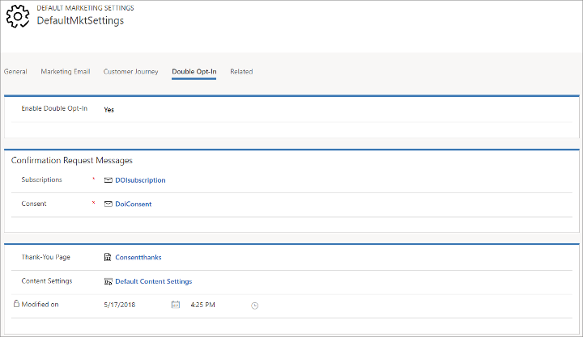

# Set up global double opt-in for new subscriptions and consent changes

The _global double opt-in_ process (also known as _confirmed opt-in_) asks contacts who sign up for a new subscription list, or who choose to increase their level of [data-protection consent](gdpr.md), to confirm their request by clicking on a link sent to their registered email address. This system helps make sure that the request is intentional, and that the supplied email address is legitimate and functional.

The global double opt-in process works as follows:

1. A new or existing contact uses a [subscription form](set-up-subscription-center.md) or landing page to subscribe to a newsletter or adjust their consent level.
2. On submitting the form, the contact is shown a page that tells them to check their email for a confirmation message that includes a link the contact must click on to confirm their request.
3. Dynamics 365 Marketing sends a confirmation email of the appropriate type (subscribe or consent) to the address registered for the contact.
4. The contact opens the confirmation email, reads the text, and clicks the link. This opens a web browser, which submits a coded URL that identifies the contact and request message to Dynamics 365 Marketing.
5. Dynamics 365 Marketing registers the click, applies the requested subscription or consent change, logs the change, and immediately redirects to a thank-you page that is shown to the contact.

> [!IMPORTANT]
> The link in confirmation email remains valid for 30 days. After that period, end user will not be able to confirm his opt-in. 

Double opt-in is a good idea in all countries/regions, and in many countries/regions (especially in Europe), it's required by law.

Read this topic to learn how to set up each element required for the global double opt-in system and how to enable global double opt-in for your instance.

> [!NOTE]
> This article explains how to set up global double opt-in. To set up double opt-in a per-form basis (for any form submission), go to the [Form double opt-in](form-double-opt-in.md) article.

## Create a subscription confirmation-request message

A subscription confirmation-request message is sent to contacts each time they register for a new newsletter subscription while global double opt-in is enabled for your instance. This applies both to known contacts using a subscription center, and for new contacts registering for the first time.

> [!NOTE]
> Dynamics 365 Marketing sends a separate confirmation-request message for each subscription list a contact chooses to join, even if they enable several lists at once.

To create a subscription confirmation-request message:

1. Go to **Marketing execution** > **Marketing emails** to open the marketing email list view.

2. Select **New** to create a new message.

3. In the **Select an email template** window, go to the **Filter** tab, select the **Purpose** dropdown, and choose **Double opt-in, email base confirmation** from the drop-down list there.

4. Select the **custonaci** or **diamante** template (or another template created by your organization for this purpose), which is already prepared with the following:

   - Default content that includes Handlebars expressions to place the recommended dynamic content.
   - A confirmation button preconfigured with the required target URL (as a Handlebars expression).
   - The **Content type** set to **Confirmation request**.
   - The **Legal designation** set to **Transactional**.
    
     See also the example given after this procedure. For the example, we'll select the **diamante** template.

     > [!NOTE]
     > The show-as-webpage feature doesn't work with confirmation-consent messages, so it's not included in the template and you shouldn't try to add it.

5. Customize the message as required.

6. Check for errors and go live.
    > [!NOTE]
    > You can't use the **Test Send** button to send yourself a test message when you are designing a confirmation-request message. To test your message design, set up a test subscription page and try to sign yourself up for a mailing list.

The previous illustration highlights important elements provided by the **diamante** template, with the **Properties** pane showing settings for the confirmation button. Note especially the Handlebars expressions, which are placeholders for dynamic values that will be resolved independently each time the message is sent. The following Handlebars expressions are available:

- **{{Message.ConfirmationRequestType}}**: Resolves to show the type of confirmation message this is (as established in the [Default marketing settings](#set-up-doi) when the message is sent). For subscription confirmations, this is "Marketing list subscribe" by default.
- **{{Message.ConfirmationObjectName}}**: Resolves to the **Name** field of the [subscription list](set-up-subscription-center.md#create-subscription-list) the contact has asked to join.
- **{{Message.ConfirmationObjectDescription}}**: Resolves to the **Description** field of the [subscription list](set-up-subscription-center.md#create-subscription-list) the contact has asked to join.
- **{{Message.ConfirmationRedirectURL}}**: Resolves to a URL that targets the Dynamics 365 Marketing server and includes a code that uniquely identifies the contact the message was sent to and the message itself. All confirmation-request messages must include a button (or link) that targets this Handlebars expression (otherwise, contacts will not be able to confirm).

The following screenshot shows a Dynamics 365 Marketing subscription-list record with the **Name** and **Description** fields highlighted. These are the values that you can include in your subscription confirmation-request message.

More information: [Email marketing overview](prepare-marketing-emails.md), [Set up subscription lists and subscription centers](set-up-subscription-center.md)

## Create an increase consent confirmation-request message

The increase consent confirmation-request message is sent to contacts each time they increase their consent level using a subscription center or landing page. No confirmation message is required when a contact chooses to reduce their consent level.

**Important**: Make sure that your consent confirmation-request message clearly explains why consent is important and what it means. It is important that you build a trusting relationship with your contacts, and that their consent confirmations reflect an informed decision-making process on their part.

To create an increase consent confirmation-request message:

1. Go to **Marketing execution** > **Marketing emails** to open the marketing email list view.

2. Select **New** to create a new message.

3. In the **Select an email template** window, go to the **Purpose** tab and chose **Double opt-in, email base confirmation** from the drop-down list there.

4. Select the **custonaci** template (or another template created by your organization for this purpose), which is already prepared with the following:

   - Default content that includes Handlebars expressions to place the recommended dynamic content.
   - A confirmation button preconfigured with the required target URL (as a Handlebars expression).
   - The **Content type** set to **Confirmation request**.
   - The **Legal designation** set to **Transactional**.

     See also the example given after this procedure.
    
     > [!NOTE]
     > The show-as-webpage feature doesn't work with confirmation-consent messages, so it's not included in the template and you shouldn't try to add it.

5. Customize the message as required.

6. Check for errors and go live.
    > [!NOTE]
    > You can't use the **Test Send** button to send yourself a test message when you are designing a confirmation-request message. To test your message design, set up a test subscription page and use it to increase your consent level.

The previous illustration highlights important elements provided by the **custonaci** template, with the **Properties** pane showing settings for the confirmation button. Note especially the Handlebars expressions, which are placeholders for dynamic value that will be resolved independently each time the message is sent. The following Handlebars expressions are available:

- **{{Message.ConfirmationRequestType}}**: Resolves to show the type of confirmation message this is (as established in the [Default marketing settings](#set-up-doi) when the message is sent). For consent-level confirmations, this is "Raise consent" by default.
- **{{Message.ConfirmationObjectName}}**: Resolves to the name of the consent-level field as defined on the contact entity (by default, "Consent given").
- **{{Message.ConfirmationObjectValue}}**: Resolves to the **Options** value for the new consent level the contact has chosen (e.g., "(2) Transactional").
- **{{Message.ConfirmationObjectDescription}}**: Resolves to the **Description** field for the new consent level the contact has chosen.
- **{{Message.ConfirmationRedirectURL}}**: Resolves to a URL that targets the Dynamics 365 Marketing server and includes a code that uniquely identifies the contact the message was sent to and the message itself. All confirmation-request messages must include a button (or link) that targets this Handlebars expression (otherwise, contacts will not be able to confirm).

The following screenshot shows an **Option Set** setup with the **Options** and **Description** fields highlighted. These are the values that you can include in your consent confirmation-request message. Note that each entry in the **Options** list has its own **Description**. More information: [Create and edit global option sets](https://docs.microsoft.com/powerapps/maker/common-data-service/create-edit-global-option-sets)

More information: [Data protection and the GDPR](gdpr.md)

## Create a content-settings record for confirmation-request messages

All marketing email messages include dynamic values taken from the content-settings record associated with the message at send time. Unlike most marketing email messages, which are sent by a customer journey that determines the content settings to use, consent messages are often sent outside the context of a customer journey so you must have a content-settings record available for use with them.

You might have just one content-settings record set up for your system, which you already use for all your customer journeys, or you might have several different ones for use in different contexts. You can reuse any of these records for your confirmation-request messages if you want to, or you can create a new one dedicated to these messages only.

Review your content-settings records and decide which to use (or create a new one if needed).

You will choose the content-settings record to use for all confirmation-request messages when you set up global double opt-in for your instance, as described later in this topic.

More information: [Use content settings to set up repositories of standard and required values for email messages](dynamic-email-content.md#content-settings)

## Create a thank-you page for each type of confirmation

When a contact clicks the confirmation link in a confirmation email, Dynamics 365 Marketing registers the confirmation, applies the requested action, and redirects the contact's browser to a thank-you page. You must create your thank-you pages as [marketing pages](create-deploy-marketing-pages.md) in Dynamics 365 Marketing. Thank-you page templates are provided out-of-the-box to help get you started.

## Set up and enable global double opt-in on your instance

The double opt-in feature is global for your Dynamics 365 Marketing instance. When it's enabled, all new-subscription and increase-consent requests will require double opt-in and the same settings will apply everywhere.

Before you start to set up and enable global double opt-in, make sure you have all the other elements described previously in this topic available to your system, including:

- A _subscription confirmation-request_ email message.
- An _increase consent confirmation-request_ email message.
- A _content-settings record_ for use with all confirmation-request messages.
- A _thank-you page_ to redirect to after a contact confirms each type of request.

To set up and enable the global double opt-in system:

1. Go to **Settings** > **Advanced Settings** > **Marketing Settings** > **Default marketing settings.**

1. A list of default settings records opens. Usually there will be just one record here. Open the available record—or the one that is currently active (which has its **Default** field set to **Yes**).

1. Open the **Double opt-in** tab on the **Default marketing settings** page.  
    

1. Make the following settings:

    - **Enable double opt-in**: Set to **Yes** to enable global double opt-in on your instance. Set to **No** to disable it.
    - **Subscriptions**: Identify the marketing email message you created to send to contacts when they add themselves to a subscription list.
    - **Consent**: Identify the marketing email message you created to send to contacts when they submit a request to increase their consent level.
    - **Thank-you page for newsletters**: Select a marketing page to show to contacts after they confirm a new subscription.
    - **Thank-you page**: Select a marketing page to show to contacts after they confirm an increase of their consent level.
    - **Content settings**: Identify the content-settings record you chose to use for all double opt-in messages.

1. Select the **Save** button in the bottom-right corner to save your settings.

### See also
[Form double opt-in](form-double-opt-in.md)

[!INCLUDE[footer-include](../includes/footer-banner.md)]
