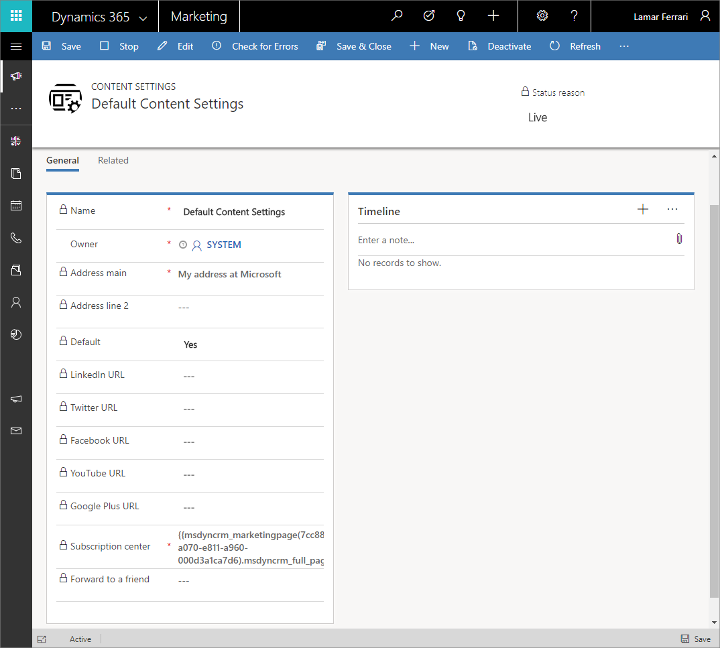
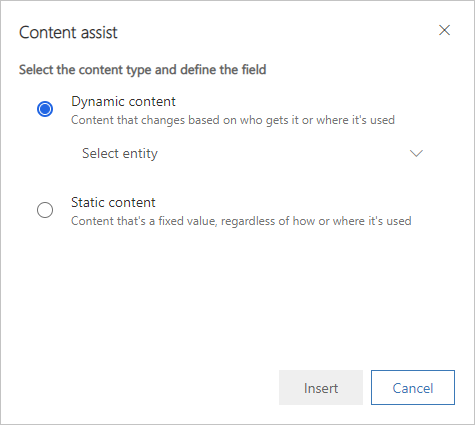
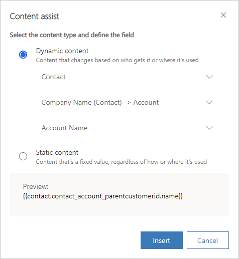
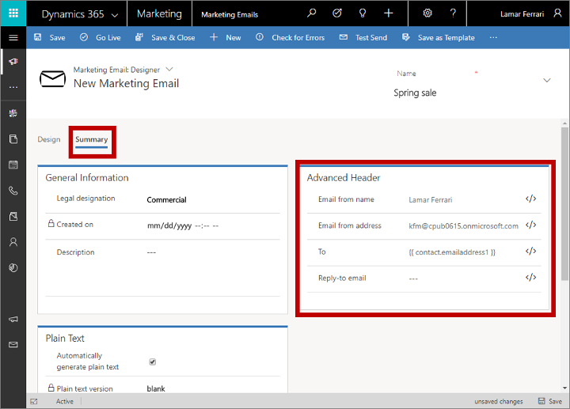
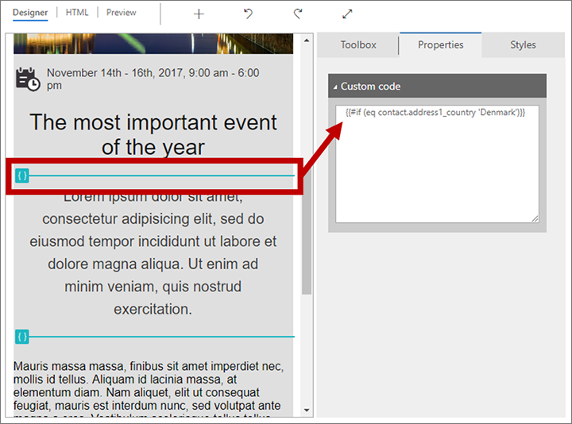

# Add dynamic content to email messages

Dynamic content gets resolved just before a message is sent to a specific individual. You'll typically use dynamic content to merge information from the recipient's contact record (such as first and last name), to place special links, and to place information and links from the content settings. If you're comfortable working in code, you can also create custom logic that includes conditional statements, for-each loops, and more. You can use dynamic content anywhere in your message body and can also use a few types of dynamic values in the message header fields (subject, from address, and from name).

<a name="content-settings"></a>

## Use content settings to set up repositories of standard and required values for email messages

Content settings are sets of standard and required values that are available for use in marketing email messages. Each includes a subscription-center link, a forward-to-a-friend link, social-media links, your postal address, and other information that can be placed into the message as dynamic values by using the [assist-edit](#assist-edit) feature.

Dynamics 365 Marketing is delivered with a single default content-settings record, which is preconfigured to use the default subscription center (also included out of the box). You can customize this record as needed, and you can also create additional records. You'll set up each customer journey to use a specific content-settings record, which means that all messages sent by that journey will use the same record. However, each journey can use a different record, which means that you can use an identical marketing-email design in two or more customer journeys, each specifying a different content-settings record. If you have more than one content-settings record, exactly one of them will be the default and will be applied automatically to each new customer journey that you create.

The values for content settings are first evaluated at send time, which means that you can edit a content-settings record at any time, and all pending and future email messages will automatically use the latest values.

Each content-settings record that you use must be available to the external marketing services, which manage email assembly and delivery. Therefore, you must publish your content-settings records by choosing **Go Live** whenever you create a new one.

> [!NOTE]
> If you have other types of values that you often use in email messages, and/or that you want to manage at the customer-journey level, then you can add them as custom fields to the content-settings entity just as you can for other types of entities in Dynamics 365. However, in the current release, all custom fields for the content-settings entity must be of type text (string). More information: [Customizing Marketing](customize.md)

To view, edit, or create a content-settings record:

1. Go to **Marketing** > **Marketing templates**  >  **Content Settings**.

1. A standard list page opens where you can view, sort, search, and filter the list to find a specific record and use buttons on the command bar to add or remove a record. Select a record to open it for editing or select **New** on the command bar to create a new one.

1. The **Content Settings** form opens. If you are editing a record that is already live, you must choose **Edit** in the command bar before you can edit it. If you are creating a new one, you can just start filling in the fields.  

    

1. Make the following settings, as needed:

    - **Name**: Enter a name for the customer-settings record. This is the name shown when you're assigning content settings to a customer journey or email-message preview.
    - **Owner**: Shows the Dynamics 365 Marketing user who created the record.
    - **Address main**: Enter the main part of your organization's postal address. All marketing email messages must include a valid main address taken from a content-settings record. Select the    button to use [assist edit](#assist-edit) to enter an expression that references a field from an existing record (such as an address field from a specific account record).
    - **Address line 2**: Enter supplemental postal address information (if needed). Select the    button to use [assist edit](#assist-edit) to enter an expression that references a field from an existing record (such as an address field from a specific account record).
    - **Default**: Set to **Yes** to make the current content-settings record the default for all new customer journeys. There must always be exactly one default; if you change the default, the existing default will automatically be changed to **No**.
    - **LinkedIn URL**,  **Twitter URL**,  **Facebook URL**, and  **YouTube URL**: For each of these social-media services, enter the URL for the landing page for your organization.  
    - **Subscription center**: Specify an existing marketing page that is set up as a subscription center. All marketing email messages must include a valid subscription-center link taken from a content-settings record. Select the    button to use [assist edit](#assist-edit) to enter an expression that references the **Full page URL** field for the specific page you want to use. The resulting expression will look something like this (where the GUID will vary based on the record you choose using assist edit):<br>
    `{{msdyncrm_marketingpage(3343053c-8daf-e911-a85e-000d3a3155d5).msdyncrm_full_page_url}}`
    - **Forward to a friend**: Specify an existing marketing page that is record up as a forward-to-a-friend page. Select the    button to choose from a list of available pages. Select the    button to use [assist edit](#assist-edit) to enter an expression that references the **Full page URL** field for the specific page you want to use. The resulting expression will look something like this (where the GUID will vary based on the record you choose using assist edit):<br>
    `{{msdyncrm_marketingpage(36458a9e-72af-e911-a859-000d3a3159df).msdyncrm_full_page_url}}`

1. Select **Save** in the bottom-right corner of the window to save your settings.

1. If you are editing a content-settings record that was already live, then the record is republished automatically when you save it. If you are creating a new record, then select **Go live** on the command bar to publish it to the marketing services so you can start using it.

<a name="assist-edit"></a>

## Use assist edit to place dynamic field values

Assist edit  helps you construct valid dynamic expressions to position field values from recipient contact records, the message content settings, and other database values. This button is provided on the text formatting toolbar whenever you select a text element in the graphical designer. The button is also provided for some settings fields, such as the subject, from-address, and from-name fields.

> [!NOTE]
> The assist-edit dialog only shows entities and relations that are synced with the marketing-insights service. If you need to show information or use relations for one or more entities that aren't listed, then ask your admin to add the relevant entities to the marketing-insights service. If you are an admin, then see [Choose entities to sync with the marketing-insights service](mkt-settings-sync.md) for instructions.

### Use assist edit to place a dynamic expression

To use assist edit:

1. Position your cursor in the field or text element where you want to insert the dynamic text, and then select the  **Assist edit**  button  . The assist-edit dialog opens.

    

1. Do one of the following:
    - Select **Dynamic content** to place a value that can change based on the context where you use the message, and then choose one of the following from the drop-down list here:
        - **Contact**: Places a field value, such as a first name, from the recipient's contact record. These values vary by recipient.
        - **ContentSettings**: Places a field value from the content settings. Values such as a subscription center URL, forwarding URL, and the sender postal address are available here. These values can vary according to the customer journey where the message is used.
        - **FormDoiSubmission**: Places a dynamic field for [form double opt-in](form-double-opt-in.md). This field does not require a relationship value, as discussed below.
        - **Message**: Places values that relate to the message itself; currently, this includes the open-as-webpage URL and the various dynamic values used in [double opt-in emails](double-opt-in.md).
    - Select **Static content** to place a fixed value from a specific record (such as the name of an upcoming event). This value is the same regardless of where you use the message or who receives it. Then make the following settings to identify the entity and record that contains the value you need:
        - **Select an option** (top combo box): Select the entity (such as event or account). To search for an entity, place your cursor in this box and start to type its name until the entity you want is shown.
        - **Choose a record** (bottom drop-down list): Select the specific record by name. This list shows all records from your selected entity. As with the entity, you can also search here.
1. Now you must identify the specific field you want to place. Do one of the following:
    - Select **Related entity** to find a field from an entity that is related to the one you picked on the previous page. Then make the following settings to identify the relation and the field you want to show:
        - **Select relationship**: The relationship defines which second entity you want to hop to, and the path you will take to get there. To search for a relationship, place your cursor in this box and start to type its name until the relationship you want is shown, and then select it. For more information about how to understand the way relationships are represented here, see [the next section](#assist-edit-relations).
        - **Select field**: Choose the field name you want to show. As with the relationship, you can also search here. This drop-down list is only available if you've chosen an [N:1 relationship](#assist-edit-relations).
1. At the bottom of the dialog, you now see the [final expression](#assist-edit-expressions). Select **Insert** to place that expression.

   

> [!IMPORTANT]
> Lists created using for-each loops are not rendered in a particular order and are not sortable by any field.

<a name="assist-edit-relations"></a>

### How assist edit presents database relationships

When you are selecting a relationship in assist edit, the options are displayed using one of the following naming conventions:

- ***FieldName (PrimaryEntity) -> SecondaryEntity***  
    When the primary entity is in parentheses and shows a field name, it’s a *many-to-one* (N:1) relation that leads to a single record from the secondary entity. You should therefore usually use the second drop-down list to choose a field from the secondary entity to display with your expression.
- ***PrimaryEntity -> FieldName (SecondaryEntity)***  
    When the secondary entity is in parentheses and shows a field name, it’s a *one-to-many* (1:N) relation that can lead to multiple records from the secondary entity. You therefore can’t choose a field (the second drop-down list is disabled) and must instead use this relation as part of a [for/each loop](#for-each) to display values form each available related record.
- ***PrimaryEntity -> SecondaryEntity***  
    When neither entity is in parentheses, it’s a *many-to-many* (N:N) relation, which can connect multiple records in both directions. You therefore can’t choose a field (the second drop-down list is disabled) and you cannot use this relationship for personalization. This is because the relationship is maintained by an intermediate entity, and you can only traverse to the intermediate entity from the primary entity.

Where:

- ***PrimaryEntity*** is an entity at the starting side of the relationship. It is always shown on the left side of the arrow. This is the entity you chose on the previous page of the assist-edit dialog. For example, a *Contact* (primary entity) can be related to an *Account* (secondary entity) through the contact's *Company Name* field (field name); this would be shown as: **Company Name (Contact) -> Account**.
- ***FieldName*** is always shown next to an entity name (which is in parenthesis). This is the name of the field through which the relation is established. The named field belongs to the entity in parenthesis, and displays a value from the entity of the other side of the arrow (but actually contains the ID of the related record that value is drawn from). In some cases, you'll notice a relationship between the same two entities, each of which flows through a different field.
- ***SecondaryEntity*** is the destination of the relationship. It is always shown on the right side of the arrow. The value(s) that you display with your final expression will come from a field belonging to the secondary entity.

> [!NOTE]
> For N:N relations, no field value is shown. That means that if you have more than one N:N relation between the same two entities, you'll see multiple identical-looking relations in the drop-down list. This situation is very rare, but if you see it, you'll have to use trial-and-error to identify the correct relation to use. To confirm, you can check the [resulting expression](#assist-edit-expressions) to see if it looks like you chose the right relation (relations are shown differently here and may provide a clue), or set up a test message that includes both versions of the N:N relation and use a test customer journey to deliver it to yourself.

Here are a few examples:

- **Company Name (Contact) -> Account**: This relationship is used by the **Contact** entity to display information from the **Account** entity in a contact record's **Company Name** field. In other words, it links to the company (account) that the contact works for.
- **Managing Partner (Contact) -> Account**: This relationship is used by the **Contact** entity to display information from the **Account** entity in a contact record's **Managing Partner** field. In other words, it links to the company (account) that is the managing partner for a contact.
- **Contact -> Primary contact (Account)**: This relationship is used by the **Account** entity to display information from the **Contact** entity in an account record's **Primary Contact** field. In other words, it finds all of the accounts where the current contact is assigned as the primary contact.
- **Contact -> Contact (Event Registration)**: This relationship is used by the **Event Registration** entity to display information from the **Contact** entity in an event-registration record's **Contact** field. In other words, it finds all of the event registrations made by (or for) the current contact.

<a name="assist-edit-expressions"></a>

### Expressions created by assist edit

Assist edit creates an expression that uses a format such as the following:
- `{{EntityName.FieldName}}`
- `{{EntityName(RecordID).FieldName}}`
- `{{EntityName.RelationshipName.FieldName}}`
- `{{EntityName(RecordID).RelationshipName.FieldName}}`

Note that the notation used for relationship names in the resulting expressions doesn't match the way they are represented in the assist-edit dialog. Here are some examples of resulting expressions:

- `{{contact.firstname}}`  
Places the recipient's first name.
- `{{msdyncrm_marketingpage(3343053c-8daf-e911-a85e-000d3a3155d5).msdyncrm_full_page_url}}`  
Places the value of the `msdyncrm_full_page_url` field from the marketing page record specified by the GUID in parenthesis. You might typically use an expression of this form in a [content settings](#content-settings) record to specify a subscription center or forward-to-a-friend page.
- `{{msdyncrm_contentsettings.msdyncrm_subscriptioncenter}}`  
Places the URL for the subscription center page identified in the [content settings](#content-settings) configured for the customer journey that sends the message.
- `{{msdyncrm_contentsettings.msdyncrm_forwardtoafriend}}`  
Places the URL to the forwarding page identified in the [content settings](#content-settings) configured for the customer journey that sends the message.
- `{{Message.ViewAsWebpageURL}}`  
Places the URL for opening the current message in a web browser.
- `{{msevtmgt_event(8a519395-856c-4e22-b560-650ce6d6a79d).msevtmgt_webinarurl}}`  
Places the webinar URL for the event identified by the specified event ID (in parentheses).
- `{{msdyn_survey(39128da2-c968-4627-9595-f030b6571be4).msdyn_name}}`  
Places the name of the survey identified by the specified survey ID (in parentheses).
- `{{contact.contact_account_parentcustomerid.name}}`  
This expression finds the name of the account for the company where a contact works.
- `{{contact.contact_account_msa_managingpartnerid.name}}`  
This expression finds the name of the managing partner for the account for the company where a contact works.

Once you have an expression that works, you can copy and paste it anywhere. You don't have to use assist edit every time.

> [!IMPORTANT]
> You can have, at most, two hops (periods) in your field expressions. Don't try to create more complex expressions by adding more hops to the expressions produced with assist edit.

> [!TIP]
> If you require the types of data that are supported by assist edit, then it's usually best to use the [assist-edit](#assist-edit) feature to place the code rather than try to type it from scratch. This will ensure that the entity, relation, and field names match those used in the database and will help you avoid misspellings.

<a name="dynamic-from"></a>

## Dynamic values in To, From-name, From-address, and Reply-to fields

On the **Summary** tab of the **Marketing Email** form, you can make various non-content-related settings for your message in the **Sender and receiver** section. This includes values and expressions for establishing the to, from-name, from-address, and reply-to values the message will use.



One typical way to take advantage of this feature is to set the **From name** and **From address** to the owner of the contact record. Then, by assigning the owner of each contact record to the salesperson managing that contact, recipients will receive marketing emails that show a from address of somebody they may know, which can greatly increase open rates. Here's how:

1. If your Marketing instance isn't already set up to sync the **User (systemuser)** entity with the marketing-insights service, talk to your admin about setting this up. If you are the admin, then see [Choose entities to sync with the marketing-insights service](mkt-settings-sync.md) for instructions.
1. Open your email message and go to the **Summary** tab.
1. Delete the contents of the **From name** field and then select the **Assist edit** button  next to this field.
1. On the first page of the assist-edit dialog, select **Contextual** and set it to **Contact**. Then select **Next**.
1. On the second page of the assist-edit dialog, select **Related entity** and then:
    - Set the top drop-down list (relationship) to **Owning User (Contact) -> User**.
    - Set the bottom drop-down list (field) to **Full name**.
1. Select **OK** to place the expression, which should be: `{{contact.contact_systemuser_owninguser.fullname}}`.
1. Delete the contents of the **From address** field and then select the **Assist edit** button  next to this field.
1. On the first page of the assist-edit dialog, select **Contextual** and set it to **Contact**. Then select **Next**.
1. On the second page of the assist-edit dialog, select **Related entity** and then:
    - Set the top drop-down list (relationship) to **Owning User (Contact) -> User**.
    - Set the bottom drop-down list (field) to **Primary email**.
1. Select **OK** to place the expression, which should be: `{{contact.contact_systemuser_owninguser.internalemailaddress}}`.

You can use similar techniques to place the owning user's name or email address anywhere in the message content. You could do this using assist edit, or copy/paste the handlebar expressions, or even type the handlebar expressions manually.

<a name="image-source"></a>

## Use dynamic values to choose an image source or link

You can use a dynamic expression to define the source URL for image elements. To do so, select the image element, go to its **Properties** panel and then select the **Assist edit** button  next to the **Source** field to place dynamic text as part of the URL. You'll typically mix this with static text to assemble a complete URL. For example, you could include the recipient's contact ID or company name to select an image that is relevant for each individual recipient.

You can likewise use assist edit to help construct a dynamic expression for setting a **Link** destination for the image.

> [!NOTE]
> The Dynamics 365 Marketing [files library](upload-images-files.md) generates a unique GUID-based file path for each image you upload, which means that the images in the files library have unpredictable URLs that don't include your original file name. Therefore, to use the technique described here, you must host your images on your own website or any third-party hosting service where the URLs are predictable and can include a value that you can easily extract from a Dynamics 365 field.

<a name="record-ids"></a>

## Find record IDs

Non-contextual field expressions (which use the form  `{{EntityName(RecordID).FieldName}}`) require a record ID to identify the specific record the value must come from. Usually, assist edit will help you find these IDs, but sometimes you might need to find an ID manually while you are designing dynamic features for a message. To find the ID for any record:

1. Open the record you want to reference.
2. Look at the URL shown in your browser's address bar, which should show a URL such as:  
`https://<MyOrg>.crm.dynamics.com/main.aspx?appid=c8cba597-4754-e811-a859-000d3a1be1a3&pagetype=entityrecord&etn=msevtmgt_event&id=5acc43d5-356e-e811-a960-000d3a1cae35`
3. Find the part of the URL that starts with `&id=`, which is followed by the ID number of your current record. Copy that number (the value only) and use it in your expression.

<a name="advanced-dynamic-content"></a>

## Advanced dynamic content

You can add advanced logical processing to your email designs, which can make the content even more responsive to recipients, demographics, and context. This type of customization requires you to have a basic understanding of scripting and programming. 

As you've seen in previous examples, dynamic content is surrounded by double braces ( `{{` and `}}` ). This includes both standard field values that you add using the [assist-edit](#assist-edit) feature, and the more advanced programming constructs described in this section.

> [!TIP]
> If you want to display double braces in a message, rather than use them to denote the start or end of a code block, then prepend (escape) the first brace with a backslash, such as `\{{` or `\}}`. The slashes won't appear in your final, rendered message, but the double braces will.

### Conditional statements and comparisons

Conditional (if-then-else) statements display content depending on whether one or more conditional expressions resolve to true or false. You can add the code required to create these statements by placing it within a text element, or by placing custom-code elements in between the other design elements. More information: [How to enter advanced dynamic content in the designer](#enter-code)

Conditional statements take the following form:

 ```Handlebars
{{#if (<operator> <value1> <value2>)}}
    Content displayed when the expression is true
{{else if (<operator> <value1> <value2>)}}
    Content displayed when the first expression is false and the second one is true
.
.
.
{{else}}
    Content displayed when all expressions are false
{{/if}}
```

Where:

- The conditional block must always open with `{{#if … }}`.
- Conditional expressions must be contained in parentheses.
- Conditional expressions start with an **&lt;operator&gt;**, which must be one of the values listed in the following table. It establishes how the first value is to be compared to the second value.
- *&lt;value1&gt;* and *&lt;value2&gt;* are values to be compared by the conditional expression, and each can be either dynamic or constant values. If either *&lt;value1&gt;* or *&lt;value2&gt;* is a constant string value (not a number or expression), then it must be surrounded with single quotes ('); for real numbers, use a period (.) as a decimal delineator. 
- If *&lt;value1&gt;* is a Boolean field (also known as a *two options* field in Dynamics 365), then don't include an *&lt;operator&gt;*, *&lt;value2&gt;*, or the parentheses. Boolean fields always have a value of either true or false, so you should just use them directly to establish the condition, such as: `{{#if contact.is_vip}}`.
- `{{else}}` and `{{else if … }}` clauses are optional.
- The conditional block must always close with `{{/if}}`.

The following table lists all the operators that you can use in your conditional expressions. Other operators are not currently available, nor can you use complex Boolean expressions (such as with AND or OR operators) in your conditional expressions.

| **Dynamics 365 Marketing syntax (case sensitive)** | **Operator** |
| --- | --- |
| eq | Equal to |
| ne | Not equal to |
| lt | Less than |
| gt | Greater than |
| lte | Less than or equal to |
| gte | Greater than or equal to |

For example, this conditional statement could be used to establish the language used in a message salutation based on the country of each message recipient:

 ```Handlebars
<p>{{#if (eq contact.address1_country 'Denmark')}}
     Hej
{{else if (eq contact.address1_country 'US')}}
     Hi
{{/if}} {{contact.firstname}}!</p>
```

Here's an example of a conditional statement based on a Boolean (two options) field called `is_vip`; note that because Boolean fields always return a value of true or false, no operator, comparison value, or parentheses are included in the condition:

 ```Handlebars
<!-- {{#if contact.is_vip}} -->
     <h3>Be sure to show your VIP card to receive a 20% discount!</h3>
<!-- {{/if}} -->
```

> [!TIP]
> You can test for empty field values by using:  
> ```Handlebars
> {{#if (eq contact.lastname '')}}
> ```
> Where `''` is two single quotation marks, not a double quotation mark. This finds empty fields, but not null fields.

> [!TIP]
> Though you can't use complex Boolean expressions in your conditional expressions, you can implement similar functionality as follows:
> 
> Not supported:  
> ```Handlebars
> {{#if A and B}}<DisplayedContent>{{/if}
> ```
> Is equivalent to (supported):
> ```Handlebars
> {{#if A}}{{#if B}}<DisplayedContent>{{/if}}{{/if}}
> ```
> &nbsp;  
> Not supported:
> ```Handlebars
> {{#if A or B}}<DisplayedContent>{{/if}
> ```
> Is equivalent to (supported):
> ```Handlebars
> {{#if A}}<DisplayedContent>{{/if}} {{#if B}}<DisplayedContent>{{/if}}
> ```

> [!TIP]
> When you are testing for values that are stored as an option set in the database, use the index values for the option set, not the display values. For example, you might have a field called `contact.customertypecode`, which holds an integer to identify the type of customer it is. Each customer type code also has a display name, such that 0 = "copper", 1 = "silver", and 2 = "gold". In this case, you must set up your expression to use the index (integer), not the matching display value. Therefore, if you're looking for gold customers, you should use:
> ```Handlebars
> {{#if (eq contact.customertypecode 2)}}
> ```

> [!TIP]
> When you are testing large numerical values, such as "1,932,333", then leave out the thousands separator (,) in the comparison statement, even though you might often see these presented in the UI. To test for this value, your expression should therefore look something like:
> ```Handlebars
> {{#if (eq contact.customernumber 1932333)}}
> ```

<a name="for-each"></a>

### For-each loops

For-each loops let you step through a collection of records that are related to a specific current record—for example, to provide a list of all the recent transactions associated with a given contact. You can add the code required to create these statements by placing it within a text element, or by placing custom-code elements in between the other design elements. More information: [How to enter advanced dynamic content in the designer](#enter-code)

For-each loops take the following form:

 ```Handlebars
{{#each Entity.RelationshipName }}
    ...
    {{this.RelatedField1}}
    ...
    {{this.RelatedField2}}
    ...
{{/each}}
``` 

Where:

- The loop block must always open with `{{#each … }}`.
- `Entity.RelationshipName` identifies the set of related records that the loop will iterate over.
- The loop starts with the first available related record, and repeats for each available related record until all related records have been listed. Note that the related records will be returned in an arbitrary and unpredictable order.
- `{{this.RelatedField<n>}}` identifies a field name from the related record. The "this" part of this expression refers to the related record being processed in the current loop iteration, and must be followed by a valid field name for the related entity. You can include any number of fields in each loop.
- The loop block must always close with `{{/each}}`.

For example, your database could include a list of products that a contact has ordered. You could list these in an email message using code such as:

```Handlebars
<p>You have purchased:</p>
<ul>
<!-- {{#each contact.contact_product_productid}} -->
<li>{{this.name}}</li>
<!-- {{/each}} -->
</ul>
``` 

In this example, the Dynamics 365 Marketing system has been customized to include a [custom entity](https://docs.microsoft.com/powerapps/maker/common-data-service/data-platform-create-entity) called _product_, which is set up with a 1:N [relationship](https://docs.microsoft.com/powerapps/maker/common-data-service/create-edit-entity-relationships) between the _contact_ and _product_ entities on the _productid_ field. For the product entity to be available to your email messages, it must also be [synced](mkt-settings-sync.md) with the marketing-insights service (as usual).

> [!IMPORTANT]
> Field values from lookups and related tables aren't shown in the **Preview** tab of the designer, or in test sends. Likewise, [for-each loops](#for-each) aren't rendered in previews or test sends. To test your related-field expressions and/or loop functionality, set up a simple customer journey to deliver the message to yourself.

<a name="enter-code"></a>

## How to enter advanced dynamic content in the designer

You must be careful when entering advanced dynamic code in the designer because there are many, sometimes unexpected, ways to get it wrong, which will break your code. Here are some tips for how to enter and test your code:

- Use custom-code elements to place code snippets between design elements on the **Designer** tab. This is much more visible and reliable than placing the code directly into the HTML using the **HTML** tab. However, you might also use dynamic code *within* a text element, in which case you'll probably need to clean up that code on the **HTML** tab, as mentioned later in this list. (When working in the [full-page editor](custom-template-attributes.md#show-toolbox), select on a custom-code element to edit its content.)    
    
- When you enter code into a text element on the **Designer** tab, any extra spaces and carriage returns that you add will create `&nbsp;`and `<p>` tags in your code, which can break it. Always go to the **HTML** tab afterwards, where you'll see all of these extra tags, and be sure to remove them.
- When you enter code into a text element, all of your dynamic-content code must either be contained within a set of start and end tags (such as `<p>` and `</p>`) or within an HTML comment (for code that is entirely separate from displayed text). Do not place code outside of comments or valid HTML tag pairs (or custom-code elements), as that will confuse the editor (especially if you switch between the **HTML** and **Design** tabs). You must work on the **HTML** tab inspect and correct the HTML within your text elements.
- Do not place carriage returns between code elements that are part of the same expression (such as in a for-each loop) unless you enclose each line within its own set of HTML tags (as illustrated in the for-each loop example given after this list).
- The [assist-edit](#assist-edit) feature is often helpful for constructing expressions that fetch values from your database because it helps you find database table, field, and relation names. This tool is available when working within a text element on the **Designer** tab, and when entering values is certain fields that support it (like the email subject). Assist edit isn't available when working on the **HTML** tab or within a custom code element, so you can instead start by using assist edit in any text element, and then cut/paste the resulting expression into your custom-code element or HTML.
- The relationship name that you use when creating loops or placing lookup values must match the one used in the marketing-insights service. This relationship name is not necessarily the same as the one used to customize Dynamics 365. To find the correct relationship name, use the [assist-edit](#assist-edit) feature.

For example, you could set up the salutation line of an email message by entering the following onto the **HTML** tab of the designer (either inside or outside of a text element):

```Handlebars
<p>{{#if (eq contact.address1_country 'Denmark')}}Hej{{else if (eq contact.address1_country 'US')}}Hi{{/if}}{{contact.firstname}}!</p>
```

The following example (also shown previously) shows how to use comments to enclose code that exists entirely outside of displayed content (also on the **HTML** tab):

```Handlebars
<p>You have purchased:</p>
<ul>
<!-- {{#each contact.contact_product_productid}} -->
<li>{{this.name}}</li>
<!-- {{/each}} -->
</ul>
```

### See also

[Email marketing overview](prepare-marketing-emails.md)  
[Create a new email and design its content](email-design.md)  
[Set the sender, receiver, and legal designation](email-properties.md)  
[Check your work using previews and test sends](email-preview.md)  
[Check for errors, go live, and deliver](email-check-golive.md)
