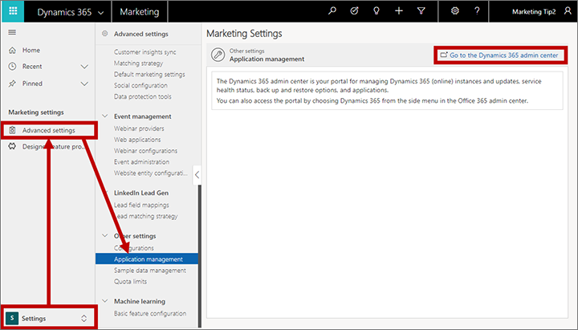
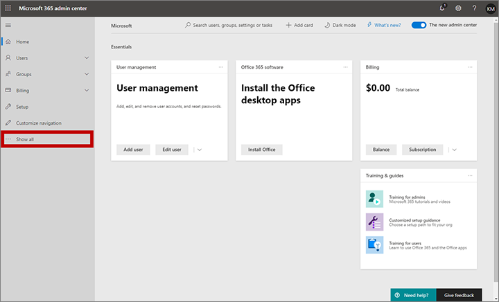
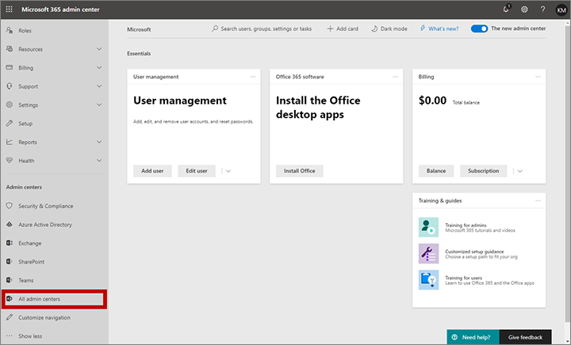
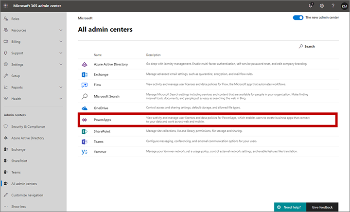
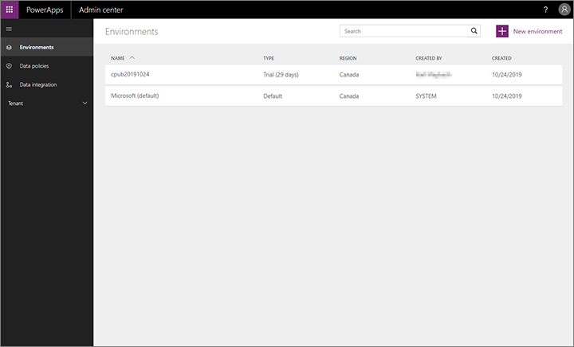
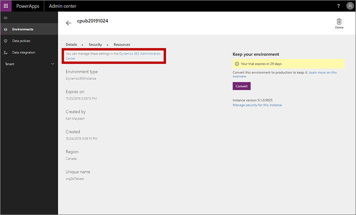

# Open the Dynamics 365 admin center

Use the Dynamics 365 admin center to review the status of your apps and solutions, apply updates, and manage your Dynamics 365 instances, solutions, and apps. 

There are two ways to open the Dynamics 365 admin center: starting from within the Marketing app or starting from the Microsoft 365 admin center. Both methods produce the same result, so the method you choose will depend on where you are when you want to open the Dynamics 365 admin center.

## Open the Dynamics 365 admin center starting from Dynamics 365 Marketing

To open the Dynamics 365 admin center starting from Dynamics 365 Marketing:

1. Sign into Dynamics 365 Marketing as a user with admin privileges.

1. Go to **Settings** > **Advanced settings** > **Other settings** > **Application management**.  
    

1. Select **Go to the Dynamics 365 admin center**.

1. The Dynamics 365 admin center opens.  
     

## Open the Dynamics 365 admin center starting from the Microsoft 365 admin center

To open the Dynamics 365 admin center starting from the Microsoft 365 admin center:

1. Sign in to your [Microsoft 365 admin center](https://admin.microsoft.com).

1. The **Home** dashboard for the Microsoft 365 admin center opens. In the navigation column on the left, select **Show all**.

    

1. The navigation column expands to show more links. Select **All admin centers**.

    

1. A list of all available admin centers opens. Select **PowerApps**.

    

1. The Power Apps admin center opens, showing a list of Power Apps environments available on your tenant. (Environments are usually referred to as "instances" in Dynamics 365 Marketing documentation, and are also sometimes called "organizations".) Select the instance where you want to configure, modify, or install Dynamics 365 Marketing.

    

1. Your selected environment opens. Select the link to the **Dynamics 365 Administration Center** provided here.

    

1. The Dynamics 365 admin center opens.

    

### See also

[Keep Marketing up to date](apply-updates.md)  
[Manage Marketing instances](manage-marketing-instances.md)  
[Uninstall Marketing](uninstall-marketing.md)
