# Design and run A/B tests on your email designs

Use email A/B testing to find out which of two similar designs is likely to be most successful and then send the winning design to the remaining audience automatically. You start by creating an initial design (the "A" version), and then use that as the basis to create a "B" version of the design in which you have modified a small part of it (such as the subject or an image). Finally, choose your conditions for success (such as most opened or most clicked) and run the test as part of a customer journey.

The journey runs the entire test automatically. It starts by sending version A to a small part of your segment (for example 10% of contacts, selected randomly) while also sending version B to another part of the segment (typically also 10%). It waits for a period of time you choose (for example, 24 hours) and then analyzes the interaction results and chooses a winner based on your selected criteria (such as most opened). The journey then sends the winning design to the rest of the segment (the remaining 80%) automatically.

## Create a marketing email for A/B testing

To set up an A/B test, start by creating your basic design (this will be the A version) and then create one or more B versions where just a small part of the design has changed. Each B version allows only one type of change (such as subject, body, _or_ from address), but you can define several test for the same design, where the A version is always the same, but with a different B version for each test.

To set up A and B designs for a message:

1. Create your initial design as usual, as described in [Create a new email and design its content](email-design.md). Perfect the design as much as possible and be sure to check it for errors to make sure it can go live.

1. When your A design is finished, do one of the following:
    - If you haven't yet defined any test for this email, then select the **Add A/B test** button at the top corner of the designer.
    - If you already have one or more tests defined, select **A/B test** at the top corner of the designer to open the **A/B test** panel and then select the **Add test** button at the top of the panel.

    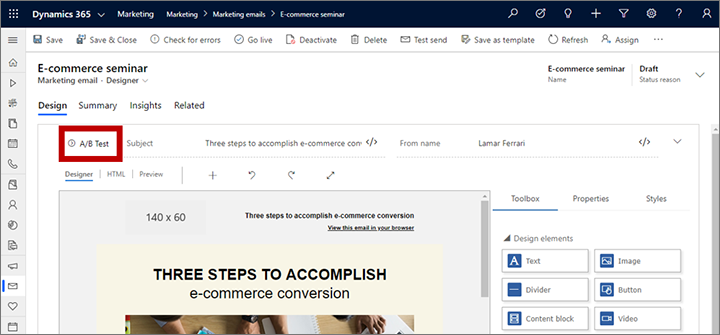

1. The **Add a test** dialog opens. Do the following:
    - Set the **Test type** to one of the following:
           - **Subject**: Lets you choose a different subject for the B version of your design.
           - **From name**: Lets you choose a different from-name for the B version of the design. Recipients will see this as the name of the sender of the message. This won't change the actual the from-address, which will remain the same for both versions.
           - **Body**: Lets you select one or more design elements in the email body and then change those elements' settings, content, or appearance in the B version of the design. 
    - Enter a **Test name** to identify the test. This name is displayed in the **A/B test** panel and in the customer journey email tile when you are choosing which test to run for that journey
    - Select **Add** to add your test to the **A/B test** panel.

    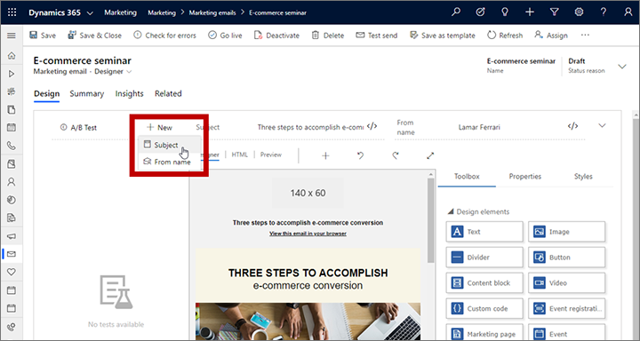

    > [!NOTE]
    > You can add as many tests as you like by repeating the previous two steps. Remember that the A version is the same for all tests, but the B version is specific for each test, so you can have many different B versions.

    > [!NOTE]
    > You can run each test just once, on a single email tile in a single journey. As soon as you configure a journey to run a test, you won't be able to select that test for any other email tile or journey. If you'd like to run several tests on a single design, then add more tests to **A/B test** panel. 

1. A new test of  your selected type is now added to **Draft** section of the **A/B test** panel. Note the following:
   - You might have any number of tests available. Each test shows its name and type (indicted by an icon next to the name).
   - Select a test from the **A/B test** panel to work with that test. When a test is selected, its name appears in bold and it is expanded to show **Version A** and **Version B** buttons for working with that test.
   - You can change the name of any listed test by selecting the test and then selecting the **Rename** button shown next to the test name when it's active. This name is displayed in the customer journey email tile when you are choosing which test to run for that journey .
   - For subject and from-name tests, the parameter being controlled by your selected test shows either an **A** icon  or a **B** icon 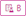 to indicate what you are testing and which version is being shown (and editable). The icon changes to match the version button you have selected ( **Version A** or **Version B** ).
   - For body tests, each element being tested shows a colored frame around it (when selected) that matches the color of the version button you have selected (blue for **Version A** or pink for **Version B** ). See the next step for details about how to set this up.

    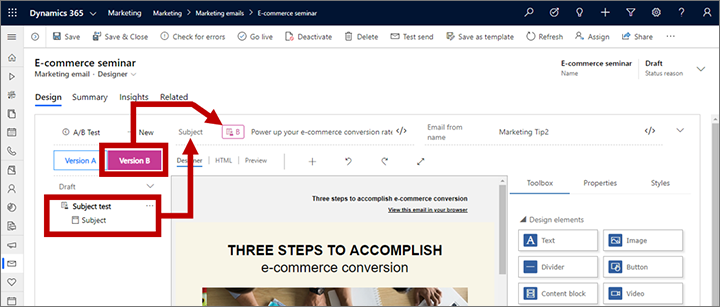

1. Select a test from the **A/B test** panel and then select the **Version B** button. Do one of the following, depending on which type of test you are making:
    - For subject tests, the **Subject** field should now show a **B** icon . Enter a new subject here.
    - For from-name tests, the **From name** field should now show a **B** icon . Enter a new name here.
    - For body tests, add an element to the test by selecting it on the canvas to highlight it and then select the **A/B** button 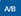 in the tab at the top of the highlighted frame. This is a toggle button, so you can select it  again to remove an element from the test&mdash;it shows a white background 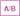 for elements being tested, and shows a dark-blue background  for elements that are the same for each version. For tested elements, the frame color indicates the version: light-blue for version A and dark-pink for version B. You can add as many elements as you want to the test, but usually it's best just to test just a few elements (or one element) at a time.

    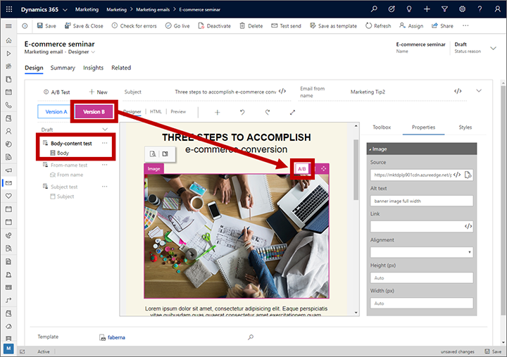

1. Now change the design of the item(s) you have enabled for testing. For subject and from-name tests, edit the appropriate field text; for body tests, you can edit text content for text elements or **Property** tab settings for other types of design elements. You can toggle back and forth between versions using the **Version A** and **Version B** buttons and continue to edit each version while it's being displayed.

    > [!NOTE]
    > Even after you have enabled A/B testing you can still edit parts of your message that aren't part of any tests. When you to this,  your edits will affect all versions (the A version and all B versions), regardless of which test and version button are currently selected. But if you edit a setting that's enabled for testing, then you are only editing the version selected using the **Version A** and **Version B** buttons. Remember that the A version is the same for all tests, but the B version is unique for each test.
    > 
    > Be careful when adding new design elements to a message that already has a body test set up. After doing this, always make sure your new elements are fully defined with the correct content and settings for each of version of each test.

1. Continue working in this way until you have set up all of the tests you want to run on the current email design.
1. When you're done setting up your designs and tests, select **Go live** to make your message available for use with a customer journey.

## Prepare to execute your test from a customer journey

When you're email is ready to test, use a customer journey to send it. You can include A/B-test emails in any type of journey, regardless of complexity, and including journeys that you are using in a production campaign. The strategy is to send each design to a small part of the full segment being targeted by the journey, wait to see how those recipients react to each version of the message, and then send the best performing message to the rest of the segment. You can choose what the winning conditions are (most clicks or most opens), and also how long to run the test for.

> [!IMPORTANT]
> To produce reliable test results, you should always send each version (A and B) to a minimum of 100 recipients before allowing the system to choose a winner. A typical recommended setup would use a 1,000-member segment (or larger), with a test distribution that sends version A to 10% of the segment, version B to another 10%, and then sends the winning design to the remaining 80%.
> 
> It's possible to run an A/B test with as little as just one or a few recipients for each version, but this can often result in an uneven or non-random distribution of versions and unreliable final results. We recommend that you only do this while experimenting with the feature.

To add an A/B test to a journey:

1. Set up your journey as usual, and be sure to include one or more email tiles where you can place your A/B-test email(s).

1. Select an email tile that included in your journey pipeline and open the **Properties** tab in the side panel to start configuring the tile.

1. In the **Marketing email message** field on the **Properties** panel, select the email message you set up for A/B testing. Note that when a message that has one or more A/B tests designed for it is selected for an email tile, that tile shows **A** and **B** icons in its corner. These are shown in gray for now because you haven't yet set up the test for this tile (they will turn blue after you enable the test).

    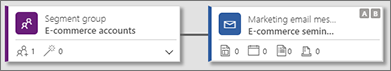

1. Scroll down in the **Properties** panel until you see the **A/B testing** switch and then select it to turn on the test. This opens the A/B test settings.

    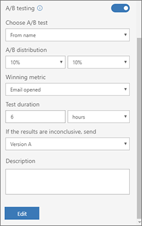

    > [!NOTE]
    > If you select an email message that has A and B designs but don't enable A/B testing for the tile, then version A will be sent to all recipients.

1. Make the following settings to set up the test:
   - **Choose A/B test**: Your selected email design must have at least one test set up that hasn't been used, but it might have more. Select the name of the test that you want to run on this tile. You can run at most one test at a time.
   - **A/B distribution**: Set the slider to choose how many contacts (as a percentage of the total number of contacts in the target segment) you'd like to include in the test. Half of the test audience will receive version A, and the other half will receive version B. All test contacts, and the versions each receives, are selected randomly.
   - **Winning metric**: Choose whether to decide the winning design based on the click-through rate (how often a recipient clicked on a link in the message) or on the open rate (how often a recipient opened the message). In each case, the winner is the version that produced the most clicks or opens as a proportion of the total number of times that version was sent.
   - **Test duration**: Use these settings to establish how long the test should run. For best results, we recommend running each test for at least 24 hours, or longer if possible—especially if you are targeting a worldwide audience (to compensate for time zones). At the end of this time, the system will analyze the results and send the winning design to the remaining contacts in the segment. Contacts who received the "losing" design won't be re-sent the winning one.
   - **If the results are inconclusive, send**: Choose what to do if the test doesn't produce a clear winner. In this case, you can choose to send version A, version B, or a random 50/50 split of both versions to all remaining contacts.
1. Finish setting up your journey as usual and the go live.

## Monitor the lifecycle of your A/B tests

Each test defined for a given email message can only be run once. As soon as a test starts to get processed by a customer journey, or has been processed, you won't be able to use it again with any other customer journey. As a result, you might sometimes try to set up an A/B test for an email tile in a customer journey and be surprised when you can't select the test you want to run. In this case, you can just add another test.

To view the run status of each A/B test defined in an email message, open the message and expand the **A/B Test** panel. Each test available for the message is listed under one of the following headings. Each heading includes an expand/collapse button for showing or hiding the tests in each category.

- **Draft**: These are tests that haven't been run yet, so you can still edit their settings and choose them when configuring an email tile for a customer journey.
- **Scheduled**: These are tests that are already set up to be run by a customer journey, but that journey hasn't started yet.  Their  settings are locked and you can't run them in any other customer journey.
- **In progress**: These are tests that are currently being run. Their  settings are locked and you can't run them in any other customer journey.
- **Finished**: These are tests that are complete and can't be used again. To [view the results](#inspect-results), go to the customer journey where you ran the test.

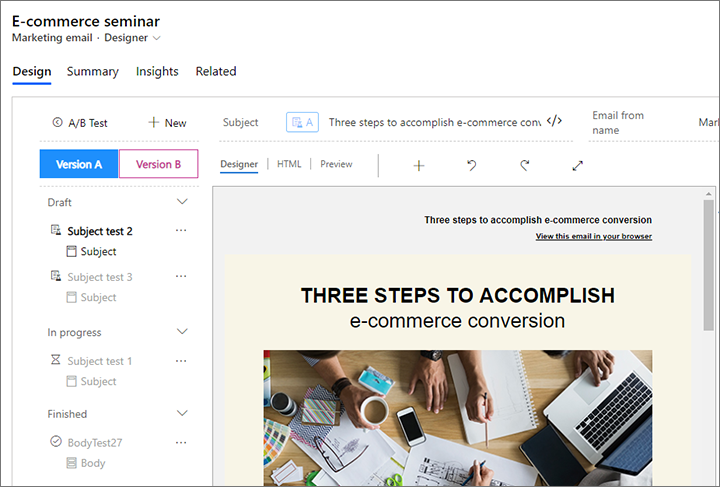

## Inspect your test results

You can check the progress and results of your A/B tests at any time by examining the email tiles of your customer journey. To do so:

1. Open the customer journey.

1. Select the email tile where you are running an A/B test.

1. Scroll down to the bottom of the **Data** panel for the selected email tile. Here you'll see a display that shows the name of the test, the percentage of contacts that you sent each version to (including the winning version), how much time there is left in the test, and which design was declared the winner (provided the test has finished).

    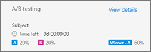

1. Select the **View details** link here to get even more information about the test results. This opens a dialog that shows KPIs for each design from the test. For more information about email KPIs and how to interpret them, see the [Insights glossary](insights-glossary.md).

    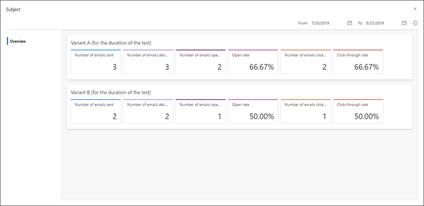

You can also see the results of an A/B test by opening the message itself. From here, open the **A/B test** panel, expand the **Finished** category of tests and select the **Test insights** button for the test you want to see.

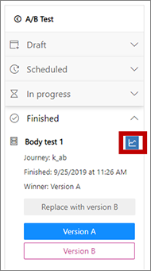

## Replace the A version with the B version after a test is finished

Regardless of the results of an A/B test, version A will remain the standard version of the message. Future test will continue to test against version A, and all journeys that don't run an A/B test will send version A to everyone. Therefore, and especially if version B wins a test, you might consider making that B version the new A version going forward.

> [!CAUTION]
> When you replace version A with version B, version A is permanently deleted and replaced with version B from the selected test. You can't undo this.

To replace version A with version B from a selected test:

1. Open the message where the A/B test has finished.
1. Expand the **A/B test** panel to see the list of test.
1. Expand the **Finished** category of tests in the **A/B test** panel.
1. Select the test where the B version is the one you want to make the new A version and select the **Replace with version B** button.

    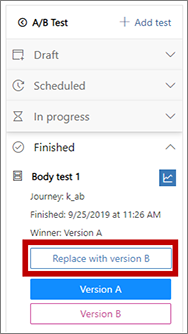

1. You're prompted to confirm the action. If you're sure you want to continue, then confirm and then save your message.

### See also

[Design your digital content](design-digital-content.md)  
[Design elements reference](content-blocks-reference.md)  
[Email marketing overview](prepare-marketing-emails.md)  
[Create automated campaigns with customer journeys](customer-journeys-create-automated-campaigns.md)  
[Customer journey tiles reference](customer-journey-tiles-reference.md)  

[!INCLUDE[footer-include](../includes/footer-banner.md)]